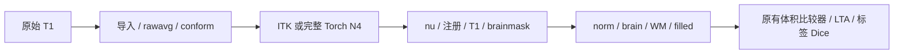

# 完整 Torch N4 的原始 T1 连续前段诊断

## 1. 功能与流程

对同一真实 T1、A100、四线程和源码冻结 `e34a1829`，比较 Conda ITK N4 与已有完整缓存 Torch N4。两条流程均从原始 T1 和空目录开始；本报告在表面 worker 已启动、前段输出停止写入后只读检查到 filled，不称为完成整例。



生产默认仍为 ITK。Torch N4 的少量量化差异在后续注册、归一化和 WM 链被放大，不能据单阶段 P99 为零将其称为无实质影响。

## 2. Python、输入与输出

```python
from pathlib import Path
from compare_prefix import compare_prefix

prefix_diagnostic = compare_prefix(
    reference=Path("/data/control/subject"),  # FNIT ITK N4 自产被试目录
    candidate=Path("/data/torch_n4/subject"),  # FNIT Torch N4 自产被试目录
    reference_benchmark=Path("/data/control/benchmark.json"),  # 控制运行配置/版本收据
    candidate_benchmark=Path("/data/torch_n4/benchmark.json"),  # 候选运行配置/版本收据
    scripts_dir=Path("/path/to/frozen/validation/recon_all/python_gpu_port"),  # 原有固定比较器
    label_table=Path("/data/assets/FreeSurferColorLUT.txt"),  # 已校验标签表
)
```

六个输入均必需且无路径默认值。前两个目录包含下表14张体积和 `mri/transforms/talairach.lta`。两份 benchmark 必须具有相同原始 T1、源码、资源、程序、主机、目标设备、线程与 CPU 亲和性，后端选择可不同。此处 reference 是 FNIT 控制流程，不是官方输入。

返回 JSON 字典包含实际版本、输入/源码/比较器 SHA、逐体积不同体素数、最大/P99、affine/header/dtype、LTA 16 元素误差、逐标签 Dice 和诊断墙钟。体积位于同一 conform 网格；强度误差是存储数值，affine 平移为 mm，LTA 的线性项与平移单位分别为无量纲/mm，Dice 无量纲。filled 使用自身 255=左、127=右的语义；aseg 使用 LUT。WM 强度图不按每个 uint8 值当作解剖标签。

比较复用 `compare_complete_subject._volume/_error` 的既有门槛，不新增整体等效门。读取前后核对体积 SHA；缺文件、配置不同、LTA 格式错误或文件写入中变化会抛异常。数值差异保留为诊断，`overall_metric_equivalence` 固定为 `not_assessed`。CLI 输出路径不得存在，失败不覆盖旧报告。

## 3. CLI 与复现

```bash
python validation/recon_all/optimizations/20261010_n4_continuous_prefix/compare_prefix.py \
  --reference /data/control/subject \
  --candidate /data/torch_n4/subject \
  --reference-benchmark /data/control/benchmark.json \
  --candidate-benchmark /data/torch_n4/benchmark.json \
  --scripts-dir /path/to/frozen/validation/recon_all/python_gpu_port \
  --label-table /data/assets/FreeSurferColorLUT.txt \
  --output /data/diagnostics/new_prefix.json
```

参数与上面的 Python 调用一一对应；`output` 为新的机器可读报告。复现候选使用既有完整整例入口 `--n4-backend torch --n4-execution isolated`，控制使用 `native/in-process`；其余设置相同。原始运行、候选程序和资产哈希沿用收据，禁止从官方结果或手动补跑构造生产输入。没有新增依赖，沿用主页 Conda 的 NumPy/nibabel。

## 4. 原软件对应

完整固定 N4 对应独立 ITK 构建程序及官方 recon-all 前段；算法、命令和文献见[完整 N4](../../../../docs/recon_all/N4_COMPLETE_TORCH_20261009.md)与[输入链](../../../../docs/recon_all/INPUT_N4_CHAIN.md)。本比较器是诊断工具，没有独立等价 FreeSurfer 命令；官方参考未进入两条生产链。

## 5. 两例实测精度、时间与资源

表中每格为“不同体素数 / 最大绝对差 / P99”，未以平均相关性替代局部误差。

| 连续输出 | sub-06 | sub-07 |
|---|---:|---:|
| orig/001、rawavg、orig，各自 | 0 / 0 / 0 | 0 / 0 / 0 |
| tmp/nu0 | 4016 / 1 / 0 | 3259 / 1 / 0 |
| nu | 3709 / 3 / 0 | 9230 / 3 / 0 |
| T1 | 465105 / 23 / 1 | 24394 / 13 / 0 |
| brainmask | 200826 / 23 / 1 | 5810 / 13 / 0 |
| norm | 551197 / 7 / 1 | 52536 / 4 / 0 |
| brain | 755442 / 22 / 2 | 184878 / 16 / 1 |
| aseg.presurf | 0 / 0 / 0 | 0 / 0 / 0 |
| wm.seg | 203763 / 230 / 1 | 61715 / 230 / 0 |
| wm.asegedit | 144661 / 250 / 0 | 44219 / 250 / 0 |
| wm | 145097 / 250 / 0 | 44301 / 250 / 0 |
| filled | 4671 / 255 / 0 | 2291 / 255 / 0 |

aseg.presurf 各标签 Dice 均为1；filled 最低半球 Dice **0.995364106 / 0.997220977**。talairach LTA 分别有 **4 / 0** 个元素不同，最大元素差 **0.304666519 / 0**。sub-07 LTA 相同仍有后续强度/WM 差异，不能将全部差异归因于注册。对应[完整 sub-06 收据](reports/sub06.json)和[sub-07 收据](reports/sub07.json)保留类型、几何、全部标签和首个差异。

两例只读诊断墙钟为 **19.827 / 22.429秒**，不是 N4 阶段或整例时间。本报告不声称整例提速、显存达标或整体指标等效；完整 Torch N4 整例仍须独立完成输出、形状距离、脑区统计与局部质量评价。尚无本次完整整例叠加脑图，后续由完整评分生成，不能复用控制图改标为候选图。

## 6. 版本、验证与更新

实际生产冻结为 `e34a1829145b34158f7b37b5d3046f8b02c03617`，源码包 SHA `145f0f656ea3a97101b2d43a96a7c5c5e3f0849a990401216e41a65f871f7933`；诊断脚本 SHA `b35a369ef5a64b26c1503cf1809fc6deef492d779ecc7ff766079e9981f7425c`。公开报告只替换私有字符串，[导出清单](reports/PUBLIC_EXPORT_MANIFEST.json)证明867个数字/布尔/null的值和类型不变，并保存原件与公开 SHA。报告输入 SHA 与仓库脚本逐项核对通过。

先前固定同输入 N4、原始 T1→nu 和初始化 CUDA 的缓存 worker 证据保留于[执行策略页](../../../../docs/recon_all/N4_CACHED_WORKER.md)。本次新增原始连续链到 filled，发现下游放大；不覆盖旧报告或事后放宽门槛。下一优先诊断为冻结 GCA 的 nu×brainmask 四输入配对及相同归一化，不进入生产。

## 7. 参考与源码

- [本次只读复现脚本](compare_prefix.py)、[既有完整体积比较器](../../python_gpu_port/compare_complete_subject.py)、[原标签 Dice 语义](../../python_gpu_port/compare_parcellation_dice.py)。
- [FNIT 完整 N4 数学及原实现链接](../../../../docs/recon_all/N4_COMPLETE_TORCH_20261009.md)。
- Tustison NJ 等，N4ITK，*IEEE Transactions on Medical Imaging*，2010，29:1310–1320。
