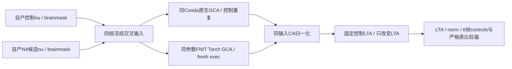
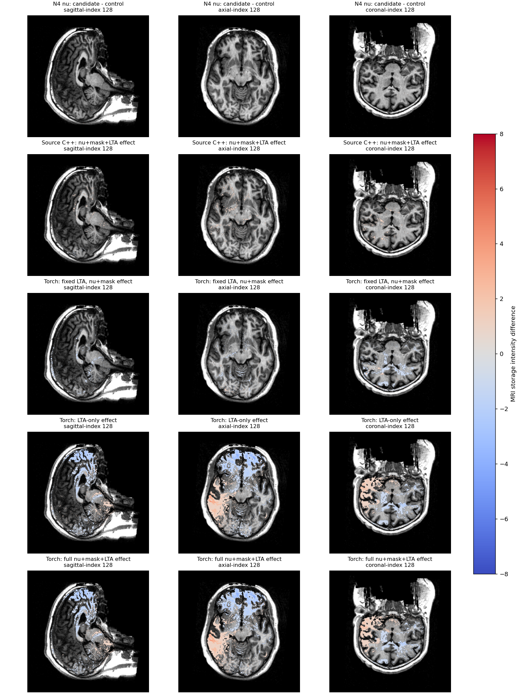
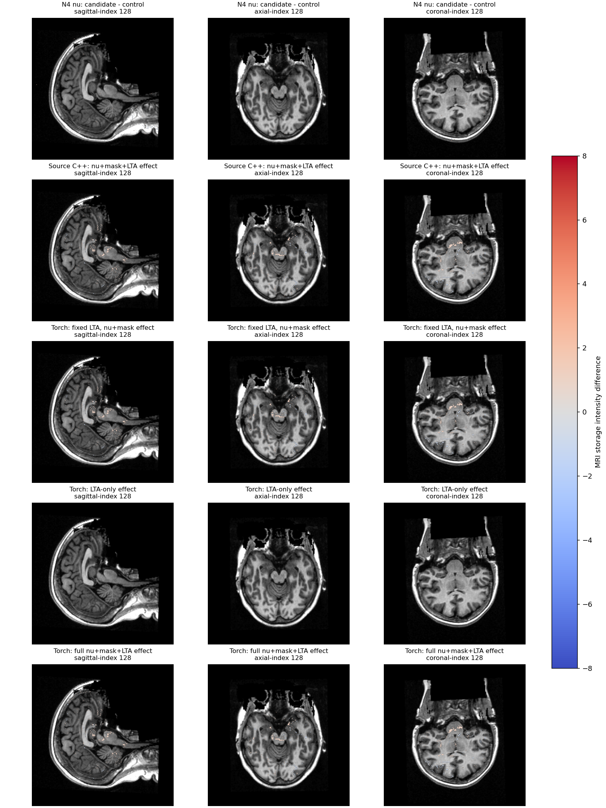

# N4后强度、掩膜和GCA注册的交叉归因

## 1．功能与范围

这是诊断工具，使用同一原始公开T1的FNIT自产ITK控制与Torch N4候选。
不改生产图像，不读取官方影像来修补输出。先用同一声明的Conda固定
源码构建`mri_em_register`，再单列生产已有Torch注册；两者不同不能默认
归因于线程或随机。整体等效与性能优化不由本页判定。



每个被试分组：11=控制nu+控制brainmask，21=候选nu+控制brainmask，
12=控制nu+候选brainmask，22=候选nu+候选brainmask；原生另有11-repeat。
原生四组和控制重复先完成，再独立重放Torch四组。两个后端分别以自身
11为基线；因素有非线性相互作用，不把体素差或耗时直接相加。

## 2．Python、输入输出与参数

```python
from pathlib import Path
from run_cross_inputs import run_cross_inputs

cross_input_report = run_cross_inputs(
    source_directory=Path("frozen/e34_source"),  # 实际e34 src，不补写冻结树
    control_subject=Path("runs/itk_control/subject"),  # 自产ITK控制，前段已停止写入
    candidate_subject=Path("runs/torch_n4/subject"),  # 同T1自产候选，交叉仅诊断
    native_binary=Path("resources/native/bin/mri_em_register"),  # 独立Conda源码程序
    comparison_module=Path("fixed_diagnostics/compare_complete_subject.py"),  # 原有固定比较器
    assets_directory=Path("resources/assets"),  # 固定2020 GCA资产
    output_directory=Path("runs/new_cross_inputs"),  # 新目录，禁止覆盖
    device="cuda:1",  # 显式目标GPU，Torch重放使用
    threads=4,  # 全程请求四线程，一次一个计算阶段
    code_version="e34a1829",  # 生产源码另有逐文件SHA，诊断脚本也单独SHA
    torch_replay=True,  # 默认True；False只做原生四组和控制重复
)
```

| 输入/参数 | 格式、意义和默认值 |
|---|---|
| source_directory | 含冻结src/fnit；调用成熟GCA和CA-normalize，不写入源树 |
| control_subject / candidate_subject | 分别含mri/nu.mgz和mri/brainmask.mgz；须同shape和affine，四文件逐个SHA |
| nu / brainmask | conform 256³/1mm强度图，既有uint8语义；brainmask在此为带强度的去脑外图，不是aseg解剖分割 |
| native_binary | 声明的Conda独立构建可执行文件，程序SHA绑定；不是系统预装FreeSurfer |
| comparison_module | 原有compare_complete_subject.py明确路径、源码SHA；不复制更改门槛 |
| assets_directory | average/RB_all_2020-01-02.gca及声明原生资源；不读许可证内容或下载新资产 |
| output_directory | 必填不存在目录；symlink四输入，输出只写本诊断目录 |
| device / threads | 显式cuda:N、正整数；native-only不执行GPU，仍记录显式设备；两例/组按顺序，不开启额外模型并行 |
| code_version | 明确冻结Git版本文字；真实执行脚本、GCA相关源码和输入另保存SHA |
| torch_replay | 默认True；生产同参数isolated/inverse=torch/chunk1024；假时只运行Conda对照 |

返回字典含执行状态、输入/源码/程序SHA、CPU亲和性和线程、每组LTA4×4、
原生注册/CA完整API秒数、norm/ctrl输出SHA，以及同输入、固定11-LTA和
只改变LTA的原比较器结果。LTA为源体素→图谱体素，矩阵平移以图谱体素
表示；不把voxel矩阵原数值泛称mm。norm保持原conform几何和存储单位；
ctrl_pts为256×256×256×6 float32，前3帧控制标签、后3帧对应目标强度。
0表示非控制点；2/41为左/右大脑白质、7/46为左/右小脑白质、16为脑干。
后3帧是图谱节点目标均值，部分标签被舍弃的位置也可能保留该值；不是
完整组织分割或偏置场。控制点Dice不能当作aseg/aparc分区Dice。

只读汇总与固定切面脑图有独立接口：

```python
from analyze_cross_results import analyze_cross_results
from plot_cross_results import plot_cross_results
from summarize_cross_results import summarize_cross_results

control_point_diagnostic = analyze_cross_results(
    diagnostic_directory=Path("runs/new_cross_inputs"),  # 已完成四组及重复的report目录
    prefix_report=Path("diagnostics/sub06_prefix.json"),  # 同T1自产连续链的实际SHA收据
    output_file=Path("runs/new_cross_inputs/controls-analysis-v1.json"),  # 不存在的新JSON
)
error_figure_receipt = plot_cross_results(
    diagnostic_directory=Path("runs/new_cross_inputs"),  # 只读nu和已生成norm，不重跑算法
    output_directory=Path("runs/new_cross_inputs/plots-v2"),  # 新目录，输出PNG及source.json
)
summarize_cross_results(
    reports_directory=Path("publication/reports"),  # 两例完成且已脱敏的原数值JSON
    output_directory=Path("publication/rebuilt_summaries"),  # 新CSV/JSON目录，拒绝覆盖
)
```

`analyze_cross_results`三个路径参数必填：读取六帧控制图，逐轮记录标签
变动数和每标签Dice、目标强度最大/P99/MAE/偏差；绑定连续前段的原始T1、
producer与四个nu/mask SHA。复用原函数比较闭运算后及GCA掩膜后实际强度，
并将诊断Torch 11/22的LTA/norm与两个真实producer核对。源版本、输入来源、
几何、控制图格式不符或文件变化抛异常。返回并写JSON，不改变生产状态。

`plot_cross_results`两个必填目录参数：读取完成report与五组诊断norm，
输出固定中央三个体素索引切面`error_slices.png`及`source.json`。背景为控制
nu；不插值、不按最大误差挑切面，色标±8为MRI存储单位。图仅展示N4强度、
源码构建注册和Torch固定LTA/仅LTA/完整组合的差异，不代替网格或脑区验收。

`summarize_cross_results`读取`sub06/sub07.report.json`和`.controls.json`，
写`norm_comparisons.csv`、`control_frames.csv`、`masked_input_comparisons.csv`
及`summary.json`；只使用标准库，保留实际数字与类型，不叠加不同因素误差。

原生命令保持`-uns 3 -mask brainmask.mgz nu.mgz atlas talairach.lta`和软件
默认种子；重复实测判断稳定性，不提前声称固定随机性。Torch通过成熟
fresh-exec helper启用局部缓存，默认TF32及已验精度策略，无半精度，不改
父CUDA/allocator。其完整子报告保留实际dtype/precision/device/SHA。

新输出目录、几何、文件、程序或算子异常抛出；进入运行后失败保存partial
report。初始化导入/文件校验失败可能仅保存controller日志与退出码，不能
把启动当完成。比较不设整体新门，原uint8零容差、float控制1e-6门保持。

## 3．命令行调用

```bash
python run_cross_inputs.py \
  --source-directory frozen/e34_source \
  --control-subject runs/itk_control/subject \
  --candidate-subject runs/torch_n4/subject \
  --native-binary resources/native/bin/mri_em_register \
  --comparison-module fixed_diagnostics/compare_complete_subject.py \
  --assets-directory resources/assets --output-directory runs/new_cross_inputs \
  --device cuda:1 --threads 4 --code-version e34a1829
```

所有参数与上面Python调用一致，`--native-only`对应torch_replay=False。
输入不能边写边读，完成后复核输入、参考程序和冻结源码未变化；CPU相关
环境在fresh进程启动前固定四线程。报告完整API含加载、读写和注册子进程
退出，诊断比较及启动另计；本实验不宣称整例提速或独立显存达标。

辅助CLI与Python参数完全对应：

```bash
python analyze_cross_results.py --diagnostic-directory runs/new_cross_inputs \
  --prefix-report diagnostics/sub06_prefix.json \
  --output-file runs/new_cross_inputs/controls-analysis-v1.json
python plot_cross_results.py --diagnostic-directory runs/new_cross_inputs \
  --output-directory runs/new_cross_inputs/plots-v2
python summarize_cross_results.py --reports-directory publication/reports \
  --output-directory publication/rebuilt_summaries
```

公开导出在服务器侧先执行，复用现有`export_receipts.py`；仅选择本次两例
report、controls分析、脑图来源及controller JSON和两个PNG。其接口为：

```python
from collect_public_receipts import collect_public_receipts

published_receipts = collect_public_receipts(
    run_directory=Path("runs/cross_v2"),  # 含两例和三个实际零退出码sentinel
    output_directory=Path("runs/cross_v2/public-export-v1"),  # 不存在的新公开目录
    exporter_file=Path("existing/export_receipts.py"),  # 已验证脱敏器，保留数字合同
    replacements_file=Path("private/replacements.json"),  # 私有字符串→占位符，仅服务器保留
    failed_initialization_directory=Path("runs/cross_v1"),  # 失败初始化真实退出码和日志SHA
    plot_subdirectory="plots-v2",  # 成功绘图子目录及其独立退出码，保留旧失败
)
```

五个路径参数均必填；`plot_subdirectory`默认plots-v2，只接受目录名，
CLI对应`--plot-subdirectory`；其余是同名的`--run-directory`等旗标。输出
`reports/`、`figures/`及`EXPORT_PROVENANCE.json`；数字/布尔/null值及类型
必须不变，保存原件和公开SHA。未完成、已有输出、分析绑定或图像SHA变化
拒绝；导出失败可能留下不完整新目录。不打包MRI、权重、许可证或原生程序。

## 4．原软件对应

诊断原生对照复用固定FreeSurfer源版本在Conda独立编译的程序，不复制
预装二进制。官方同阶段调用为：

```bash
mri_em_register -uns 3 -mask brainmask.mgz \
  nu.mgz assets/average/RB_all_2020-01-02.gca transforms/talairach.lta
mri_ca_normalize -c ctrl_pts.mgz -mask brainmask.mgz \
  nu.mgz assets/average/RB_all_2020-01-02.gca transforms/talairach.lta norm.mgz
```

实际CA路径统一调用FNIT成熟`run_ca_normalize()`，保留三轮控制选择与偏置
更新，不改为另一个原软件路径。参考归档与跨环境差异见原功能页；本次
native源码构建对照与官方归档结果分开，不称为新官方整例运行。

## 5．真实结果、耗时与脑图范围

两例均完成原生四组+控制重复、Torch四组、同CA三轮归一化和固定LTA/仅LTA
对照。诊断Torch 11/22与原始自产控制/候选的LTA、norm均**零差异**，来源、
原始T1及前段版本绑定通过；输入、程序和冻结源码在运行后逐项SHA复核不变。
原生11重复的LTA、norm、六帧控制图在两例均零差异。这是在当前条件下的
实测稳定性，不能用随机性解释本次N4差异。

表中norm每格为“不同体素数 / 最大绝对差 / P99”，各后端以自己的11为
基线。21与22的归一化输出相同；12单独改变掩膜，两例两后端全为零。

| 诊断路径 | sub-06 | sub-07 |
|---|---:|---:|
| Conda原生，候选nu+掩膜+自身LTA | 54672 / 4 / 0 | 52536 / 4 / 0 |
| Conda原生，固定11 LTA | 54672 / 4 / 0 | 52536 / 4 / 0 |
| Conda原生，控制nu+掩膜，仅换LTA | 0 / 0 / 0 | 0 / 0 / 0 |
| Torch，候选nu+掩膜+自身LTA | 551197 / 7 / 1 | 52536 / 4 / 0 |
| Torch，固定11 LTA | 137040 / 5 / 0 | 52536 / 4 / 0 |
| Torch，控制nu+掩膜，仅换LTA | 558170 / 7 / 1 | 0 / 0 / 0 |

原生四输入的LTA均相同。Torch sub-06只换nu后LTA **4/16**元素变化，最大
**0.304666519**；sub-07仍相同。sub-06固定LTA后尚有137040个norm差异体素，
仅LTA改变又产生558170个，完整组合551197个：强度及注册影响有非线性
相互作用，不能相加。既有Torch与原生基线也须分开：sub-06同控制输入11
已有12个LTA元素差、最大10.566434860，norm920601/max15/P99=2；sub-07
同输入11为零差异。这是同主机算法路径差异，不能默认归因编译器或随机性。

GCA掩膜谓词改变26/1体素，但没有改变LTA；CA闭运算后的mask-only实际
强度图两例均零差异。只换nu后的有效CA输入分别**1238/1292体素、最大3**，
之后被控制点选择和偏置传播放大。控制点标签不是组织分割，按轮列出：

| 路径 | sub-06三轮标签变化数 | sub-07三轮标签变化数 |
|---|---:|---:|
| 原生完整组合 / 固定LTA，各自 | 8 / 9 / 51 | 27 / 88 / 208 |
| Torch完整组合 | 290 / 459 / 732 | 27 / 88 / 208 |
| Torch固定LTA | 5 / 57 / 98 | 27 / 88 / 208 |
| Torch仅LTA改变 | 285 / 472 / 764 | 0 / 0 / 0 |

全部控制点逐标签Dice、均值帧的最大/P99/MAE/偏差保存在
[control_frames.csv](control_frames.csv)和[两例完整分析](reports/sub06.controls.json)。
均值帧最大约109–115通常来自该位置出现/消失目标均值，不能解释为同一
控制点的纯强度尾差。没有以标签数值Pearson代替Dice。

完整注册API含加载、注册和输出及进程退出；单位秒：

| 主机/四核同输入注册 | 11 | 21 | 12 | 22 | 11重复 |
|---|---:|---:|---:|---:|---:|
| sub-06原生 | 129.960 | 130.671 | 129.615 | 129.710 | 131.814 |
| sub-06 Torch fresh-exec | 45.244 | 40.195 | 41.428 | 39.791 | 未额外跑 |
| sub-07原生 | 225.912 | 224.369 | 204.864 | 270.069 | 273.372 |
| sub-07 Torch fresh-exec | 60.329 | 51.635 | 54.410 | 46.489 | 未额外跑 |

诊断总墙钟**1681.176/2406.632秒**包含校验、哈希、全部反事实归一化、IO和
比较，不属于整例。原生初始哈希计入总墙钟，Torch子哈希也计入API；两种
算法的基线不同、节点共享、未做ABBA，不能据此称性能或端到端提升。

CPU为Xeon Platinum8369B，目标A100-SXM4-80GB `cuda:1`，亲和性76–79；
原生环境、Numba和Torch intra-op各4线程，父Torch inter-op池实际64，保留
该事实。子进程实际TF32开启、autocast关闭、half未请求、分配缓存开启且
计数有效；八次子进程峰值allocated最大**219581440**、reserved最大
**257949696字节**。没有同步整父子GPU进程采样，合计显存为null，不能称
整例小于20GB。[硬件身份](reports/hardware_after_diagnostic.json)在诊断结束后
采集并明确时间范围，不冒充起点或连续峰值。

以下是两例实际完成后的固定中央切面，零误差位置透明覆盖，不按最大
误差选切面。切面名根据affine轴方向，保留体素索引而非重采样到MNI。





本页没有新的整例验收：原始T1→filled误差、sub-06完成及sub-07 mesh失败
由[连续前段报告](../20261010_n4_continuous_prefix/README.md)和根独立整例
报告记录，不能将交叉诊断称作连续整例。整体指标等效仍未判定，N4默认
保持原生ITK。本轮没有新依赖；Matplotlib、NumPy/nibabel/Torch/Numba已在
主页Conda与pyproject声明。

## 6．版本与验证记录

- v1入口比较器不存在：e34冻结包没有validation，未执行注册；实际
  退出与日志SHA保留在[初始化失败收据](reports/failed_initialization_v1.json)。
- v2明确复用已有固定比较器，SHA
  `ea8e7faf842c8f4039a50bc3097eb2bd77752b84355f1f76134a6bccdd3a31ba`；
  执行脚本SHA
  `8d67471b7716369a9da97abbb5f1660aa666bbbbd511a7502c81c7954b5e8a1c`。
  两例完整四输入、原生重复、反事实归一化、输入/程序/源码不变与真实
  producer重放均完成，详情见[sub-06](reports/sub06.report.json)及
  [sub-07](reports/sub07.report.json)。
- controls分析额外绑定原始T1、producer配置/源码、前段benchmark快照SHA；
  快照在前段停止写入时采集，不声称整例完成后benchmark字节未更新。
- 脑图v1在PNG已写后因MGH shape的NumPy int32不能JSON编码而失败；只修
  转为Python int，v2新目录两例成功，数值计算未重跑。保留
  [绘图失败收据](reports/failed_plot_metadata_v1.json)和私有原日志/源码。
- [公开清单](reports/PUBLIC_EXPORT_MANIFEST.json)保留原始及公开SHA并验证
  **10243个数字/布尔/null的值和类型未变**；[导出来源](EXPORT_PROVENANCE.json)
  及仓库摘要可重复核对。公开包只含JSON和公开T1派生PNG，不含MRI、程序、
  权重、许可证或私有替换表。图像逐项SHA和源码SHA通过；四份摘要可从
  完成收据重建，具体记录见`REGRESSION_REBUILD.json`。
- 生产源码为e34a1829145b34158f7b37b5d3046f8b02c03617，完整source archive SHA
  `145f0f656ea3a97101b2d43a96a7c5c5e3f0849a990401216e41a65f871f7933`。
  此提交只增加诊断与中文报告，不切换生产N4、不修改GCA算法或验收门。

## 7．参考、源码和文献

- [现有GCA注册](../../../../docs/recon_all/GCA_ISOLATED_TORCH_20261009.md)、
  [原始连续前段](../20261010_n4_continuous_prefix/README.md)。
- [FreeSurfer固定源码](https://github.com/freesurfer/freesurfer/tree/d932c45b7941662ea380a05efef580568b98d41a)。
- Tustison NJ等，N4ITK，IEEE TMI 2010;29:1310–1320。
- [OpenNeuro ds000114](https://openneuro.org/datasets/ds000114)，本轮公开T1及自产检查点来源。
