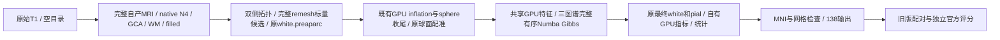

# 有序Gibbs与remesh存储接入后的真实整例对照

## 1．功能和验证范围

本版复用已经写好的完整有序Numba Gibbs重分类，以及CPU remesh的
双精度Python标量存储，保留全部图谱、网格堆规则与有序反馈。它们分别
替换同功能内部循环和标量容器，没有重写GPU几何或增加标准输出。
默认仍为Python Gibbs和NumPy remesh；候选用显式选项开启。

实际生产源码为 **79a41cdda2397525a8952dd5af303372b352916c**，包SHA-256
`e0a9a418669035f39f979e25cfb4b65e8cc93e200485eae7d93a2d22ddcfcaec`。
两例公开ds000114从原始T1及空目录连续完成；控制为e34a1829同T1、同
A100、同GPU、同CPU亲和性、总四线程整例。新报告不追标到交付提交。



**本轮未测到整例提速。** CLI为2718.390/2653.001秒，相对e34慢
28.0508%/29.0136%；只有注释组实际缩短。多项未改算法的前段、表面和
配准也变慢，一组跨时段配对不能证明变慢全部由候选或共享负载造成。
原始失败、尾差和共享资源限制均保留，十分钟与纯PyTorch目标尚未达到。

## 2．Python、输入和输出

```python
from pathlib import Path
from fnit.recon_all.native_free import run_recon_all_python

reconstruction_report = run_recon_all_python(
    t1=Path("input/sub07_T1w.nii.gz"),  # 原始三维公开T1，固定输入SHA
    subject_dir=Path("runs/new_sub07"),  # 新空目录，不读参考或手工补跑
    weights_dir=Path("resources/weights"),  # 已校验16项Synth权重
    assets_dir=Path("resources/assets"),  # 已校验102项声明模板、图谱和LUT
    native_bin_dir=Path("resources/native/bin"),  # 已校验15项Conda独立源码程序
    device="cuda:0",  # 明确目标逻辑GPU，尊重可见设备
    threads=4,  # 整例总线程预算
    hemisphere_workers=2,  # 左右各两线程，发布和共享文件屏障保持
    native_optimizations="auto",  # 与控制相同的已有GCA及原生优化
    n4_backend="native",  # 保持ITK，另一路N4精度问题不混入本候选
    n4_execution="in-process",  # 控制原执行方式
    wm_backend="native",  # 保持完整WM分割
    wm_execution="in-process",  # 保持完整WM调度
    wm_edit_backend="native",  # 保持aseg核心编辑
    defects_backend="native",  # 保持缺陷投射
    normalization_controls_backend="torch",  # 已验GPU控制点邻域
    normalization_initial_bias_backend="torch",  # 已验GPU初始偏置
    sphere_normals_backend="numba",  # 与控制相同的球面法向
    inflate_backend="torch",  # 已验完整GPU inflation和sulc
    sphere_finish_backend="torch",  # 既有完整dense GPU收尾
    annotation_gibbs_backend="numba",  # 本版接入已有完整有序CPU核，默认python
    remesh_scalar_storage="python",  # 本版双精度标量容器，默认numpy
    gca_inverse_backend="torch",  # 与控制相同的完整矩阵求逆
    gca_candidate_chunk=1024,  # 与控制相同的候选分块
    gca_execution="isolated",  # 局部缓存fresh worker
    fill_backend="torch-numba",  # GPU边界和完整有序CPU堆
    mni_execution="parallel-late",  # MNI与独立CPU网格检查并行
    profile_stages=True,  # 同步目标GPU剖析，含加载、搬运、读写；生产默认False
)
```

原T1为三维NIfTI/MGH；资源和程序来自声明的主页Conda安装路径，SHA逐项
保存在benchmark。volume为conform网格，surface为surface RAS/mm，有序
顶点图和注释与该网格对应；厚度mm、面积mm²、灰质体积mm³。全部138输出
路径、shape/dtype、参数、返回report与失败行为见[主接口](../../../../docs/recon_all/README.md)。
只有两个新选项不同于e34；非法值在CUDA和输出设置前报错，计算失败
向上传播，不回退、删步骤或补近似文件。表面版本缓存不混用preaparc、
final white和pial，TH3顶点volume仍不替代-no-th3脑区体积。

## 3．CLI和可复现报告

```bash
python tools/benchmark_recon_torch_end_to_end.py \
  --t1 input/sub07_T1w.nii.gz --output-root runs/new_sub07 \
  --weights-dir resources/weights --assets-dir resources/assets \
  --native-bin-dir resources/native/bin --device cuda:0 --threads 4 \
  --hemisphere-workers 2 --native-optimizations auto \
  --n4-backend native --n4-execution in-process \
  --wm-backend native --wm-execution in-process --wm-edit-backend native \
  --defects-backend native --sphere-normals-backend numba \
  --normalization-controls-backend torch --normalization-initial-bias-backend torch \
  --inflate-backend torch --sphere-finish-backend torch \
  --annotation-gibbs-backend numba --remesh-scalar-storage python \
  --gca-inverse-backend torch --gca-candidate-chunk 1024 --gca-execution isolated \
  --fill-backend torch-numba --mni-execution parallel-late --code-version 79a41cdd
```

全部选项含义与上面的具名Python示例一致；测评工具自动启用剖析。实际
完整命令、冷JIT、各worker和程序/输入SHA留在收据。完整harness计时另含
前置哈希校验、导入、启动和退出；事后诊断时间不计入生产墙钟。

`collect_receipts(fnit_directory=..., output_directory=...)` 只收集真正
完成的两例和两种独立评分。`export_collected_receipts(input_directory=...,
output_directory=..., replacements_file=..., exporter_path=...)` 复用已有
脱敏器，保存原始/公开SHA并核验数值类型和值；PNG原样复制。目录及脚本
路径必须显式给定，不存在默认服务器、账号或影像路径。未完成、绑定
不同、缺输出或已有目录抛异常，不覆盖原件。这些辅助函数没有官方CLI。

```python
from summarize_results import summarize_results

summary_report = summarize_results(
    reports_directory=Path("reports"),  # 本版完整公开收据
    previous_reports_directory=Path("../20261010_whole_sphere_finish_a100_e34a1829/reports"),  # 同例控制
    output_directory=Path("new_summary"),  # 已创建、没有旧摘要的目录
)
```

此函数生成SUMMARY.json、完整stage_times.csv和零容差顶点图CSV；只读
双方源码、原始/公开benchmark SHA、完成状态及16张有序坐标，不执行MRI算法或判断整体等效。
`summarize_official_results(reports_directory=..., output_directory=...)`
另外生成官方JSON摘要和逐脑区误差CSV。缺失或未完成时拒绝生成成功摘要。

## 4．原软件对应

对应mris_ca_label内部完整Gibbs重分类，以及mris_remesh的有序拆缩。
没有独立的官方标量存储/Gibbs循环CLI。固定原命令、全部算法参数与
原实现见[GCSA功能](../../../../docs/recon_all/GCSA_ANNOTATION_ACCELERATION_20261007.md)
和[remesh功能](../../../../docs/recon_all/REMESH_SCALAR_STORAGE_20261010.md)。
官方参考为独立归档FreeSurfer8.2.0 d932c45，版本/输入/程序SHA单列；
生产不读取官方结果。跨主机历史官方耗时不用于本组同机加速倍率，
本次重跑评分也不等于在本节点重新运行官方recon-all或证明其重复性。

## 5．真实精度、时间、显存和脑图

| 原始T1 | e34控制CLI/s | 79组合候选CLI/s | CLI缩短 | 完整harness/s |
|---|---:|---:|---:|---:|
| sub-06 | 2122.900 | 2718.390 | -28.0508% | 2737.822 |
| sub-07 | 2056.372 | 2653.001 | -29.0136% | 2672.439 |

两例执行、138项输出和生产网格通过；原容差138/138对照通过。有序
网格和分割/脑区等各组指标另由完整机器报告核验，不能用文件通过数
代替整体指标等效；后者仍未判定。原无对应网格的官方比较采用双向
点到三角面距离，不称为逐顶点一致。零容差顶点图和局部异常不删项。

| 完整阶段，s；控制→候选 | sub-06 | sub-07 |
|---|---:|---:|
| N4 | 171.212→199.539 | 168.317→200.376 |
| 双侧初始表面组 | 687.041→903.320 | 728.750→970.375 |
| 双侧球面配准组 | 281.788→375.839 | 288.875→390.971 |
| 双侧注释组 | 103.918→86.243 | 89.796→76.625 |
| 双侧最终white/pial组 | 377.466→475.841 | 308.161→388.259 |
| 末尾MNI/网格并行组 | 81.871→91.467 | 72.544→82.480 |

注释组缩短17.675/13.171秒；同时未更改的多个CPU及GPU阶段增加，
surface组增长216.278/241.626秒。嵌套/并行阶段不可累加，单组跨时段
配对不能隔离候选、JIT与共享资源的因果贡献。

目标GPU整卡采样峰为44,770,000,896/26,929,528,832字节，包含其他
共享进程；进程树归属未知，合计峰为null，不能当作FNIT超过预算或
小于20GB的证据。请求间隔0.5秒、实际最大7.936/8.080秒，有7/4次
采样失败；缓存关闭后allocated/reserved未知不写成零显存。
当前既有Conda的独立wheel/target安装553模块一致，构建/安装/CLI帮助
28.723/4.271/3.439秒；安装后MRI、全新Conda和物理隔离未验证，详见
[安装收据](../20261010_gcsa_integration/package_79a41cdd/)。没有新增依赖。

独立官方两组评分实际complete，耗时1230.561/1358.379秒，单列为事后
诊断。严格原容差仍6/138、7/138；68区、7张Dice、no-th3、双向三角面
距离和全脑数值与e34相同。原报告中的filled与14张表面输入SHA改变，
原件及哈希变化均保留；解码体素/坐标/有序面和度量值相同，不将文件
SHA相等当作数值比较，也不称整例逐字节复现。六份摘要重建逐字节
相同，见[重建核验](REGRESSION_REBUILD.json)。130份JSON的272438个
数字、bool、null类型和值保持，六PNG字节不变；公开包18022400字节，
SHA `29ca6a2236bdd91b00a2f4df7a03bf72872f63053ccc4ff177d828665355a431`。

| 相对官方68区 | sub-06 MAE | sub-07 MAE |
|---|---:|---:|
| 厚度，mm | 0.044824 | 0.050676 |
| 面积，mm² | 31.397059 | 35.867647 |
| 灰质体积，mm³ | 151.147059 | 153.955882 |
| 平均曲率，mm⁻¹ | 0.002456 | 0.001368 |

每例16张自产有序表面坐标与面均0差异、七标签最低Dice1、68区四项
统计与-no-th3均0误差；20/44顶点图的零容差尾差完整保留。
[544条逐脑区CSV](official_region_errors.csv)保留原参考/候选、绝对及
带符号相对偏差，[八条指标汇总](official_metric_summary.csv)另存MAE/P90/最大差。
厚度最大0.289/0.175mm、灰质体积最大681/729mm³等局部误差没有删去。
sub07 LH反向white最大6.179mm；两例white↔pial穿越及sub07球面负向面
是原有未通过的扩展质量项目，生产网格passed不代表全部质量passed。
完整[官方摘要](OFFICIAL_SUMMARY.json)及实际脑图如下。


[本轮完整变慢分解](../20261010_gcsa_remesh_runtime_diagnostics/README.md)
核验了sphere逐步轨迹、关键MRI/表面的解码值、同阶段GPU峰和当前
40CPU配额。首次JIT与计时分项原样报告；没有运行期间的历史限流
采样，不能把28–29%整体变慢归因于一个新算子或负载。

## 6．版本和benchmark

- 79a41cdd：完整Gibbs/remesh候选接线，61项真实CFFF契约与wheel安装通过；
  两例原始T1均完成，本组没有整例加速，默认未替换。
- e34a1829：完整dense GPU球面收尾，旧版两例原始T1和独立官方评分；
  [旧报告](../20261010_whole_sphere_finish_a100_e34a1829/README.md)保留原版本与计时。
- 22cc6687 / 8f73828c：Gibbs、remesh同输入ABBA阶段结果各自保存，
  不将不同线程的阶段百分比相加成整例收益。
- 独立Torch N4替换已完成[交叉归因](../20261010_n4_gca_cross_inputs/README.md)
  与[完整形状诊断](../../../../docs/recon_all/N4_WHOLE_DIAGNOSTICS_20261010.md)；
  sub07原生产失败门保持，未混入本版性能候选。

## 7．参考和原实现

- [重建接线与61项契约](../20261010_gcsa_integration/README.md)、
  [GCSA源码](../../../../src/fnit/recon_all/gcsa_label_python.py)、
  [remesh源码](../../../../src/fnit/recon_all/mris_remesh_python.py)。
- [FreeSurfer固定源码](https://github.com/freesurfer/freesurfer/tree/d932c45b7941662ea380a05efef580568b98d41a)。
- Fischl B. FreeSurfer. *NeuroImage*. 2012;62:774–781。
