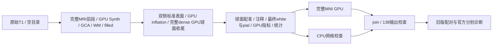
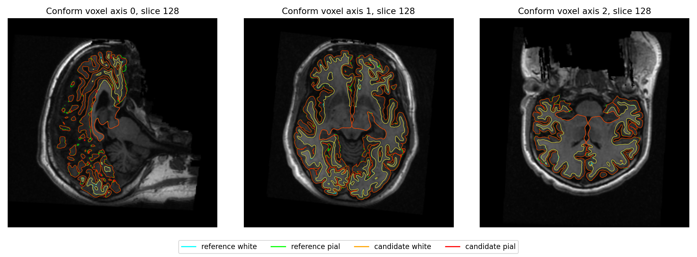

# 完整 GPU 球面收尾后的两例原始 T1 整例验证

## 1．功能与验证范围

生产源码为 **e34a1829145b34158f7b37b5d3046f8b02c03617**，源码包SHA-256
`145f0f656ea3a97101b2d43a96a7c5c5e3f0849a990401216e41a65f871f7933`。
本版复用仓库已有完整dense PyTorch球面收尾，接入半球surface worker；
不改sphere配准或有序更新规则。两例公开ds000114从原始T1与空目录连续运行，
与同输入、同A100、同GPU及CPU亲和性、总四线程的765c0fe9控制比较。
各例仅一组整例配对，不能据此宣布稳定吞吐改善。



**本次没有测到可靠整例提速：sub-06慢0.2653%，sub-07快0.2485%。**
一个左半球的收尾明显加快，但其他阶段耗时波动抵消收益。纯PyTorch
GPU与十分钟目标均未完成；生产仍保留必要的独立Conda原生组件。

## 2．Python调用、全部输入输出与限制

```python
from pathlib import Path
from fnit.recon_all.native_free import run_recon_all_python

reconstruction_report = run_recon_all_python(
    t1=Path("input/sub07_T1w.nii.gz"),  # 原始三维T1；输入大小与SHA已校验
    subject_dir=Path("runs/new_sub07"),  # 新空目录，禁止手动补跑冒充连续整例
    weights_dir=Path("resources/weights"),  # 声明且已校验的外置Synth权重
    assets_dir=Path("resources/assets"),  # 模板、图谱和LUT
    native_bin_dir=Path("resources/native/bin"),  # Conda固定源码独立构建程序
    device="cuda:0",  # 显式逻辑GPU，尊重CUDA_VISIBLE_DEVICES
    threads=4,  # 整例总线程预算
    hemisphere_workers=2,  # 左右各两线程，发布屏障保持
    native_optimizations="auto",  # 既有GPU GCA与Python EM链
    n4_backend="native",  # 保持已验ITK N4，不混入另一路精度实验
    n4_execution="in-process",  # 对照执行方式
    wm_backend="native",  # 对照完整WM分割
    wm_execution="in-process",  # 对照WM执行方式
    wm_edit_backend="native",  # 保持aseg编辑
    defects_backend="native",  # 保持缺陷投射
    normalization_controls_backend="torch",  # 已验GPU控制点邻域
    normalization_initial_bias_backend="torch",  # 已验GPU初始偏置
    sphere_normals_backend="numba",  # 原球面法向
    inflate_backend="torch",  # 已验标准GPU inflation和sulc
    sphere_finish_backend="torch",  # 本版新增接入已有完整dense GPU收尾
    gca_inverse_backend="torch",  # 完整GCA矩阵求逆
    gca_candidate_chunk=1024,  # 对照候选分块
    gca_execution="isolated",  # 已验GCA缓存子进程
    fill_backend="torch-numba",  # GPU边界与有序CPU堆
    mni_execution="parallel-late",  # MNI与CPU检查独立并行
    profile_stages=True,  # 目标GPU同步计时，生产默认False
)
```

输入包括原始影像、声明权重/资产/独立程序；只读取自产中间结果。
影像、权重、许可证和凭据不发布。输入SHA、全部资源和程序SHA见逐例
benchmark。输出138项清单与存在性、报告字典、完整参数和失败行为见
[主接口](../../../../docs/recon_all/README.md)；volume为conform网格256³/1mm，
surface为surface RAS/mm，注释对应有序顶点。厚度mm、面积mm²、体积mm³。
`torch`收尾要求显式CUDA设备与两个隔离surface worker；缺少条件在创建
输出前报错，不回退或复制占位表面。默认仍为cpu，子缓存不改变父精度/分配器。

## 3．CLI、机器报告与复现

```bash
python tools/benchmark_recon_torch_end_to_end.py \
  --t1 input/sub07_T1w.nii.gz --output-root runs/new_sub07 \
  --weights-dir resources/weights --assets-dir resources/assets \
  --native-bin-dir resources/native/bin --device cuda:0 --threads 4 \
  --hemisphere-workers 2 --native-optimizations auto --wm-backend native \
  --wm-edit-backend native --defects-backend native --sphere-normals-backend numba \
  --n4-backend native --n4-execution in-process --wm-execution in-process \
  --gca-inverse-backend torch --gca-candidate-chunk 1024 --gca-execution isolated \
  --fill-backend torch-numba --normalization-controls-backend torch \
  --normalization-initial-bias-backend torch --inflate-backend torch \
  --mni-execution parallel-late --sphere-finish-backend torch --code-version e34a1829
```

测评工具自动启用阶段剖析；完整harness含输入和资源校验、导入、模型加载、
传输、计算、GPU同步、写出与退出。诊断耗时另计。实际完整生产命令保存在
各自benchmark；源码SHA绑定真实运行，不能将后续提交追标为本次结果。

```python
from pathlib import Path
from summarize_results import summarize_results

summary_report = summarize_results(
    reports_directory=Path("reports"),  # 本版完整JSON收据
    previous_reports_directory=Path("../20261009_whole_late_mni_a100_765c0fe9/reports"),  # 同例控制
    output_directory=Path("new_summary"),  # 已创建且没有摘要的新目录
)
```

汇总仅读取已完成报告，缺失、源码绑定不同、有序坐标改变或输出存在会
抛异常，不执行MRI算法。官方汇总另调用`summarize_official_results`，显式
传入reports_directory及output_directory。五个摘要已重新生成逐字节相同，
见[重建验证](REGRESSION_REBUILD.json)。122份JSON脱敏时260724个数字、布尔
和null的类型和值保持；[导出清单](reports/PUBLIC_EXPORT_MANIFEST.json)保存
原始/公开SHA。公开包17274880字节、SHA
`ade2f4d039229761ccf608c3354d35170049668566be95bfabfb81f2350cfd1f`。

## 4．原软件命令与参考

对应标准`mris_sphere`完整球面优化的收尾内部步骤，无独立官方收尾CLI。
固定源码、目标/梯度/有序更新、参数及函数输入输出见
[完整sphere实现](../../../../docs/recon_all/SPHERE_FINISH_TORCH_20261009.md)和
[收尾接线](../20261009_sphere_finish_integration/README.md)。
官方归档为FreeSurfer8.2.0 d932c45，同原始T1/四线程、另一主机；历史
5735.363/6138.304秒不用于本机速度倍率，也不能证明官方同机重复性。
本版另外运行官方评分，读取e34实际产物，没有重命名旧版诊断。

## 5．真实整例精度、时间、显存与脑图

| 原始T1 | 765控制CLI，s | e34完整GPU收尾CLI，s | CLI缩短 | 完整harness，s |
|---|---:|---:|---:|---:|
| sub-06 | 2117.283 | 2122.900 | -0.2653% | 2133.935 |
| sub-07 | 2061.494 | 2056.372 | 0.2485% | 2067.393 |

两例138项输出齐全、生产网格通过；优化对照严格原容差138/138通过。
16张表面的有序面和坐标全部零差异；7张分区的最低标签Dice1；68区厚度、
面积、体积、平均曲率MAE及最大差均0，-no-th3与全脑统计也相同。
逐字节一致仍未通过：每例20/44张顶点图有零容差尾差，全部计数、P99、
最大值与单位留在[逐图CSV](vertex_map_exact_differences.csv)，不删失败项。

sub-07 LH标准sphere收尾49.597→3.021秒，完整sphere154.666→110.818秒；
双侧surface组754.157→728.750秒。同时配准278.829→288.875、最终表面
297.820→308.161秒，整例改善仅5.122秒。sub-06没有相同收尾瓶颈。
[完整阶段CSV](stage_times.csv)保留每段含I/O时间；嵌套/并行时间不累加。

本版实际官方严格诊断为6/138、7/138，五组完整指标逐字段与765相同：
68区统计、分区Dice、-no-th3、双向表面距离、全脑统计没有新增改变，
见[官方摘要](OFFICIAL_SUMMARY.json)及[对照核对](REGRESSION_REBUILD.json)。

| 官方68区比较 | sub-06 MAE | sub-07 MAE |
|---|---:|---:|
| 平均厚度，mm | 0.044824 | 0.050676 |
| 面积，mm² | 31.397059 | 35.867647 |
| 灰质体积，mm³ | 151.147059 | 153.955882 |
| 平均曲率，mm⁻¹ | 0.002456 | 0.001368 |

完整[P90/最大差CSV](official_region_errors.csv)保留局部异常；厚度最大
0.289/0.175mm、面积181/233mm²、体积681/729mm³。网格与官方不同，
不作同索引声称；双向点到三角面距离全部保存，sub-07 LH反向white最大
6.179mm。已有white/pial穿越和sphere局部翻折保留在扩展质量报告，
生产mesh通过不代表所有扩展质量通过。整体指标等效仍未判定。

目标整卡峰47255126016/41619030016字节；所有compute进程快照峰
47234154496/41584427008字节，**含共享其他任务，不能当FNIT自身峰**。
父子树PID归属未解析，树峰为null；名义采样0.5秒、实际最大间隔
7.933/6.198秒。当前整例未证明FNIT低于20000000000字节；缓存关闭后
不可把allocated未知值解释为零。TF32及已验FP32模型例外保持，没有半精度。

本版源码wheel构建、独立目标安装、13模块SHA及45项实际入口契约均通过，
见[安装实测](../20261009_sphere_finish_integration/README.md)。它使用已有
Conda环境，不是全新环境或物理无预装脑影像软件的隔离整例证明。

两例各有本次实际评分生成的T1叠加、统计误差和异常区边界图：

**sub-06**



[异常脑区边界](reports/runs/evaluate_sphere_finish_e34a1829_sub06_vs_official_20261010_v1/figures/local_region_boundary.png)

**sub-07**


[异常脑区边界](reports/runs/evaluate_sphere_finish_e34a1829_sub07_vs_official_20261010_v1/figures/local_region_boundary.png)

## 6．版本与近期更新

- e34a1829：本页两例原始T1完整GPU收尾，以及分别重新运行的官方诊断。
- 765c0fe9：[末尾MNI并行完整结果](../20261009_whole_late_mni_a100_765c0fe9/README.md)，本次实际控制。
- 589e2749：[标准GPU inflation完整结果](../20261009_whole_inflate_a100_589e2749/README.md)。
- 后续N4/WM/有序Gibbs/remesh/final-white实验不计入本次速度或精度。

执行完成、138输出完整、生产网格通过、优化未引入已测指标退化分别报告。
官方严格复现失败与整体指标等效未判定保持原状态；不能用138通过代替等效。

## 7．源码与参考文献

- [FNIT recon-all接口](../../../../docs/recon_all/README.md)、[sphere收尾接线](../20261009_sphere_finish_integration/README.md)。
- [固定FreeSurfer源码](https://github.com/freesurfer/freesurfer/tree/d932c45b7941662ea380a05efef580568b98d41a)。
- [OpenNeuro ds000114](https://openneuro.org/datasets/ds000114)，只复用已授权公开输入和参考。
- Fischl B. FreeSurfer. NeuroImage. 2012;62:774–781. DOI:10.1016/j.neuroimage.2012.01.021。
