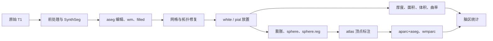

# Python recon-all：整例差异根因、精度容忍与验收顺序

**状态：2026-09-27，基于 `main` 提交 `c640a7d` 的既有同一 T1 证据；本报告没有重新运行重建。** 目标是固定 FreeSurfer 8.2 单 T1 配置的关键体素、表面、逐顶点与脑区指标一致。当前 Python 入口能从原始 T1 跑到核心皮层指标，但还不能把输出或用时称作与官方等价。[整例记录](NATIVE_FREE_CONNECTED_20260927.md)保留输入 SHA-256、参考日志、候选源码哈希、阶段时间和全部差异。

## 1. 先区分“算法相同”“输出相近”和“整例一致”

固定 138 项[严格比较](native_free_sub01_20260927/strict_138.json)中，只有 `orig/001`、`rawavg`、`orig`、`nu`、`T1` 和 `synthseg.rca` 通过。按文件路径分组如下；“不同”包括数值、类型、形状或元数据未过门槛。

| 组别 | 应有 | 通过 | 已生成但未通过 | 缺失 |
|---|---:|---:|---:|---:|
| MRI/体积 | 39 | 6 | 13 | 20 |
| 表面、逐顶点图及表面 MGH | 64 | 0 | 50 | 14 |
| 顶点标注 | 12 | 0 | 6 | 6 |
| 统计文件 | 23 | 0 | 11 | 12 |
| **合计** | **138** | **6** | **80** | **52** |

另一个[核心比较器](native_free_sub01_20260927/comparison.json)比较了 80 个双方均有的文件，并列出该比较范围内 24 个缺失文件；它是定位误差的诊断报告，分母与 138 项清单不同。六项通过中包含 SynthSeg 硬分割；该项通过不代表最终 `aseg` 或皮层指标通过。

[FreeSurfer 官方流程说明](https://surfer.nmr.mgh.harvard.edu/fswiki/recon-all)明确把拓扑修复、white/pial 放置、球面配准、皮层标注与脑区统计作为连续阶段；[官方形态重建教程](https://surfer.nmr.mgh.harvard.edu/fswiki/FsTutorial/MorphAndRecon)解释球面拓扑和球面图谱配准为何是皮层标注的前提。因此当前多个下游失败很可能共享少数上游首差，不能逐文件单独调大容差。

当前入口在 C–I 多处使用替代算法或省略阶段。图中箭头代表需用 **Python 上一阶段的真实输出** 接续核验的依赖关系；用冻结官方输入单独通过某一步，还不是整例通过。

## 2. 不一致的直接证据和最可能原因

| 边界 | 已观察到的差异 | 当前实现与可检验解释 |
|---|---|---|
| 前处理与 GCA | `brainmask` 差 35 个体素；`norm` 差 126,298 个体素，`ctrl_pts` 差 2,037 个值。 | `nu`、`T1` 已过严格门槛。应在相同 `nu`、mask、LTA 输入下定位 `mri_em_register → mri_ca_normalize` 的首差；不能仅由最终 `norm` 数字断言 GCA 数值核有错。独立 GCA 固定输入的最终 LTA 最大矩阵误差 `7.45e-9`，315,638 个 atlas 样本的取整映射全同。[GCA 阶段验证](MRI_EM_REGISTER_VALIDATION.md)、[整例差异](native_free_sub01_20260927/comparison.json)。 |
| `aseg`、WM、`filled` | `aseg` 差 107,249、`wm` 差 435,774、`filled` 差 90,420 个体素；`aseg.auto/presurf` 各差 2,263。 | [整例代码](../../../src/fnit/recon_all/native_free.py)把 SynthSeg 直接复制为 `aseg.auto/presurf/aseg`，以白质标签和最大连通域构造 `wm/filled`，没有串联官方对应的胼胝体、白质和后处理编辑。候选缺失官方 `aseg.auto` 的 2,263 个 251–255 胼胝体标签体素；它与两文件差异数量相同，但仍须空间逐点核对才可确认全部首差。`aseg` 还存在官方 int32、候选 float32 的类型/头差异。冻结输入下已有匹配的[mri_cc/填充](experimental/FILL_ASEG.md)和[后续 ribbon 修复](SURF2VOLSEG_FIX.md)代码。 |
| 网格与拓扑 | LH/RH white 顶点官方 106,622/105,541，候选 117,432/120,276；候选面数比球面拓扑关系 `F=2V−4` 多 56/76。 | 当前将 `orig.nofix` 复制为 `orig`，未运行完整缺陷修复。面数关系说明球面拓扑门槛不满足；未确认闭合、连通、流形条件前，不据此计算确切亏格。已有[拓扑预检](TOPOLOGY_PREFLIGHT.md)匹配部分冻结中间状态，候选边的 MRI 评分、遗传搜索、最终有序网格仍未验收。先修 `filled` 首差，再验拓扑；只补拓扑搜索也无法消除错误输入。 |
| White、pial、厚度 | white 候选→官方平均最近顶点距离 LH/RH 为 1.000/0.980 mm；pial 为 1.517/1.521 mm。厚度均值官方 2.079/2.024 mm，候选 4.148/4.087 mm。 | 当前 white 是平滑初始网格的复制；pial 沿法线以 **0.5 mm** 步进到 SynthSeg 皮层外，距离限于 1–6 mm，并把该射线距离写作厚度。它没有复现官方的强度梯度表面放置及厚度定义。冻结**官方 white/MRI** 输入时，独立 Python 双侧 pial 优化器已生成有序顶点一致的最终表面；独立[厚度核](../../../src/fnit/recon_all/surface_thickness_gpu.py)在冻结网格上最大误差小于 `1e-6` mm，但二者均未接入当前整例路径。[表面放置记录](PLACE_SURFACE_WHITE_PIAL.md)。完整 white 优化仍是缺口。 |
| 面积、体积、曲率 | pial 逐顶点面积均值 LH/RH 官方 0.872/0.876、候选 1.394/1.371 mm²；顶点体积 1.682/1.658 对 2.583/2.564 mm³。LH `curv.pial` 最近点最大差约 3460。 | 网格顶点数和几何先已不同，逐顶点面积/体积/曲率依附错误三角面与 pial；最近点只可定位空间误差。极端曲率提示需检查局部面面积、法向、自交/退化，但现有证据**尚未证明**具体是哪种几何病灶。[整例逐图结果](NATIVE_FREE_CONNECTED_20260927.md)。 |
| `sphere.reg`、atlas | 代码把径向 `sphere` 直接复制为 `sphere.reg`；aparc、a2009s、DKT 的空间最近点逐脑区 Dice 中位数 LH/RH 分别为 0.259/0.220、0.044/0.028、0.257/0.223。 | 当前 `sulc` 也是 `||inflated-white||` 的非负量；它不是官方有符号/处理后的球面配准种子。[独立完整标准球面](SPHERE_STANDARD_STATUS.md)和[双侧完整球面配准](MRIS_REGISTER_STATUS.md)已在冻结官方输入上匹配最终有序网格，但未从当前 Python 的真实前序结果串联。六个[atlas 标注](MRIS_CA_LABEL_STATUS.md)也已有冻结输入逐文件匹配证据，整例差异主要先查上游球面、分割和皮层标签。 |
| 体素投影和统计 | `aparc+aseg` 差 312,356、a2009s 差 358,625、DKT 差 314,950、`wmparc` 差 659,800 个体素。`aseg.stats` 45/30 行，`wmparc.stats` 70/65 行；`CortexVol` 官方 353,949.8、候选 530,938.2 mm³。 | 当前将体素分配给最近 white 顶点，且 `wmparc` 从原始 `aseg` 出发，只重标 2/41 白质。它留下 407,102 个 3/42 皮层体素，未产生官方 38,026 个 5001/5002 未分区白质体素。官方对应路径还检查表面法线与距离；已有[皮层投影](SURF2VOLSEG_CORTEX.md)、[白质投影](experimental/SURF2VOLSEG_WM.md)的冻结输入验证。`CortexVol` 来源于 white/pial 包围体积差，故目前的 +176,988.4 mm³ 主要指向表面输入；冻结官方输入时[统计行](ANATOMICAL_STATS_ROWS.md)、[全局值](ANATOMICAL_STATS_GLOBAL.md)、[aseg](ASEG_STATS.md)与[wmparc](experimental/SEGSTATS_WMPARC.md)的 Python 计算已匹配。 |
| 剩余 52 文件 | MRI 20、表面 14、标注 6、统计 12 项缺失。 | 包含 ribbon/缺陷图、部分辅助分割与曲率图、BA/exvivo 等标注及相应统计；**缺失是覆盖范围问题**，不是浮点误差。以[138 项清单](native_free_sub01_20260927/strict_138.json)逐项补齐，不能以 80 个核心比较文件代替完整输出验收。 |

上表的 atlas Dice 与最近点顶点图误差均来自两个**无同源顶点对应**的网格。它们不能证明逐顶点 atlas 或形态图一致。`aseg.stats` 共同区域体积误差中位数仅 5.95 mm³，也不能抵消缺失 15 行、pial 体积和皮层标注的大误差。[逐结构与逐脑区原值](native_free_sub01_20260927/comparison.json)必须一起报告。

## 3. 哪些必须逐点一致，哪些允许数值容忍

本项目需要同时保存两种口径，不能事后互换：**A. 固定 FreeSurfer 输出兼容**，用相同输入和固定官方配置验收全部 138 项；**B. 科学指标近似**，在多被试上评估形态指标的可替代性。当前发布目标是 A；B 即使通过，也不能称为官方逐顶点输出一致。

| 对象 | A：固定输出兼容的硬门槛 | 浮点容忍与 B 的诊断空间 |
|---|---|---|
| 文件集合、路径、模型/atlas 版本 | 138/138 存在；版本、标签表和真实输入 SHA 固定。 | 不能用平均分弥补缺文件。只需忽略与数值无关的时间戳、主机名、压缩流字节和绝对源路径等 provenance。 |
| 离散体素与网格拓扑 | 分类体素 ID **0 个不一致**；形状、方向、dtype、有效图像头正确。有序顶点数、面数、面索引、半球、流形/球面拓扑和有意义的 volume geometry 必须一致。 | Dice、边界距离、总体体积差仅用于 B 和定位；若 mesh 拓扑不同，只能报告空间距离，**不得用顶点编号直接配对**。严格比较器对整数体素要求逐点 0 差，对浮点体素/affine 允许绝对 `1e-6`。 |
| White/pial/sphere 坐标 | 先确认有序面和顶点一一对应；[严格比较器](compare_complete_subject.py)每坐标分量绝对差 `≤1e-5` mm、0 超差；不要求整个压缩文件 SHA 相同。 | [旧试验性配置](../../../tests/recon_all/tolerances_numeric.json)中的最大 0.25 mm、平均 0.01 mm、P99 0.05 mm **不是当前严格 138 项门槛**，也不能单独证明厚度/面积一致。若提出宽松 B 门槛，须同时检查所有逐顶点图、拓扑、自交及每个 ROI。 |
| 厚度、面积、顶点体积、曲率、sulc | 同源顶点前提下，逐点比较，**0 超差顶点**；严格比较器对 `area*` 用 `0.001 + 0.001×|官方值|` mm²，对其他形态图用 `0.005 + 0.001×|官方值|`（各图单位）。 | [旧试验性配置](../../../tests/recon_all/tolerances_numeric.json)进一步给曲率/sulc `0.001 + 0.001×|官方值|`；门槛在多被试开发集和重复官方运行上校准、冻结后再进入盲测。即便脑区均值接近，也不能放过局部曲率尖峰或单顶点厚度/面积异常。 |
| 顶点 atlas、脑区身份、整数计数 | 每顶点注释 ID、名称/颜色表、ROI 行集合与顺序，以及 `NumVert`/`NVoxels` 等整数计数精确一致。 | atlas Dice 可作 B 的补充指标，但须无缺失/新增脑区且按每脑区报告；当前空间最近点 Dice 不是同源顶点 Dice。 |
| MRI 强度、形变矩阵与连续场 | 当前严格比较器对浮点体素和 affine 用绝对 `1e-6`。LTA 可存在机器精度差，但要证明它不会改变任何采样索引、标签和下游输出。 | 固定输入 GCA LTA 误差 `7.45e-9` 且 315,638 个 atlas 样本取整相同，是可容忍浮点差的实例。若以后放宽 warp 场门槛，应先重复官方基线并实测对体素与指标的传播，而不能只凭位移误差小。 |
| ROI/全局统计与 SynthSeg 软体积 | ROI 名称、列、行数、单位、非数值字段须完整一致；当前严格比较器逐数值字段绝对 `≤0.005`、逐行 0 超差。 | [旧试验性配置](../../../tests/recon_all/tolerances_numeric.json)按字段给厚度 `0.01` mm、面积/灰质体积 `1 + 0.1%`、软体积 `10 mm³ + 0.1%` 等不同容差；它与严格比较器**不一致**，需确定单一正式口径。当前 SynthSeg 33 列软体积最大差 0.04 mm³、sTIV 差 0.05 mm³，虽很小，仍超过 `0.005` 严格门槛。若 B 使用更宽容差，必须预先冻结并逐脑区/逐列核验。 |

逐点严格门槛不是“所有 float 必须 bitwise 相同”：GPU/CPU 加法顺序可产生有限舍入误差；但**离散决策**（拓扑补丁、线搜索接受/拒绝、三角面、顶点 ID、标签、ROI 集合）不能因放宽 float 门槛而改变。曾有同输入的安装版与重编译诊断版 pial 表面坐标中位差 0.01577 mm，却使 79,656/106,622 个面积顶点超出既定容差，[详见放置诊断](PLACE_SURFACE_WHITE_PIAL.md)。因此“表面看起来接近”远不足以证明派生指标一致。

**比较器应先统一语义，再冻结阈值。** 当前 138 项比较器将所有非面积形态图统一设为 `0.005+0.1%`，统计字段统一设为 `0.005`；旧数值配置按变量细分，而且[核心比较器](../../../src/fnit/recon_all/compare_native_free.py)在顶点数不同时只给最近点描述，不能担任严格放行器。此外，严格 CSV 比较在非数值文本字段不同后即停止该行：`synthseg.vol.csv` 的报告显示 `max_numeric_abs=0` 却失败，不能据此断定 33 列数值完全一致，必须另看[逐列结果](native_free_sub01_20260927/comparison.json)。修订检查器应分别报告文本/标识差、逐列数值差及首个数值超差，并固定一份版本化容差文件；禁止看到盲测失败后放宽门槛。

## 4. 修复顺序与每一步的可交付验收

| 顺序 | 要接通/验证的边界 | 必须留存的首差和通过证据 |
|---|---|---|
| 0 | 冻结 FreeSurfer 8.2 构建、输入/模型/atlas SHA、参数和 138 项清单；核对 `brainmask → GCA LTA → ctrl_pts/norm`。 | 同输入分段体素/矩阵比较；说明归档 `nu`/N4 34 体素差和 `norm` 当前 126,298 值差的来源。先修上游，不通过下游容差掩盖。 |
| 1 | 接入已验证的 `mri_cc`、aseg 编辑、WM 和 `filled`；然后 tessellation、完整拓扑缺陷评分/搜索。 | `aseg.auto/presurf/aseg`、`wm`、`filled` 逐标签 0 差；双侧 `orig` 有序顶点/面、球面拓扑、volume geometry 匹配。拓扑搜索目前只完成部分预检。 |
| 2 | 完整 white 放置；接上已有的双侧 pial 优化和官方厚度定义；输出 ribbon、逐顶点图。 | 同源 white/pial 网格逐点、逐面过门槛；厚度、白质/pial/中面面积、顶点体积、曲率逐点 0 超差，检查局部最大误差和自交。已有 pial/厚度的**冻结输入**验证不替代这里的连续输入验收。 |
| 3 | 接上已验证的独立标准 `sphere`、`sphere.reg` 注册及六 atlas 标注。 | 从 Python `inflated` 连续产生球面与注册；每个阶段有序顶点/面、球面质量和每顶点 atlas ID 一致。当前 `sphere.reg` 文件复制必须消失。 |
| 4 | 按官方规则接入 ribbon、皮层/WM 投影、辅助分割、BA/exvivo 与全部统计。 | 138/138 文件存在；分类体素、ROI 名称/整数计数精确；浮点指标按预先冻结的逐元素门槛通过。独立冻结输入已通过的统计核应在 Python 自有上游输出上复验。 |
| 5 | 通过完整一致性后再优化耗时并做配对 benchmark。 | 同一 T1、同一节点和配置交错重复，保存日志/进程树、GPU/CPU/线程、冷暖启动与负载；报告各阶段和整例中位数及离散度。 |

## 5. 速度：当前观察、不能得出的结论、优先分析点

[候选计时 JSON](native_free_sub01_20260927/benchmark.json)记录 1805.733 秒（30.10 分钟），归档官方日志 6789.6 秒（113.16 分钟），表观时长比为 0.266。官方不是本轮配对冷启动，且输出缺失/近似，**不能称 3.76 倍等价加速**。

| 候选阶段 | 秒 | 候选总时长占比 | 解释 |
|---|---:|---:|---|
| GCA `mri_em_register` | 905.4 | 50.1% | 本次为归档官方同名命令 251.8 秒的 3.60 倍；CPU 路径。 |
| 六次 atlas 标注 | 389.6 | 21.6% | 目前输入 `sphere.reg` 尚未真正注册。 |
| N4 + `nu` | 236.5 | 13.1% | 与官方 `mri_nu_correct.mni` 的 225.3 秒大致对应。 |
| 双侧近似表面 | 68.1 | 3.8% | 省略了大部分拓扑和几何优化；不能同官方 `mris_place_surface` 的 1505.6 秒作加速比。 |

官方 `mris_register` 计时 833.1 秒，而当前只是复制球面。`rca-surfreg` 的 834.7 秒包含注册流程，不能与 `mris_register` 直接相加；原生日志所有命令计时求和 6907.8 秒，已经大于整例 6789.6 秒，说明还有嵌套。等价阶段的成本必须在接入后重测。

GCA 的 **3.60 倍只是一轮运行观察，不是 Python 算法固有速度**：同一固定输入的 headcw 隔离观测为 Python 230.20 秒、官方 236.52 秒，Python 的线性搜索占其中 205.25 秒。[GCA 函数](../../../src/fnit/recon_all/mri_em_register_python.py)已返回准备/平移/线性搜索/EM/写盘内层计时；[整例入口](../../../src/fnit/recon_all/native_free.py)当前只把外层秒数写入报告。先在 gpucw1 保存内层时间、搜索次数、Numba 冷暖状态、CPU 亲和/负载，配对复测后才判断是运行环境还是核函数热点。已验证的独立双侧球面注册在冻结输入上分别耗时 372.85/347.36 秒，仍比当时原生命令慢，且运行负载不同；它尚未接入整例。[配准状态](MRIS_REGISTER_STATUS.md)。

**最终速度验收**：先通过相同输入的 138 项固定门槛；再在同一主机、相同线程、设备、权重、模板与存储条件下，交错顺序重复完整官方和 Python 重建，分别统计冷启动与暖启动，记录阶段关键路径及资源峰值。报告中分开列出 CPU 与 CUDA 阶段，不能把不同主机的隔离计时拼成一个完整流程速度比。

## 证据边界

这里所有数字来自一个开发用 T1。冻结官方中间输入上的单阶段一致，说明代码可复用；它不能证明当前 Python 调度的上游输入、阶段交接、其他被试或全部 138 项已经一致。数值容差仍需在多个开发被试和官方重复运行上定稿，并在独立保留被试验收前冻结。[发布门槛](RELEASE_GATES.md)列出原有完整比较范围。
