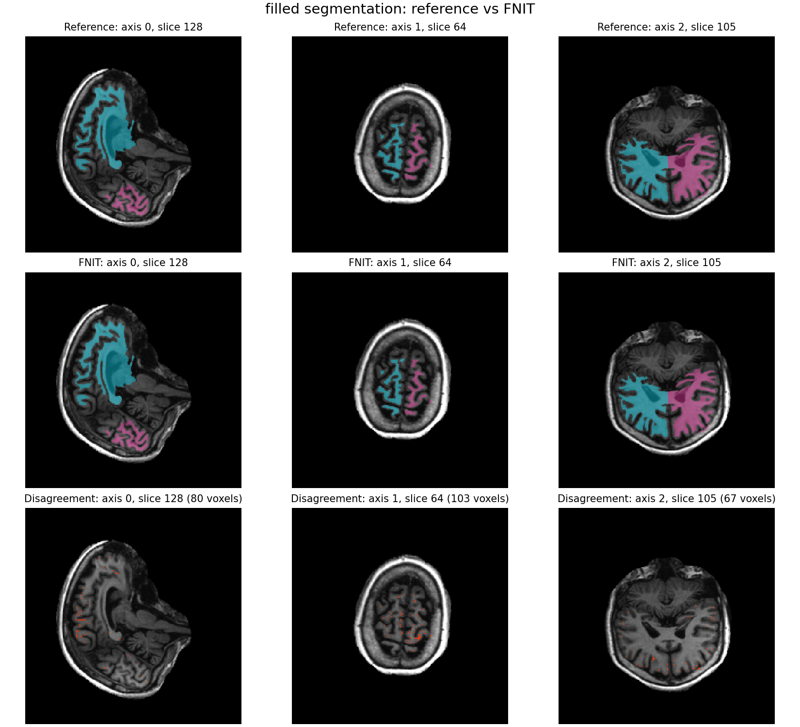

# recon-all 验证记录

[功能说明与安装](../../../docs/recon_all/README.md) · [阶段索引](../../../docs/recon_all/CONDA_CPP_STAGES.md) · [验收门槛](RELEASE_GATES.md)

主要真实影像为去标识的 `examples/data/sub-01_T1w.nii.gz`，SHA-256 为 `f20410a4efd8e6a05cd04d55730a4a5492ecf9ad1b234fe0fd4661e448270c6a`。记录分为三种：冻结官方上游的同输入算子比较、FNIT 自产上游的连续链、从原始 T1 开始的整例。三种结果不得互相替代。

## 当前单 T1 标准流程

入口已固定执行 MNI152 非线性变换、拓扑修复、真实 `white.preaparc`、标准球面与配准、最终 white、Conda 源码构建的四轮 pial 以及体积/顶点后处理，不再通过多个开关组合近似表面。Python pial 保留为可单独调用的同输入验证函数。[同一自产输入的双引擎比较](native_pial_candidate_20260929.json)给出输出差异与耗时。文件完整性与数值验收是运行报告中的不同字段。主页安装脚本已在新 Conda 环境从[完整固定源码树编译并安装 14 个必需程序](build_full_14_20260929.json)；源代码快照的 [recon-all 与权重清单测试](rebased_tests_20260929.json)为 237 项通过。此前的[固定源码初次构建](source_codeload_build_20260929.json)还记录了同输入真实 T1 的 `mri_segment` 逐体素一致。[资产安装记录](asset_setup_20260929.json)显示首次全新下载在 80 项处中断；[续传后的全新安装](asset_fresh_install_20260930.json)和当前源码 `--verify-only` 对 98 项标准资产均通过。无预装软件环境中的整例隔离验证仍待完成。[安装说明](../../../docs/recon_all/CONDA_CPP_BUILD.md)。 当前源码在主页环境的首次整例重跑于共享 GPU 0 的 SynthSeg 阶段因可用显存不足而停下，详见 [v8 OOM 记录](v8_shared_gpu_oom_20260929.json)；已改用空闲显存较多的 GPU 1 重新运行。独立 `sub-02` 的同版重跑也在共享 GPU 0 的 SynthSeg 阶段因其他任务占用显存而中断，见 [v10 OOM 记录](v10_shared_gpu_oom_20260930.json)。

旧版 v5 开发链从原始 T1 完成了 59 个阶段，双侧 white/pial 的[独立网格检查](mesh_validation_20260929.json)通过，但因使用早期代码快照缺少固定清单中的 18 项，运行报告为 `incomplete`，耗时 11,651 秒。与归档官方整例严格比较仅 5/138 项通过，通过项均是 MRI；它不能代表现版交付。v6 主页安装链在 Python pial 阶段结束，未形成完整整例。

固定源码快照的 v7 标准链使用新建 Conda 环境从原始 T1 跑完当时调度的计算阶段，耗时 7,414 秒；两侧[网格质量](v7_mesh_validation_20260929.json)另行检查为闭合、Euler 特征数 2、white/pial 自相交数 0。当时固定清单缺 4 项；在同一自产上游上单独补跑 `entowm.stats` 和[非线性配准](mni_nonlinear_real_20260929.json)后，138 项均存在。补跑不算一次当前 HEAD 的原始 T1 整例。严格[138 项整例比较](v7_138_comparison_20260929.json)仍只有 5 项通过，不能宣称数值验收。候选与官方表面顶点数不同，[双向最近点距离](v7_surface_nearest_20260929.json)仅用于定位形状差异，不能替代同索引比较。[34 个 aparc 脑区的统计](v7_region_comparison_20260929.json)中，平均厚度相关性左侧 0.9924、右侧 0.9978，均未达到 0.9999；[前段体积比较](v7_volume_comparison_20260929.json)中 WM 与 filled 也未达到 0.9957 门槛。整例进程 GPU 占用每 2 秒采样的最大值为 18,452 MiB，约 19.35 GB；采样最大值不等于连续峰值。

独立真实 `sub-02` 的同一冻结快照完成双侧表面和大部分统计，但 `brain_volume_stats` 遇到 4 个未分侧的标签 77 体素而停下。修正后对该阶段、后续统计和非线性配准分别手动续算，[138/138 项存在、两侧网格质量通过](sub02_fixed_stage_audit_20260929.json)。标签 77 的[同输入官方配对](brain_volume_label77_pair_20260929.json)显示左右白质体积完全相同，16 项统计最大误差 0.000826 mm³。手动续算不算当前 HEAD 的原始 T1 完整整例通过。



图中三列是 conform 网格差异体素最多的 X=128、Y=64、Z=105 切片；前两行分别为官方和 FNIT v7，青色、粉色对应标签 127、255，末行红点标出不一致体素。三张切片分别有 80、103、67 个差异体素，全体积共有 4,885 个；切片图不能替代全体积 Dice。
[绘图脚本](plot_filled_difference.py)以 `--reference` 接受官方单被试目录、`--candidate` 接受 FNIT 单被试目录、`--output` 指定 PNG 路径；三者均需写明。例如：

```bash
python validation/recon_all/python_gpu_port/plot_filled_difference.py \
  --reference /data/reference-sub01 \
  --candidate /data/subjects/sub01 \
  --output /data/filled-difference.png
```

## 2026-09-29 的现版同输入记录

| 范围 | 实测与边界 | 记录 |
| --- | --- | --- |
| N4 与 EM 输入敏感性 | 自产 `nu` 相对官方仅差 2 个体素；对冻结官方 `nu`、`brainmask` 重跑 Conda `mri_em_register` 时 LTA 16/16 元素一致。两处差异在连续链中放大，不能据此断言 N4 是唯一原因 | [N4 源码构建对照](n4_source_probe_20260929.json)、[EM 配对](em_register_input_sensitivity_20260929.json) |
| N4 同主机参考重放 | 在 gpucw1 上官方程序的 `nu` 与归档官方逐体素一致，FNIT 仍差 2 个体素；官方程序换到 headcw 后差 34 个体素 | [同主机与跨主机配对](n4_same_host_replay_20260930.json) |
| 缺陷体积映射 | 真实 T1 冻结输入，16,777,216 个体素全部一致；新 Conda 自编译 `mri_label2vol` | [精度、时间和输入](defects_volume_20260929.json)、[函数说明](../../../docs/recon_all/DEFECTS_VOLUME.md) |
| Talairach affine 子进程 | 冻结真实 SynthStrip 输入，XFM、LTA 与直接路径逐字节一致；需整例显存复核 | [记录](talairach_child_20260929.json) |
| SynthSeg 显存 | 同一 T1、同一 GPU 的候选分割与旧路径逐体素一致，体积 CSV 逐字节一致；独立阶段进程采样 18,450 MiB | [记录](synthseg_memory_20260929.json)、[资源说明](../../../docs/recon_all/GPU_MEMORY.md) |
| BA/VPnl 注释 | 修正相同统计值时的标签顺序后，六张注释的双侧顶点编码全部与冻结参考一致 | [记录](exvivo_wiring_20260929.json)、[注释说明](LABEL2ANNOT.md) |
| 图谱曲率 | 冻结球面上的 `avg_curv` 相关性超过 0.999999999999；四张曲率附图超过 0.999999999999999 | [函数说明及计时](../../../docs/recon_all/CURVATURE_OUTPUTS.md) |
| Jacobian、灰白对比、SNR | 双侧 Jacobian 相关性超过 0.9999999999999；百分比图逐顶点一致；70 行 SNR 数据行一致 | [记录](surface_metrics_wiring_20260929.json)、[函数说明](../../../docs/recon_all/SURFACE_EXTRA_METRICS.md) |

以上多数使用冻结官方上游，不能当作 FNIT 自产上游的整例吻合。`white.preaparc` 的候选输入首差和最终 white 冻结输入下的 57 个大于 0.1 mm 的顶点仍须在现版整例中追踪；见[预白质](../../../docs/recon_all/WHITE_PREAPARC_CONDA_CHAIN.md)与[最终 white](../../../docs/recon_all/FINAL_WHITE_CONDA.md)。[真实 T1 的非零自相交输入](intersection_positive_real_20260929.json)经 Conda 源码构建程序修复到零，相同有序面；尚无对应的官方同输入修复输出。

## 比较方法

[比较器](compare_complete_subject.py)与生产入口共用[138 项输出清单](../../../src/fnit/recon_all/expected_outputs.py)：39 张 MRI/其他体积图、18 个表面、46 张顶点图、12 张注释和 23 个统计文件。官方存档自比是 138/138；人为把厚度或面积改动 0.02 单位时仅对应输出失败，这只证明比较器能检出差异。

```bash
python validation/recon_all/python_gpu_port/compare_complete_subject.py \
  /data/reference-sub01 /data/subjects/sub01 \
  --report /data/sub01-comparison.json
```

完整门槛见[RELEASE_GATES.md](RELEASE_GATES.md)。

## 参考文献与原实现

- Fischl B. FreeSurfer. *NeuroImage*. 2012;62(2):774–781. [doi:10.1016/j.neuroimage.2012.01.021](https://doi.org/10.1016/j.neuroimage.2012.01.021)。
- [FreeSurfer 原实现代码库](https://github.com/freesurfer/freesurfer/tree/d932c45b7941662ea380a05efef580568b98d41a)。
