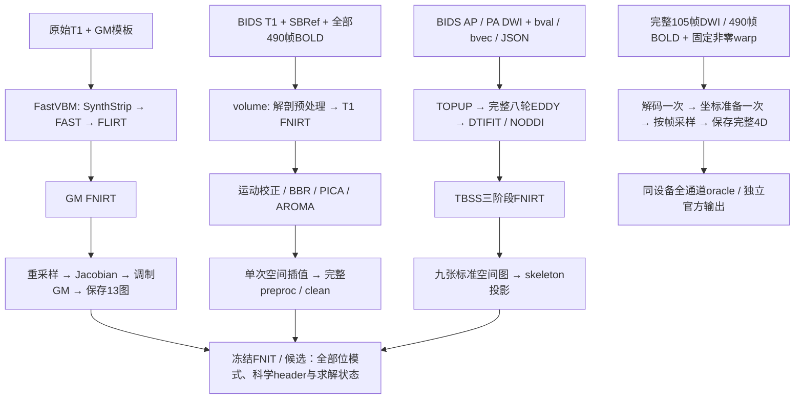
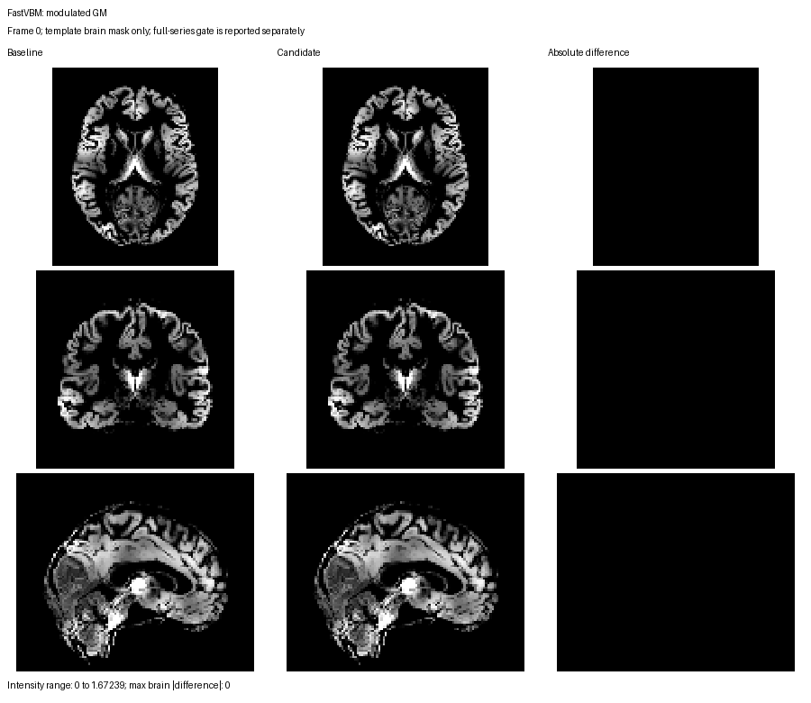
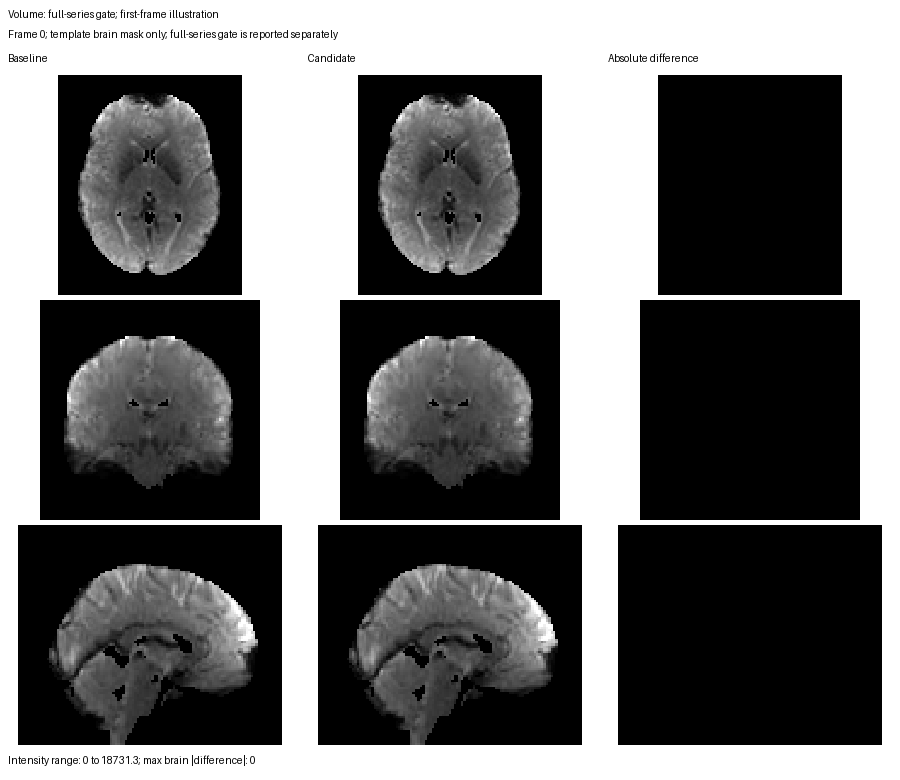
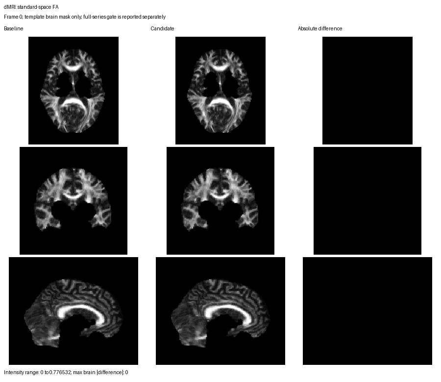
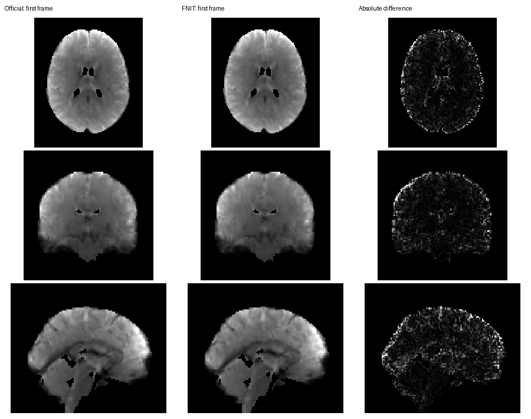
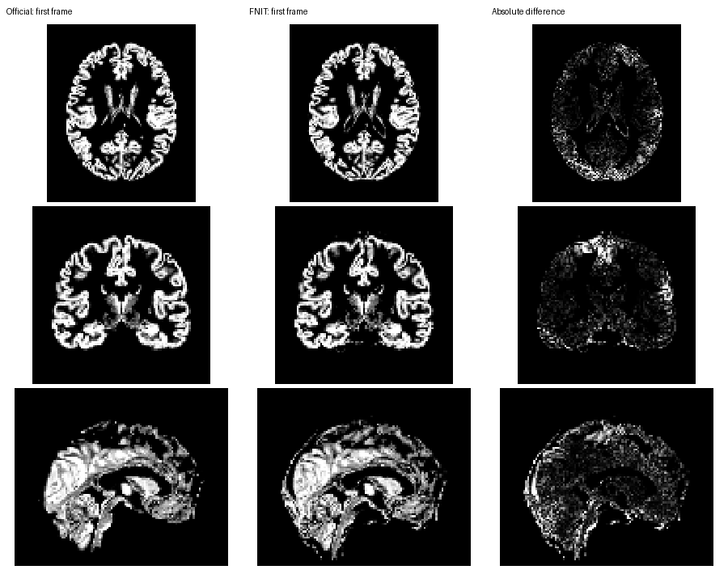

# FNIRT 与完整4D重采样：2026-10-02

[FNIRT](../../docs/fnirt/README.md) · [ApplyWarp](../../docs/applywarp/README.md) · [SynthMorph](../../docs/synthmorph/README.md) · [FastVBM](../../docs/fast_vbm/README.md) · [volume](../../docs/fmri/README.md) · [dMRI](../../docs/dmri_pipeline/README.md)

## 1. 本轮结果

三条真实完整流程均实际重新执行FNIRT，科学输出与冻结FNIT `747345223710e704f94ba850f58504fe2bac4f8e` 逐位相同。完整105帧DWI和490帧BOLD使用固定实际配准变换，覆盖全部体素、时间帧、正负零、几何、dtype、TR和保存重读。没有裁剪影像、减少帧数、降低精度、修改配准schedule或停止条件。

- FNIRT固定T1热调用中位数 **24.813→24.084 s**，观测时间降低2.94%，20对保存影像及4对完整QC文件相同。
- SynthMorph apply默认CPU最多32帧：490帧已加载影像API **27.836→14.943 s**，同设备逐位相同。显式CUDA **2.274 s**，与同GPU全通道oracle逐位相同；CPU/GPU舍入差异单列。
- ApplyWarp按吞吐改用8 GiB变化帧缓冲预算，本例自动105帧：已加载影像API **0.886→0.813 s**，allocated **1.157→0.777 GB**。文件路径API未显示稳定收益，完整文件读写另测。
- [相关测试](tests.public.json) **653 passed，4 skipped**；三条pipeline当前进程最大allocated **6.750 GB**、reserved **10.823 GB**。

本轮实现相对FNIT基线无损。与独立FSL/FreeSurfer的误差另外报告；FNIRT及完整原软件流程尚非逐位等价。

## 2. 输入、输出和实际流程



三条流程使用全新输出目录。volume关闭解剖缓存复用，STC关闭，clean采用公开API默认的WM/CSF及额外运动回归关闭配置，TR=0.735 s。dMRI从原始BIDS AP/PA开始，GP seed=12345；NODDI使用默认AMICO分支。FastVBM从原始 `208×320×320` T1w开始。

完整4D组件测试另使用 `104×104×72×105` corrected DWI和 `88×88×64×490` BOLD，两者输出均为 `91×109×91×T`。输入warp是实际已估计的非零FNIRT coefficient或MNI→EPI world-RAS pull，所有实现使用同一场。单独保留FMRIB58 1 mm网格的3D FA/FSL配对。

## 3. 计算和数据流改动

| 组件 | 保留的优化 | 精度约束 |
|---|---|---|
| FNIRT | cost-only采样跳过未用梯度；T1 linearization复用强度映射/bias；联合PCG复用FP64 deformation increment | 插值顺序、FP64系数/法方程、FP32强度项、归约、迭代与PCG检查相同 |
| ApplyWarp | 只materialize一次；channel采样；复用GPU输入buffer；直接回传最终CPU数组；缓存nearest索引 | 保留FP64 FSL几何、FP32 grid和原mask乘法的负零 |
| SynthMorph apply | 一次解码和坐标准备；CPU最多32帧；可选CUDA | 坐标仍按原CPU FP32顺序计算后传GPU；没有使用half |

两种CUDA采样器在坐标驻留后按 `min(8 GiB, 20,000,000,000 − 当前allocated − 512 MiB)` 估算变化帧缓冲，每帧计一个FP32输入和两个输出；显式分帧也检查剩余20 GB预算。ApplyWarp CPU默认全通道；SynthMorph CPU默认32帧。预算不足明确报错。本次实测选择105/490帧全通道CUDA；更长影像仍按预算切块。

成熟函数 `apply_transform` 原先将 `(X,Y,Z,1)` 折叠成3D，现修复为保留单帧4D轴，单列契约回归测试；配准模型的3D返回不变。该修复有意纠正旧输出，不列入旧错误结果相等门禁。

## 4. FNIRT完整端到端验收与分步骤时间

| 实际完整流程 | 基线API含保存 | FNIRT候选API含保存 | FNIRT函数：基线→候选 | allocated / reserved峰值，候选 | 完整检查 |
|---|---:|---:|---:|---:|---|
| raw T1→FastVBM调制GM | 212.67 s | 204.58 s | 193.61→188.21 s | 6.503 / 10.823 GB | 18幅影像 + 科学QC，全相同 |
| raw BIDS→volume全部490帧 | 539.48 s | 522.01 s | 28.43→24.49 s | 6.503 / 10.773 GB | 12幅影像 + 矩阵 + 科学QC，全相同 |
| raw BIDS AP/PA→dMRI/TBSS | 504.80 s | 477.69 s | 16.71→13.23 s | 6.750 / 7.850 GB | 66项检查，含54幅影像，全相同 |

当前main的volume集成版（包含此前 `8a3f227` 的MCFLIRT精确缓存/CUDA graph及样条采样优化）又完整运行一次：**462.43 s**，FNIRT **23.04 s**，全部科学输出与522.01 s候选相同。上游后续 `a315211` 未改这些pipeline的计算代码。[实测源码与发布源核对](source_verification.public.json)：FNIRT文件哈希在三条候选和最终发布源中相同；4D分帧政策的最终变化另由全帧组件/CLI门禁覆盖，这些pipeline的ApplyWarp调用为单帧3D。

### 主要内部阶段

| 阶段，s | 基线 | FNIRT候选 | 当前main volume集成 |
|---|---:|---:|---:|
| FastVBM脑提取 / FAST | 3.91 / 1.98 | 3.56 / 1.90 | — |
| FastVBM配准、Jacobian、调制 | 200.40 | 193.59 | — |
| volume FEAT core | 104.58 | 101.88 | 61.67 |
| volume PICA/AROMA/confounds | 72.49 | 63.49 | 59.00 |
| volume单次preproc空间插值 | 254.45 | 247.42 | 249.82 |
| dMRI TOPUP/EDDY准备 | 64.54 | 66.65 | — |
| dMRI EDDY | 372.38 | 348.92 | — |
| dMRI DTIFIT / NODDI | 13.91 / 23.50 | 13.87 / 22.68 | — |
| dMRI配准和九图传播 | 29.24 | 25.47 | — |

API时间包含构造、lazy import与最终保存；额外FNIRT验证捕获的写盘时间从API及包含它的内部阶段中扣除。阶段有嵌套关系，不能相加。共享H100与文件缓存未隔离，未修改步骤也有波动；这些单次整链差异不全部归因于FNIRT，也不称稳定加速比。更早的707.287 s volume启用了额外回归，与本轮配置不同。

匿名证据：[FastVBM基线](baseline_fast_vbm.public.json)、[候选](candidate_fast_vbm.public.json)、[逐位检查](fast_vbm_lossless.public.json)；[volume基线](baseline_volume.public.json)、[候选](candidate_volume.public.json)、[逐位检查](volume_lossless.public.json)、[main集成](integrated_volume.public.json)、[集成检查](integrated_volume_lossless.public.json)；[dMRI基线](baseline_dmri.public.json)、[候选](candidate_dmri.public.json)、[逐位检查](dmri_lossless.public.json)。

### 固定同输入T1的函数比较

同一实际已处理T1、FSL初始affine、MNI模板/mask与完整六级配置，在同一物理H100依次运行两个版本；4个CPU线程。其余测试使用8线程。

| 正式FNIRT函数时间 | 基线 | 候选 |
|---|---:|---:|
| cold | 27.101 s | 26.516 s |
| warm 1 / warm 2 | 24.802 / 24.823 s | 24.047 / 24.120 s |
| warm中位数 | 24.813 s | 24.084 s |
| 正式allocated / reserved峰值 | 1.178 / 1.491 GB | 1.183 / 1.458 GB |

20对系数、warped T1、完整pull、nonlinear/full Jacobian的全体素位模式、header和保存SHA-256均相同，4对原始完整QC也相同。profile展开次数 **20,819→14,147**，PCG matvec仍为7,266；profile kernel计数 **1,553,433→1,509,022**。profile墙钟186.98/178.46 s包含大量测量开销，仅用于诊断。主要剩余开销仍在PCG迭代的内核派发和CPU/GPU同步，本轮保留其科学停止逻辑。

[FNIRT固定输入完整报告](fixed_fnirt.public.json)保存所有正式重复、profile、源码/输出哈希和完整QC检查。相对独立FSL 6.0.7.22的warped T1脑内r仍为 **0.9977178843**。原软件217.558 s来自2026-10-01独立完整命令，其输出与本例输入绑定；FNIT函数不含持久输出保存，不能用两侧异边界计算加速比。

## 5. 完整4D、分帧消融与真实CLI

### 最终默认策略

| 范围 | 已加载API基线→最终，两次中位数 | 输入路径API，不含保存，一次 | gzip保存，独立warmup | 最终API allocated |
|---|---:|---:|---:|---:|
| ApplyWarp 105帧，CUDA | 0.886→0.813 s | 3.700→3.838 s | 9.79 s | 0.777 GB |
| SynthMorph 490帧，CPU32 | 27.836→14.943 s | 38.215→20.007 s | 75.71 s | CPU |
| SynthMorph 490帧，显式CUDA490 | 新增选项2.274 s | 6.738 s | 71.92 s | 4.557 GB |
| 独立3D FA，CUDA | 0.0506→0.0514 s | 0.214→0.072 s | 0.34 s | 1.969 GB |

材料已加载的API包含坐标准备、采样和CPU回传；路径API包含输入解压，但reference/warp已加载。读取、保存和profile另列，不将不同运行的这些时间拼成端到端测量。诊断采样阶段的计时范围也不同：ApplyWarp包含layout/H2D/D2H，SynthMorph仅包采样内核；正式API重复不加phase hooks/profiler。

### 为什么修改默认块

[Stage1完整消融](components_tuning.public.json)与[聚合摘要](component_tuning.public.json)实测auto/32/128和CUDA全通道；25个完整warmup门禁、4次auto gzip roundtrip全通过。

- BOLD CPU：32帧14.387 s，128帧20.777 s，全通道27.676 s；最终默认32。
- BOLD CUDA：全490帧2.501 s，128帧3.737 s，32帧3.502 s，旧256 MiB自动策略3.553 s；最终预算允许本例490帧。
- DWI CUDA：旧64帧auto0.998 s，32帧0.806 s，105帧全通道0.798 s，冻结基线0.826 s；取消任意64帧上限，保留显式块与20 GB检查。

最终复测见[ApplyWarp](components_apply_final.public.json)和[Stage2 SynthMorph默认复测](components_policy_stage2.public.json)的 `case_002`。Stage2里两个ApplyWarp病例仍记录当时的64帧政策，不作为最终ApplyWarp结果。报告保留各阶段真实源码哈希，避免混用不同默认值的时间。

CPU→CPU逐位相同；CUDA→同设备全通道oracle逐位相同。完整490帧CPU/GPU的全网格MAE/RMSE为 `5.45e-5 / 1.98e-4`，最大差值0.005859375，来自显式设备切换的舍入，未作为跨设备相等门禁。每个配置warmup验证全部值及metadata；正式重复仅计时，报告中门禁为null并引用已完成的warmup。auto保存重读独立核对，其他同位结果引用同一序列化路径。

### 新进程完整文件读写

| 同固定输入/变换的完整命令 | 设备 | 启动→退出，包含解压与gzip写出 | allocated / reserved |
|---|---|---:|---:|
| FNIT ApplyWarp，105帧 | 单GPU | 18.43 s | 0.777 / 1.460 GB |
| FSL 6.0.7.4 applywarp，105帧 | CPU8线程 | 500.62 s | CPU |
| FNIT SynthMorph apply，490帧，默认32块 | CPU8线程 | 94.23 s | CPU |
| FNIT SynthMorph apply，490帧，默认490块 | 单GPU | 86.90 s | 4.523 / 4.528 GB |
| FreeSurfer 8.2.0-1 / Surfa0.6.3 apply，490帧 | CPU8线程 | 116.16 s | CPU |

FNIT真实CLI由 `fnit.cli.main` 在新子进程执行，影像不提前解码/哈希，无warmup；GPU测试设置19 GB allocator上限。独立官方命令包含输入读写，Surfa warp格式准备单列排除。每个FNIT CLI的完整保存输出均再与对应CPU基线或GPU全通道oracle逐位/header比较通过。[完整CLI报告](cli_final.public.json)记录墙钟、显存、输入/输出哈希与门禁。单次运行、文件缓存和共享负载不受控，因此只报告观测时间。

## 6. 与独立原软件的输出比较及脑图

### 固定warp的全部4D值

| 输出与参照 | 模板脑内r | MAE / RMSE | 全网格r | 全网格MAE / RMSE |
|---|---:|---:|---:|---:|
| ApplyWarp 105帧 vs FSL | 0.999999999997 | 0.001514 / 0.004125 | 0.999999999998 | 0.000497 / 0.002180 |
| SynthMorph CPU 490帧 vs官方 | 0.999999999995 | 0.005271 / 0.009446 | 0.999931086434 | 1.902311 / 41.782933 |
| SynthMorph CUDA 490帧 vs官方CPU | 0.999999999995 | 0.005271 / 0.009445 | 0.999931086434 | 1.902311 / 41.782933 |

所有统计覆盖对应区域的**全部时间帧**，没有用第一帧代替完整benchmark。FSL比较有23,990,715个脑内值；SynthMorph有111,956,670个脑内值。[CPU/FSL报告](official_warp.public.json)、[CUDA官方报告](official_warp_cuda.public.json)同时保存shape、affine、dtype、TR/单位和header差异。FSL部分未使用的pixdim项不同；FreeSurfer额外写入extension。它们与FNIT整份header并不相等。

SynthMorph线性采样保留既有 `[0,n−1]` 有效域；Surfa0.6.3使用 `[0,n)`，末层中心外的带状区域因此不同。本轮为无损优化保留这一行为。第一帧诊断定位14,467个带状体素，模板脑mask与该带无交集；其误差贡献仅描述第一帧，未推广到490帧。[边界诊断](synthmorph_boundary.public.json)。

### 从原始T1开始的FastVBM

使用独立FSL既有同raw T1/GM模板的保存结果重新比较本轮输出：warped GM / nonlinear Jacobian / modulated GM脑内r分别为 **0.89136 / 0.89016 / 0.86629**；MAE分别为 **0.08853 / 0.10328 / 0.11079**。原软件3195.14 s是2026-09-30的完整命令合计，不是本轮重新计时，也未固定中间分割或初始仿射。[最新逐图精度](vbm_official.public.json)与[完整参照记录](../fast_vbm/README.md)。本轮相对FNIT基线严格一致，不消除这项原软件算法差异。

三条pipeline与原软件的独立验证范围分开记录：[T1/FSL六级](../../docs/fnirt/README.md#t1w-专用预设当前-gpu-修复版)、[完整raw dMRI独立FSL/AMICO与TBSS](../dmri_pipeline/end_to_end_20261002.md)、[volume历史匹配配置](../fmri/README.md)。不同起点、clean选项或seed的原软件流程不能作为本轮FNIT前后逐位门禁的替代。

### 新示例图

每图为三个正交切面，基线/候选/绝对误差；volume只展示首帧，完整490帧另有数值门禁。强度和误差面板独立定标，放大采用nearest；全部像素限制在模板脑mask内。





官方对照依次显示Official/FNIT/绝对误差，4D图仅为首帧示例：





所有图的生成脚本/图哈希见 `figures/*.public.json`；原始/完整NIfTI和私有路径不发布。

## 7. 复现、资源、更新记录和参考

主功能页按简介、Python/输入输出/参数、CLI、原软件命令、最新验证/脑图、更新记录、参考七节组织；源码README只链接主文档。

在主页Conda环境运行，不额外追加另一环境的 `site-packages`。旧验证bootstrap引入不兼容的setuptools/backports，影响Triton导入；受影响的试跑与时间已排除，未修改生产内核或放宽容差。环境为项目Torch2.5.1/Triton3.1.0、共享H100 PCIe；各进程仅一张可见GPU，TF32保持原开关，没有half或新依赖。

```bash
# 私有JSON按pipeline名保存真实API参数。baseline/candidate为独立源码目录。
# output-dir必须是新目录；volume脚本自动禁止解剖缓存命中。
python tools/validate_fnirt_pipeline_lossless.py \
  --pipeline fast-vbm --case-json /private/pipelines.json \
  --source-root /work/baseline --output-dir /results/baseline_fast-vbm \
  --threads 8 --memory-limit-gb 19
python tools/validate_fnirt_pipeline_lossless.py \
  --pipeline fast-vbm --case-json /private/pipelines.json \
  --source-root /work/candidate --output-dir /results/candidate_fast-vbm \
  --threads 8 --memory-limit-gb 19
# volume / dmri使用同一模式，比较全部科学输出及完整科学QC。
python tools/validate_fnirt_pipeline_lossless.py \
  --output-dir /results/candidate_fast-vbm --compare-to /results/baseline_fast-vbm

# cases含backend、input、reference、warp、interpolation、devices。
python tools/benchmark_warp_4d_lossless.py \
  --legacy-root /work/baseline --case-json /private/warp_cases.json \
  --output-dir /results/warp --repeats 2 --frame-chunks 32 128 \
  --path-api-repeats 1 --profile-cuda
# 最终自动政策只复测默认值时加--auto-only，仍使用完整影像和全通道oracle。

# CLI私有JSON另列expected_outputs_by_device，CUDA SynthMorph给同GPU全通道oracle。
python tools/benchmark_warp_cli_lossless.py \
  --case-json /private/cli_cases.json --output-dir /results/cli --threads 8

# 原软件输出提前在独立进程生成；比较工具不调用原软件。
python tools/compare_warp_official.py \
  --case-json /private/official_cases.json --output-dir /results/official_comparison
python tools/summarize_fixed_fnirt_lossless.py --help
```

科学门禁比较完整数组位模式和header/extensions，不以浮点容差替代；FNIRT额外覆盖系数、完整RAS pull、两种Jacobian与所有科学QC。QC只递归排除测得的 `elapsed_seconds`，仅顶层排除执行标签 `execution`；cost、范围、计数、接受/拒绝与停止状态均保留。测试确保科学状态变化不会被忽略。

独立完整105帧原软件命令：`applywarp --in=corrected_dwi.nii.gz --ref=MNI152_T1_2mm.nii.gz --warp=FA_to_MNI_coeff.nii.gz --interp=trilinear --datatype=float --out=dwi_in_MNI.nii.gz`。独立完整490帧命令：`mri_synthmorph apply -m linear -t float32 -f 0 official_ras_warp.nii.gz bold.nii.gz bold_in_MNI.nii.gz`。官方Surfa场以相同RAS向量补入source/target geometry、format与NIfTI extension，重读向量/affine完全不变；该格式准备不计apply时间。

资源使用已核查的服务器现有模板。SynthStrip/SynthMorph既有权重按FNIT `assets-v1`清单核验大小/SHA-256，没有新下载、依赖或再分发权重/模板。GitHub仅保存匿名数值、源码/输入哈希和模板脑内PNG；原始数据、含私有路径的配置与日志留在服务器。

| 日期/版本 | 范围 |
|---|---|
| 2026-10-02，本轮 | 三条完整FNIRT流程逐位验收；全105/490帧参数消融、最终默认策略、CLI含读写、独立官方误差与脑图 |
| 2026-10-02，`8a3f227`/`edea6a5` | 上游MCFLIRT缓存/graph及volume样条采样；本轮main集成版重新验收 |
| 2026-10-02，`7473452` | 已有dMRI数据流优化；本轮冻结数值基线 |
| 2026-10-01 | [T1 FNIRT/BBR历史profile](../fmri/registration_gpu.current.public.json)，此前Gram优化改变了FP64求和顺序，本轮以它为既有基线 |

参考：[FSL FNIRT User Guide](https://fsl.fmrib.ox.ac.uk/fsl/docs/registration/fnirt/user_guide.html)、[FNIRT原实现](https://git.fmrib.ox.ac.uk/fsl/fnirt)、[applywarp.cc](https://git.fmrib.ox.ac.uk/fsl/fugue/-/blob/master/applywarp.cc)、[FreeSurfer mri_synthmorph](https://github.com/freesurfer/freesurfer/blob/dev/mri_synthmorph/mri_synthmorph)、[Surfa0.6.3采样源代码](https://github.com/freesurfer/surfa/blob/v0.6.3/surfa/image/interp.pyx)、[SynthMorph论文](https://doi.org/10.1162/imag_a_00197)。
