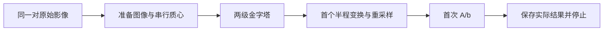

# CPU 首次 A/b：真实输入对照

## 1. 功能简介

本页记录 robust-register 的首次线性系统观察。输入同一对真实三维影像，分别运行固定 FreeSurfer 源码的独立 SDK 观察器和 FNIT 原有 CPU 数学流程，在首次粗分辨率 A/b 构造后停止。候选仅在私密验证模块使用已测的串行质心函数；生产默认和 GPU 代码均未修改。

**本次 18 个观察边界全部一致。** 两幅准备图像、两级金字塔和两幅半程图像的 8 组 Float32 数组记录逐字节一致；7 组 Double 状态一致；A 为 9196×6，b 为 9196，全部 Float32 位模式相同。首个差异边界为空。完整 robust-register 的正式验收仍为 **17/20**，下一步定位 QR、MAD/权重、IRLS 和更新。



原生参考由固定源码和已审查的对象独立编译；其初始化、准备与数学函数来自该 SDK。它不是安装版 `mri_robust_register` 的受控 trace。本次注册 QR、IRLS、后续更新、完整配准和 GPU 执行次数均为 0。Schur 内部算法另列，实际调用 1 次，n=4，INFO=0。

## 2. Python 调用、输入与输出

[boundary_probe.py](boundary_probe.py) 提供验证函数 `make_first_ab_cpu_tap`。它读取指定注册函数的原始 AST，保留原 `torch.inference_mode()` 和全部数学节点，在首次 `analytic_system` 返回之后调用回调并停止。它不修改磁盘上的生产源码。

| 参数 | 意义与格式 |
| --- | --- |
| `registration_module` | 已导入的 FNIT robust-register 模块；必须能提供原 `robust_register` 函数及其原始源码。 |
| `source_binding` | 字典，包含原模块的 `path`、`resolved_path`、`bytes`、`sha256`；用于验证实际源码身份。 |
| `save_state` | 回调函数，接受首次构造之后的实际局部状态字典；调用者负责保存需要的输出。 |

返回一个只允许调用一次的 CPU 刚体验证入口。入口的位置参数 `source_image`、`target_image` 是原注册函数接受的三维影像路径；关键词参数沿用原注册函数。`device` 必须为 `cpu`，`mode` 必须为 `rigid`。重复调用、源码身份不一致或无法找到唯一边界时明确报错。

本次真实输入的原始存储分别为 uint8 与 Float32 MGH/MGZ，具有 MRI 几何字段。准备输出均为 Float32 XYZ 张量，39×45×61；粗层为 19×22×30。完整准备状态记录真实尺寸、体素大小、方向、中心、outside 和 RAS 标志。候选金字塔及半程张量没有存储原生 MRI 头，观察器记录其实际张量网格。

本次保存的输出包括：

- 两幅准备图像、各两层金字塔及两幅半程图像的原始 Float32 字节；XYZ 数组按 X 最快、再 Y、Z 布局保存。
- 两个三元素 Double 质心，Rsrc/Rtrg、粗层入口矩阵及两幅半程映射。
- 首个 A 与 b，Float32 行主序；6 列对应刚体参数。原函数的行选择规则由源码定义，本次未导出显式选中行索引。两侧 A/b 全字节相同。
- 各入口和运行库身份、计时、执行次数、退出状态，以及聚合差异统计。本阶段精度结论来自服务器原始 COMPARISON 的安全聚合和原件大小、SHA-256；本地未转移原矩阵、影像、A/b、日志，也未逐字节重构完整原始 JSON。原始数据与完整记录保留在服务器私密验证目录。

以下示例将已导入的冻结候选模块作为显式输入。当前 main 只有相关准备模块，注册候选尚未成为生产 API。示例使用传入模块的现有 CPU 质心；本页精确对照另使用前一阶段已经验证的串行 CPU 质心候选，详见[质心报告](../centroid_serial_cpu_probe_20261006/README.md)和[初始化报告](../centroid_m0_cpu_prefix_20261006/README.md)。该串行实现的资格仍限于已验证的准备输入域。

```python
from pathlib import Path
import hashlib
from validation.robust_register.first_ab_cpu_prefix_20261007.boundary_probe import (
    make_first_ab_cpu_tap,
)

def observe_first_system(registration_module, moving_image_path, fixed_image_path):
    """registration_module 是调用者已经导入的冻结验证模块。"""
    # 原模块身份：每个字段都来自实际源码文件。
    registration_source_path = Path(registration_module.__file__)
    registration_source_bytes = registration_source_path.read_bytes()
    registration_source_binding = {
        "path": str(registration_source_path),
        "resolved_path": str(registration_source_path.resolve()),
        "bytes": len(registration_source_bytes),
        "sha256": hashlib.sha256(registration_source_bytes).hexdigest(),
    }
    first_system_outputs = {}

    def save_first_system(original_state):
        # 保存原构造结果；此处不重新计算梯度、行选择或 QR。
        first_system_outputs["A"] = original_state["a"].detach().cpu().clone()
        first_system_outputs["b"] = original_state["b"].detach().cpu().clone()
        first_system_outputs["rows"] = dict(original_state["rows"])
        first_system_outputs["source_half"] = original_state["sw"].detach().cpu().clone()
        first_system_outputs["target_half"] = original_state["tw"].detach().cpu().clone()

    first_system_probe = make_first_ab_cpu_tap(
        registration_module,
        source_binding=registration_source_binding,
        save_state=save_first_system,
    )
    probe_boundary = first_system_probe(
        moving_image_path,           # 移动三维影像，保留原几何和存储类型
        fixed_image_path,            # 固定三维影像
        device="cpu",               # 此验证入口只接受 CPU
        mode="rigid",               # 六参数刚体
        initialize_translation=True,
        pyramid_min_size=16,
        pyramid_max_size=-1,
        highres_iterations=-1,
        iterations_per_level=5,
        stop_distance=0.01,
        saturation=50.0,
        spatial_chunk_size=131072,
        memory_budget_gb=20.0,
        tf32=True,                  # 沿用接口；本次设备为 CPU
    )
    return probe_boundary, first_system_outputs

# 调用者先导入自己的固定注册候选模块，再传入本函数。
# probe_boundary, first_system_outputs = observe_first_system(
#     registration_module, "/path/to/moving.mgz", "/path/to/fixed.mgz"
# )
```

脑图可视化示例：用户可在自己的影像上运行上述入口，显示同一个粗层网格上的半程图像。本次未回传私密影像或新增公开脑图。

```python
import matplotlib.pyplot as plt

source_half_image = first_system_outputs["source_half"].numpy()
target_half_image = first_system_outputs["target_half"].numpy()
axial_index = source_half_image.shape[2] // 2
figure, axes = plt.subplots(1, 2, figsize=(7, 3))
for axis, image, title in zip(
    axes, (source_half_image, target_half_image), ("Source halfway", "Target halfway")
):
    axis.imshow(image[:, :, axial_index].T, cmap="gray", origin="lower")
    axis.set_title(title)
    axis.set_axis_off()
figure.tight_layout()
```

## 3. 命令行调用

此观察器是内部验证 API，没有生产 CLI。相关准备功能的输入、参数和输出说明见[准备说明](../../../docs/robust_register/PREPARATION.md)。本次私密控制入口只允许一组 SDK 与候选调用，采用 120 秒单子进程、300 秒工作和 350 秒外层 OS 期限，持有同一 CPU 锁直到所有已观察后代退出。

## 4. 原软件调用

完整官方刚体调用对应：

```bash
mri_robust_register --mov moving.mgz --dst fixed.mgz \
  --lta official_rigid.lta --sat 50 --maxit 5 --epsit 0.01
```

该命令运行完整配准；此次精确观察使用原源码独立 SDK，保存首个 A/b 后停止。SDK 保留原始 min/max/subsample 默认值、刚体、对称模式、不做强度缩放、translation 初始化、Float32 图像与构造类型。候选使用原函数相同有效金字塔条件。

## 5. 最新真实精度与耗时

| 同输入观察内容 | 结果 |
| --- | --- |
| 准备图像、各层金字塔与半程图像：8 组数组 | Float32 原始字节全部相同，不同元素 0，最大误差 0 |
| 质心、Rsrc/Rtrg、粗层入口和半程映射：7 组状态 | Double 位模式全部相同，最大误差 0 |
| A：9196×6；b：9196 | Float32 原始字节全部相同，不同元素 0，最大误差 0 |
| 原生 Schur 入口 | 实际 1 次，n=4，INFO=0；仅该固定调用域得到验证 |
| 原生运行库 | 实际 23 个 ELF 身份匹配 |
| 候选四个运行库检查点 | 实际 99/122/122/122 个 DSO，均是原 123 个指定文件身份的子集 |

| 计时层级 | 秒 |
| --- | ---: |
| SDK 原生首次 A/b 子进程 | 0.293293 |
| 候选首次 A/b 子进程，含导入/JIT/身份检查 | 16.505572 |
| 候选前缀导入，含第一个运行库检查 | 5.463983 |
| 候选原流程前缀，含两次运行库检查和 JIT | 7.472722 |
| 冷 typed 质心编译 | 0.596000 |
| 额外 NumPy/Numba/LLVM 导入 | 0.361618 |
| 四个运行库身份检查点合计（maps、文件 SHA 与记录） | 12.573443 |
| 两个真实质心内核 | 543977 / 232976 ns |
| 包含两侧对照的 supervisor / outer / owner | 30.952328 / 31.050197 / 31.150906 |

这些是同节点、8 CPU 线程、20,000,000,000 字节地址空间上限的一次冷观察。子步骤嵌套在父时钟中，不应累加。候选的大部分观察时间来自四个运行库身份检查点，包含 maps、文件 SHA 与记录；无诊断检查的生产净算法时间尚未独立测量，本页不据此给出生产加速比。

控制收尾通过：20 个冻结文件与 484 项资源前后身份相同，20 个保存数组哈希一致，10 个原始 PID/start 实例均已退出，共用 CPU 锁可释放，六把索引锁下同伴条目保留，本任务授权已关闭。LLVM 名称与 flags 是静态证据，运行库身份是实际加载文件证据；它们没有被标成动态 BLAS 调用 trace。

## 6. 最近版本与下一步

| 阶段 | 结果与范围 |
| --- | --- |
| 初始准备/M0 观察 | 准备字节一致，PyTorch 质心与 M0 存在 Double 尾差；观察格式和入口错误保留在私密历史中。 |
| 串行 CPU 质心与 M0 前缀 | 已测真实质心 6 个 Double words 及完整初始化；原始准备与 M0 一致，默认未替换。 |
| 本次首个 A/b（2026-10-07） | 18 个观察边界一致；SDK/候选各 1 次，Schur 固定调用完成；注册 QR/IRLS/更新未运行。 |
| 下一阶段 | 在已相同的真实 A/b 上对比首 MAD/sigma、归一化、sqrtWeights、weighted A/b、QR 解、每轮 IRLS 标量及首个更新，随后验证完整连续注册。 |

完整刚体/仿射/inverse 和 warp 的正式 17/20 门保持原阈值。未知输入域、生产默认和 GPU 回归待完整验收后决定。

## 7. 参考文献与源码

- Reuter M, Rosas HD, Fischl B. Highly accurate inverse consistent registration: a robust approach. *NeuroImage* 53, 1181–1196 (2010). [DOI](https://doi.org/10.1016/j.neuroimage.2010.07.020)。
- [FreeSurfer mri_robust_register](https://github.com/freesurfer/freesurfer/tree/d932c45b7941662ea380a05efef580568b98d41a/mri_robust_register)：固定原源码、准备、回归与刚体/仿射注册相关函数。
- [FNIT 准备说明](../../../docs/robust_register/PREPARATION.md)，[首次 A/b 验证函数](boundary_probe.py)，[机器可读汇总](benchmark_summary.json)。
- [PyTorch torch.linalg.qr](https://docs.pytorch.org/docs/stable/generated/torch.linalg.qr.html)，[Numba 编译接口](https://numba.readthedocs.io/en/stable/reference/jit-compilation.html)。
