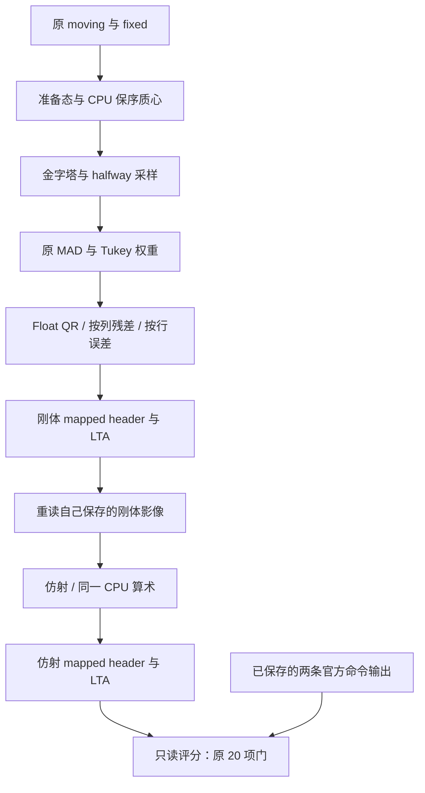

# 完整 CPU 刚体与仿射：可复用实验 API

## 1. 功能简介与流程

将已验证的 CPU 串行 Double 质心、Float LINPACK QR、按列残差和按行加权误差，接入原实验配准流程。输入原影像后执行**刚体 → 保存并重读自己的刚体头信息 → 仿射**，与同输入的已保存 FreeSurfer 官方结果比较。

**公开适配器的冷启动和同实例热启动，在这个真实案例上各通过原有 20/20 项检查。** 本次重新运行的两条官方命令与此前官方输出比较，也通过 20/20 项检查。 两阶段的 133 点位移、共享采样器 warp 差异、非零支持集差异均为 0；两份 mapped MGH 的 13 个头字段均相同。LTA 增量矩阵还有约 `1e-14` 的文本解析尾数差。

这是独立 CPU 验收候选。生产 `fnit.robust_register` 仍提供准备态函数；GEMS 默认与 GPU 分支没有替换。[CPU 适配器](cpu_experiment_adapter.py)和[命令行包装](run_cpu_experiment.py)随本报告提供；它们从完整 FNIT checkout 加载已验收的实验源码，不是已安装 wheel 中的生产注册 API。其它输入与 GPU 回归仍待完成。



## 2. Python 调用、输入与输出

### 从完整 checkout 加载 CPU 候选

使用主页的 Conda 环境，在 FNIT 仓库根目录运行。`load_cpu_candidate` 创建一次独立实例；重复调用同一个实例复用四个已编译内核。`with` 在最后一次调用后关闭该实例，并移除它自己的实验命名空间。普通 Python API 保留调用方的线程数和 TF32 设置。

```python
from pathlib import Path
import importlib.util

# 从 FNIT 仓库根目录运行；validation 文件需要完整 checkout。
toolkit_repository_root = Path.cwd()
cpu_adapter_path = (
    toolkit_repository_root
    / "validation/robust_register/full_cpu_arithmetic_20261007/cpu_experiment_adapter.py"
)
cpu_adapter_specification = importlib.util.spec_from_file_location(
    "fnit_cpu_registration_experiment", cpu_adapter_path
)
cpu_adapter_module = importlib.util.module_from_spec(cpu_adapter_specification)
cpu_adapter_specification.loader.exec_module(cpu_adapter_module)

moving_image_path = Path("inputs/moving_atlas.mgz")
fixed_image_path = Path("inputs/fixed_target_mask.mgz")
registration_parameters = {
    "device": "cpu",
    "saturation": 50.0,
    "iterations_per_level": 5,
    "stop_distance": 0.01,
    "initialize_translation": True,
    "pyramid_min_size": 16,
    "pyramid_max_size": -1,
    "highres_iterations": -1,
    "spatial_chunk_size": 131072,
    "memory_budget_gb": 20.0,
    "tf32": True,  # 保留配置；CPU 不使用 TF32。
}
with cpu_adapter_module.load_cpu_candidate(
    repository_root=toolkit_repository_root
) as cpu_registration_candidate:
    cold_pair_result = cpu_registration_candidate.cpu_robust_rigid_affine(
        moving_image_path,
        fixed_image_path,
        stage_directory=Path("outputs/cpu_registration_cold"),
        **registration_parameters,
    )
    # 同实例重复调用：复用 JIT 内核，写入另一个输出目录。
    warm_pair_result = cpu_registration_candidate.cpu_robust_rigid_affine(
        moving_image_path,
        fixed_image_path,
        stage_directory=Path("outputs/cpu_registration_warm"),
        **registration_parameters,
    )
    print(warm_pair_result["seconds"])
    print(warm_pair_result["combined_RAS_matrix"])
```

单阶段可调用 `cpu_registration_candidate.cpu_robust_register(moving_image_path, fixed_image_path, mode="rigid", **registration_parameters)`；`mode="affine"` 使用 12 参数仿射。单阶段结果提供 `transform`、`header_image` 和 `report`，调用方可以用 `transform.save(...)` 和 `nibabel.save(...)` 保存。

| 输入或参数 | 意义、格式与本次设置 |
|---|---|
| `moving_image_path` | 三维标量 moving 影像，带有效空间头信息。本例是反射后的 atlas，`131×241×99`、UInt8、0.25 mm。 |
| `fixed_image_path` | 三维标量目标影像。本例是公开真实 T1 派生的非空目标 mask，`39×45×56`、Float32、1 mm。 |
| `repository_root` | 完整 FNIT checkout 根目录；省略时从本叶子的固定位置推导。 |
| `mode` | 单阶段取 `rigid` 或 `affine`；两阶段方法依次执行刚体与仿射。 |
| `stage_directory` | 自己的输出目录；仿射读取本目录刚体阶段保存的 MGH。 |
| `device` | 本次固定 `cpu`。本 CPU 实验入口拒绝 CUDA；既有 GPU 入口保持独立，本轮没有 GPU 数值或速度回归。 |
| `saturation` | 原稳健回归的饱和参数，本次 50。 |
| `iterations_per_level` | 每个金字塔层最多 5 次外层更新。 |
| `stop_distance` | 原变换更新的停止距离，本次 0.01。 |
| `initialize_translation` | 按原图像质心初始化平移，本次开启。 |
| `pyramid_min_size` | 金字塔最小尺寸，本次 16。 |
| `pyramid_max_size` | 最大尺寸限制；本次 -1 表示使用原配置的不限模式。 |
| `highres_iterations` | 单独的最高分辨率迭代预算；本次 -1 使用原层预算。 |
| `spatial_chunk_size` | 采样时每块体素数，本次 131072。 |
| `memory_budget_gb` | 计算内存预算，本次 20；验收进程另有 20 GB 十进制地址空间上限。 |
| `tf32` | 保留原配置；CPU 不执行 TF32 运算。 |

输出包括 `rigid`、`affine` 两个结果对象、`combined_RAS_matrix` 和两阶段 `seconds`。两阶段结果对象的 `report` 保存准备态、金字塔与回归信息。输出文件共 **4 份**，包含 2 个 mapped-header 影像和 2 个 LTA 变换：`rigid.header.mgz`、`rigid.lta`、`affine.header.mgz`、`affine.lta`。mapped-header 影像保留原源体素，只更新空间头；不是重采样后的新体素网格。验收另保存两份完整阶段/退出 JSON，不能把它们计为两份新增影像。

本次刚体 6 个参数、仿射 12 个参数。此前受控完整 pair 中，每臂真实执行 2 层×5 次外层求解，三种 helper 各调用 80 次、质心调用 4 次。此次正常 API 验证四个内核的对象和签名在冷、热调用间复用，没有在 API 内插入观测器来重复统计每次内核。13 参数强度缩放和秩亏输入尚未验收；不支持的 helper 输入返回 `None` 时走旧计算，秩亏 helper 的 `ValueError` 原样传出。

可复用算子及其调用见[同 A/b 的 CPU QR、残差与误差](../same_ab_irls_cpu_20261007/README.md)、[保序质心](../centroid_serial_cpu_probe_20261006/README.md)。Numba、PyTorch、nibabel 已列入主页 [Conda 环境](../../../environment.yml)。

## 3. 命令行调用

以下脚本委托上一节的 CPU API；输出目录必须尚未存在。Python API 的正常调用已经实测，CLI 的 help、参数解析与拒绝 CUDA 合同已经检查；CLI 包装的影像端到端时间尚未单独 benchmark。

```bash
python validation/robust_register/full_cpu_arithmetic_20261007/run_cpu_experiment.py \
  --source inputs/moving_atlas.mgz \
  --target inputs/fixed_target_mask.mgz \
  --output-directory outputs/cpu_registration \
  --mode rigid-affine \
  --device cpu \
  --saturation 50 \
  --iterations-per-level 5 \
  --stop-distance 0.01 \
  --pyramid-min-size 16 \
  --pyramid-max-size -1 \
  --highres-iterations -1 \
  --spatial-chunk-size 131072 \
  --memory-budget-gb 20 \
  --threads 8
```

| CLI 参数 | 意义与默认值 |
|---|---|
| `--source`、`--target` | 必填的三维 moving、fixed 路径，与 Python 输入含义相同。 |
| `--output-directory` | 必填的新输出目录；已存在时报错。 |
| `--mode` | `rigid`（默认）、`affine`、`rigid-affine`。 |
| `--device` | 仅 `cpu`；在科学库导入前拒绝 CUDA。 |
| `--saturation`、`--iterations-per-level`、`--stop-distance` | 分别默认 50、5、0.01，对应上一节参数。 |
| `--no-initialize-translation` | 可选开关；默认启用质心平移初始化，指定后关闭。 |
| `--pyramid-min-size`、`--pyramid-max-size`、`--highres-iterations` | 分别默认 16、-1、-1。 |
| `--spatial-chunk-size`、`--memory-budget-gb` | 分别默认 131072、20。 |
| `--disable-tf32` | 将原 `tf32` 参数设为 False；CPU 不执行 TF32。 |
| `--repository-root` | 可选的完整 checkout 根目录；本公开位置默认自动推导。 |
| `--threads` | 可选的正整数，只在 CLI 中显式设置 Torch intra-op 线程数；省略时保留默认。 |

两阶段 CLI 保存 2 个 mapped-header MGH、2 个 LTA 和 `report.json`；单阶段保存 `mapped.header.mgz`、`transform.lta` 和 `report.json`。报告包含参数、准备态、金字塔、稳健回归及计算时钟；两阶段另有组合 RAS 矩阵。它不自动运行官方对照或判断新输入是否等价。

## 4. 原软件调用

本次在同一 8 核 CPU 预算下重新执行以下两条安装版 FreeSurfer 命令。每一边的仿射都读取自己保存的刚体 mapped-header 文件。官方输出也与此前官方结果作同一组 20 门确认。

```bash
mri_robust_register --mov moving_atlas.mgz --dst fixed_target_mask.mgz   --lta official/rigid.lta --mapmovhdr official/rigid.header.mgz   --sat 50 -verbose 0
mri_robust_register --mov official/rigid.header.mgz --dst fixed_target_mask.mgz   --lta official/affine.lta --mapmovhdr official/affine.header.mgz   --sat 50 -verbose 0 --affine
```

原命令为安装版 FreeSurfer 对照。此前 SDK 同 A/b 算术探针是独立参考，两者来源分开。

## 5. 真实数据精度与耗时

### 冷、热 API 与新官方输出：三组原 20 门全部通过

固定原阈值：133 点 RMS≤0.001 mm、最大值≤0.01 mm；warp 相对 L2≤1e-5、非零支持集 XOR=0；保存头与 LTA 内部几何≤1e-5 mm。没有补 mask、修改候选输出或放宽阈值。

| 官方与新候选的差异 | 刚体 | 仿射组合 |
|---|---:|---:|
| 133 点 RMS / 最大距离，mm | 0 / 0 | 0 / 0 |
| warp 相对 L2 | 0 | 0 |
| warp 最大 / P99 绝对误差 | 0 / 0 | 0 / 0 |
| 非零支持集差，体素 | 0 | 0 |
| 组合 world 矩阵最大绝对差 | 0 | 0 |
| 增量 LTA 矩阵最大绝对差 | 4.97e-14 | 4.00e-15 |
| mapped MGH 头字段相同数 | 13/13 | 13/13 |

冷、热 API 各自产两阶段结果，与此前官方输出比较；新官方两阶段输出也与此前官方比较。每组双方共四份 mapped-header 影像的源体素、shape、dtype 保持相同，LTA source/target shape 均正确。官方与候选自己的头/LTA内部几何最大差均为刚体 `9.536743e-7 mm`、仿射 `2.861023e-6 mm`，通过一致性门。

目标 mask overlap Dice 两边均为刚体 0.768116、仿射 0.889348。这是各自配准影像与目标 mask 的重叠，不是两实现间的 Dice；两实现 warp 在本次共享采样器下逐值相同。

**评分使用同一个 FNIT 采样器读取双方保存的几何。** 官方命令只生成 mapped-header，没有独立官方重采样 warp；本结果不能扩展为官方体素采样器对照或 GEMS 核团分割验收。结论来自服务器原评分 JSON 的安全聚合与原件身份绑定；影像、矩阵、A/b、像素 hex 和日志没有传回本地。这里报告空间/warp 标量，不新增带私密输入的脑图。

### 正常调用时钟

同一节点分配 8 个 CPU 核，Torch intra-op=8，并对双方设置 OMP/MKL/OpenBLAS 8 线程预算。官方实际活跃线程数没有动态观测，不能称两边都有 8 个线程同时运行。

| 实际时钟 | 秒 | 范围 |
|---|---:|---|
| 冷导入 | 1.713436 | 原正常 API 入口的科学库和适配器导入，pair 外 |
| 创建一个适配器实例 | 0.086839 | factory，pair 外 |
| 冷 pair API | 2.146999 | 原输入→刚体保存→重读→仿射保存；包含首次自然 JIT |
| 冷 pair 中刚体 / 仿射 | 1.737477 / 0.363884 | 两阶段内部计算与保存 |
| 同实例热 pair API | 0.789534 | 相同完整两阶段流程，复用已编译内核 |
| 热 pair 中刚体 / 仿射 | 0.366615 / 0.380918 | 两阶段内部计算与保存 |
| 官方刚体 / 仿射 CLI wall | 0.515542 / 0.515472 | 各子进程启动至退出，安装版原命令 |
| 官方两条 CLI wall 合计 | 1.031014 | 两个命令的 wall 相加 |
| 官方两阶段 workflow | 1.031932 | 还含命令间的控制记录写入 |
| 三组只读评分 | 0.197277 / 0.190702 / 0.193644 | 冷、热、新官方输出的原 20 门评分，API 计时外 |

此次热 API 时钟比两条官方 CLI wall 合计短约 **23%**。这是单例、单次顺序运行的 API 与 CLI 时钟观察；二者启动开销和计时边界不同，不是同一 CLI 端到端性能结论。身份检查、评分、资源监督均放在 API 时钟外；冷导入、factory 与 API 时钟应分别阅读。没有为了热时钟重复原语 trace。Python CLI 包装尚未做影像端到端 benchmark。

四个已编译内核的对象和签名在两次正常调用间相同；关闭实例后其自有命名空间移除，原有 GPU/实验命名空间对象和调用方线程、TF32 设置保持原状。GPU 未执行，不把静态保留源分支称为 GPU 性能回归通过。

### 之前观测版的记录

此前插入内核观测与运行库身份检查的完整 pair 为 14.851893 秒，独立恢复评分为 0.193140 秒；这些不是本次正常 API 时钟。原评分读取把 MGH 大端 Float32 直接交给 `torch.from_numpy`，恢复评分精确复用[成熟字节序修复](../rigid_affine_20261006/score_byteorder_recovery.py)的 `dtype=np.float32`。原失败保留，单独评分通过 20/20。

正常 API 的冷、热输出已经一次生成并保存。随后 benchmark 包装先后出现自有监督模块的显式导入遗漏、惰性质心模块库存为 `None`，以及关闭 reader 实例后才评分导致相对导入失效。这些是 benchmark 入口错误，公开适配器的数学和生命周期没有改动；官方两条命令的成功输出也保留。最终评分使用仍存活的 reader 实例，只读取已经保存的 12 个输出文件，完成三组评分；没有重新配准、重跑官方或重新 JIT。

最终评分的源码、190 个资源、10 个原进程实例、CPU 锁与六索引均已核对关闭。运行库前后 98 个映射都属于冻结身份集合；这不是动态算术调用 trace。所有原失败记录与后续评分成功分开保存。

## 6. 最近版本与 benchmark 记录

| 阶段 | 已证实结果 |
|---|---|
| 旧完整刚体/仿射实验 | 17/20；warp 与非零支持集还有差异。 |
| 同输入 prepared/M0 | 保序质心后准备态、质心和 M0 等已观测边界一致。 |
| 同真实 A/b 基线 | 首 7 个边界一致，首差 Float QR；Float 归约顺序也有差异。 |
| 三个 CPU 基元 | 同保存输入 QR、残差、误差逐位相同。 |
| 自然 IRLS | 同真实 6 列 A/b，4 轮、选 3、回滚及 44 条记录逐位相同。 |
| 本次完整 CPU pair | 原输入、自产刚体结果重读、12 列仿射均完成；首次评分 I/O 失败保留。 |
| 本次独立恢复评分 | 没有重配准、重原生程序或修改输出；原 20 门全部通过。 |
| 公开可复用 CPU API | 一次 factory、冷 pair、同实例热 pair；四内核缓存复用及关闭合同通过。 |
| 正常 API benchmark 评分恢复 | 复用冷、热与新官方全部结果和时钟；三组原 20 门均通过，原包装失败保留。 |

下一步覆盖其它输入、13 参数/退化输入契约，验证 GEMS 对接与 GPU 回归。此单例结果不能代替总体 recon-all 或所有核团的验收。

## 7. 原实现与参考文献

- 原 [CPU 刚体/仿射实验](../rigid_affine_20261006/README.md)、[输入/输出与生产边界](../rigid_affine_20261006/SOURCE_RUNTIME_GAP.md)、[inverse 实验加载器](https://github.com/weikanggong1/Fudan-Neuroimaging-toolkit/blob/main/validation/robust_register/inverse_real_20261006/load_experiment.py)。
- [质心源码候选](../centroid_serial_cpu_probe_20261006/README.md)、[完整 M0 对照](../centroid_m0_cpu_prefix_20261006/README.md)、[首 A/b 对照](../first_ab_cpu_prefix_20261007/README.md)、[同 A/b 的 CPU 算术](../same_ab_irls_cpu_20261007/README.md)。
- FreeSurfer [`RegRobust.cpp`](https://github.com/freesurfer/freesurfer/blob/d932c45b7941662ea380a05efef580568b98d41a/mri_robust_register/RegRobust.cpp) 与 [`Regression.cpp`](https://github.com/freesurfer/freesurfer/blob/d932c45b7941662ea380a05efef580568b98d41a/mri_robust_register/Regression.cpp)。
- ITK 5.4.0 [`vnl_qr.hxx`](https://github.com/InsightSoftwareConsortium/ITK/blob/v5.4.0/Modules/ThirdParty/VNL/src/vxl/core/vnl/algo/vnl_qr.hxx)；Float LINPACK 原始代码链接见同 A/b 报告。
- Reuter M, Rosas HD, Fischl B. *Highly accurate inverse consistent registration: a robust approach*. NeuroImage, 2010;53:1181–1196. [DOI](https://doi.org/10.1016/j.neuroimage.2010.07.020)。
