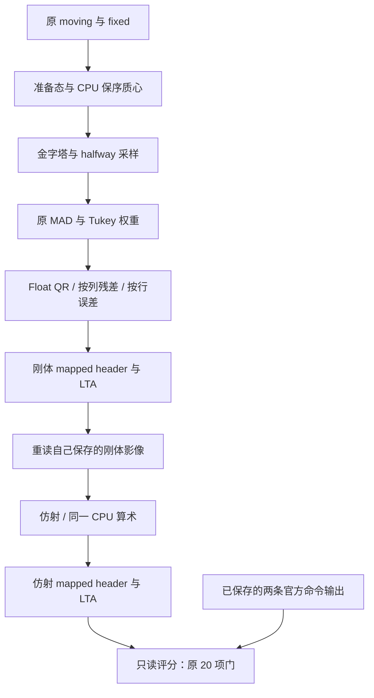

# 完整 CPU 刚体与仿射：保序算术验收

## 1. 功能简介与流程

将已验证的 CPU 串行 Double 质心、Float LINPACK QR、按列残差和按行加权误差，接入原实验配准流程。输入原影像后执行**刚体 → 保存并重读自己的刚体头信息 → 仿射**，与同输入的已保存 FreeSurfer 官方结果比较。

**这个真实案例通过原有 20/20 项检查。** 两阶段的 133 点位移、共享采样器 warp 差异、非零支持集差异均为 0；两份 mapped MGH 的 13 个头字段均相同。LTA 增量矩阵还有约 `1e-14` 的文本解析尾数差。

这是独立 CPU 验收候选。生产 `fnit.robust_register` 仍提供准备态函数；GEMS 默认与 GPU 分支没有替换。下一步是提供可复用的公开 CPU 实验适配器，并完成其它输入与 GPU 回归。



## 2. Python 调用、输入与输出

### 已公开实验入口

下面加载仓库已有实验 API；它使用旧 PyTorch QR 路径，**不会自动启用本次保序 CPU overlay**。本次 20/20 结果来自私密受控入口，不等于下面示例已经切换到新算术。公开适配器尚待接入验证。

```python
from pathlib import Path
import importlib.util

# 从 FNIT 仓库根目录运行；环境使用主页的 Conda 配置。
toolkit_repository_root = Path.cwd()
experiment_loader_path = (
    toolkit_repository_root
    / "validation/robust_register/inverse_real_20261006/load_experiment.py"
)
experiment_loader_specification = importlib.util.spec_from_file_location(
    "robust_registration_experiment_loader", experiment_loader_path
)
experiment_loader_module = importlib.util.module_from_spec(
    experiment_loader_specification
)
experiment_loader_specification.loader.exec_module(experiment_loader_module)

# 用独立命名空间加载实验函数，不覆盖生产 fnit.robust_register。
experiment_configuration = {
    "legacy_candidate_directory": str(
        toolkit_repository_root
        / "validation/robust_register/rigid_affine_20261006/candidate_source/robust_register"
    ),
    "overlay_directory": str(
        toolkit_repository_root
        / "validation/robust_register/inverse_real_20261006/candidate_overlay"
    ),
}
experimental_registration_package = experiment_loader_module.load_package(
    experiment_configuration, candidate=True
)
moving_image_path = Path("inputs/moving_atlas.mgz")
fixed_image_path = Path("inputs/fixed_target_mask.mgz")
stage_output_directory = Path("outputs/experimental_registration")
registration_results = experimental_registration_package.robust_rigid_affine(
    moving_image_path,
    fixed_image_path,
    stage_directory=stage_output_directory,
    device="cpu",
    saturation=50.0,
    iterations_per_level=5,
    stop_distance=0.01,
    initialize_translation=True,
    pyramid_min_size=16,
    pyramid_max_size=-1,
    highres_iterations=-1,
    spatial_chunk_size=131072,
    memory_budget_gb=20.0,
    tf32=True,  # CPU 不使用 TF32；保持原配置，不启用低精度。
)
print(registration_results["seconds"])
```

| 输入或参数 | 意义、格式与本次设置 |
|---|---|
| `moving_image_path` | 三维标量 moving 影像，带有效空间头信息。本例是反射后的 atlas，`131×241×99`、UInt8、0.25 mm。 |
| `fixed_image_path` | 三维标量目标影像。本例是公开真实 T1 派生的非空目标 mask，`39×45×56`、Float32、1 mm。 |
| `stage_directory` | 自己的输出目录；仿射读取本目录刚体阶段保存的 MGH。 |
| `device` | 本次固定 `cpu`。GPU 尚未做本轮数值或速度回归。 |
| `saturation` | 原稳健回归的饱和参数，本次 50。 |
| `iterations_per_level` | 每个金字塔层最多 5 次外层更新。 |
| `stop_distance` | 原变换更新的停止距离，本次 0.01。 |
| `initialize_translation` | 按原图像质心初始化平移，本次开启。 |
| `pyramid_min_size` | 金字塔最小尺寸，本次 16。 |
| `pyramid_max_size` | 最大尺寸限制；本次 -1 表示使用原配置的不限模式。 |
| `highres_iterations` | 单独的最高分辨率迭代预算；本次 -1 使用原层预算。 |
| `spatial_chunk_size` | 采样时每块体素数，本次 131072。 |
| `memory_budget_gb` | 计算内存预算，本次 20；验收进程另有 20 GB 十进制地址空间上限。 |
| `tf32` | 保留原配置；CPU 不执行 TF32 运算。 |

输出包括 `rigid`、`affine` 两个结果对象、`combined_RAS_matrix` 和两阶段 `seconds`。两阶段结果对象的 `report` 保存准备态、金字塔与回归信息。输出文件共 **4 份**，包含 2 个 mapped-header 影像和 2 个 LTA 变换：`rigid.header.mgz`、`rigid.lta`、`affine.header.mgz`、`affine.lta`。mapped-header 影像保留原源体素，只更新空间头；不是重采样后的新体素网格。验收另保存两份完整阶段/退出 JSON，不能把它们计为两份新增影像。

本次刚体 6 个参数、仿射 12 个参数；每臂真实执行 2 层×5 次外层求解。三种 CPU helper 各自然调用 80 次、各冷编译一次，质心调用 4 次、冷编译一次，fallback 为 0。13 参数强度缩放和秩亏输入尚未验收。

可复用算子及其调用见[同 A/b 的 CPU QR、残差与误差](../same_ab_irls_cpu_20261007/README.md)、[保序质心](../centroid_serial_cpu_probe_20261006/README.md)。Numba、PyTorch、nibabel 已列入主页 [Conda 环境](../../../environment.yml)。

## 3. 命令行调用

本叶子是验收报告，没有新增生产 CLI。完整实验 API 见上一节；本次有限入口只用于受控验证。用户可从仓库根目录读取公开汇总：

```bash
python -m json.tool validation/robust_register/full_cpu_arithmetic_20261007/benchmark_summary.json
```

生产准备态与已有 CLI 见[准备态说明](../../../docs/robust_register/PREPARATION.md)。

## 4. 原软件调用

原官方对照已经完成，本次复用输出，没有重跑官方命令。两边仿射都读取自己的刚体 mapped-header 文件。

```bash
mri_robust_register --mov moving_atlas.mgz --dst fixed_target_mask.mgz   --lta official/rigid.lta --mapmovhdr official/rigid.header.mgz   --sat 50 -verbose 0
mri_robust_register --mov official/rigid.header.mgz --dst fixed_target_mask.mgz   --lta official/affine.lta --mapmovhdr official/affine.header.mgz   --sat 50 -verbose 0 --affine
```

原命令为安装版 FreeSurfer 对照。此前 SDK 同 A/b 算术探针是独立参考，两者来源分开。

## 5. 真实数据精度与耗时

### 原有 20 项门：全部通过

固定原阈值：133 点 RMS≤0.001 mm、最大值≤0.01 mm；warp 相对 L2≤1e-5、非零支持集 XOR=0；保存头与 LTA 内部几何≤1e-5 mm。没有补 mask、修改候选输出或放宽阈值。

| 官方与新候选的差异 | 刚体 | 仿射组合 |
|---|---:|---:|
| 133 点 RMS / 最大距离，mm | 0 / 0 | 0 / 0 |
| warp 相对 L2 | 0 | 0 |
| warp 最大 / P99 绝对误差 | 0 / 0 | 0 / 0 |
| 非零支持集差，体素 | 0 | 0 |
| 组合 world 矩阵最大绝对差 | 0 | 0 |
| 增量 LTA 矩阵最大绝对差 | 4.97e-14 | 4.00e-15 |
| mapped MGH 头字段相同数 | 13/13 | 13/13 |

官方与候选双方共四份 mapped-header 影像的源体素、shape、dtype 保持相同，LTA source/target shape 均正确。官方与候选自己的头/LTA内部几何最大差均为刚体 `9.536743e-7 mm`、仿射 `2.861023e-6 mm`，通过一致性门。

目标 mask overlap Dice 两边均为刚体 0.768116、仿射 0.889348。这是各自配准影像与目标 mask 的重叠，不是两实现间的 Dice；两实现 warp 在本次共享采样器下逐值相同。

**评分使用同一个 FNIT 采样器读取双方保存的几何。** 官方命令只生成 mapped-header，没有独立官方重采样 warp；本结果不能扩展为官方体素采样器对照或 GEMS 核团分割验收。结论来自服务器原评分 JSON 的安全聚合与原件身份绑定；影像、矩阵、A/b、像素 hex 和日志没有传回本地。这里报告空间/warp 标量，不新增带私密输入的脑图。

### 时钟范围

| 实际时钟 | 秒 | 范围 |
|---|---:|---|
| 原官方刚体命令 | 0.675617 | 已保存的同 CPU 8 线程命令 |
| 原官方仿射命令 | 0.515443 | 已保存的同 CPU 8 线程命令 |
| 新候选完整 pair API | 14.851893 | 含 4 次冷编译、身份门与观测 I/O |
| 其中刚体 API | 14.358868 | 包含首次 JIT 与身份检查 |
| 仿射 API | 0.446767 | 复用已经编译的 helper |
| 候选冷导入与初次身份门 | 4.637340 | 位于 pair API 外 |
| 原完整候选 entry | 19.747471 | 两臂保存后遇到评分字节序错误 |
| 5 个运行库身份检查点合计 | 15.745853 | 含 maps、文件 SHA 与记录；部分包含在 pair API 内 |
| 独立恢复评分的数学计算 | 0.193140 | 只读取原有保存结果，不做注册 |
| 恢复评分 entry / outer | 11.122745 / 24.494295 | 包含前后资源、运行库和控制检查 |

| CPU 内核 | 真调用数 | kernel 累计秒 | 一次显式编译秒 |
|---|---:|---:|---:|
| 串行 Double 质心 | 4 | 0.001310 | 0.418626 |
| Float QR | 80 | 0.076573 | 0.587405 |
| 按列残差 | 80 | 0.005007 | 0.129339 |
| 按行加权误差 | 80 | 0.000833 | 0.063891 |

这些时钟相互嵌套，不能相加，也不能把候选观测冷时钟与官方命令直接算作生产速度倍率。此阶段完成的是精度门；没有测量移除观察器后的热运行端到端速度。两个臂的 4 个 level 都耗尽原 5 次预算，不把它们称为达到 0.01 的收敛。

原完整计算虽然保存了结果，首次观测组因旧评分器把 MGH 大端 Float32 直接交给 `torch.from_numpy` 而失败。它从冻结原评分函数抽取时漏用了仓库已有字节序修复。恢复组精确复用 [成熟修复](../rigid_affine_20261006/score_byteorder_recovery.py) 的 `dtype=np.float32` 转换，只评分一次已有结果；原失败记录保留。原组结果仍是失败，独立评分组和数值 20/20 是成功。主页的 1 项字节序合同测试通过，属于读取合同检查，不是新的 benchmark。

原组与评分组的源、资源、进程树、CPU 锁及索引均已关闭；评分前后保存结果身份没有变化。运行库检查仅证明实际加载文件属于冻结身份集合，不是动态算术调用 trace。

## 6. 最近版本与 benchmark 记录

| 阶段 | 已证实结果 |
|---|---|
| 旧完整刚体/仿射实验 | 17/20；warp 与非零支持集还有差异。 |
| 同输入 prepared/M0 | 保序质心后准备态、质心和 M0 等已观测边界一致。 |
| 同真实 A/b 基线 | 首 7 个边界一致，首差 Float QR；Float 归约顺序也有差异。 |
| 三个 CPU 基元 | 同保存输入 QR、残差、误差逐位相同。 |
| 自然 IRLS | 同真实 6 列 A/b，4 轮、选 3、回滚及 44 条记录逐位相同。 |
| 本次完整 CPU pair | 原输入、自产刚体结果重读、12 列仿射均完成；首次评分 I/O 失败保留。 |
| 本次独立恢复评分 | 没有重配准、重原生程序或修改输出；原 20 门全部通过。 |

下一步提供可复用的 CPU 实验适配器，覆盖其它输入、13 参数/退化 fallback，并实测 GPU 回归与无观察器的同线程速度。此单例结果不能代替总体 recon-all 或所有核团的验收。

## 7. 原实现与参考文献

- 原 [CPU 刚体/仿射实验](../rigid_affine_20261006/README.md)、[输入/输出与生产边界](../rigid_affine_20261006/SOURCE_RUNTIME_GAP.md)、[inverse 实验加载器](https://github.com/weikanggong1/Fudan-Neuroimaging-toolkit/blob/main/validation/robust_register/inverse_real_20261006/load_experiment.py)。
- [质心源码候选](../centroid_serial_cpu_probe_20261006/README.md)、[完整 M0 对照](../centroid_m0_cpu_prefix_20261006/README.md)、[首 A/b 对照](../first_ab_cpu_prefix_20261007/README.md)、[同 A/b 的 CPU 算术](../same_ab_irls_cpu_20261007/README.md)。
- FreeSurfer [`RegRobust.cpp`](https://github.com/freesurfer/freesurfer/blob/d932c45b7941662ea380a05efef580568b98d41a/mri_robust_register/RegRobust.cpp) 与 [`Regression.cpp`](https://github.com/freesurfer/freesurfer/blob/d932c45b7941662ea380a05efef580568b98d41a/mri_robust_register/Regression.cpp)。
- ITK 5.4.0 [`vnl_qr.hxx`](https://github.com/InsightSoftwareConsortium/ITK/blob/v5.4.0/Modules/ThirdParty/VNL/src/vxl/core/vnl/algo/vnl_qr.hxx)；Float LINPACK 原始代码链接见同 A/b 报告。
- Reuter M, Rosas HD, Fischl B. *Highly accurate inverse consistent registration: a robust approach*. NeuroImage, 2010;53:1181–1196. [DOI](https://doi.org/10.1016/j.neuroimage.2010.07.020)。
