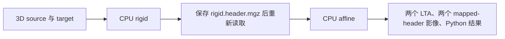

# 正式安装包：CPU robust rigid/affine 真实验收

## 1. 功能简介

FNIT 0.16.0 的正式 CPU 接口完成刚体配准与仿射配准。CPU 质心、Float LINPACK QR、残差和加权误差采用已验证的保序算术；图像采样和金字塔复用仓库实现。此入口不调用 FreeSurfer、FSL、Surfa 或它们的程序封装，也不从 `validation` 动态导入注册代码。

本次将同一 wheel 安装到现有 Conda 环境之外的新隔离目录，通过正式 `fnit.robust_register` 导入，在一个真实右侧 atlas→T1 前景目标案例上运行一次完整 rigid→affine，原有 **20/20** 门全部通过。GEMS 核团拟合和 GPU 功能另行验收。



## 2. Python 调用、输入与输出

在主页 Conda 环境中安装 FNIT 后使用下面的正式 API。可重复使用同一个上下文；常规模块和 Numba 缓存保留在进程内，`close()` 关闭该上下文的后续调用。

```python
from pathlib import Path
import json
from fnit.robust_register import load_cpu_registration

source_image_path = Path("inputs/source.mgz")       # 3D 待配准影像，保留真实头几何
fixed_image_path = Path("inputs/target.mgz")        # 3D 参考影像，允许与 source 网格不同
output_stage_directory = Path("outputs/cpu_pair")  # 此目录必须尚不存在

with load_cpu_registration() as cpu_registration:
    registration_results = cpu_registration.cpu_robust_rigid_affine(
        source=source_image_path,
        target=fixed_image_path,
        stage_directory=output_stage_directory,
        device="cpu",                  # 正式 CPU 接口拒绝 CUDA
        saturation=50.0,               # Tukey 残差截断阈值
        iterations_per_level=5,        # 每个金字塔层的外层迭代上限
        stop_distance=0.01,            # 变换距离停止阈值
        initialize_translation=True,   # 初始化源/靶质心平移
        pyramid_min_size=16,           # 最粗层的尺寸下界
        pyramid_max_size=-1,           # -1 不添加最细层尺寸上限
        highres_iterations=-1,         # -1 使用统一外层迭代预算
        spatial_chunk_size=131072,     # 采样空间分块大小
        memory_budget_gb=20.0,         # 声明 20 GB 内存预算
        tf32=True,                     # 保留接口策略；本次实际执行是 CPU
    )
    combined_RAS_matrix = registration_results["combined_RAS_matrix"]
    for registration_mode in ("rigid", "affine"):
        stage_report = registration_results[registration_mode].report
        report_path = output_stage_directory / f"{registration_mode}.report.json"
        report_path.write_text(json.dumps(stage_report, indent=2) + "\n")
```

### 输入

- `source`、`target`：带有效三维头几何的非负影像路径或 nibabel 影像对象。读取支持的 NIfTI/MGH/MGZ 后进入 CPU 浮点计算。本次实测输入为已保存的 MGZ 准备图，不重复目标准备或 atlas 反射。
- `stage_directory`：尚不存在的输出目录。pair 固定先 rigid，保存、重载自己的中间 MGH，再 affine；不接受额外 `mode`。
- `device`：此接口只接受 `cpu`；CPU 上下文保留调用者的线程设置和 TF32 全局标志。

### 参数

| 参数 | 默认值 | 意义 |
|---|---:|---|
| `saturation` | `50.0` | MAD 归一化后 Tukey 权重的截断值，必须为有限正数 |
| `iterations_per_level` | `5` | 每层外层注册迭代上限；内部 IRLS 保留其自然停止规则 |
| `stop_distance` | `0.01` | 相邻变换的停止距离阈值 |
| `initialize_translation` | `True` | 以质心差初始化平移 |
| `pyramid_min_size` | `16` | 最粗金字塔层的尺寸下界 |
| `pyramid_max_size` | `-1` | 最细层尺寸上限；负值保留原默认分辨率范围 |
| `highres_iterations` | `-1` | 最细层单独迭代预算；负值使用统一预算 |
| `spatial_chunk_size` | `131072` | 图像采样分块的体素数 |
| `memory_budget_gb` | `20.0` | 内存预算，单位十进制 GB |
| `tf32` | `True` | 接口的精度策略参数，本案例为 CPU 执行 |

单阶段使用 `cpu_registration.cpu_robust_register(source, target, mode="rigid", device="cpu", ...)`；`mode` 可为 `rigid` 或 `affine`。调用后通过返回对象的 `transform.save(...)` 与 `nibabel.save(result.header_image, ...)` 显式保存。输入不满足保序 CPU helper 的支持域时保留已有路径；秩亏的实际 LINPACK 解错误不被吞掉。

### 输出

pair API 自身保存：

```text
cpu_pair/
├── rigid.lta           # source scanner RAS → target scanner RAS
├── rigid.header.mgz    # voxel 数据保持原 source，更新头几何
├── affine.lta          # 已重载 rigid 影像 → target scanner RAS
└── affine.header.mgz   # 同一 source voxel 数据，保存最终头几何
```

返回字典包含 `rigid`、`affine` 两个结果对象（`transform`、`header_image`、`report`），`combined_RAS_matrix`（4×4 scanner-RAS 总变换）、`header_image`（最终影像）和 `seconds`（pair 内部时钟）。LTA 和矩阵中的位置单位是 mm。上述示例另外保存两份 JSON 报告；本次 benchmark 因此核对了六个输出文件。

## 3. 命令行调用

正式安装包提供单阶段与两阶段命令：

```bash
fnit-robust-register --source inputs/source.mgz --target inputs/target.mgz \
  --output-directory outputs/cpu_pair --mode rigid-affine \
  --saturation 50 --iterations-per-level 5 --stop-distance 0.01 \
  --pyramid-min-size 16 --pyramid-max-size -1 --highres-iterations -1 \
  --spatial-chunk-size 131072 --memory-budget-gb 20 --threads 8
```

`--mode` 取 `rigid`、`affine` 或 `rigid-affine`，默认 `rigid`。`--no-initialize-translation` 关闭初始化平移，其余参数与 Python 表对应。`--threads` 只在用户显式传入时设置 CLI 的 Torch CPU 线程；Python 上下文不修改调用者的线程策略。

本页实测的是正式安装后的 Python API。CLI 的 parser/help 和参数合同通过聚焦检查，真实 CLI 端到端尚未单独 benchmark。

## 4. 对应原软件调用

隔离参考使用官方 `mri_robust_register` 两次调用：第一次 rigid 的 `--mapmovhdr` 文件必须重载后作为第二次 affine 输入。

```bash
mri_robust_register --mov inputs/source.mgz --dst inputs/target.mgz \
  --lta outputs/official/rigid.lta --mapmovhdr outputs/official/rigid.header.mgz \
  --sat 50 -verbose 0

mri_robust_register --mov outputs/official/rigid.header.mgz --dst inputs/target.mgz \
  --lta outputs/official/affine.lta --mapmovhdr outputs/official/affine.header.mgz \
  --affine --sat 50 -verbose 0
```

本次复用先前同一真实输入和参数保存的 fresh 官方结果，没有重跑官方程序。官方 CLI 不提供本固定版本的 `--threads` 参数；既有对照分配相同 8 物理核亲和性，并设置 OMP/MKL/OpenBLAS 的 8 线程预算，未观测官方实际活跃并发。

## 5. 最新精度、端到端与分步骤时间

### 精度

原有阈值不变：mapped-header 内部一致性 ≤`1e-5` mm；133 个物理点的 RMS ≤`0.001` mm、最大距离 ≤`0.01` mm；共享 FNIT 采样的相对 L2 ≤`1e-5`，非零支持差为 0。本次 **20/20** 通过。

| 指标 | rigid | affine |
|---|---:|---:|
| 133 点物理 RMS / 最大距离（mm） | 0 / 0 | 0 / 0 |
| 共享 FNIT sampler 的相对 L2 / 最大 / P99 差 | 0 / 0 / 0 | 0 / 0 / 0 |
| 非零支持差（voxel） | 0 | 0 |
| source voxel 值、shape、dtype 保持 | 一致 | 一致 |
| mapped MGH 13 字段 | 全部逐字段一致 | 全部逐字段一致 |
| LTA 单阶段矩阵最大绝对差 | `4.974e-14` | `3.997e-15` |
| 总 RAS 矩阵最大绝对差 | 0 | 0 |

共享 sampler 用于比较两方保存几何，并不构成官方重采样器的独立 oracle。精度结果来自服务器原记录的安全聚合，本地没有转移影像、矩阵数组、日志或 maps 正文，也没有把聚合记录称为原 JSON 的逐字节重构。

### 时间

| 范围 | 秒 | 口径 |
|---|---:|---|
| 隔离 wheel 安装 | 4.271128 | 既有 Conda 依赖，`--no-deps --no-compile --target` |
| 冷导入正式 API | 1.594422 | Torch 与正式 FNIT 包导入 |
| 创建 CPU 上下文 | 0.000027 | 不预先编译 kernel |
| **冷正常 pair API** | **2.253696** | 两阶段、冷 JIT、MGH/LTA 保存和中间重载 |
| rigid 内部 API | 1.829216 | 已包含在 pair 时钟 |
| affine 内部 API | 0.364360 | 已包含在 pair 时钟 |
| pair 内部时钟 | 2.239478 | API 返回的内部计时，嵌套在外部 pair 时钟 |
| 原 20 门评分 | 0.178845 | 单独读取双方保存输出 |
| 带身份检查的 entry / 受控外层 | 13.296155 / 13.930564 | 包含导入、三个库身份检查点和收据写出 |
| **此前 fresh 官方两次 CLI 合计** | **1.031014** | 相同真实输入与 8 核预算；本次未重跑 |
| 此前 fresh 官方 workflow | 1.031932 | 包含两次 CLI 调度 |

嵌套时钟不能相加。正式安装版此次冷 pair 比此前官方两次 CLI 时钟长；本页不报告安装版加速，也不将旧实验适配器的热缓存时间替换为本次安装版结果。正常 API 时钟不包含外部源码/DSO 身份检查点。安装版同实例热性能仍待单独测量。

四个实际 dispatcher 各出现一条已编译签名；没有 instrument 内部总编译次数。该次 Torch intra-op 8、interop 1，CPU 进程地址空间上限 20,000,000,000 B，CUDA 未初始化，API 保持线程和精度标志。所有实际 FNIT 模块来自隔离安装 wheel；运行库检查点是 98→121→121，均为已封存 233 身份集合的精确子集。这是加载文件身份记录，不是动态 BLAS 数学调用 trace。

### 可视化例子

以下复用已公开的 CC0 粗分割派生目标掩膜三视图，展示本案例二值目标的结构与空间；公开图不含 atlas 模板数组，模板仍按资源指南核查许可。本次安装 API 使用对应已保存准备图，不新增准备步骤；图是既有准备组件可视化，不是新的注册误差图或 GEMS 分割图。


## 6. 近期更新与 benchmark 记录

- 原独立实验版本曾为 17/20。定位到 CPU 质心归约、Float QR、残差和加权误差算术差异后，完整 CPU 候选在同一真实案例达到 20/20。
- 显式实验适配器的冷/热 API 与 fresh 官方对照均通过原 20 门；这组热缓存记录属于实验适配器，不是本页正式 wheel 的热性能。
- 2026-10-07：正式 `fnit.robust_register` 接口进入 wheel。现有 Conda 依赖 + 新隔离安装目标完成源身份核对；一次正式 CPU pair、一次原 20 门评分全部通过。全新 Conda 环境尚未单独验收。
- 本组数值及控制一次成功。最后的元数据收尾脚本首版有断行语法错误，在任何读取或索引写入前停止；保留错误记录，修正脚本后只做元数据关闭，没有重复注册、评分、JIT 或官方命令。
- 最终 29 资源、8 自有控件、12 冻结文件、17 个已加载 FNIT 模块和 121 个已加载 provider 身份保持；六个保存输出一致，7 个原 PID 实例消失，FD/共用锁与任务索引关闭。

尚未测量正式安装版的热缓存速度、更多被试/网格、左侧、13 参数强度缩放 affine、GPU 性能和完整 GEMS 分割。

## 7. 参考文献与原实现

- Reuter M, Rosas HD, Fischl B. Highly accurate inverse consistent registration: A robust approach. *NeuroImage* (2010). [DOI](https://doi.org/10.1016/j.neuroimage.2010.07.020)。
- [FreeSurfer `mri_robust_register` 源码](https://github.com/freesurfer/freesurfer/tree/d932c45/mri_robust_register)。
- [ITK/VNL 源码](https://github.com/InsightSoftwareConsortium/ITK/tree/v5.4.0/Modules/ThirdParty/VNL)及其 LINPACK/BLAS 代码。FNIT 的算法改编与许可归属见仓库 `THIRD_PARTY_NOTICES.md` 和 `licenses/FreeSurfer.txt`。
- [仓库准备函数说明](../../../docs/robust_register/PREPARATION.md)、[之前的完整 CPU 算术验收](../full_cpu_arithmetic_20261007/README.md)、[正式 API 前的冷/热实验适配器](../full_cpu_arithmetic_20261007/README.md)。
