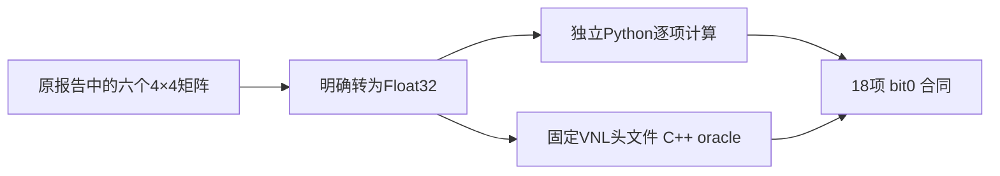

# Robust register：Float 反矩阵运算顺序合同

## 1. 功能与当前结论

这里是独立实验模块，用于检查一个 4×4 Float 反矩阵的计算顺序。它没有接入 FNIT 生产函数，也没有修改成熟的 `ca_register_inverse`、旧 B 版实验或 CPU/GPU 默认流程。

六个矩阵来自上一例真实右侧 HA atlas alignment 已保存的 RAS/LTA 统计。新 Python 候选与固定 ITK 4.13.2/VNL 头文件编译的独立 C++ oracle，在 determinant、reciprocal 和 inverse 共 **18 个检查上逐 bit 相同**，RC=0。这不是新的影像 benchmark；没有读 MRI 数组、注册、重采样或 GEMS。**旧 B 版仍为17/20项通过，仿射 warp L2 和两阶段各1体素支持集差仍未验收。**



## 2. Python调用、输入与输出

仅依赖已有 NumPy；文件通过独立路径加载，不替换 `fnit.robust_register`。以下示例使用保存的矩阵元数据，不需要 MRI。

```python
from pathlib import Path
import importlib.util
import json
import numpy as np

experiment_directory = Path("validation/robust_register/inverse_order_20261006")
module_specification = importlib.util.spec_from_file_location(
    "isolated_inverse", experiment_directory / "inverse_candidate.py"
)
inverse_module = importlib.util.module_from_spec(module_specification)
module_specification.loader.exec_module(inverse_module)
saved_metadata = json.loads((experiment_directory / "SAVED_MATRICES.json").read_text())
# 明确采用原 MATRIX_REAL 的 Float 边界，不隐式改变 Double 调用值。
matrix_float32 = np.asarray(saved_metadata["cases"][0]["matrix"], dtype=np.float32)
inverse_result = inverse_module.inverse_float_source_order(matrix_float32)
inverse_matrix_float32 = inverse_result["inverse"]
```

函数参数仅 `matrix`，没有默认值：必须是有限、非奇异的 `numpy.float32` 数组，shape为 `(4,4)`；其他shape、Double和非有限值拒绝。输出为字典：`inverse` 与 `adjugate` 是 `(4,4)` Float32数组，`determinant`、`reciprocal` 是Float32标量。每个乘法和每次累计均在Float32中计算；没有 TF32、Float16、Double累计或GPU回退。

`SAVED_MATRICES.json` 是原报告矩阵字段的机械复制，共四个阶段RAS矩阵及两个仿射组合RAS矩阵；它们不是优化过程内部的实际 halfway/header inverse 输入。来源 JSON 和每个 LTA 的 SHA 均保存。这里不发布 MRI、矩阵二进制、compiled oracle 或上游完整头文件。

## 3. 命令行与Conda

本实验没有新的生产CLI。`run_matrix_contract.py` 是有界验证入口：

```bash
python run_matrix_contract.py --workspace /private/frozen_inverse_workspace --result /private/new_run/result.json
```

`--workspace` 必填，含固定PLAN、实验源码、六个矩阵元数据、三个上游头文件及原成熟函数的私密副本；`--result` 必填且必须不存在，保存JSON并拒绝覆盖。runner依PLAN固定六个case、CPU亲和性、AS上限、编译器及SHA、编译/子进程时限；第一次bit差异即停止。

`run_matrix_controller.py` 额外需要必填 `--workspace`、`--run`（新目录）、`--python`（已配置Conda Python）和 `--lock`（共用CPU锁）。它清理动态库/PYTHONPATH注入、隐藏CUDA、控制线程，并在锁内执行一次worker。正式运行使用现有 Anaconda GCC11.2.0；没有安装或移动环境。若仅自行编译这个验证oracle，Conda可提供 `gcc_linux-64`、`gxx_linux-64`，但本次记录并未运行安装命令，其他编译器不自动算同一验证。

上游三头文件按 [SOURCE_BINDINGS.json](SOURCE_BINDINGS.json) 从固定官方URL下载到私密include目录，核验大小与SHA；公共 `include/` 只有自有最小容器shim。shim仅实现Float存储/访问/标量乘，反矩阵和det算法来自未改动的原头文件。将仓库成熟模块的固定版本复制到私密 `legacy_ca_register_inverse.py` 仅作诊断；公共仓库不重复发布这一模块。

## 4. 原软件对应位置

这是 `mri_robust_register` 的矩阵内部调用，无独立影像命令。固定 FreeSurfer 8.2源码链为：`extract_r_to_i → MatrixInverse → OpenLUMatrixInverse → vnl_inverse<float,4,4>`。`numerics.cpp:1120–1125` 明确走4×4 Float分支；安装binary的编译路径字符串与ITK4.13.2/VNL相符。ELF已经strip，没有函数符号可独立定位。

oracle直接使用固定ITK头文件，而非调用安装binary；编译采用 `-O2 -fno-fast-math -ffp-contract=off -msse2 -mfpmath=sse`，rounding为nearest。因此结论是**固定源码定义的合同通过**，不是安装binary相同指令或全部FreeSurfer输入上的equivalence证明。

## 5. 精度、时间与未通过项

| 已保存矩阵 | 新Python/C++不同Float word | 旧成熟函数不同word | 旧/新数值max绝对差 |
|---|---:|---:|---:|
| 官方刚体RAS | 0 | 2 | 0：带符号零 |
| FNIT刚体RAS | 0 | 2 | 0：带符号零 |
| 官方仿射RAS | 0 | 15 | 4.76837158203125e-7 |
| FNIT仿射RAS | 0 | 13 | 1.1920928955078125e-7 |
| 官方仿射组合RAS | 0 | 15 | 7.62939453125e-6 |
| FNIT仿射组合RAS | 0 | 15 | 3.814697265625e-6 |

第一列bit0结果包含determinant/reciprocal/inverse三个block；六个case共18个检查。旧实现word数包含零的符号位，不能把刚体2word解释成非零数值误差。真正非零差只在这里四个仿射状态得到证明；没有记录每个非零元素的单独ULP数。

编译0.755594s，包含编译的worker0.892751s，controller1.021132s，锁等待0.003807s，worker峰值RSS47,411,200B；CPU8亲和性固定，AS20GB，NumPy1.26.4。六次C++短进程各约1.2–1.7ms，包含进程启动；这些时钟不是反矩阵kernel benchmark，也不与完整注册耗时计算加速比。源码/输入前后SHA完全相同，四份标准输出/错误输出均为空并原样保存：worker以JSON报告结果。

没有新影像计算，所以沿用 [旧B报告](../rigid_affine_20261006/README.md) 的真实精度边界：刚体warp relL2=2.4091169e-6通过但support差1；仿射relL2=2.5881265e-5超过1e-5且support差1。脑图没有重绘；本纯矩阵合同不能提供新的脑图、最终ROI或速度结论。

## 6. 更新记录与下一步

- 固定源码只读定位：成熟函数采用通用六项minor和四个cofactor点积；VNL规定不同的三因子顺序/正项顺序，det采用24项顺序展开。详见 [SOURCE_AUDIT.md](SOURCE_AUDIT.md)。
- 一次矩阵合同：18/18通过；[RESULTS.json](RESULTS.json) 保存原标量、原私密报告SHA及机械路径裁剪说明，原scientific RC=0没有改写。
- 生产源与旧B保持原样。下一步只准备一次局部inverse替换的真实两阶段有限试验，复用原两个输入及旧官方输出，不再调用官方或运行GEMS/GPU。见 [NEXT_PLAN.md](NEXT_PLAN.md)；尚未派发。

## 7. 原实现、来源与许可

- [固定VNL反矩阵定义](https://raw.githubusercontent.com/InsightSoftwareConsortium/ITK/v4.13.2/Modules/ThirdParty/VNL/src/vxl/core/vnl/vnl_inverse.h)，[固定det定义](https://raw.githubusercontent.com/InsightSoftwareConsortium/ITK/v4.13.2/Modules/ThirdParty/VNL/src/vxl/core/vnl/vnl_det.hxx)。反矩阵作者Peter Vanroose，det接口记录fsm/Peter Vanroose。
- [固定FreeSurfer矩阵桥接](https://raw.githubusercontent.com/freesurfer/freesurfer/d932c45b7941662ea380a05efef580568b98d41a/utils/numerics.cpp)，[固定几何定义](https://raw.githubusercontent.com/freesurfer/freesurfer/d932c45b7941662ea380a05efef580568b98d41a/utils/mri.cpp)。不发布原软件完整源码。
- VNL沿用VXL/TargetJr Consortium的宽松许可；这是保留版权/许可、禁止未经同意宣传署名并明确改动记录的MIT/BSD风格许可，不将它冒称SPDX MIT或BSD-3-Clause。固定[ITK4.13.2 NOTICE](https://raw.githubusercontent.com/InsightSoftwareConsortium/ITK/v4.13.2/NOTICE)中的VXL项单独保存在 [LICENSE_VNL.txt](LICENSE_VNL.txt)。
- FNIT改动（2026-10-06）：NumPy逐项Float32适配、源码绑定、独立容器shim、18项合同及有界调度；不把上游许可改标为仓库主许可证。
