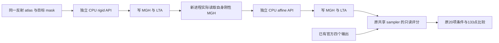

# Robust registration：局部 Float inverse 实图对照

## 1. 功能与验证范围

本目录记录一次 CPU 刚性配准→MGH 保存重读→仿射配准的对照。它只在独立实验命名空间里替换 `native_inverse`，采用已经通过 18 项矩阵合同的固定 VNL Float 运算顺序。成熟 `ca_register_inverse`、原 B 六个源码文件、原参考输出与生产 CPU/GPU 流程保持原版本。

**两阶段影像已保存；仿射报告序列化失败，随后只评分已有输出。原 20 项条件仍为 17/20，三个失败未消失。** 矩阵合同的 18/18 不代替影像验收。原 controller RC1 和纯评分 RC2 均保留；不接生产，也不宣称完整 runtime 门通过。



## 2. Python 调用、数据和参数

实验使用 `load_experiment.py`，没有正式接入 `fnit.robust_register`。新命名空间优先从 `candidate_overlay/` 读取 `_sampling.py` 与 `inverse_candidate.py`；其他五个 B 文件直接复用原冻结目录。评分另用原 B 包、原 sampler 和成熟 inverse，保持同一评分方法。

```python
from pathlib import Path
import json
import sys

experiment_directory = Path("validation/robust_register/inverse_real_20261006")
sys.path.insert(0, str(experiment_directory))
from load_experiment import load_package

# 私密 PLAN 包含先核验的源、输入、参考 SHA；此示例需要对应本地路径。
frozen_plan = json.loads(Path("/private/frozen/PLAN.private.json").read_text())
sys.path.insert(0, str(Path(frozen_plan["source_directory"]) / "src"))
experimental_package = load_package(frozen_plan, candidate=True)
# 显式刚体模式；参考输出不会传给配准函数。
rigid_result = experimental_package.robust_register(
    source=frozen_plan["moving"],        # 反射 atlas，三维 uint8 MGH
    target=frozen_plan["fixed"],        # 实际目标 mask，三维 Float32 MGH
    mode="rigid", saturation=50.0, iterations_per_level=5,
    stop_distance=0.01, initialize_translation=True,
    pyramid_min_size=16, pyramid_max_size=-1, highres_iterations=-1,
    device="cpu", tf32=True, spatial_chunk_size=131072,
    memory_budget_gb=20.0,
)
```

完整的有界对照通过 worker 进行，避免示例调用绕过 SHA、线程及超时检查。配准输入是原准备阶段已经保存并验收的两个文件：

| 输入 | 格式、空间与意义 |
|---|---|
| `moving` | `flippedAtlasDump.mgz`，131×241×99，uint8，0.25 mm，反射后的 atlas header；来自单独许可的 FreeSurfer 资源 |
| `fixed` | `targetMask.mgz`，39×45×56，Float32，1 mm，scanner RAS header；同一公开 CC0 ds000114 T1/aseg 派生目标 |
| `source_directory` | 原 B 冻结源码根目录；不会切换为当前 main 或已安装的另一版本 |
| `overlay_directory` | 仅两份局部候选模块；不覆盖成熟函数或全局 Python module |
| `official_directory` | 已完成官方实验的两份 MGH 与两份 LTA，只用于 SHA 核对和后验评分 |

配准参数保持原 B 定义：`mode` 为 rigid/affine；`saturation=50` 为 Tukey SAT；`iterations_per_level=5` 为每层更新上限；`stop_distance=0.01` 为原变换停止距离；`initialize_translation=True` 使用原质心初始化；`pyramid_min_size=16`、`pyramid_max_size=-1` 和 `highres_iterations=-1` 保持原金字塔选择与最高层迭代策略；`device="cpu"` 固定本轮 CPU；`tf32=True` 在 CPU 上不参与数值计算；`spatial_chunk_size=131072` 控制采样分块；`memory_budget_gb=20` 控制预检。图像、A 和 QR 保持 Float32，小矩阵状态与原采样权重边界不变。

两阶段均保存自产 MGH/LTA；成功写入的刚性报告保存 API/读写时钟、两层各5次更新、停止原因和局部 inverse 实际成功调用26次。仿射在写 JSON 时因 NumPy int32 shape 退出，内部 API 时钟/counter/flags/RSS 缺失为 NA，不重建。源码/输入/输出/参考前后 SHA、线程和 CUDA 未初始化由刚性与纯评分的实际报告核验；原失败记录保留。MRI/atlas 数组不发布。

## 3. 实验命令行与 Conda

没有新的正式 CLI。冻结 controller 的命令为：

```bash
python /private/frozen/run_real_controller.py \
  --plan /private/frozen/PLAN.private.json \
  --approved-plan-sha 05a45563f703420f2d70a22e5cf551a3c0e263c28bb94543e875a003ea884bf8
```

`--plan`、`--approved-plan-sha` 必填；worker 另有必填 `--phase`，只接受 `rigid`、`affine`、`score`。controller 顺序执行三个独立进程，刚性保存后仿射实际重读自己的 MGH，不直接传递内存里的刚性结果。已有目录/输出拒绝覆盖；任一 phase 的非零退出都会停止后续阶段，不自动重试。

资源固定 CPU8、原物理核、共用 CPU 锁、AS 20,000,000,000 B。锁等待上限 120 s，rigid/affine child 分别上限 60 s，score 120 s，锁后全段 300 s，外 controller 480 s；锁超时没有数值作业。controller 清理 `LD_LIBRARY_PATH`、`LD_PRELOAD`、`PYTHONPATH`、`OPENBLAS_CORETYPE` 与 header 环境开关，隐藏 CUDA，禁止 bytecode，显式设置 Torch/BLAS/OpenMP 线程。索引准备使用六锁共 25 s 的非阻塞有限等待。每个 phase 结束时要求精度/资源 flags 与开始完全相同（只剔除自然变化的系统负载），否则非零退出并停止后续阶段。

复用 FNIT Conda 已有 PyTorch、NumPy、SciPy、nibabel；没有增加、安装或移动依赖，实图候选不会调用编译 oracle。这里的 AS 限额是进程地址空间上限，不冒充实测 RSS。

## 4. 原软件调用

原 B 已完成下面两条对应命令；本次只复用其保存输出，**不再次调用官方程序**：

```bash
mri_robust_register --mov reflectedAtlas.mgz --dst targetMask.mgz \
  --lta rigid.lta --mapmovhdr rigid.header.mgz --sat 50 -verbose 0
mri_robust_register --mov rigid.header.mgz --dst targetMask.mgz \
  --lta affine.lta --mapmovhdr affine.header.mgz --sat 50 -verbose 0 --affine
```

固定源码链为 FreeSurfer `extract_r_to_i → MatrixInverse → OpenLUMatrixInverse → vnl_inverse<float,4,4>`，ITK 4.13.2/VNL。局部 inverse 已与固定未改动头文件的独立 C++ 定义通过 bit0 合同；安装 binary 的同指令执行仍未单独验收。

## 5. 精度、时间与脑图

本项保持原 20 项条件：两阶段两方的源体素/shape/dtype、LTA source/target shape 和内部 header 一致性，共 12 项；两阶段的 133 点 RMS≤0.001 mm、max≤0.01 mm、同目标网格 warp relL2≤1e-5、nonzero support 差 0，共 8 项。内部 header max≤1e-5 mm。13 项 MGH 字段误差与固定目标 mask overlap 单列，不代替正式条件。

`SCORER_SOURCE_BRIDGE.json` 记录原 scorer 数学 AST 相同；变化限于独立包选择、参考/新输出路径和显式包参数。保存官方/新 header 使用原共享 FNIT sampler，因此本轮评估几何/warp 差异，不冒称独立官方重采样器验证。

| 阶段/指标 | 旧 B | 本局部 inverse |
|---|---:|---:|
| 刚性133点 RMS / max，mm | 5.470951e-6 / 7.742393e-6 | 5.044064e-6 / 7.696581e-6 |
| 仿射组合133点 RMS / max，mm | 2.691429e-4 / 4.487401e-4 | 2.681510e-4 / 4.470680e-4 |
| 刚性 warp relL2 / support差 | 2.4091169e-6 / 1 | 2.5840940e-6 / 1 |
| 仿射 warp relL2 / support差 | 2.5881265e-5 / 1 | 2.5566429e-5 / 1 |
| 原正式条件 | 17/20 | 17/20 |

新刚性 API 0.442906 s，MGH保存0.021029 s，LTA保存0.001726 s；刚性 worker RSS431,030,272 B。原失败 controller4.741112 s（刚性/仿射 child2.469602/2.269814 s）；其中仿射内部 API 时钟为NA。纯评分 worker2.189347 s、recovery controller2.687818 s，RSS410,267,648 B。两段不是连续成功 end-to-end benchmark，不能相加后与原官方1.191060 s的两命令时钟计算加速比；没有ABBA或新的官方计时。详细标量和原字节SHA见 [RESULTS.json](RESULTS.json)、[完整评分字段](FULL_SCORE_RESULTS.json) 与 [METRICS.csv](METRICS.csv)。

本次没有新的脑图或最终ROI。可复用 A 已验收的 [CC0目标mask示意图](../target_preparation_20261006/preparation_targets.png)；不发布尚未核清许可的atlas像素，也没有为绘图增加采样。进一步原因与尚无证据的归因见 [SOURCE_RUNTIME_GAP.md](SOURCE_RUNTIME_GAP.md)。

## 6. 更新与 benchmark 记录

- 原 B：一次真实两阶段实验完成，17/20；原结果与失败记录保持不变。
- 矩阵合同：[inverse_order_20261006](../inverse_order_20261006/README.md)，六个保存状态共 18 项 bit0 通过；刚体旧 word 差只来自带符号零，仿射有真实非零差。
- 本项：实际刚性/仿射 API各一次、自产保存输出；原 controller 因 affine JSON serializer失败RC1，未重跑任何API；唯一保存输出评分RC2，仍17/20。
- v1 仅准备、0数值作业；v2追加 flags 后置门并作上述唯一实验。原 six runtime文件/PLAN/失败字节保持；独立score recovery使用原冻结worker的score分支，不修改数学或评分。
- 后续一行shape元数据patch与JSON对象合同单列，没有作用于原已运行worker，也没有用重建时钟冒充affine报告；不修改生产默认或原门限。

## 7. 原实现、来源与许可

源码定位、版本及许可见 [矩阵源审计](../inverse_order_20261006/SOURCE_AUDIT.md) 与 [原 B 源审计](../rigid_affine_20261006/prepared/SOURCE_AUDIT.md)。固定 [VNL inverse](https://raw.githubusercontent.com/InsightSoftwareConsortium/ITK/v4.13.2/Modules/ThirdParty/VNL/src/vxl/core/vnl/vnl_inverse.h)、[VNL det](https://raw.githubusercontent.com/InsightSoftwareConsortium/ITK/v4.13.2/Modules/ThirdParty/VNL/src/vxl/core/vnl/vnl_det.hxx) 及 [FreeSurfer numerics](https://raw.githubusercontent.com/freesurfer/freesurfer/d932c45b7941662ea380a05efef580568b98d41a/utils/numerics.cpp) 均有固定 SHA。

局部 inverse 适配保留 [VNL 权限说明](../inverse_order_20261006/LICENSE_VNL.txt)，不改标为仓库主许可证；sampling 与原五模块按 [FreeSurfer 来源许可](../../../licenses/FreeSurfer.txt) 的相应说明。上游完整 header、编译 binary、MRI、atlas、参考图像、许可证和凭据不发布。FNIT 2026-10-06 修改仅包括独立 NumPy Float 源顺序适配、局部委托/观察计数、路径和有界验证调度。
