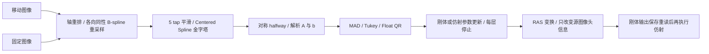

# Robust 刚体与仿射配准：隔离实验接口

**B实验源码只在 `candidate_source/`，未接入生产src。main当前不提供普通B API/CLI。下面通过显式实验loader/runner使用，先核验候选和成熟依赖SHA；实际严格warp/支持集门未过。**

## 1. 功能简介

`robust_register` 实现对称刚体或仿射配准；`robust_rigid_affine` 按刚体、MGH 保存重读、仿射的顺序组合两次配准。目标是替换核团分割准备阶段的两次 `mri_robust_register --sat 50 --mapmovhdr`。**已通过局部合同，一次真实同输入 CPU8 对照已完成，严格 warp/支持集门未通过。GEMS、recon-all 及其他 FNIT 默认流程均未调用此候选。**

图像、设计矩阵与 QR 为 Float32；CUDA 默认 TF32。4×4 变换状态、对称平方根及源码要求的插值/权重中间值使用 Double。4×4 Schur 分解在 CPU，CUDA 图像和 QR 保留在 GPU；这不是完全无 CPU 的接口。没有 Float16/BFloat16，也没有 CUDA 失败后的 CPU 回退。



新增模块复用 nibabel 读写、FNIT `AffineTransform`/LTA 与已验收的 Float 4×4 cofactor inverse。通用采样器的边界和舍入定义不同，因此在本组件内单独实现源码定义的采样与金字塔，没有修改通用 GPU 函数。主页 `environment.yml` 已包含所需 PyTorch、NumPy、SciPy、nibabel、Numba；没有新增安装依赖，也不调用 FreeSurfer/FSL/Surfa 等软件。

## 2. Python 调用、输入与输出

```python
from pathlib import Path
from runpy import run_path

candidate_loader_path = Path("validation/robust_register/rigid_affine_20261006/load_candidate.py")
experimental_package = run_path(str(candidate_loader_path))["load_candidate"]()
robust_register = experimental_package.robust_register
robust_rigid_affine = experimental_package.robust_rigid_affine

moving_atlas_path = "inputs/reflected_atlas.mgz"  # 待对齐的单帧 3D atlas 图像
fixed_mask_path = "inputs/target_mask.mgz"        # 固定的单帧 3D 掩膜
new_stage_directory = "results/robust_alignment" # 必须尚不存在，保留两次 MGH 读写边界

registration_result = robust_register(
    source=moving_atlas_path,
    target=fixed_mask_path,
    mode="rigid",                   # 刚体 6 参数；可选 affine 12 参数
    device="cuda:0",                # 显式选择 GPU；CPU 为 cpu
    tf32=True,                      # GPU 默认 TF32，退出后恢复原全局设置
    saturation=50.0,                # Tukey 饱和阈值，对应 --sat 50
    iterations_per_level=5,         # 各金字塔层最多 5 次参数更新
    stop_distance=0.01,             # 原变换距离的停止阈值
    initialize_translation=True,    # 由强度质心差初始化平移
    pyramid_min_size=16,            # 最低层尺寸规则
    pyramid_max_size=-1,            # -1 保留原分辨率，正数控制最高计算层
    highres_iterations=-1,          # -1 沿用每层预算；0 跳过最高分辨率层
    spatial_chunk_size=131072,      # 一批输出采样点，限制坐标缓冲
    memory_budget_gb=20.0,          # 十进制 GB；预检上限，非自动内存流式化
)
registration_result.transform.save("results/rigid.lta")

two_stage_result = robust_rigid_affine(
    source=moving_atlas_path,
    target=fixed_mask_path,
    stage_directory=new_stage_directory,
    device="cpu",                   # 同线程 CPU 官方对照使用此模式
    tf32=True,
)
```

输入逐项说明：

- `source`、`target`：路径或 nibabel 图像，MGH/MGZ 或 NIfTI，形状 `(X,Y,Z)`，所有轴至少 2；存储类型 uint8、int16、int32 或 float32；有限、非负强度；坐标单位 scanner RAS 毫米。不是 surface RAS。输入不必同网格。MGH 必须有合法 `goodRASFlag`，方向轴需近似正交。该版本不支持 2D、多帧、Double 存储影像、任意 shear 输入或白背景参数。
- 二值掩膜或连续强度均可作为函数输入，但真实对照计划只覆盖已保存的一例核团目标掩膜/反射 atlas。对其他输入没有官方精度承诺。
- `mode="rigid"`：6 参数（平移、旋转向量）；`mode="affine"`：12 个 row-major 增量参数。两阶段 API 固定这两个模式，不接受额外 `mode`。
- `stage_directory`：两阶段的全新目录。存在时拒绝；失败产物保留用于诊断，不伪装成功。

全部数值参数：

| 参数 | 默认值 | 意义与边界 |
| --- | --- | --- |
| `saturation` | 50.0 | 有限正数；Tukey 的标准化残差阈值 |
| `iterations_per_level` | 5 | 正整数；每层最多更新次数，耗尽不宣称收敛 |
| `stop_distance` | 0.01 | 有限正数；`sqrt(2000*||Δlinear||²+||Δtranslation||²)`，在当前层体素变换中计算 |
| `initialize_translation` | True | 强度质心差；False 使用重采样后头信息的 voxel 变换，不增加方向/尺度初始化 |
| `pyramid_min_size` | 16 | 正整数；原 strict `>16` 下采样层级定义 |
| `pyramid_max_size` | -1 | -1 不裁去最高层；正整数限制计算层级，停止层的平移按源码升回原分辨率 |
| `highres_iterations` | -1 | -1 使用每层预算；0 跳过层 0；正整数覆盖层 0 预算 |
| `device` | cuda:0 | CPU 或显式 CUDA 设备；缺少 CUDA 抛错，不回退 |
| `tf32` | True | 布尔值；只在 CUDA 数学上下文设置 matmul TF32，结束或异常后恢复 |
| `spatial_chunk_size` | 131072 | 正整数；重采样输出坐标分块；不改变整幅图的存储或 QR 行数 |
| `memory_budget_gb` | 20.0 | 有限正数，十进制 GB；保守申请估算，CPU 同时限制 32 GB、CUDA 限制 20 GB，超预算在分配前报错 |

IRLS 内部最多 20 次，以原 weighted error `2e-12` 判停；MAD 太小则权重 1。误差增加恢复上一组参数和权重，误差相等保留当前组。QR 失秩/非有限、不可接受的 halfway 平方根、反射或近投影均明确失败，不用 ridge、SVD、软 Dice 或另一优化器补救。当前采用 PyTorch QR，VNL 的失秩与尾差行为仍待实测。

输出逐项说明：

- `RobustRegistrationResult.transform`：FNIT `AffineTransform`，源→目标 scanner RAS mm 的 `(4,4)` 矩阵；来源/目标几何随对象保存，`space="world"`。实际公开矩阵经过原 `MATRIX_REAL` Float 边界，再用 Double 容器保存。
- `header_image`：MGH 图像，源数据不重采样；只更新 `delta/Mdc/Pxyz_c`。默认保留原 `delta`，仿射后方向向量不一定单位长度，不能事后归一化。
- `report`：JSON 可序列化标量、4×4 变换、各层 shape、更新/收敛原因、实际精度与分步时钟。不含影像数组；`experimental_native_equivalence="not_assessed"` 不等于精度通过。
- 两阶段返回 `rigid`、`affine` 两个结果、`combined_RAS_matrix`、最终 `header_image` 和包含 MGH 保存重读的 `seconds`。目录保存 `rigid.header.mgz`、`affine.header.mgz`、`rigid.lta`、`affine.lta`。仿射输入是刚体输出的实际 MGH 重读对象。

## 3. 命令行调用

```bash
python validation/robust_register/rigid_affine_20261006/run_experiment.py \
  --source inputs/reflected_atlas.mgz \
  --target inputs/target_mask.mgz \
  --output-directory results/robust_alignment \
  --mode rigid-affine --device cuda:0 \
  --saturation 50 --iterations-per-level 5 --stop-distance 0.01 \
  --pyramid-min-size 16 --pyramid-max-size -1 --highres-iterations -1 \
  --spatial-chunk-size 131072 --memory-budget-gb 20
```

`--mode` 可为 `rigid`、`affine`、`rigid-affine`。其余带横线选项对应上表同名参数；`--no-initialize-translation` 对应 False，`--disable-tf32` 对应 False。CLI 输出另含 `report.json`；单阶段保存 `transform.lta` 和 `mapped.header.mgz`。已有输出目录拒绝覆盖。未修改共享 FNIT CLI 或 GEMS CLI，也没有默认启用这一配准。

## 4. 原软件调用

```bash
# 仅用于隔离官方 benchmark；FNIT 运行时不调用原软件。
mri_robust_register --mov reflected_atlas.mgz --dst target_mask.mgz \
  --lta rigid.lta --mapmovhdr rigid.header.mgz --sat 50 -verbose 0
mri_robust_register --mov rigid.header.mgz --dst target_mask.mgz \
  --lta affine.lta --mapmovhdr affine.header.mgz --affine --sat 50 -verbose 0
```

固定来源是 FreeSurfer 8.2.0-1 build `d932c45` 的两条命令：对称、robust、无强度缩放、无随机抽样，质心平移初始化；每层 5 次、停止 0.01。该接口没有覆盖 `--iscale`、`--nosym`、`--doubleprec`、手动初值、2D 等整个命令面。

## 5. 精度、时间及脑图

| 范围 | 当前结论 |
| --- | --- |
| 局部合同 | 源码定义的 pyramid 截奇轴/每轴 Float、cubic knot、trilinear 半体素边界、解析 A 行序、权重恢复、参数更新、MGH 两阶段读写已检；详细 nodeids 见冻结报告 |
| 真实刚体/仿射、官方两命令 | 已完成一次，点差通过；rigid support 差1体素，affine warp 相对L2 2.588e-5且support差1体素，严格门未过，详见本目录 README 和 ONE_OFF_RESULTS.json |
| CPU 与 GPU 速度 | CPU单次观察：FNIT两阶段含保存1.07115s，官方两命令合1.19106s；没有CPU ABBA或CUDA实际测试，不称等价加速 |
| GEMS 最终核团 | 未接入，本候选不能更改已报告的失败结果或宣称最终 ROI 通过 |

本次对照使用 A 已验收保存的同一真实公开实例，双方读完全相同输入字节；先刚体再仿射，分别比较 LTA 定义、头信息和 unchanged source data。事先物理点门为 atlas bounding-box 与标准网格点的 RMS≤0.001 mm、max≤0.01 mm；同固定目标网格采样另报告最大/P99/相对 L2 与支持集差。已完成一次有界 CPU8 两命令精度对照，原严格门未过，CPU ABBA/GPU尚未安排。完整冻结计划见 `validation/robust_register/rigid_affine_20261006/`。

当前可视化仅有 [A 的真实目标掩膜准备图](../target_preparation_20261006/preparation_targets.png)，显示原/new 数据相同；它不是本 B 配准输出。B 的官方/FNIT overlay 尚未生成。

## 6. 更新记录与待验收项

- **2026-10-06 A**：真实目标掩膜/反射头信息单例门通过；两次 JSON 元数据序列化失败与只读恢复单列，详见 [PREPARATION.md](../../../docs/robust_register/PREPARATION.md)。1mm 实例未触发 voxel resize 分支。
- **2026-10-06 B 候选**：独立实现 source-defined preparation、pyramid、halfway、analytic flow、MAD/Tukey/Float QR 和两阶段 API/CLI。初版局部报告暴露 nibabel shape 的 NumPy integer JSON 问题，已显式转 Python int；没有重跑 MRI。一次真实注册已完成，严格门未过；没有接入端到端 GEMS。
- 已确认成熟 helper 数学边界不同，所以本地保留专属 adapter。没有去改通用 GPU 采样、GEMS 目标函数或默认 alignment。
- 剩余：VNL/PyTorch QR 和 reduction 的真实精度、初始化/BSpline 真实输入中间结果、两阶段矩阵/warp/header、CPU8速度、GPU 默认 TF32 精度与 20 GB 峰值。任何失败保留原值与门槛。

## 7. 原代码、许可及参考文献

- 原源码：[FreeSurfer d932c45](https://github.com/freesurfer/freesurfer/tree/d932c45b7941662ea380a05efef580568b98d41a/mri_robust_register)，底层 [mriBSpline.cpp](https://github.com/freesurfer/freesurfer/blob/d932c45b7941662ea380a05efef580568b98d41a/utils/mriBSpline.cpp)、[mri.cpp](https://github.com/freesurfer/freesurfer/blob/d932c45b7941662ea380a05efef580568b98d41a/utils/mri.cpp)。逐文件 SHA 与定义行见独立 SOURCE_AUDIT。
- 原作者 Martin Reuter；Copyright ©2021 The General Hospital Corporation (Boston, MA), “MGH”。改编遵循 [FreeSurfer Software License](../../../licenses/FreeSurfer.txt) Part B，保留归属与修改标记；FNIT 是改编实现，不是官方 FreeSurfer 发布。没有复制发布无关原程序或许可证凭据。
- Reuter M, Rosas HD, Fischl B. Highly accurate inverse consistent registration: A robust approach. *NeuroImage* 53:1181–1196, 2010. [doi:10.1016/j.neuroimage.2010.07.020](https://doi.org/10.1016/j.neuroimage.2010.07.020).
- Thévenaz P, Blu T, Unser M. Interpolation revisited. *IEEE TMI* 19:739–758, 2000. [doi:10.1109/42.875199](https://doi.org/10.1109/42.875199).
