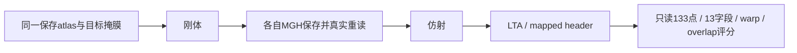

# Robust 刚体与仿射：单例 CPU8 对照未通过严格门

## 1. 功能与流程

独立实验实现对称robust刚体和仿射，用于替换核团准备阶段的两条 `mri_robust_register --sat 50 --mapmovhdr`。本次官方两命令及FNIT两阶段都完成；独立评分20项检查通过17项，warp/支持集3项未过。**实验源码只在本目录 `candidate_source/`，没有进入生产 `src/`、GEMS或既有GPU默认流程。**



## 2. Python 调用、输入与输出

main不提供B接口；本目录只保存唯一的实验源码版本 `candidate_source/`。`load_candidate.py`先校验6个候选模块和5个成熟FNIT依赖文件的大小/SHA，再以独立命名空间 `fnit._robust_register_validation_20261006` 加载；不会覆盖 `fnit.robust_register`、向生产src写文件或修改其接口。若当前安装版成熟依赖SHA已变，使用固定基线 `db61cebc9d3683720e6c0a288db3cdc7d6f30a7c` 的隔离checkout，令该checkout的src作为Python搜索路径。不要修改主仓库或正在使用的环境。

```python
from pathlib import Path
from runpy import run_path

candidate_loader_path = Path(
    "validation/robust_register/rigid_affine_20261006/load_candidate.py"
)  # 在仓库根目录运行；加载会先核验SHA
experimental_package = run_path(str(candidate_loader_path))["load_candidate"]()
moving_atlas_path = "inputs/reflected_atlas.mgz"  # 外部atlas的右侧反射头信息图
fixed_mask_path = "inputs/target_mask.mgz"         # 真实T1派生ASEG所生成0/255目标
new_stage_directory = "results/robust_pair"       # 必须尚不存在

two_stage_result = experimental_package.robust_rigid_affine(
    source=moving_atlas_path,
    target=fixed_mask_path,
    stage_directory=new_stage_directory,
    device="cpu",
    saturation=50.0,
    iterations_per_level=5,
    stop_distance=0.01,
)
```

输入格式、全部参数、精度/内存边界和逐项输出详见 [实验接口7节文档](PROTOTYPE_API.md)。本次目标来自一例CC0公开真实T1的ASEG，源为另有FreeSurfer许可的atlas，不能把atlas称为CC0被试MRI。固定输入39×45×56 float32/1mm和131×241×99 uint8/0.25mm，双方读相同保存字节。输出是源→目标scanner RAS毫米LTA、源体素不重采样的MGH、阶段标量报告；仿射输入是各自刚体MGH的实际重读对象。

## 3. 命令行调用

```bash
# 显式实验入口；不使用普通python -m fnit.robust_register。
python validation/robust_register/rigid_affine_20261006/run_experiment.py \
  --source inputs/reflected_atlas.mgz --target inputs/target_mask.mgz \
  --output-directory results/robust_pair --mode rigid-affine \
  --device cpu --saturation 50 --iterations-per-level 5 --stop-distance 0.01
```

完整参数见实验接口。benchmark私密计划用用户自己的路径和独立官方许可证配置，公共材料没有影像、模板数组或凭据。实际one-off及原计划/源码审计的归档在 `prepared/`，恢复scorer只允许score阶段。公开 `reproduce_worker.py` / `reproduce_controller.py` 显式加载SHA绑定的实验副本；它们是复现适配器，未在本次真实对照中执行，不能用它们的SHA替换原as-run worker。复现者使用自己的新目录、输入/许可证和路径/SHA绑定；本次私密计划只公开SHA及非私密参数。

## 4. 原软件调用与来源

```bash
# 只用于隔离原软件对照，不属于FNIT运行时。
mri_robust_register --mov reflected_atlas.mgz --dst target_mask.mgz \
  --lta rigid.lta --mapmovhdr rigid.header.mgz --sat 50 -verbose 0
mri_robust_register --mov rigid.header.mgz --dst target_mask.mgz \
  --lta affine.lta --mapmovhdr affine.header.mgz --affine --sat 50 -verbose 0
```

固定FreeSurfer8.2 build `d932c45`，默认Float profile、对称、无强度缩放/随机抽样，每层5次，变换距离0.01。原代码具体行和许可见 [SOURCE_AUDIT.md](prepared/SOURCE_AUDIT.md)。前后509原绑定、4MGZ+4LTA及原失败记录保持SHA完全相同。

## 5. 真实精度、时间与可视化

| 阶段 | 点RMS / max（mm） | warp相对L2 | 支持集差 | 固定掩膜Dice（双方） | 正式结论 |
| --- | ---: | ---: | ---: | ---: | --- |
| 刚体 | 5.471e-6 / 7.742e-6 | 2.409e-6 | 1体素 | 0.768116 | 支持集门未过 |
| 仿射组合 | 2.691e-4 / 4.487e-4 | 2.588e-5 | 1体素 | 0.889348 | warp及支持集门未过 |

原门：点RMS≤0.001mm、max≤0.01mm；warp相对L2≤1e-5、支持集0差；自身LTA/保存几何误差≤1e-5mm。源体素/shape/dtype、LTAshape、自身几何门都通过。13个MGH字段各阶段11项exact，`Mdc/Pxyz_c`有Float尾差。掩膜计数与Dice相同不等于逐体素标签已证明一致。warp评分双方使用同一FNIT采样器，仅评价不同保存几何；不是独立官方重采样器验收。

| 时钟范围 | 官方 | FNIT |
| --- | ---: | ---: |
| 刚体命令 / API | 0.675617s | 0.674704s |
| 仿射命令 / API | 0.515443s | 0.343163s |
| 两条命令合计 / 含MGH保存重读的两阶段 | 1.191060s | 1.071150s |
| instrumented arm墙钟（含导入/绑定检查） | 2.796632s | 2.541934s |
| worker peak RSS | 309129216B | 520515584B |

仅一次同节点8物理核、独占共同CPU锁、20e9地址空间、无CUDA分配的观察，没有CPU ABBA；严格精度门未过，不能称等价加速。官方child峰值和worker峰值分别保留，未把两个峰值相加。FNIT刚体load/prep/pyramid为0.010302/0.324796/0.021708s，仿射0.001299/0.115664/0.021204s；其余每层sampling/design/IRLS/step时钟见JSON。4个level均5次预算耗尽，未称收敛。

原score第一次因MGH大端Float32数组不能直接转Torch退出1，尚未获得数值结果。独立只读恢复显式转native Float32，局部值和正mask合同通过；只评分原保存输出，得到上述正式exit2。原controller/失败JSON和输出永久保留，不把恢复称作原controller成功。评分恢复2.452492s不计入注册API时间，不称metadata-only操作。

本次未产生新脑图，先保留完整数值和来源。可查看 [A的真实目标准备脑图](../target_preparation_20261006/preparation_targets.png)，它只证明目标准备，不代表B的注册精度。详细字段见 [METRICS.csv](METRICS.csv) 和 [ONE_OFF_RESULTS.json](ONE_OFF_RESULTS.json)。

## 6. 更新记录、归因和待改进

- A目标准备此前单例exact通过；B准备44项API/CLI合同通过，另6项benchmark保护合同，未合称一次50项执行。准备归档原字节在 `prepared/`。
- 本次只执行官方2命令与FNIT2阶段；score IO失败后只恢复一次保存输出评分，新增1项big-endian值/mask合同通过。没有再次注册、重复评分、CUDA或完整GEMS。
- [SOURCE_RUNTIME_GAP.md](SOURCE_RUNTIME_GAP.md)区分证据与推测：相同源值和同一评分采样器下，已保存几何小差形成warp差；没有保存那1体素的局部值，也没有官方same-A/b或内部轨迹，不能把差异唯一归因于求解器或保存尾数。
- 严格门未过，不接生产。后续仍需针对性初始化/采样/QR中间状态定位，再另行安排CPU ABBA和CUDA TF32/20GB门；本次未进行这些对照。本实验不改变既有完整GEMS右HA未通过的28区结果。

## 7. 许可、依赖和参考

实验源码保留Martin Reuter/MGH归属、FNIT改编和Thévenaz/Blu/Unser采样归属，遵循 [FreeSurfer Software License](../../../licenses/FreeSurfer.txt)。未复制发布原C++/原生可执行文件。目标来自公开CC0数据；外部atlas按自身许可配置，未发布其数组。主页Conda已有PyTorch、NumPy、SciPy、nibabel、Numba，未新增依赖或修改环境。

- Reuter M et al. *NeuroImage*53:1181–1196,2010. [DOI](https://doi.org/10.1016/j.neuroimage.2010.07.020)。
- Thévenaz P et al. *IEEE TMI*19:739–758,2000. [DOI](https://doi.org/10.1109/42.875199)。
- [固定原代码d932c45](https://github.com/freesurfer/freesurfer/tree/d932c45b7941662ea380a05efef580568b98d41a/mri_robust_register)。
