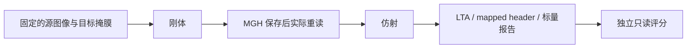

# 独立 Robust 刚体与仿射候选：准备冻结记录

## 1. 功能和当前状态

新增独立 `robust_register` 与 `robust_rigid_affine`，按 FreeSurfer 8.2 `mri_robust_register --sat 50` 的 Float 默认定义实现对称刚体、仿射与只改变头信息的输出。当前状态为 **prepared_not_dispatched**：完成源码审计、局部合同和一次真实同输入 CPU8 对照的冻结准备；真实注册、官方两命令、CUDA 注册与完整 GEMS 均执行 0 次。没有接入 GEMS、recon-all 或其他默认流程。



## 2. Python 输入、输出和参数

完整 API、每个参数、输入存储类型及精度边界见 [REGISTRATION.md](../../../docs/robust_register/REGISTRATION.md)。这里的两阶段协议是每一方各自执行刚体、保存和重读自己的 MGH，再执行仿射；双方使用同一份原始 atlas 与目标掩膜，评分产物不进入优化器。

```python
from fnit.robust_register import robust_rigid_affine

moving_atlas_path = "inputs/reflected_atlas.mgz"  # 源图像，单帧 3D
fixed_mask_path = "inputs/target_mask.mgz"         # 目标掩膜，单帧 3D
new_stage_directory = "results/robust_pair"       # 必须不存在

two_stage_result = robust_rigid_affine(
    source=moving_atlas_path,
    target=fixed_mask_path,
    stage_directory=new_stage_directory,
    device="cpu",
    tf32=True,
    saturation=50.0,
    iterations_per_level=5,
    stop_distance=0.01,
    initialize_translation=True,
    pyramid_min_size=16,
    pyramid_max_size=-1,
    highres_iterations=-1,
    spatial_chunk_size=131072,
    memory_budget_gb=20.0,
)
```

输出为两阶段结果、源→目标 scanner RAS mm 的 LTA、未重采样源体素的 MGH、组合 RAS 矩阵和阶段时钟。Float 图像/设计矩阵/QR，Double 小矩阵状态与源码指定中间运算；输入 Double 存储影像明确拒绝。CUDA 默认 TF32，但其真实精度和速度尚未测试。

## 3. 命令行调用

```bash
python -m fnit.robust_register \
  --source inputs/reflected_atlas.mgz --target inputs/target_mask.mgz \
  --output-directory results/robust_pair --mode rigid-affine \
  --device cpu --saturation 50 --iterations-per-level 5 --stop-distance 0.01
```

所有选项和输出结构见 API 文档。现有目录拒绝覆盖；共享 FNIT/GEMS CLI 未变。

## 4. 原软件与冻结定义

隔离对照使用 `mri_robust_register` 的刚体命令及随后带 `--affine` 的命令，两条均 `--sat 50 --mapmovhdr -verbose 0`。精确源位置、采样/初始化/金字塔/Float QR/参数更新和头信息定义见 [SOURCE_AUDIT.md](SOURCE_AUDIT.md)，上游 29 个相关文件 SHA 见 [SOURCE_BINDINGS.public.json](SOURCE_BINDINGS.public.json)。不发布原 C++ 文件、可执行程序或许可证。

冻结快照为 504 个 Python 文件：498 个与实际 canonical 基线逐字一致，加 6 个独立 A/B 模块文件。执行绑定总计 509 项，另含 2 个 worker、2 个既有输入和 1 个官方 oracle 可执行文件。来源、模块/worker SHA、私密计划 SHA 与 tree digest 见 [FROZEN_SOURCE.public.json](FROZEN_SOURCE.public.json)。canonical 基线是现场读取的 `db61cebc`，候选 worktree 基于 A 的 `af33348b`；冻结未假定两者已同步。

## 5. 合同、真实验收与时间

| 范围 | 已保存的实际结果 |
| --- | --- |
| API/CLI 单批合同 | 44 passed，5.04s；完整 stdout、44 个唯一 nodeid 和源/test SHA 已保存 |
| benchmark 调度/写入合同 | 独立批次 6 passed，0.98s；不与 44 项合称一次 50 项执行 |
| 真实 rigid/affine 精度与耗时 | 尚未运行，均 NA |
| CPU/GPU 加速或默认流程等价 | 尚未验收，无此结论 |

局部合同不是 MRI benchmark。44 项涵盖原截奇轴的每轴 Float 金字塔、cubic knot、trilinear 半体素边界、解析 A 行序、Float QR、Tukey 及拒绝更新时参数/权重恢复、参数顺序、MGH 头信息和两阶段保存重读。初次局部批次的 NumPy int32 JSON 失败已记录；修复仅转换 shape 元数据，没有重算真实 MRI。原批次的完整 stdout 未保存，不能当作最终冻源的执行证据。

真实计划见 [BENCHMARK_PLAN.public.json](BENCHMARK_PLAN.public.json)：一例已保存的 CC0 公开 MRI 所生成目标掩膜及反射 atlas。预设 133 个源物理点 RMS≤0.001mm、max≤0.01mm；LTA 与 mapped header 自洽误差≤1e-5mm；同目标网格 warp 相对 L2≤1e-5且非零支持集精确一致。13 个实际 MGH 字段、world/LTA 矩阵、刚体和仿射点差及固定掩膜重叠全部报告。固定掩膜重叠仅是观察，评分不反馈优化。warp 使用同一个 FNIT 采样器读取双方已保存的头信息，因此评价几何导致的 warp 差异，不是独立官方重采样器验收。

双方固定同 8 个物理核、公共 CPU 锁、20e9 地址空间上限及清理环境。一次 official arm、一次 FNIT arm、一次只读 score；锁等待600s、每 arm1200s、锁内总界3600s、外界4800s，官方各命令550s。首个失败立即保存非零状态，不自动重跑或改变阈值。阶段墙钟、端到端含保存重读、各 arm RSS 与 CPU 无 CUDA 分配均单列。未生成 B 脑图；[A 的已验收脑图](../target_preparation_20261006/preparation_targets.png)只代表目标准备精度。

## 6. 更新与未验收范围

- 2026-10-06：A 的单例目标准备通过，B 的独立模块/API/CLI及局部合同完成，one-off CPU8 对照已冻结但未派发。
- 对通用成熟采样器定义不同的边界保留本地专属实现，没有改通用 GPU 函数或 GEMS 默认 alignment。
- 仍需实际 VNL/PyTorch QR 与 Float reduction 对照、BSpline/初始化真实数据核验、两阶段矩阵/warp/header、CPU8 时间和 CUDA TF32/显存门。未授权其他 internal capture、CPU ABBA、GPU 配对或完整 GEMS。
- 所需 NumPy、SciPy、PyTorch、nibabel、Numba 均在现有主页 Conda 环境；未安装依赖或移动 prefix。

## 7. 许可与参考

FreeSurfer `d932c45` 派生定义保留 Martin Reuter/MGH 归属和 FNIT 改编标记；见 [FreeSurfer Software License](../../../licenses/FreeSurfer.txt)。采样定义保留 Thévenaz/Blu/Unser 归属。私密凭据、许可证内容或其 SHA、MRI 数组及服务器路径不在公共报告中。

- Reuter M, Rosas HD, Fischl B. Highly accurate inverse consistent registration: A robust approach. *NeuroImage* 53:1181–1196, 2010. [DOI](https://doi.org/10.1016/j.neuroimage.2010.07.020).
- Thévenaz P, Blu T, Unser M. Interpolation revisited. *IEEE TMI* 19:739–758, 2000. [DOI](https://doi.org/10.1109/42.875199).
- [固定原代码](https://github.com/freesurfer/freesurfer/tree/d932c45b7941662ea380a05efef580568b98d41a/mri_robust_register)。
