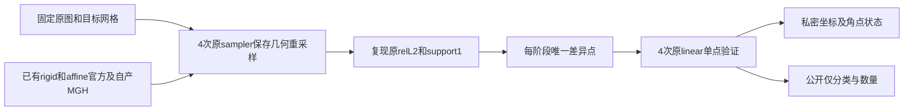

# Robust registration：保存几何的两点支持集诊断准备

## 1. 功能与当前状态

本目录准备检查上一轮刚性和仿射 warp 各 1 个非零支持集差异点。只读取已有原图、目标网格和四份官方/自产保存几何，以原冻结 B sampler 重采样。先复现两阶段原 warp relL2 与 support 数，再观察唯一差异点的舍入、边界、整数 shortcut 和插值角点。

**当前仅完成代码、冻结计划和源/输入/参考的现场只读 SHA 核对：尚未上传、未运行采样或诊断。** 既有结果仍为17/20；本目录不是新的精度通过或速度结果。



## 2. Python 调用、输入、输出及参数

这是独立验证工具，没有新增正式 FNIT API。`prepare_plan.py` 用标准库从已经保存的原私密 PLAN、原评分和现场只读观察生成新 PLAN，不载入 MRI，不执行 sampler。

```python
from pathlib import Path
import sys

diagnostic_source_directory = Path("validation/robust_register/support_points_prepare_20261006")
sys.path.insert(0, str(diagnostic_source_directory))
from prepare_plan import prepare

# 下面三个文件需要操作者已有的对应私密副本；不会从官方结果拟合变换。
original_plan_path = Path("/private/original/PLAN.private.json")
original_score_path = Path("/private/original/score/report.private.json")
live_observation_path = Path("/private/preparation/READ_OBSERVATION.private.json")
new_plan_output_directory = Path("/private/new-support-plan")  # 必须不存在
prepared_plan_summary = prepare(
    old_path=original_plan_path,
    score_path=original_score_path,
    observation_path=live_observation_path,
    output_directory=new_plan_output_directory,
)
print(prepared_plan_summary["private_PLAN"])  # 仅大小和SHA，不打印私密路径或影像
```

| 输入 | 格式、意义和规则 |
|---|---|
| `old_path` / `--old-plan` | 原186,991B JSON，SHA `05a45563…`；固定原518个源/输入/参考绑定及已有目录 |
| `score_path` / `--baseline-score` | 原187,503B JSON，SHA `c06d652d…`；保留两阶段实际评分和实际CPU flags |
| `observation_path` / `--live-observation` | 准备时只读现场记录；包含当前README/INDEX大小与SHA、实际主仓库HEAD、原518项及5个新增已有产物SHA |
| `output_directory` / `--output-directory` | 本地新目录；拒绝覆盖，目录700、文件600；生成私密完整PLAN和可发布的脱敏PLAN摘要 |
| `moving` | 原反射atlas `flippedAtlasDump.mgz`，131×241×99、uint8、0.25mm；独立FreeSurfer资源许可，不发布角点像素 |
| `fixed` | 原 `targetMask.mgz`，39×45×56、Float32、1mm，scanner RAS；CC0 ds000114 T1/aseg派生目标；本工具只消费其网格和几何 |
| `official_directory` | 原已保存rigid/affine MGH及LTA；只作后验几何对照，未经本工具重新生成 |
| `saved_output_directory` | 上轮自产rigid/affine MGH及LTA；仿射继承自身刚性MGH，与官方仿射的内部起点不同 |
| `source_directory` / `legacy_candidate_directory` | 原冻结FNIT树及旧B六模块；使用独立namespace加载原sampler和几何构造函数 |
| `spatial_chunk_size` | 固定131,072；沿用原采样分块，目标网格98,280点 |
| `expected_baseline` | 逐阶段原持久化relL2和support1；要求原Python Float标量完全相同，差异时停止单点观察 |
| `unchanged_formal_gates` | 原20项定义与已保存17通过/3失败；支持集目标仍0、warp relL2仍≤1e-5；本工具只复现其中warp/support，不重算133点条件 |
| `physical_cores` / CPU线程 | 固定原8个物理核，Torch/BLAS/OpenMP线程8、interop1；共用CPU锁 |
| `limits` | 锁等待120s、数值child120s、外controller300s；TERM/KILL各2s；AS20,000,000,000B；只尝试一次 |
| `observed_canonical_metadata` | 准备时读到的README和INDEX快照SHA；共享索引可按正常工作更新，不将该观察当运行期全局锁 |
| `harness_bindings` | 独立三源码 `common.py`、`inspect_saved_points.py`、`run_prepared.py` 的完整SHA；前后核验 |

计划的运行输出如下，均先存放在新私密run目录：

- `worker/report.private.json`：原524项与独立3源码前后SHA、线程/精度状态、实测耗时/RSS、两阶段基线标量、两点坐标/双方pull/舍入/FEQUAL/8角点状态。所有shape/index/位型计数显式转Python内置`int`，避免原仿射报告的NumPy int32 JSON错误。
- `worker/classification.public.json`：只在所有前后门通过后生成；包含逐阶段观察分类数量、基线是否复现、操作计数及原17/20的历史标注。无目标索引、坐标、pull矩阵、atlas采样值或MRI数组。
- `controller.private.json`：共用锁等待、child墙钟/退出码、实际report SHA和原524项/三源码前后SHA。失败保留记录且不自动重试。

分类描述已观察的采样分支，例如半体素支持域改变、FEQUAL整数分支改变或插值角点改变。分类不直接证明优化器最早分叉的原因。物理网格和实际sampler相同，也不能将共享sampler结果称为独立官方插值器验收。

## 3. 实验命令行与Conda

下列为冻结后复现命令格式，**当前未执行**；数值运行需协调者核对完整私密PLAN及其SHA，登记新工作/产物目录后启动。

```bash
# 本地元数据准备；三个输入均为已经核验的私密记录。
python prepare_plan.py \
  --old-plan /private/original/PLAN.private.json \
  --baseline-score /private/original/score/report.private.json \
  --live-observation /private/preparation/READ_OBSERVATION.private.json \
  --output-directory /private/new-support-plan

# 单次有限诊断；替换为实际冻结PLAN SHA。
python /private/frozen/run_prepared.py \
  --plan /private/frozen/PLAN.private.json \
  --approved-plan-sha ACTUAL_FROZEN_PLAN_SHA256
```

`--plan`和`--approved-plan-sha`均必填。worker额外要求controller继承的`--cpu-lock-fd`，不得作为普通独立CLI绕过共用CPU锁。controller保留该文件描述符至child结束，有限等待后按进程组终止。已有controller或worker目录拒绝重复运行。

复用既有FNIT Conda的PyTorch、NumPy、nibabel和原包现有依赖，无新增安装。固定FP32坐标/体素与原sampler内部Double插值和L2统计；CPU上TF32不参与计算。CUDA隐藏，无FP16/BF16或autocast。这里的AS上限是地址空间限制，不代替实测RSS或新的完整Conda安装验收。

## 4. 对应原软件

本工具读取原两条命令已经保存的几何，不再次运行FreeSurfer：

```bash
mri_robust_register --mov reflectedAtlas.mgz --dst targetMask.mgz \
  --lta rigid.lta --mapmovhdr rigid.header.mgz --sat 50 -verbose 0
mri_robust_register --mov rigid.header.mgz --dst targetMask.mgz \
  --lta affine.lta --mapmovhdr affine.header.mgz --sat 50 -verbose 0 --affine
```

官方`--mapmovhdr`保存源体素及新几何，未在此生成独立官方warp。本工具消费原B Float几何组合、原成熟inverse、half-voxel/rint支持域及Double八项trilinear；没有新的配准、优化器、GEMS或官方命令。

## 5. 已有精度与时间、待执行诊断

| 已有同输入结果 | rigid | affine |
|---|---:|---:|
| 上轮局部inverse后warp relL2 | 2.5840940291760602e-6 | 2.556642902132947e-5 |
| 原要求warp relL2 | ≤1e-5 | ≤1e-5 |
| 已有支持集差异 / 原要求 | 1 / 0 | 1 / 0 |
| 133点RMS，mm | 5.044064023421258e-6 | 2.6815100132909157e-4 |
| 本工具实际数值运行 | 未运行 | 未运行 |

上轮真实两阶段整体门17/20保留：[最终实图报告](../inverse_real_20261006/README.md)。新诊断先重现表中warp/support标量，再每阶段只检查一差异点；不运行注册API，不修改保存header，不调阈值拟合目标，不把仿射组合差归为独立affine solver bug。

上轮刚性API0.442906s；仿射API时钟/counter/flags/RSS因JSON失败仍NA；原失败controller4.741112s与只读评分recovery2.687818s分别记录，不能组成成功连续链或计算加速比。本目录没有新耗时/速度/脑图结果。可参见已有[CC0目标mask图](../target_preparation_20261006/preparation_targets.png)；atlas像素与两点实际值保持私密。

## 6. 更新记录

- 原B：真实两阶段，17/20；保存记录保持。
- 局部Float inverse：源定义矩阵18/18；实际刚性inverse调用26次，完整评分仍17/20；原失败controller和评分RC2保留。
- 本目录：现场只读核518原绑定、已有五产物及统一目录README/INDEX；准备四基线重采样及四单点观察代码。源/私密PLAN/manifest验收属于元数据准备，尚无新数值作业或上传。
- 公开分类只能由后续实际成功worker生成；原门和生产CPU/GPU代码保持原版本。

## 7. 原实现、文献与许可

原冻结FreeSurfer版本 `d932c45b7941662ea380a05efef580568b98d41a` 的[几何与采样审计](../rigid_affine_20261006/prepared/SOURCE_AUDIT.md)、[Float inverse审计](../inverse_order_20261006/SOURCE_AUDIT.md)和[完整实图来源](../inverse_real_20261006/SOURCE_RUNTIME_GAP.md)提供固定SHA与源码位置。原数值边界来自 `MRIsampleVolumeFrame`、`MRIindexNotInVolume` 与 `MatrixMultiply`；引用源码见 [FreeSurfer mri.cpp](https://github.com/freesurfer/freesurfer/blob/d932c45b7941662ea380a05efef580568b98d41a/utils/mri.cpp)。

Reuter et al. (2010), *Highly accurate inverse consistent registration: a robust approach*, NeuroImage 53:1181–1196，[DOI](https://doi.org/10.1016/j.neuroimage.2010.07.020)。原适配保留[FreeSurfer许可](../../../licenses/FreeSurfer.txt)；本目录只增加调用已有仓库实现的有界诊断和元数据报告，不复制上游源码集合、官方二进制或资源像素。目标来自CC0 ds000114派生输入；atlas适用独立资源许可，不能由目标CC0许可推出可再分发。
