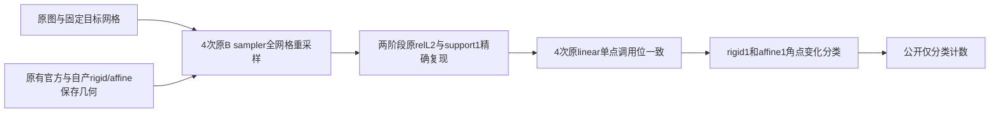

# Robust registration：保存几何的支持集诊断结果

## 1. 功能与结论

一次有界诊断已完成，controller 和 worker 均退出0。四次原 B sampler 全网格重采样精确复现已有刚体和仿射 warp relL2、各1个支持集差异；随后四次原 sampler 单点调用均复现相应 Float32 结果位。

两阶段各1点均归入 **插值角点或非零角点状态变化**（`interpolation_stencil_or_nonzero_corner_switch`）。这是保存几何下的采样分支观察；优化器最早分叉尚未定位。仿射仍继承各自不同的刚性MGH。原正式结果保持 **17/20、3失败**。



## 2. Python调用、输入与输出

这是独立验证工具，使用[冻结准备代码](../support_points_prepare_20261006/README.md)，没有新增正式FNIT API。完整输入格式、参数和元数据准备例子见该说明。

| 输入 | 格式与作用 |
|---|---|
| 原 `moving` | 131×241×99、uint8、0.25mm反射atlas MGH；仅在私密服务器读取 |
| 原 `fixed` | 39×45×56、Float32、1mm目标mask MGH；消费网格及scanner RAS几何 |
| 四份保存MGH | 已有官方及自产rigid/affine源网格、Float32 header；不重新拟合变换 |
| 原冻结B包与FNIT源码 | 原sampler、几何组合及成熟inverse；独立namespace加载，前后核验SHA |
| 原评分 | 已保存两阶段warp relL2、支持集差异数和CPU flags；必须完全复现后才观察单点 |
| 最终私密PLAN | 190,058B JSON；SHA `1e95b019f7107d839e12b25e84f2bfe52e78f51dcb542d3550b4035c8d55dea3`；524项源/输入/参考绑定及3份harness |

```python
from pathlib import Path
import subprocess

# 指定已冻结的私密代码、PLAN与既有Conda解释器。
frozen_diagnostic_directory = Path("/private/frozen/robust-support-points-20261006-v1")
frozen_plan_path = frozen_diagnostic_directory / "PLAN.private.json"
existing_conda_python = Path("/private/fnit-conda/bin/python")
approved_plan_sha256 = "1e95b019f7107d839e12b25e84f2bfe52e78f51dcb542d3550b4035c8d55dea3"

# 调用controller；它取得共用CPU锁后只启动一个worker。
subprocess.run(
    [str(existing_conda_python),
     str(frozen_diagnostic_directory / "run_prepared.py"),
     "--plan", str(frozen_plan_path),
     "--approved-plan-sha", approved_plan_sha256],
    check=True,
)
```

| 参数或固定限制 | 本次值与作用 |
|---|---|
| `--plan` | 完整私密PLAN路径；controller与worker都检查 |
| `--approved-plan-sha` | 必须与最终PLAN完整SHA一致 |
| `--cpu-lock-fd` | worker内部参数；继承controller持有的同一CPU锁描述符 |
| `spatial_chunk_size` | 131,072；沿用原sampler分块 |
| CPU | 原8物理核，Torch/BLAS/OpenMP线程8，Torch interop1 |
| 数值类型 | 原FP32坐标/体素，Double插值及L2统计；CPU autocast关闭；CUDA隐藏，TF32不参与CPU计算 |
| 时间限制 | 锁等待120s、worker120s、controller300s，TERM/KILL各2s |
| 地址空间 | 20,000,000,000B；这是AS上限，实测RSS另记 |
| 尝试次数 | 一次；首次失败停止，既有dispatch/worker拒绝重复启动 |

私密输出 `worker/report.private.json` 保存两点索引、双方pull、舍入/FEQUAL/角点状态、524项与3份源码前后SHA、资源flags、耗时和RSS；`controller.private.json` 保存实际child、共用锁、退出码及report SHA。公开输出仅保存分类计数和元数据；坐标、atlas值、pull和MRI数组留在私密运行目录。

## 3. 命令行与环境

```bash
python /private/frozen/robust-support-points-20261006-v1/run_prepared.py \
  --plan /private/frozen/robust-support-points-20261006-v1/PLAN.private.json \
  --approved-plan-sha 1e95b019f7107d839e12b25e84f2bfe52e78f51dcb542d3550b4035c8d55dea3
```

本次复用既有Conda、Torch2.5.1、NumPy和nibabel，没有新增依赖。上述命令展示固定调用格式；本次运行目录已经完成，不能再次执行。输入和资源均复用现有冻结文件，没有上传影像或官方资源。

## 4. 对应原软件

本次读取以下原命令已有的输出几何：

```bash
mri_robust_register --mov reflectedAtlas.mgz --dst targetMask.mgz \
  --lta rigid.lta --mapmovhdr rigid.header.mgz --sat 50 -verbose 0
mri_robust_register --mov rigid.header.mgz --dst targetMask.mgz \
  --lta affine.lta --mapmovhdr affine.header.mgz --sat 50 -verbose 0 --affine
```

本轮新增注册、官方命令、GEMS和GPU调用均为0。`--mapmovhdr`保存源体素及变换后的header；本诊断通过同一原B sampler比较保存几何，未新增独立官方插值器验收。

## 5. 真实结果与耗时

| 阶段 | 精确复现原warp relL2 | 支持集差异 / 原要求 | 公开分类计数 |
|---|---:|---:|---|
| rigid | 2.5840940291760602e-6 | 1 / 0 | 插值角点或非零角点状态变化：1 |
| affine | 2.556642902132947e-5 | 1 / 0 | 插值角点或非零角点状态变化：1 |

原warp relL2要求仍为≤1e-5。刚体的支持集门、仿射的warp relL2及支持集门保持原失败；本诊断没有重算或调整原20门。

| 时间或资源 | 实测 |
|---|---:|
| controller总墙钟，含锁与前后SHA核验 | 2.716486s |
| 共用CPU锁等待 | 0.000997s |
| 完整worker子进程墙钟 | 2.516240s |
| worker记录至postcheck前墙钟 | 2.166421s |
| worker最大RSS | 407,552,000B（0.408GB，0.380GiB） |
| 各次warp/point独立时间 | 未单独记录 |
| 注册API耗时、原软件耗时和加速比 | 本次未运行，NA |

嵌套墙钟不能相加。4次baseline与4次单点是诊断操作计数，不能当作注册端到端性能。

524项冻结绑定、3份harness及precision/resource flags在controller和worker前后均一致，单点位验证4/4。两进程结束、child已回收，之后对共用锁inode5185616833的非阻塞probe取得锁并立即释放。

脑图例子沿用已有[CC0目标mask可视化](../target_preparation_20261006/preparation_targets.png)；本次公开分类不含atlas图像或点坐标。机器可读结果见[RESULTS.json](RESULTS.json)、原样[公开分类](classification.public.json)与[私密receipt的大小和SHA](RECEIPTS.public.json)。

## 6. 版本与benchmark记录

- 原B及局部Float inverse实图评分：[原报告](../inverse_real_20261006/README.md)，正式17/20、3失败；原失败controller和评分recovery记录保留。
- 准备提交 `9b51c38e`：固定最终PLAN、524项绑定和3份源码；准备记录属于当时的未运行快照。
- 本次一次有界诊断：RC0，四次完整baseline及四次原sampler单点验证通过；rigid1与affine1同属角点变化分类，正式17/20保持。既有生产源码和原23份评分文件未改。
- 私密JSON及文本receipt以原字节和SHA归档。两次只读整包传输超出终端relay尺寸上限，随后分块取得原文件；数值任务未重启。worker只产生两条CPU autocast查询弃用警告，退出0。

## 7. 原实现、文献与许可

沿用[固定FreeSurfer几何与采样审计](../rigid_affine_20261006/prepared/SOURCE_AUDIT.md)、[Float inverse审计](../inverse_order_20261006/SOURCE_AUDIT.md)与[实图来源](../inverse_real_20261006/SOURCE_RUNTIME_GAP.md)。源码参考：[FreeSurfer mri.cpp，固定提交d932c45b](https://github.com/freesurfer/freesurfer/blob/d932c45b7941662ea380a05efef580568b98d41a/utils/mri.cpp)。

Reuter et al. (2010), *Highly accurate inverse consistent registration: a robust approach*, NeuroImage53:1181–1196，[DOI](https://doi.org/10.1016/j.neuroimage.2010.07.020)。原适配沿用[FreeSurfer许可](../../../licenses/FreeSurfer.txt)。目标来自CC0 ds000114派生输入；atlas适用其独立资源许可，本目录仅发布分类计数和元数据。
