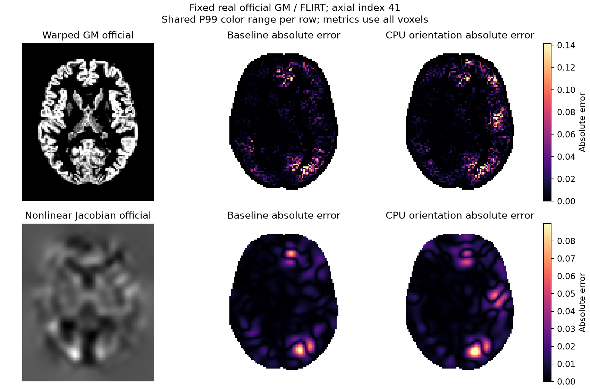

# CPU FNIRT 平滑方向候选：完整真实阶段未通过（2026-10-04）

## 结论

**候选未采纳，默认生产源码保持基点。** NEWIMAGE 对正 affine determinant 的 NIfTI 先在内部翻转 X；FNIT CPU 原方向平滑存在 FP32 累计顺序差。隔离候选补上这一步，使既有真实 `224×288×288` GM 平滑图与官方逐值相同，但本轮完整 GM-FNIRT 配对的最终官方误差扩大。完整 nonlinear estimation 仍未达到官方等价。

候选代码与测试保存在 [rejected_candidate.patch](rejected_candidate.patch)，不进入默认运行路径。CUDA 保留原分支；本地实际 RTX 3060 测试证明未调用 CPU helper。父任务在完整 CPU 退化后明确取消候选的完整 GPU 回归，故没有完整 GPU 回归或速度结论。

## 固定输入、源码与运行

- 基点 `b4a55d8ff2738d9cfd9744f9759f62dead9bc4fc`，首差诊断提交 `b27a50bf`。
- 两臂读取同一份已保存官方 FAST GM、官方 FLIRT、template 和 mask；没有重跑 FAST、FLIRT 或原始 T1 pipeline。
- 数据来自既有公共 ds003138 v1.0.1（CC0）记录。GM `224×288×288`；template `91×109×91, 2 mm`。实际 header zoom 与 affine 用于 FLIRT 转换。
- 官方参考目录：`FNIT/runs/smri_cpu_20261004/task4_vbm_official_cpu_v2/official_synthstrip_fast_fnirt`；template：`FNIT/legacy/freesurfer_synth/work/ukb_vbm_gpu/assets/template_GM_v1.nii.gz`；mask：安装 FSL 6.0.7.4 的 `MNI152_T1_2mm_brain_mask_dil.nii.gz`。
- 保留完整 `GMFNIRTConfig()`：subsampling `4,2,1,1`、miter `5,5,10,5`、input FWHM `6,4,2,2`、reference FWHM `4,2,0,0`、lambda `150,75,50,30`、10 mm warp resolution、global linear intensity、SSD weighted lambda、LM、FP64 系数/梯度/solver。前三层不启用 explicit reference mask，最后一层启用；没有改评价网格或阈值。
- nodecw7，CPU `32,36,40,44,48,52,56,60`，8 Torch/OMP/BLAS threads，同一 `nodecw7.gems.cpu8.lock`。baseline 后 candidate，各运行一次完整 FNIRT。没有连续负载采样；配对耗时为本次观测，不能作为稳定性能保证。
- baseline 使用 `gems/fnirt-jacobian-v1/source/src`；candidate 使用独立 `gems/fnirt-cpu-orientation-v1/source/src`，仅 `registration.py` 改变。旧冻结源码、旧输出和环境 prefix 保留。
- input、source、output SHA-256、实际 affinity、完整 QC 分别在 [baseline](cpu-baseline.public.json)、[candidate](cpu-candidate.public.json)；模块配对 SHA 和失败记录在 [binding](binding.public.json)。

## 完整真实阶段精度与耗时

全部指标直接比较保存的官方图。brain mask 为固定官方 mask，292,019 体素；系数在完整 `21×24×21×3` coefficient grid 比较。MAE/RMSE/max 均使用全部选定值，脑图的颜色裁剪不改变指标。[完整比较](cpu_comparison.public.json) 另保存全网格指标、相关、所有五类图逐值差异、header/affine 一致性以及 QC 差异。

| 输出 | baseline MAE / RMSE / max | candidate MAE / RMSE / max |
| --- | --- | --- |
| coefficients，mm，全 coefficient grid | `0.033200 / 0.084011 / 2.856787` | `0.049989 / 0.127315 / 3.866099` |
| warped GM，brain | `0.005999 / 0.020061 / 0.714767` | `0.008717 / 0.031622 / 0.934404` |
| nonlinear Jacobian，brain | `0.007106 / 0.013270 / 0.279551` | `0.010107 / 0.020135 / 0.231849` |
| warped GM × nonlinear Jacobian，brain | `0.008141 / 0.025651 / 1.136188` | `0.011761 / 0.040115 / 1.606614` |
| 完整 FNIRT stage，s | `365.785756` | `422.256593` |
| topology 子函数累计，s / iterations | `326.404054 / 24` | `382.751973 / 26` |

计时覆盖 `TorchFNIRT` 调用内的影像解码、全部优化、topology、完整 pull/Jacobian 和 QC；排除 imports、初始 header load、落盘、hash、指标比较。不是 cold raw-T1 pipeline 耗时。两臂均完成且退出 0；不能把用时增加解释为平滑本身增加了 56 s，已记录 topology 工作量也改变。

### 最早已保存的分叉

两臂最粗层的前两次 PCG 均为 `5 / 24` 次，relative residual 已有末位差；第三次求解变为 `80 / 49` 次，是本轮 QC 最早的离散分叉。最粗层最终 mask `14,096 / 14,092`，cost `59.920413 / 59.931965`，该层未触发 topology。

因此本例的分叉在第一次系数网格转换和 topology 之前已经存在。各层 `attempts == accepted_iterations`，本例没有 LM 拒绝 trial。完整官方旧运行未保存逐次状态；这些结果不能证明某个 later derivative、PCG 或 topology 子函数就是完整偏差根因。共享非零系数的后续探针另行记录。

## 脑图



轴向 index 41；每一行两个候选误差图共用完整 brain mask 上的 joint P99 显示范围。指标使用全部体素。绘图所需公共 GM 二维 slice 在 [cpu_slices.npz](cpu_slices.npz)，不发布完整输入 MRI。

## 复现及完整性测试

[run_cpu_pair.sh](run_cpu_pair.sh) 保留实际运行命令；[run_stage.py](run_stage.py) 保存系数、warped GM、pull、nonlinear Jacobian、full pull Jacobian 五类 NIfTI 和完整 QC。[compare_stage.py](compare_stage.py) 比较全部图；[extract_slices.py](extract_slices.py) 提取显示切片与全 mask 色限；[plot_stage.py](plot_stage.py) 本地绘图。

```bash
# 只在独立诊断 checkout 上应用已拒绝候选；默认生产保留原路径。
git apply validation/smri_cpu/fnirt_cpu_orientation_20261004/rejected_candidate.patch
PYTHONPATH=src python -m pytest -q tests/fnirt/test_cpu_reference_smoothing.py \
  tests/fnirt/test_registration_primitives.py tests/fnirt/test_lossless_execution.py \
  tests/fnirt/test_t1w.py tests/fnirt/test_header_geometry.py tests/fnirt/test_coefficient_io.py

# 两次都使用同一组完整变量名；--output 必须为新目录。
PYTHONPATH="$FNIT_FROZEN_SOURCE/src" python run_stage.py \
  --gm "$OFFICIAL_GM" --template "$GM_TEMPLATE" --mask "$REFERENCE_MASK" \
  --affine "$OFFICIAL_FLIRT" --device cpu --output "$NEW_STAGE_OUTPUT"
python plot_stage.py --slices cpu_slices.npz --output cpu_brain.png
```

测试覆盖同世界坐标但相反存储方向、noncontiguous strides、masked zeros、输入与 mask 不变、零 FWHM、moving/template 四种实际 affine sign，以及实际 CUDA 不进入 CPU helper。44 个选定测试全部通过，9.81 s，Python 3.11.16 / Torch 2.5.1 / RTX 3060；[测试记录](tests.public.json)。候选测试只在 patch 或诊断目录保存，不进入默认测试集合。

对应官方完整命令使用同一保存输入和 recipe：

```bash
# 本轮复用已经保存的官方图，没有重复该命令。
fnirt --in="$OFFICIAL_GM" --ref="$GM_TEMPLATE" --aff="$OFFICIAL_FLIRT" \
  --refmask="$REFERENCE_MASK" --config=GM_2_MNI152GM_2mm.cnf \
  --cout="$OFFICIAL_COEFFICIENTS" --iout="$OFFICIAL_WARPED_GM" --jout="$OFFICIAL_JACOBIAN"
```

## 失败与历史

2026-10-04：[首差诊断](../fnirt_first_diff_20261004/README.md) 证明平滑方向和共享系数 regrid 的实际差；本次补上完整候选配对，结果退化，候选被拒绝。远端绘图环境没有 Matplotlib，fit 和指标不受影响；改用既有本地环境绘图，没有安装依赖或改变服务器环境。预备 GPU runner 留存，未执行；CPU 退化后不再为未采纳候选运行完整 GPU stage。

## 原实现和参考

[FNIRT](https://git.fmrib.ox.ac.uk/fsl/fnirt)、[NEWIMAGE](https://git.fmrib.ox.ac.uk/fsl/newimage)、[basisfield](https://git.fmrib.ox.ac.uk/fsl/basisfield)。原软件只用于既有隔离官方 benchmark，FNIT 生产不调用原程序。参考：Andersson、Jenkinson、Smith，*Non-linear registration, aka spatial normalisation*，FMRIB TR07JA2（2007）。
