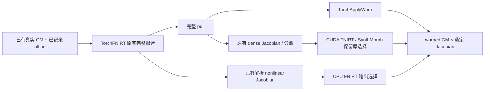
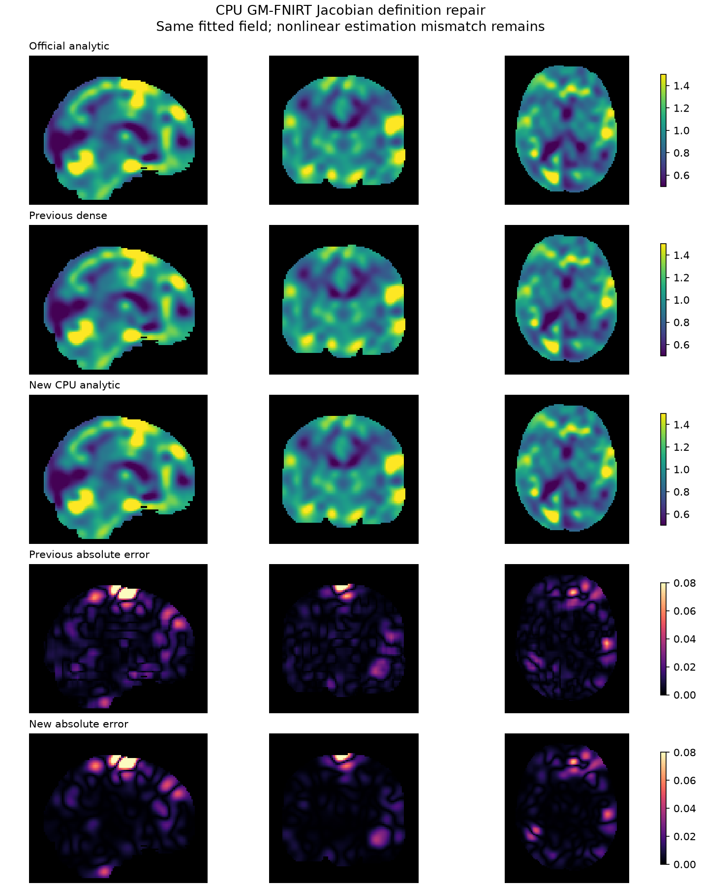

# CPU FastVBM FNIRT：采用已有解析 nonlinear Jacobian

## 1. 修复内容与流程

成熟 `TorchFNIRT` 已计算最终 B-spline coefficients 的解析 `nonlinear_jacobian`，但 FastVBM 公共后处理将它替换为 sampled dense field 的有限差分。这与官方 `fnirt --jout` 定义不同。

本次最小修复只在 **CPU 且后端为本包 TorchFNIRT** 时采用已有解析图。公开参数、13幅输出结构和文件名保持原接口；有限差分与解析图的诊断比较继续保留。CUDA FNIRT、SynthMorph 和 custom backend 延续原有限差分路径。没有改动 FNIRT solver、系数、pull、精度策略或 dMRI 代码，没有新增依赖。



实际改动为 `src/fnit/fast_vbm/registration.py` 的输出选择；对应单元测试区分 CPU FNIRT 与 SynthMorph 的 Jacobian 语义。

## 2. Python、输入输出和参数

完整公开接口、每项参数及13个文件说明见[FastVBM 功能页](../../../docs/fast_vbm/README.md)。没有增加开关或要求用户提供 coefficients。例：

```python
from fnit import FastVBM

pipeline = FastVBM(
    device="cpu",                 # CPU：本次 FNIRT Jacobian 修复覆盖路径
    threads=8,                    # CPU 线程预算
    registration_backend="fnirt", # 使用已有 TorchFNIRT GM 配置
    fast_execution="fsl",         # FNIT 内部 CPU 原序 FAST，不调用原软件
    synthstrip_weights="/models/synthstrip.1.pt",  # 脑提取权重
)
result = pipeline.run(
    image="/data/T1w.nii.gz",       # 输入：完整3D原始T1w
    template="/data/template_GM.nii.gz", # 输入：GM模板及输出网格
    reference_mask="/data/template_mask.nii.gz", # 输入：同模板网格的显式mask
    output_dir="/results/new_cpu_vbm", # 输出：新的13图目录
    overwrite=False,              # 拒绝覆盖已有输出
)
# result.jacobian：模板网格float32，nonlinear-only，不含FLIRT affine determinant
# result.modulated_gm：相同网格，warped_gm逐体素乘以上述Jacobian
```

`device="cuda:0"` 的 FNIRT Jacobian 定义保持既有 dense 路径，不能将 CPU 解析门结果扩大为 CUDA 解析门。SynthMorph 的公开定义不变。

## 3. 命令行

CLI 结构不变；下面是公开入口的使用示例，本轮没有重新运行它：

```bash
FNIT_T1_IMAGE=/data/T1w.nii.gz
FNIT_GM_TEMPLATE=/data/template_GM.nii.gz
FNIT_REFERENCE_MASK=/data/template_mask.nii.gz
FNIT_SYNTHSTRIP_WEIGHTS=/models/synthstrip.1.pt
FNIT_OUTPUT_DIRECTORY=/results/new_cpu_vbm
python -m fnit.cli fast-vbm -i "$FNIT_T1_IMAGE" \
  --template "$FNIT_GM_TEMPLATE" --reference-mask "$FNIT_REFERENCE_MASK" \
  --synthstrip-weights "$FNIT_SYNTHSTRIP_WEIGHTS" \
  --device cpu --threads 8 --registration-backend fnirt \
  --fast-execution fsl -o "$FNIT_OUTPUT_DIRECTORY"
```

本轮受影响 stage 脚本为 [capture_stage.py](capture_stage.py) 与 [compare_tail.py](compare_tail.py)：前者只从已有 GM、模板、mask、记录 affine 拟合一次 FNIRT；后者在旧/新 `_register_gm` 中重放已捕获的完整状态，不运行 FAST、FLIRT 或 FNIRT 第二次。

## 4. 原软件定义和同系数验证

独立官方参考来自 FSL 6.0.7.4 的已完成命令，参数一致性另见[只读诊断](../gems_fixes_20261004/FNIRT_READONLY.md)：

```bash
fnirt --in=existing_GM.nii.gz --ref=template_GM.nii.gz \
  --aff=existing_gm_affine.mat --config=GM_2_MNI152GM_2mm \
  --refmask=template_mask.nii.gz --cout=gm_coeff.nii.gz \
  --jout=nonlinear_jacobian.nii.gz
```

该命令只用于隔离原软件 benchmark；FNIT 生产代码及本次新探针没有调用原软件。
直接读取已存 intent-2007 coefficients 的实际 field shape、voxel sizes、knot spacing 和 embedded affine，再调用 **已有** `_spline_jacobian`，没有拟合或调参。

| 同一官方 coefficients 的解析门 | 模板脑内 | 全网格 |
|---|---:|---:|
| 体素数 | 257,125 | 902,629 |
| RMSE 对原 `jout` | **7.37350e-8** | **6.84176e-8** |
| 最大绝对误差 | **4.76837e-7** | **4.76837e-7** |

field shape `91×109×91`，header voxel sizes `2,2,2 mm`，knot spacing `5,5,5 voxel`；解析式为 `det(I + ∂residual/∂reference_scaled_mm)`，不把 embedded affine determinant 乘入。原系数 SHA `be0fd7fb455737c19cbf2b0d6231520185c54cc72feeec075e699a2e4c7f5867`，原 `jout` SHA `4d597612a1162a80fce39b031ad24dda3c2758ba2e490637d32037d00b4624a3`。完整数值与 affine 在 [oracle.public.json](oracle.public.json)。

## 5. 真实受影响 stage、GPU 回归与脑图

### 输入与源码

复用 OpenNeuro ds003138 v1.0.1 CC0 公开 T1 衍生的既有 GM，原空间 `224×288×288`；GM 模板 `91×109×91`。
本轮没有生产读取官方 labels/结果。官方系数只用于上一节隔离定义探针。
GM、模板、mask、prior affine report 及完整捕获输出的 SHA 在 [capture.public.json](capture.public.json)；源码和脚本 SHA 在 [source.public.json](source.public.json)。模板/权重复用既有许可资源，未随代码再分发。

实际拟合使用冻结 `task5_candidate_cpu_v4`，head `6f1e2b38925a481df3fa622f925af076df5436a9`、归档 SHA `ffda47a74376fbaec07c3e8aedaacdc30f2a60398b919c0d5feae38e3beba0d9`。
候选为该冻结源码仅替换 FastVBM registration 文件；FNIRT registration/spline/topology/optimizer/io、ApplyWarp、变换和 NIfTI 模块 SHA 完全相同。

CPU nodecw7，8核 `32,36,40,44,48,52,56,60`，共同锁 `nodecw7.gems.cpu8.lock`。仅拟合一次并完整保存 coefficients、pull、解析图、full-pull Jacobian、estimator warped image 和 solver QC；旧/新后处理用同一捕获状态。
这次 stage 从已保存 report 重建初始 world affine，旧 tail 的数值不被标作历史 v4 完整链的重新逐位复现。

### CPU 同状态旧/新

沿用原 brain mask 与正 GM 模板交集257,125体素，没有改变评价网格或阈值。

| 对独立官方的脑内指标 | 旧 dense | 新解析 |
|---|---:|---:|
| warped GM RMSE / 最大误差 | 0.0189829 / 0.716070 | **逐位相同** |
| nonlinear Jacobian RMSE | 0.0140407 | **0.0125940** |
| nonlinear Jacobian NRMSE | 0.0100725 | **0.00903468** |
| nonlinear Jacobian 最大误差 | 0.285301 | **0.273976** |
| modulated GM RMSE | 0.0243624 | **0.0241273** |
| modulated GM NRMSE | 0.0160429 | **0.0158880** |
| modulated GM 最大误差 | 1.147692 | **1.149588，略增** |

全网格 Jacobian RMSE `0.00835457→0.00760647`；modulated GM `0.0130314→0.0129061`。
warped GM 位模式相同；三图 header、affine 完全相同；新 CPU Jacobian 与捕获解析图逐值完全相同。旧 tail 三图也与捕获的旧后处理输出完全相同。
全部 estimator/solver QC 原值保留；公共 QC 仅 `jacobian_method/min/max` 三项变化。完整不同元素数、P99、MAE、全网格/脑内误差见 [cpu.public.json](cpu.public.json)。

这是解析定义修复。nonlinear 形变估计仍有误差，调制 GM 的局部最大误差还有退步，没有达到完整 VBM 官方数值等价。

### GPU 既有后处理保持

同一真实完整 GM 与 CPU 拟合的完整 pull，仅重放受影响的旧/新 GPU 后处理；**没有再次运行 GPU estimator 或完整 pipeline**。
H100 PCIe GPU0，UUID `GPU-26e41f63-1a65-6b3e-5370-fa9a2934ca8e`，共同锁 `gpucw1.gpu.lock`，PyTorch allocator 预算 `20e9 B`，TF32保持既有策略，无 float16。

三图全部数组、header、affine和**所有 QC 逐值相同**。两臂所在同一进程的合计峰值 allocated/reserved 为 **256,508,928 / 457,179,136 B**；这是 allocator 记录，不是驱动占用或分臂峰值。
没有 CPU↔GPU 等价或稳定速度结论；[完整 GPU 报告](gpu.public.json)保留实际跨设备与官方差异。

### 真实脑图与执行记录



三正交中心切片、相同色限；显示用显式 dilated mask，数值评价另用上述mask与正模板交集。色限仅用于显示，所有最大误差保留在 JSON；图中误差显示形变估计差异仍存在。[图 SHA 与显示规则](jacobian_cpu.public.json)。

本地受影响 API/CLI、common chain、header、coefficient IO 共 **33 passed / 10.31s**。
首次远端等待辅助程序达到180秒上限，已验证原 worker 继续运行并保存完整状态，没有重复启动；该 worker 的独立 exit code 未捕获。此 transport 事件保留在 [run_status.public.json](run_status.public.json)。不把 stage、重放或辅助等待当作 cold pipeline benchmark，未宣称提速。

服务器实际冻结源码/脚本：`FNIT/workspaces/smri_cpu_20261004/remaining_20261004/gems/fnirt-jacobian-v1`；产物为同名 `runs/.../gems/fnirt-jacobian-v1/{stage-capture,tail-cpu,tail-gpu}`。旧实体不改动。

## 6. 版本与剩余工作

- 本轮：CPU FNIRT 输出选择修复，同官方系数解析门及一次固定真实 GM stage 通过；GPU后处理全图/QC保持原值；未运行完整新 raw-T1 pipeline。
- 此前：FastVBM v4 两条完整 CPU链13图及原软件比较，见[原报告](../../smri_cpu_20261004/task04/fast_vbm_cpu_20261004/final_v4/README.md)。其时间和误差保留原冻结范围。
- 后续：固定输入/affine，对齐初始归一化、平滑、mask和首次 coefficient/PCG 更新，再定位 topology；本次没有修改这些算法。

## 7. 原实现与参考文献

- [FSL FNIRT 源码](https://git.fmrib.ox.ac.uk/fsl/fnirt)、[basisfield](https://git.fmrib.ox.ac.uk/fsl/basisfield)：cubic coefficient导数和Jacobian定义。
- [FNIT FNIRT 文档](../../../docs/fnirt/README.md)：preset、系数 header 合同与当前数值边界。
- Ashburner & Friston (2000), *Voxel-Based Morphometry—The Methods*, [doi:10.1006/nimg.2000.0582](https://doi.org/10.1006/nimg.2000.0582)。
- Smith et al. (2004), *Advances in functional and structural MR image analysis and implementation as FSL*, [doi:10.1016/j.neuroimage.2004.07.051](https://doi.org/10.1016/j.neuroimage.2004.07.051)。
