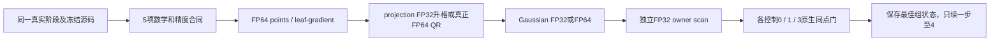
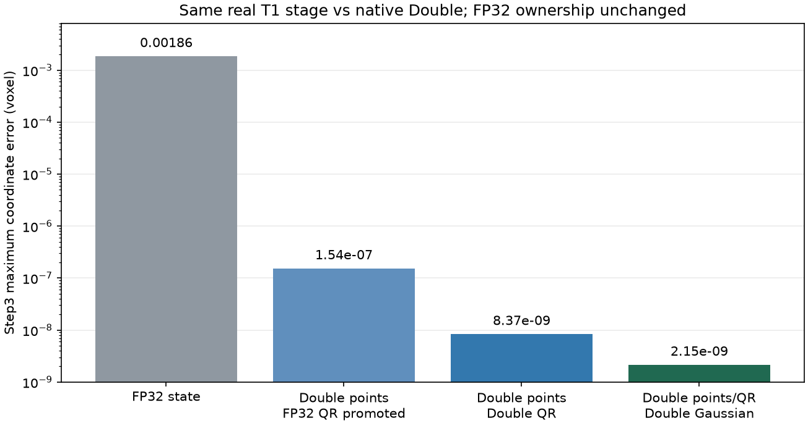

# GEMS CPU：Double 内部状态控制与第4步验证

## 1. 功能与边界

在[raw prior 同点门](../gems_cpu_objective_20261005/README.md)通过后，保持同一真实右侧海马／杏仁核 synthetic stage1，分别控制 CPU points／leaf-gradient、投影矩阵计算和 Gaussian likelihood 的内部精度。三个 bounded3 控制及最佳控制继续的一步全部通过同点 cost／gradient／prior／coverage 门。**GPU 没有改动；本目录仍是独立验证，不是当前生产 `TorchGEMS`。**

FP64 point／gradient 和真正 FP64 QR 将 step3 对官方实际 Double 坐标的最大误差从 `0.0018594` 降到 `8.37e-9` voxel；再使用 FP64 Gaussian 后为 `2.15e-9`。第4步实际 alpha 回到官方保存轨迹推断的 `0.0078125`，原 FP32 的 `0.0625` 分叉消失。第4步最大点差仍为 `1.73e-6` voxel；这不是逐位一致或完整核团 Dice／体积验收。



## 2. Python 调用、输入与输出

以下调用仅用于固定 checkpoint 验证；用户实际分割接口仍见[子核团功能页](../../../docs/subregions/README.md)。

```python
import os
import sys
from pathlib import Path
import json
import numpy as np

# 必须与 capture 的23个 GEMS source SHA完全相同，不使用当前 main替代。
frozen_source_directory = Path("/private/frozen-source/src")
sys.path.insert(0, str(frozen_source_directory))
os.environ["FNIT_GEMS_FROZEN_ADAPTER"] = "../gems_first_trial_20261005/run_real.py"
os.environ["FNIT_GEMS_RAW_ADAPTER"] = "../gems_cpu_objective_20261005/raw_prior_cpu_adapter.py"
os.environ["FNIT_GEMS_F64_PROJECTION"] = "1"  # 实际用FP64计算QR投影。
os.environ["FNIT_GEMS_F64_GAUSSIAN"] = "1"    # 固定Gaussian参数升格后计算FP64 likelihood。

from raw_prior_f64_cpu_adapter import SharedClosure

capture_directory = Path("/private/capture-hippo-amygdala-right")
capture_report = json.loads((capture_directory / "report.public.json").read_text())
with np.load(capture_directory / "shared_input.npz", allow_pickle=False) as capture_file:
    captured_arrays = {name: capture_file[name].copy() for name in capture_file.files}
double_cpu_closure = SharedClosure(captured_arrays, capture_report["background_class"])
initial_cost, initial_gradient = double_cpu_closure(double_cpu_closure.start)
# points和gradient都是CPU FP64；owner明确使用原FP32几何和扫描。
# 上例展示闭包接口，实际runner另执行完整source/input SHA与原生门。
```

输入仍为 FP32 原始工作网格影像、固定 vertices／reference／Gaussian 参数／已平滑 alphas、int64 有序 tet、移动标志和 boundary transform，详见[逐项格式](../gems_cpu_objective_20261005/README.md)。新控制仅改变 CPU 内部表示／运算：point storage／leaf-gradient／solver history 为 FP64；image／alpha 捕获值不变；owner geometry 和 compact scan 保留 FP32；reference／interpolation／raw prior mass 和 epsilon 沿用前一份冻结闭包。两个环境变量只允许 `0` 或 `1`，默认均为 `0`；projection0 是旧 FP32 QR 矩阵升格，projection1 才是实际 FP64 QR。

输出 actual0700 新目录内的 scalar JSON、私密 accepted／trial points、gradients／priors／coverage 与 optimizer／closure checkpoint。新 [汇总](f64_controls_and_step4_summary.public.json)只保存原 scalar 的精度策略、误差和 SHA；不发布影像／atlas／gradient 数组。续跑先检查 saved state、source、重新生成 cache、以及 accepted3 cost／gradient 逐值相等。

## 3. 命令行与参数

```bash
# 选定CPU Double控制：没有修改任何GPU选项。
export FNIT_GEMS_RAW_ADAPTER=../gems_cpu_objective_20261005/raw_prior_cpu_adapter.py
export FNIT_GEMS_F64_PROJECTION=1 FNIT_GEMS_F64_GAUSSIAN=1
PYTHONPATH=/private/frozen-source/src python run_raw_f64_limited.py \
  --capture /private/capture-hippo-amygdala-right \
  --base-adapter ../gems_first_trial_20261005/run_real.py \
  --raw-adapter raw_prior_f64_cpu_adapter.py \
  --candidate ../gems_cpu_objective_20261005/optimizer_candidate_v2.py \
  --normalized-baseline /private/completed-original-armijo36 \
  --output /private/new-double3 --steps 3

# 最佳组只续一次更新，不能用此runner启动37步或完整recipe。
PYTHONPATH=/private/frozen-source/src python run_f64_continue4.py \
  --capture /private/capture-hippo-amygdala-right \
  --base-adapter ../gems_first_trial_20261005/run_real.py \
  --raw-adapter raw_prior_f64_cpu_adapter.py \
  --candidate ../gems_cpu_objective_20261005/optimizer_candidate_v2.py \
  --normalized-baseline /private/completed-original-armijo36 \
  --resume /private/new-double3 \
  --resume-helper ../gems_cpu_objective_20261005/resume_raw_cache.py \
  --output /private/new-double4 --steps 4
```

`--capture` 为固定真实状态；`--base-adapter`、`--raw-adapter`、`--candidate` 为实际固定源码；`--normalized-baseline` 只复用旧 source／五项初态证明，不把旧 normalized gradient 当新 Double 目标。`--output` 拒绝覆盖。bounded3 的 `--steps` 默认为3、仅允许最多3步、禁止resume；continue4强制 `--resume` 与 `--steps 4`，仅新增1步。`--resume-helper` 是前次状态／cache 重建器；旧 cache 对象地址不要求相同，同点 resume cost／gradient 必须逐值通过。

`check_raw_f64_contracts.py --adapter ... --output ...` 用于5项有意义的梯度／精度合同；其小单元数据不是MRI benchmark。`summarize_f64_controls.py` 的 `--scalar-root` 为三控制原 scalar 目录、`--output` 为新汇总；可选 `--step4-root` 与 `--saved-direction-audit` 联合读取第4步及此前推断alpha的SHA来源。原生 scorer复用前两份报告脚本，不更新nativeoptimizer。

## 4. 原软件与实测

本步骤没有独立原软件 CLI。官方参考为安装版 samseg GEMS calculator；实际 optimizer37步文件完全复用。本版没有EM／新nativeoptimizer调用。扩展SHA `8125a39c…`、recipe `beb64fa1…`、固定source commit `2ce2b6be…` 及具体方程见[前一报告](../gems_cpu_objective_20261005/README.md)。CPU-only新适配器SHA `5246ee69…`，原冻结core `7f7c5eaa…`／raster `f665e255…`，不同于当前生产core `0ded484d…`／raster `f99d6c45…`。

5项合同全部通过：三组 raw-zero-alpha gradient 与中央有限差分／checkpoint 恢复；8种 mobility 的 FP64 QR 与原 Gram projector 公式一致；FP32输入拒绝。只有这些通过后才运行真实三个控制。保持预先 cost≤0.01、gradient relative L2≤1e-5、prior最大差≤1e-6和coverage exact门，全部9个真实点通过。

| 内部CPU策略；owner均FP32 | step3 同点 gradient rel L2 | step3 native−CPU cost | step3 对官方Double点最大差，voxel | 3步观察秒 |
| --- | ---: | ---: | ---: | ---: |
| FP32 point／projection／Gaussian，前一版 | `2.8243e-8` | 0.00215293 | 0.00185940 | 10.0069 |
| FP64 point／gradient，FP32 projection升格，Gaussian32 | `5.4957e-10` | 0.00215293 | `1.5353e-7` | 8.3883 |
| 再用真正FP64 projection，Gaussian32 | `3.7116e-11` | 0.00215293 | `8.3657e-9` | 7.9640 |
| 再用FP64 Gaussian | `1.3672e-11` | 0.000554668 | `2.1458e-9` | 8.1405 |

各组coverage差0，priors最大绝对差≤`2e-15`。时钟有顺序／缓存差异，没有ABBA，不能由上表宣称完整提速。第三组仍有约0.00055同点cost残差，记录在原门内，不叫逐位Double一致。

### 仅新增第4步

接受点3的resume cost／gradient逐值通过；实际source及Gaussian／projection环境策略不变，只新增1次更新。private alpha实际 `0.0078125`，官方已存方向审计推断 `0.007812499999999055`，二者一致到浮点尾差。当前第4步最大Double点差 `1.7288e-6`、RMSE `2.3197e-8`、P99 `3.95e-8` voxel；同点g relative L2 `1.3946e-9`、cost差 `0.000554689`、prior max差 `1.776e-15`、coverage 0差，四门通过。双方Jacobian均无非正／非有限tet，minimum分别 `0.03819766 / 0.03819495`。

新增一步含8个trial，观察 `27.9173 s`；恢复评分／本段冷JIT `7.5731 s` 单列。前三步 `8.1405 s`与续段不能当作单次fresh end-to-end时间；导入、状态重建、暂停和原生scorer另外记录。没有完整新分割，因此没有新Dice／体积／脑图；旧图不能改标为本版。下图只展示真实固定状态的坐标差。



## 5. 历史字段更正

保持全部已冻结 producer／scorer 和原JSON不变；新汇总明示以下四项更正：

- `raw_actual_FP32_deformation` 是旧scorer字段名，本版取实际Double point位移；新汇总名为 `CPU_actual_coordinate_deformation` 并记录 actual dtype。
- `native_points_rounded_to_FP32_exact` 将Double candidate与刻意舍入的native32比较，False不能判定Double轨迹失败；新汇总直接报告Double坐标误差。
- `same_image_alphas_reference_canmove_epsilon_projection_source` 只表示捕获输入／函数source共用；projection64重新计算QR，不能解释为投影矩阵逐值不变。
- `raw_initial.intentional_change` 旧文字只写raw mass；本控制另改变point／leaf-gradient／projection／Gaussian，实物以 `actual_CPU_precision_policy` 与 static_signature 为准。

这次没有发现新数值计算bug；上述是重复使用旧诊断schema的标签局限，原数据及SHA完整保留。

## 6. 更新与剩余工作

2026-10-06：三组bounded3和仅续一步4通过；CPU Double内部状态显著减小最早轨迹误差，实际第4步alpha分叉消失。GPU和生产源码不变。本结果允许下一次同源、同状态的有限续段核验，不能升级为完整recipe／速度验收。

下一阶段应从saved Double accepted4最多再续33次到37，先恢复cost／gradient／history／cache门，复用旧native37做同点、真实Double轨迹、alpha与Jacobian比较。若这些通过，再创建独立生产CPU候选接入必要math与optimizer，并做受影响完整recipe和所有核团验收。每区Dice≥0.95、硬体积差≤5%、同线程完整CPU速度目标、公共接口与GPU回归都仍未完成。

## 7. 原代码与参考文献

- [固定samseg原实现](https://github.com/freesurfer/samseg/tree/2ce2b6be69f2954ea704e593a5be79c284a3a8c3/gems)。
- [原L-BFGS](https://github.com/freesurfer/samseg/blob/2ce2b6be69f2954ea704e593a5be79c284a3a8c3/gems/kvlAtlasMeshDeformationLBFGSOptimizer.cxx)、[原投影／prior](https://github.com/freesurfer/samseg/blob/2ce2b6be69f2954ea704e593a5be79c284a3a8c3/gems/kvlAtlasMeshPositionCostAndGradientCalculator.cxx)。
- [Iglesias et al., 2015, hippocampal substructure segmentation](https://doi.org/10.1016/j.neuroimage.2015.04.042)。其余核团参考见[功能说明](../../../docs/subregions/README.md)。
