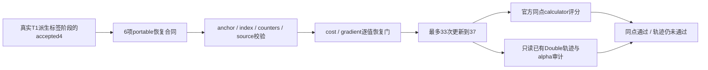
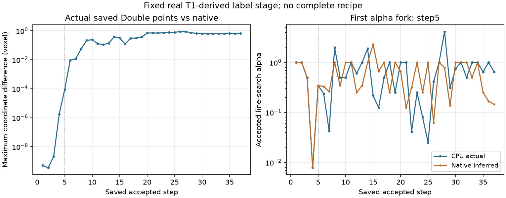

# GEMS CPU：保存 Double 状态的有限续段

## 1. 功能与结果

从[前三步与第4步控制](../gems_cpu_double_20261006/README.md)的保存状态再更新33次，累计至37次。CPU points／gradient／QR／Gaussian／history保持Double，owner扫描仍为FP32；生产 `TorchGEMS` 和GPU代码没有改动。第37个候选点与官方在**相同坐标**的cost、gradient、raw prior和coverage全部通过预定门，但与官方各自第37个接受点的最大坐标差为 **0.65977 voxel**。因此本候选尚未完成轨迹或完整核团分割验收。

这里的 `synthetic stage1` 是核团recipe的**标签配准阶段**：本例读取同一个真实公开T1配套的 `norm`、`aseg`、`wmparc`；`coarse_segmentation` 经recipe标签合并形成工作影像，再重采样、裁剪和掩膜，并使用固定Gaussian参数。它不是模拟MRI benchmark，也不是本轮新完成的原始T1完整重建。捕获的影像为 `101×117×118`，有效体素44,255，网格20,100个vertex／122,333个tet／11类；影像及分割数组保留在私密目录。



本闭包还依赖前次冻结实现的CPU mixture `+1e-15`、Double reference／interpolation、raw atlas mass和私有原定义L-BFGS。这些前提不同于当前生产源码；结果不能用来宣布生产代码仅删除一行normalization便已验收。

## 2. Python、输入与输出

这是固定checkpoint验证工具；公开分割API继续见[子核团功能页](../../../docs/subregions/README.md)。

```python
from pathlib import Path
import json
from resume_f64_portable import reconstruct, fingerprint

# cpu_double_closure来自前一报告的SharedClosure，已设置Double QR与Gaussian。
# frozen_raster_module必须与capture source SHA相同。
resume_directory = Path("/private/saved-double4")
resume_report = json.loads((resume_directory / "summary.public.json").read_text())
resume_provenance = reconstruct(
    cpu_double_closure, frozen_raster_module, resume_directory, resume_report
)
restored_closure_fingerprint = fingerprint(cpu_double_closure)
# runner接着核对saved optimizer history，并重算accepted4的cost/gradient；
# 必须逐值一致，才允许新增更新。不能从这段示例直接宣布恢复验收。
```

输入逐项如下：

- 原capture：FP32工作影像／reference／alphas，int64有序tet，移动标志、boundary transform、固定Gaussian参数与stiffness；其6个文件和23个源码SHA沿用前报告。
- saved accepted4：CPU Double point／gradient及已有4步scalar记录，原summary和accepted文件SHA固定。
- `optimizer_state.private.npz`：current point／gradient／cost／alpha，old gradient／direction／alpha，最新优先的`history_s/y/sy`，iteration／evaluation／finished状态。内部向量均Double；真实恢复门另检查历史长度和实际dtype。
- `closure_state.private.npz`：anchor、packed candidate IDs和offsets、evaluation／rebuild counters。形状、dtype、大小、候选范围和各数组SHA必须一致；static input／precision和last scalar从保存的fingerprint核对。

输出为私密新目录中的trial／accepted／optimizer／closure数组和scalar报告。公开[更正汇总](f64_continuation_corrected.public.json)只包含数值、dtype、来源SHA和恢复证明，不包含影像、atlas、梯度或cache数组。动态Python plans没有序列化为对象；由完全相同的候选列表重新生成，随后同accepted4 cost／gradient逐值检查。进程地址和cache对象身份不是数值恢复门。

## 3. 命令行与每个参数

```bash
export FNIT_GEMS_RAW_ADAPTER=../gems_cpu_objective_20261005/raw_prior_cpu_adapter.py
export FNIT_GEMS_F64_PROJECTION=1 FNIT_GEMS_F64_GAUSSIAN=1
PYTHONPATH=/private/frozen-source/src python run_f64_continue37.py \
  --capture /private/capture-hippo-amygdala-right \
  --base-adapter ../gems_first_trial_20261005/run_real.py \
  --raw-adapter ../gems_cpu_double_20261006/raw_prior_f64_cpu_adapter.py \
  --candidate ../gems_cpu_objective_20261005/optimizer_candidate_v2.py \
  --normalized-baseline /private/completed-original-armijo36 \
  --resume /private/saved-double4 \
  --resume-helper resume_f64_portable.py \
  --output /private/new-double37 --steps 37
```

`--capture`是绑定的真实阶段；`--base-adapter`、`--raw-adapter`、`--candidate`分别为冻结闭包、Double控制和私有优化器；`--normalized-baseline`只复用之前的source／初态证明，旧normalized gradient不是本次目标。`--resume`强制已完成4步，`--steps`强制37，即最多新增33步；`--resume-helper`是portable恢复器。`--output`必须不存在，实际目录权限0700；遇恢复失败即停止。两个precision环境变量必须均为1；GPU没有新增开关。

`check_portable_resume_contracts.py --helper ... --output ...`只测序列化合同，其单元数组不作为MRI benchmark。`run_f64_continue37.sh`固定8个physical core、共用CPU锁和900秒上限，然后复用既有native37做单点评分，**不执行native optimizer**。

两个只读审计器接受 `--prefix3`、`--prefix4`、`--continuation`、`--native`、`--alpha_audit`、`--output`；方向审计另需 `--native_initial`。下划线是这两个冻结parser的实际参数名。它们仅读取已有文件，不调用cost／gradient计算器或优化器。`summarize_f64_continuation.py`通过 `--scalars`、`--prefix3`、`--prefix4`、`--path-audit`、`--direction-audit`、`--output`生成更正汇总。

## 4. 原软件与真实结果

官方参考是安装版samseg GEMS的 `KvlCostAndGradientCalculator.evaluate_mesh_position`，本步骤没有独立官方CLI。官方37步trajectory、Double gradient、原生.so和recipe options均复用，不重跑优化器。原生扩展SHA `8125a39c…`，固定samseg source commit `2ce2b6be…`；Double闭包SHA `5246ee69…`，优化器 `d6ab8eee…`，冻结core `7f7c5eaa…`／raster `f665e255…`。恢复器 `2a020465…`、续段runner `cb5b7b35…` 与完整23-source绑定均列于汇总。

### 恢复与第37步同点门

6项serialization合同全部通过：portable arrays／counters／last／static恢复；拒绝改动的checkpoint、array binding、precision、counter和static signature。真实saved accepted4的cost／gradient逐值相等，anchor／candidate index／counters／last／static SHA一致，L-BFGS history及old state从绑定文件恢复。

| 相同第37候选坐标 | 实测 | 固定验收门 |
| --- | ---: | ---: |
| native−CPU cost | 0.000555420 | 绝对差≤0.01 |
| projected full gradient relative L2 | `5.9167e-11` | ≤`1e-5` |
| raw prior最大绝对差 | `1.4433e-15` | ≤`1e-6` |
| coverage不同体素 | 0 | 必须0 |

四门全部通过。这个点没有新dump／逐项比较owner cell IDs；coverage与prior相等不能单独证明每个边界owner ID相同。约0.000555的同点cost残差与下一表的不同点cost差分别记录，不能混合。

### 各自接受点与未通过结果

| 各自第37个接受点 | CPU Double候选／差异 | 官方已存轨迹 |
| --- | ---: | ---: |
| 最大Double坐标差，voxel | 0.65977256 | 参考 |
| 坐标RMSE／P99绝对差 | 0.00926356／0.00852552 | 参考 |
| CPU cost高于官方 | 35.4879933 | 33,925.6526339 |
| 实际／返回最大变形，voxel | 0.05723411 | 0.03203514 |
| Jacobian最小值 | 0.03200003 | 0.03399155 |
| 非正／非有限tet | 0／0 | 0／0 |
| Jacobian<0.1的tet | 10 | 4 |

前一FP32 raw37的最大点差0.50804、RMSE0.008893和cost差+242.54。Double控制解决最早的FP32状态分叉并减小最终cost差，但本次最大点差／RMSE没有通过轨迹验收；不把它概括为全面改善。37个接受步骤共15次bracket／22次zoom，0次budget exhausted、0次算法收敛；第37步只是诊断上限，双方都未宣称最终收敛。本版没有新的完整分割、核团Dice／体积或脑图。

### 只读定位：第5步alpha分叉

[逐步方向报告](f64_saved_directions.public.json)使用保存的实际point增量除以实际alpha；native alpha沿用已验证的source方向和返回max-deformation推断，原增量残差最大 `1.85e-13`。没有原生内部alpha／history trace，不将推断写成直接捕获。

| 已存状态 | 对官方Double点最大差 | different-point gradient rel L2 | 下一方向／alpha变化 |
| --- | ---: | ---: | --- |
| accepted3 | `2.1458e-9` | `2.3100e-6` | step4 direction rel `2.0383e-5` |
| accepted4 | `1.7288e-6` | 0.00213133 | step5 direction rel 0.0175403 |
| accepted5 | `8.8194e-5` | 0.00939832 | step6 alpha差0.0925138 |

第4步alpha仍为0.0078125。首次alpha差>1e-8发生于第5步：CPU实际0.3434410537，native推断0.3454167613；同一轮H0分别为`6.457844e-7 / 6.478414e-7`。小坐标差之后的局部gradient／y差异进入L-BFGS历史，随后方向和线搜索逐渐分开。**这些gradient差是在不同几何点，不是相同点公式门失败。** 是否由极小prior mass、边界ownership或浮点归约的敏感性触发，仍需在明确的fork点做受限验证，当前没有把任一项确认为唯一原因。



## 5. 时钟与历史字段

前三步观察8.1405秒，仅新增第4步27.9173秒，本次33次续段99.1892秒；各段时钟相加约135.2470秒。accepted4恢复评分／冷cache另为2.3332秒，accepted3恢复／冷JIT为7.5731秒；导入、暂停、读取和native scorer也未合成fresh流程时间。这不是一次连续端到端benchmark，没有ABBA，不用于发布完整CPU提速结论。

前一报告的4个metadata errata继续适用：scorer旧字段 `raw_actual_FP32_deformation` 实际取Double point位移；`native_points_rounded_to_FP32_exact=False`只表示刻意舍入比较；旧same-projection-source标记不是矩阵逐值相同；raw initial文字也未列Double point／gradient／QR／Gaussian控制。原JSON不覆写，更正汇总明确actual dtype和字段意义。

第一次只读path审计的launcher误用 `--alpha-audit`，parser以exit2退出，没有数值计算。保留[setup failure](setup_failure.public.json)；改用冻结parser的 `--alpha_audit` 在新目录完成，不计为科学门失败，也没有重跑MRI或前37步。

## 6. 更新与剩余工作

2026-10-06：完成accepted4恢复、最多33次续段、第37同点评分与只读source-bound轨迹／方向定位；same-point通过，轨迹尚未通过。生产源码与GPU完全未改。

下一步只制定生产CPU最小移植方案：明确本冻结闭包与当前main的差异，接入已证实的raw mixture／epsilon和CPU Double state／projection／Gaussian／必要L-BFGS，并保持GPU分支。随后先检查新生产候选的固定真实状态与恢复门，再安排一侧右HA完整recipe验收。内部37步轨迹未逐点一致，不能据此断言最终ROI也失败；最终功能门仍为每区Dice≥0.95、硬体积差≤5%。同线程CPU速度、其他核团、全部公共功能与GPU回归仍待验收。[最小CPU接入计划](CPU_INTEGRATION_PLAN.md)列出了实际main差异与单侧RHA门；它尚未实施。本报告未修改生产或启动完整recipe。

## 7. 原代码与参考文献

- [固定samseg源码](https://github.com/freesurfer/samseg/tree/2ce2b6be69f2954ea704e593a5be79c284a3a8c3/gems)。
- [L-BFGS／line search](https://github.com/freesurfer/samseg/blob/2ce2b6be69f2954ea704e593a5be79c284a3a8c3/gems/kvlAtlasMeshDeformationLBFGSOptimizer.cxx)、[GEMS data cost](https://github.com/freesurfer/samseg/blob/2ce2b6be69f2954ea704e593a5be79c284a3a8c3/gems/kvlAtlasMeshToIntensityImageCostAndGradientCalculator.cxx)。
- [Iglesias et al., 2015](https://doi.org/10.1016/j.neuroimage.2015.04.042)。完整核团参考见[子核团文档](../../../docs/subregions/README.md)。
