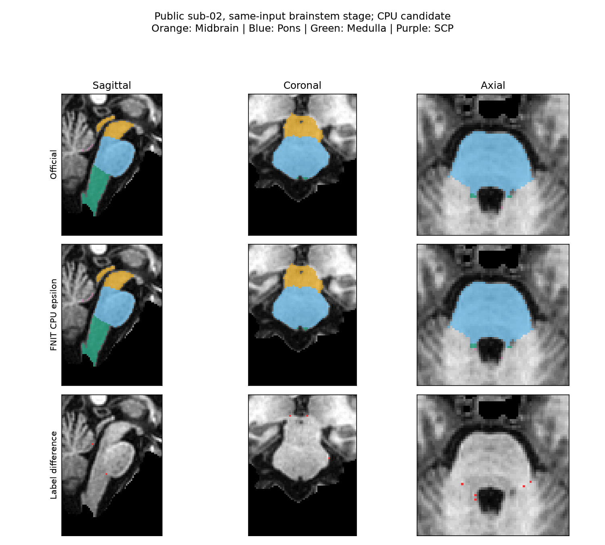

# CPU GEMS 网格似然与内部精度候选

## 进度与范围

本轮修正候选针对成熟 `TorchGEMS` compact 网格目标漏掉的 `1e-15`，同时保留原 FP32 owner 查找和外部顶点／梯度，将可微插值及形变矩阵算术改为 CPU FP64。三处真实首次状态的实际 frozen recipe 闭环已经通过；完整脑干、丘脑和双侧海马／杏仁核的旧版／候选逐区对照正在运行，尚未据此采纳默认行为。独立公式诊断和脑图在[首次状态记录](../gems_first_state_20261004/README.md)，对应提交 `0211dabcb5c566b6ec03f43e1c8cf312e417a45a`。

CUDA 的计算路径保持原样，仍缺少这个 epsilon。保持旧 CUDA 行为只表示本次 CPU 分支隔离，不能证明 GPU 与官方等价。本轮也没有使用首次 closure 时长作提速结论。

本记录提交仅保存诊断、完成的阶段指标和未采纳的[冻结候选补丁](candidate_v1.patch)，不修改生产源文件。补丁 SHA 与 `source.public.json` 的实际 v1 绑定一致；完整丘脑／HA 结果齐前保持候选状态。后续本地 dense guard 的差异单独记录，不能将 v1 结果改标为另一份源码。

## 子函数输入、输出与公式

`_compact_mesh_data_cost` 输入 `priors[C,N]` 和 Gaussian `likelihood[C,N]`（log 密度），输出一个可微标量：

```python
import torch
from fnit.gems.core import _compact_mesh_data_cost

# 两类、三个有效体素，演示内部调用；正式拟合由 recipe 生成这些数组。
class_priors = torch.tensor([[1e-20, .3, .6], [1e-22, .7, .4]], dtype=torch.float64)
gaussian_log_density = torch.tensor([[-2., -3., -4.], [-4., -6., -3.]], dtype=torch.float64)
mesh_data_cost = _compact_mesh_data_cost(
    class_priors,
    gaussian_log_density,
    double_accumulation=True,  # 标量求和使用 FP64；完整梯度经过相同 epsilon 分母
)
```

CPU 用 `logaddexp(logsumexp(log(prior) + log_density), log(1e-15))` 实现 `-sum(log(sum(prior * density) + 1e-15))`。epsilon 位于类别求和之后；EM 责任权重及 Gaussian 更新继续沿用原公式。

`rasterize_priors_compact` 的内部可选 `owner_geometry` 指向同一个当前网格的 CPU FP32 原点、逆矩阵和 singular 标记。它保留 owner、候选顺序、整数网格点、覆盖及恢复顺序；`current_geometry` 提供 FP64 可微插值矩阵。此参数不用于 CUDA。三维单模态 compact、FP32 外部 vertices、`precise_mesh_matrices=True`、`reuse_geometry=True` 才启用内部 FP64。显式 dense 模式保留原路径；公开 API 参数及输出结构不增加依赖或新选项。

完整 Python／命令行调用、输入输出、流程图、官方命令和参考文献见[亚区功能文档](../../../docs/subregions/README.md)。此内部子函数没有对应独立 CLI。

## 实际首次状态闭环

三组均读取固定公开 sub-02 的 `norm/aseg/wmparc`。全部捕获 NPZ 字段与旧共享状态逐值一致，包括 image、FP32 points/reference、alphas、Gaussian 参数、边界变换、movable flags、tetrahedra 和背景类。实际候选 cost 和完整 FP32 gradient 与混合精度探针完全相同。

| 实际首次状态 | cost 减官方 | 完整 gradient 相对 L2 误差 | 实际减探针 cost / 不同 gradient 值 |
|---|---:|---:|---:|
| 丘脑 | −0.004631022 | 2.51894e-8 | 0 / 0 |
| 左海马／杏仁核 | −0.002009332 | 3.96111e-8 | 0 / 0 |
| 右海马／杏仁核 | −0.002152588 | 3.14062e-8 | 0 / 0 |

剩余 cost 小差与原 FP32 Gaussian log-density 算术有关，没有为它调整参数。该闭环没有 optimizer update，不能代替最终分割精度。[丘脑](first-thalamus.public.json)、[左侧](first-hippo-amygdala-left.public.json)、[右侧](first-hippo-amygdala-right.public.json)保存完整指标；共同源码与固定资源元数据采用[安全精简绑定](binding.public.json)，展开后 canonical SHA 已核验无损。

## 完整 recipe 验证计划

nodecw7、固定 8 个物理核 `32,36,40,44,48,52,56,60`，公共同组锁 `nodecw7.gems.cpu8.lock`。冷进程依次运行候选脑干、旧丘脑、候选丘脑、旧双侧 HA、候选双侧 HA。旧脑干复用同 node7、同实际 f1 源码的完整已保存结果；旧 thal/HA CPU v2 缺少 f1 owner 实现，其结果不作为本次旧臂。

双方使用相同公开 checkpoint 和正式 atlas pack；35 个 pack 文件均绑定，四个 recipe 的 mesh／LUT／dump 与官方安装版 SHA 完全相同。baseline 与 candidate 各 472 个 Python 源文件按实际内容绑定。候选包含已接受的 Gaussian 类质量广播修复；旧 f1 未包含该修复，但四个正式 recipe 的强度 EM 均提供超参数，合成拟合使用固定 Gaussian，因此不进入被修分支。

每项保存全部后验、vertices、Gaussian 均值／协方差、objective 轨迹、solver 统计、最小 Jacobian、标签与体积表，以及实际 dtype、线程、API 时间、冷进程 wall 和 RSS。官方细标签只在拟合完成后评分。沿用预先固定的 scanner-RAS 评价网格、逐区 Dice ≥ 0.95 和硬体积相对官方误差 ≤ 5%；每个非空区都报告 ΔDice、体积误差 Δ 及极值。CPU 共享负载和旧官方不同节点时长不能作为稳定提速比。

[后处理收集器](collect_completed_recipes.py)只在双方 frozen recipe 完成后调用评分与状态比较，每个家族一次，不启动拟合、不修改已存在结果。[软体积推导](derive_recipe_report.py)从已保存的原始评分补充所有区域相对官方的绝对／相对误差变化和极值；原区域字段逐值保留，输入及程序 SHA 单独绑定。新旧轨迹改变时不强求 CPU 逐值相同。

运行源码 `cpu-epsilon-v1/source/src` 已冻结；后续本地仅补上显式 dense 模式 guard，实际上述 recipe 均使用 compact，因此这一额外 guard 不改变已运行分支。原 freeze、失败输出与时长均保留，版本不混写。

### 已完成脑干：固定门通过，部分指标略降

旧版与候选的 native／HR 均为 4/4 区通过。native 最坏 ΔDice 为 Medulla 的 −0.0002454，最大硬体积相对误差增加为 Midbrain 的 +0.0006758；HR 最坏 ΔDice 为 SCP 的 −0.0011501，最大硬体积相对误差增加为 Medulla 的 +0.0004920。没有丢失旧通过区，但不能称所有指标不退化。[全部区域及软体积 Δ](score-brainstem.public.json)保留了改善和回退。

| 完整脑干阶段 | 旧版 | CPU 候选 |
|---|---:|---:|
| 冷进程墙钟（秒） | 636.617 | 954.319 |
| API（秒） | 632.479 | 949.813 |
| 采样进程树峰值 RSS（GB，十进制） | 3.711 | 4.688 |
| load（开始／结束，1 min） | 48.28 / 121.63 | 90.32 / 103.60 |
| 最小 Jacobian | 0.24748485 | 0.24793719 |

两次运行不是邻接空载配对，时间差不作为性能变化的因果估计。候选强度网格拟合 861.238 秒、旧版 558.066 秒，完整阶段都记录了原始时钟。native 有 13 个标签体素变化，HR 有 100 个；21 通道后验 RMSE 为 0.00205645，最大差为 1.0。输出形状、affine、zooms、dtype 及有限性检查通过；后验、vertices、means 和 covariances 保留 FP32，全部目标与 solver 记录见[完整状态](state-brainstem.public.json)。这不是旧版逐值回归。

相对官方软体积的绝对误差变化分别为 Midbrain +1.188965、Pons −1.325195、Medulla +1.836426、SCP −0.101776 mm³；两个评价网格使用同一工作网格软积分。首次数学梯度误差的改善与这些最终 hard-label 小回退分别报告。



图像仅显示重采样到 norm 的三个真实切面；数值评价使用独立固定网格。服务器验证绘图环境缺少 Matplotlib，已记录[失败及替代路径](failures.public.json)：通过 Nibabel 导出[二维切片](brainstem_figure_slices.public.npz)，使用已有本地 Matplotlib 绘制，没有修改服务器环境。

### 已完成丘脑旧臂

实际 f1 冻结旧臂的冷进程 wall 为 2655.507 秒，API 为 2651.360 秒；native 为 29/45 个非空区通过，HR 为 32/47，分别有 5／3 个双方均空区域，仍不满足全部区域门。[完整旧臂评分](score-thalamus-baseline.public.json)中的 `candidate` 字段来自既有单臂评分器，在此文件专指 f1 旧臂。候选及双侧 HA 仍待完整运行和评分，此处不预判效果。

### 有限 alpha 平滑检查：丘脑首态未见量级差

同已保存的实际 FP32 reference points、分组后的原始 alphas 和 sigma=3，隔离官方 binding 得到的 alpha 与 FNIT 首态 alpha 最大差 7.15e-7、RMSE 1.70e-8。仅替换这两个 alpha 数组、保持 mesh／image／Gaussian 和 native calculator 一致，完整 cost 变化 +0.00876644，gradient 相对 L2 变化 1.51493e-6。[平滑指标](alpha-first-thalamus.public.json)及[完整目标／梯度指标](alpha-first-thalamus-cost.public.json)均绑定实际输入和扩展 SHA。这只覆盖丘脑首态，不作为其他阶段或实际未截断 FP64 reference 的结果。

参考 C++ 的统计分母使用 `sum(W) + 1e-15`，节点归一使用 `sum(stat) + 1e-12`，FNIT 当前使用相应下限截断；本次限定状态的影响小，未由此改动生产。FNIT atlas reader 没有保存 `m_CanChangeAlphas`，但实际 brainstem／thal／HA 的 4432／23027／20100 个节点均允许改变 alphas，本例排除该标志造成差异。源码参考与实际 binary 分别绑定，见[只读来源记录](alpha-first-source.public.json)。

### 零 prior 的导数边界：真实影响尚待统计

当前候选保留 `log(prior.clamp_min(tiny))`。当某类 prior 恰为零时，它屏蔽该类 prior 的导数；参考 C++ 在四面体任一顶点的该类 alpha 非零时仍累计空间导数。局部数学检查中，候选与线性 mixture+epsilon 的 cost 完全相同，但一项 prior 导数分别为 0 和 −14.7781，见[边界记录](zero_prior_edge.public.json)。这没有改变已保存的三处真实完整梯度结果，也没有证明实际 recipe 受到影响。

[限定统计脚本](count_shared_zero_prior.py)先用原 FP32 owner 和 FP64 插值逐值重建已保存 capture 的 priors／coverage，再区分全零 alpha、负 raw prior 已被 raster 裁零、raw prior 恰零且四面体 alpha 有变化三类。最后一类才需进一步核验 loss clamp 的梯度影响。脚本只读已保存数组，不调用 optimizer；小型临时夹具已验证重建和分类，真实统计尚未执行，不将夹具作为 benchmark。

## 代码与参考

- [官方网格目标源码](https://github.com/freesurfer/samseg/blob/2ce2b6be69f2954ea704e593a5be79c284a3a8c3/gems/kvlAtlasMeshToIntensityImageCostAndGradientCalculator.cxx)：先累计类别密度，再加 `1e-15`，梯度使用同一分母。源码 Git 参考与实际安装二进制分别绑定。
- [FreeSurfer 亚区说明](https://surfer.nmr.mgh.harvard.edu/fswiki/SubregionSegmentation)、现有 `licenses/FreeSurfer.txt`。官方扩展只用于隔离 benchmark；生产 FNIT 不加载它。未复制发布官方库、源码或 atlas。
- [捕获与比较](compare_first_capture.py)、[完整源码与输入计划](prepare_recipe_plan.py)、[逐区评价](score_recipe.py)。没有新增运行时依赖，原 Conda prefix 保持原位置。
