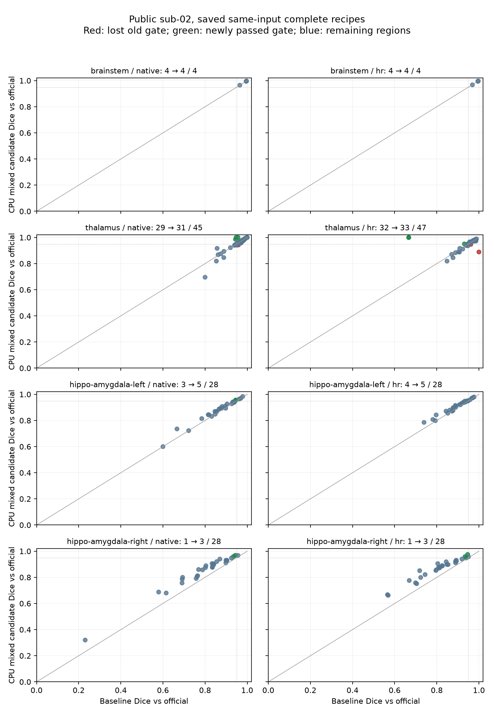

# CPU GEMS 网格似然与内部精度候选

## 进度与范围

本轮修正候选针对成熟 `TorchGEMS` compact 网格目标漏掉的 `1e-15`，同时保留原 FP32 owner 查找和外部顶点／梯度，将可微插值及形变矩阵算术改为 CPU FP64。三处真实首次状态的实际 frozen recipe 闭环已经通过；完整脑干、丘脑和双侧海马／杏仁核的旧版／候选逐区对照均已完成。丘脑有旧通过区跌出固定门，HA 仍有多数区域未过，因此不采纳 mixed 候选为默认。独立公式诊断和脑图在[首次状态记录](../gems_first_state_20261004/README.md)，对应提交 `0211dabcb5c566b6ec03f43e1c8cf312e417a45a`。

CUDA 的计算路径保持原样，仍缺少这个 epsilon。保持旧 CUDA 行为只表示本次 CPU 分支隔离，不能证明 GPU 与官方等价。本轮也没有使用首次 closure 时长作提速结论。

本记录提交仅保存诊断、完成的阶段指标和未采纳的[冻结候选补丁](candidate_v1.patch)，不修改生产源文件。补丁 SHA 与 `source.public.json` 的实际 v1 绑定一致；完整结果及所有改善、退步均已保存；生产修改保持未提交候选。后续本地 dense guard 的差异单独记录，不能将 v1 结果改标为另一份源码。

## 子函数输入、输出与公式

`_compact_mesh_data_cost` 输入 `priors[C,N]` 和 Gaussian `likelihood[C,N]`（log 密度），输出一个可微标量：

```python
import torch
from fnit.gems.core import _compact_mesh_data_cost

# 两类、三个有效体素，演示内部调用；正式拟合由 recipe 生成这些数组。
class_priors = torch.tensor([[1e-20, .3, .6], [1e-22, .7, .4]], dtype=torch.float64)
gaussian_log_density = torch.tensor([[-2., -3., -4.], [-4., -6., -3.]], dtype=torch.float64)
mesh_data_cost = _compact_mesh_data_cost(
    class_priors,
    gaussian_log_density,
    double_accumulation=True,  # 标量求和使用 FP64；完整梯度经过相同 epsilon 分母
)
```

CPU 用 `logaddexp(logsumexp(log(prior) + log_density), log(1e-15))` 实现 `-sum(log(sum(prior * density) + 1e-15))`。epsilon 位于类别求和之后；EM 责任权重及 Gaussian 更新继续沿用原公式。

`rasterize_priors_compact` 的内部可选 `owner_geometry` 指向同一个当前网格的 CPU FP32 原点、逆矩阵和 singular 标记。它保留 owner、候选顺序、整数网格点、覆盖及恢复顺序；`current_geometry` 提供 FP64 可微插值矩阵。此参数不用于 CUDA。三维单模态 compact、FP32 外部 vertices、`precise_mesh_matrices=True`、`reuse_geometry=True` 才启用内部 FP64。显式 dense 模式保留原路径；公开 API 参数及输出结构不增加依赖或新选项。

完整 Python／命令行调用、输入输出、流程图、官方命令和参考文献见[亚区功能文档](../../../docs/subregions/README.md)。此内部子函数没有对应独立 CLI。

## 实际首次状态闭环

三组均读取固定公开 sub-02 的 `norm/aseg/wmparc`。全部捕获 NPZ 字段与旧共享状态逐值一致，包括 image、FP32 points/reference、alphas、Gaussian 参数、边界变换、movable flags、tetrahedra 和背景类。实际候选 cost 和完整 FP32 gradient 与混合精度探针完全相同。

| 实际首次状态 | cost 减官方 | 完整 gradient 相对 L2 误差 | 实际减探针 cost / 不同 gradient 值 |
|---|---:|---:|---:|
| 丘脑 | −0.004631022 | 2.51894e-8 | 0 / 0 |
| 左海马／杏仁核 | −0.002009332 | 3.96111e-8 | 0 / 0 |
| 右海马／杏仁核 | −0.002152588 | 3.14062e-8 | 0 / 0 |

剩余 cost 小差与原 FP32 Gaussian log-density 算术有关，没有为它调整参数。该闭环没有 optimizer update，不能代替最终分割精度。[丘脑](first-thalamus.public.json)、[左侧](first-hippo-amygdala-left.public.json)、[右侧](first-hippo-amygdala-right.public.json)保存完整指标；共同源码与固定资源元数据采用[安全精简绑定](binding.public.json)，展开后 canonical SHA 已核验无损。

## 完整 recipe 验证与来源

nodecw7、固定 8 个物理核 `32,36,40,44,48,52,56,60`，公共同组锁 `nodecw7.gems.cpu8.lock`。冷进程依次运行候选脑干、旧丘脑、候选丘脑、旧双侧 HA、候选双侧 HA。旧脑干复用同 node7、同实际 f1 源码的完整已保存结果；旧 thal/HA CPU v2 缺少 f1 owner 实现，其结果不作为本次旧臂。

双方使用相同公开 checkpoint 和正式 atlas pack；35 个 pack 文件均绑定，四个 recipe 的 mesh／LUT／dump 与官方安装版 SHA 完全相同。baseline 与 candidate 各 472 个 Python 源文件按实际内容绑定。候选包含已接受的 Gaussian 类质量广播修复；旧 f1 未包含该修复，但四个正式 recipe 的强度 EM 均提供超参数，合成拟合使用固定 Gaussian，因此不进入被修分支。

每项保存全部后验、vertices、Gaussian 均值／协方差、objective 轨迹、solver 统计、最小 Jacobian、标签与体积表，以及实际 dtype、线程、API 时间、冷进程 wall 和 RSS。官方细标签只在拟合完成后评分。沿用预先固定的 scanner-RAS 评价网格、逐区 Dice ≥ 0.95 和硬体积相对官方误差 ≤ 5%；每个非空区都报告 ΔDice、体积误差 Δ 及极值。CPU 共享负载和旧官方不同节点时长不能作为稳定提速比。

[后处理收集器](collect_completed_recipes.py)只在双方 frozen recipe 完成后调用评分与状态比较，每个家族一次，不启动拟合、不修改已存在结果。[软体积推导](derive_recipe_report.py)从已保存的原始评分补充所有区域相对官方的绝对／相对误差变化和极值；原区域字段逐值保留，输入及程序 SHA 单独绑定。新旧轨迹改变时不强求 CPU 逐值相同。

运行源码 `cpu-epsilon-v1/source/src` 已冻结；后续本地仅补上显式 dense 模式 guard，实际上述 recipe 均使用 compact，因此这一额外 guard 不改变已运行分支。原 freeze、失败输出与时长均保留，版本不混写。

### 已完成脑干：固定门通过，部分指标略降

旧版与候选的 native／HR 均为 4/4 区通过。native 最坏 ΔDice 为 Medulla 的 −0.0002454，最大硬体积相对误差增加为 Midbrain 的 +0.0006758；HR 最坏 ΔDice 为 SCP 的 −0.0011501，最大硬体积相对误差增加为 Medulla 的 +0.0004920。没有丢失旧通过区，但不能称所有指标不退化。[全部区域及软体积 Δ](score-brainstem.public.json)保留了改善和回退。

| 完整脑干阶段 | 旧版 | CPU 候选 |
|---|---:|---:|
| 冷进程墙钟（秒） | 636.617 | 954.319 |
| API（秒） | 632.479 | 949.813 |
| 采样进程树峰值 RSS（GB，十进制） | 3.711 | 4.688 |
| load（开始／结束，1 min） | 48.28 / 121.63 | 90.32 / 103.60 |
| 最小 Jacobian | 0.24748485 | 0.24793719 |

两次运行不是邻接空载配对，时间差不作为性能变化的因果估计。候选强度网格拟合 861.238 秒、旧版 558.066 秒，完整阶段都记录了原始时钟。native 有 13 个标签体素变化，HR 有 100 个；21 通道后验 RMSE 为 0.00205645，最大差为 1.0。输出形状、affine、zooms、dtype 及有限性检查通过；后验、vertices、means 和 covariances 保留 FP32，全部目标与 solver 记录见[完整状态](state-brainstem.public.json)。这不是旧版逐值回归。

相对官方软体积的绝对误差变化分别为 Midbrain +1.188965、Pons −1.325195、Medulla +1.836426、SCP −0.101776 mm³；两个评价网格使用同一工作网格软积分。首次数学梯度误差的改善与这些最终 hard-label 小回退分别报告。


图像仅显示重采样到 norm 的三个真实切面；数值评价使用独立固定网格。服务器验证绘图环境缺少 Matplotlib，已记录[失败及替代路径](failures.public.json)：通过 Nibabel 导出[二维切片](brainstem_figure_slices.public.npz)，使用已有本地 Matplotlib 绘制，没有修改服务器环境。

### 已完成丘脑旧臂

实际 f1 冻结旧臂的冷进程 wall 为 2655.507 秒，API 为 2651.360 秒；native 为 29/45 个非空区通过，HR 为 32/47，分别有 5／3 个双方均空区域，仍不满足全部区域门。[完整旧臂评分](score-thalamus-baseline.public.json)中的 `candidate` 字段来自既有单臂评分器，在此文件专指 f1 旧臂。该旧臂评分与后续 paired report 的 baseline 逐值相同，现采用本地 JSON 引用保存，展开后的 canonical SHA 不变。

### 四个完整 recipe：不采纳 mixed 默认

2026-10-05 通过已认证的交互 TTY 重新读取统一 README／INDEX 和 canonical 产物，全部五个冷进程 job 及两家族后处理均为 complete、exit 0。现场逐文件核验旧／新各 472 个 Python 源、23 个 GEMS 文件及三个 worker／contract／queue helper，均与原冻结绑定相同；没有重新拟合。正式服务器仓库此时为 `cc9402734faeba93b3a13c29932fa1392eaccf62`，其 GEMS core 与旧 f1 一致。实际运行仍使用绑定的独立旧／新源码，不改标为随后 main。

| 家族／评价网格 | 旧通过／非空 | mixed 通过／非空 | 双方均空 | 丢失旧通过区 |
|---|---:|---:|---:|---|
| 脑干 native | 4/4 | 4/4 | 0 | 无 |
| 脑干 HR | 4/4 | 4/4 | 0 | 无 |
| 丘脑 native | 29/45 | 31/45 | 5 | Right-CM |
| 丘脑 HR | 32/47 | 33/47 | 3 | Left-MV(Re)、Right-Pc |
| 左 HA native | 3/28 | 5/28 | 0 | 无 |
| 左 HA HR | 4/28 | 5/28 | 0 | 无 |
| 右 HA native | 1/28 | 3/28 | 0 | 无 |
| 右 HA HR | 1/28 | 3/28 | 0 | 无 |

native 合计为 37/105 → 43/105，HR 为 41/107 → 45/107。通过数增加不能替代逐区门：Right-CM 的 native Dice 为 0.95833 → 0.94301；Left-MV(Re) 的 HR Dice 为 0.96154 → 0.94737、硬体积误差为 0 → 5.128%；Right-Pc 的 HR Dice 为 1 → 0.88889、硬体积误差为 0 → 20%。所有区域均保留，没有仅筛选旧通过区或改善区。

| 家族／网格 | 最小／最大 ΔDice | 最小／最大硬体积相对误差 Δ |
|---|---:|---:|
| 丘脑 native | −0.104348 / +0.059524 | −0.111111 / +0.153846 |
| 丘脑 HR | −0.111111 / +0.333333 | −1.000000 / +0.200000 |
| 左 HA native | −0.004342 / +0.068627 | −0.086957 / +0.058824 |
| 左 HA HR | −0.001239 / +0.046099 | −0.022235 / +0.017360 |
| 右 HA native | +0.011507 / +0.107790 | −0.156250 / +0.068966 |
| 右 HA HR | +0.006903 / +0.132547 | −0.119431 / +0.022523 |

软体积误差按实际工作网格积分，与官方软体积比较；native／HR 两套硬标签评价共享该软积分。丘脑绝对误差 Δ 的极值为 Left-VPL −2.516663、Right-VLa +2.445984 mm³；左 HA 为 Left-Lateral-nucleus −7.205750、Left-hippocampal-fissure +1.348679 mm³；右 HA 为 Right-Lateral-nucleus −32.158569、Right-presubiculum-head +0.808149 mm³。相对软误差、全部 hard／soft 数值及变化见 [220 行区域表](regional_changes_complete.csv)和[完整汇总](complete_recipe_summary.public.json)。

| 完整冷进程阶段 | 旧 wall / API（秒） | mixed wall / API（秒） | 旧／mixed 采样峰值 RSS（GB） |
|---|---:|---:|---:|
| 脑干 | 636.617 / 632.479 | 954.319 / 949.813 | 3.711 / 4.688 |
| 丘脑 | 2655.507 / 2651.360 | 3549.210 / 3545.832 | 4.456 / 4.473 |
| 双侧 HA | 4018.157 / 4012.925 | 4000.569 / 3994.958 | 8.813 / 8.973 |

均为 nodecw7 的同一 8 核组、独立冷进程；丘脑和 HA 分别顺序 old/new。运行期间共享负载变化：丘脑旧臂 103.60 → 79.74、新臂 79.74 → 117.39；HA 旧臂 117.39 → 94.12、新臂 94.12 → 115.82。此处直接报告时钟和负载，不给出因果提速比；没有重跑官方以形成同节点速度对照。RSS 未降低。

完整输出的 shape／affine／zooms／dtype／finite 门全部通过，posterior／vertices／Gaussian 存储均为 FP32，objective 存储为 FP64。丘脑 native／HR 分别变动 93／818 个标签体素；66 通道后验 RMSE 为 0.00170329。双侧 HA native 合计变动 540 个体素，左右 HR 分别 3230／11814；后验 RMSE 分别 0.00230302／0.00876206。全部 posterior、参数和目标轨迹的实际 SHA、不同值数量、最大差与 RMSE 均保存。

强度 solver 的步数丘脑为 400 → 400、左 HA 和右 HA 均为 300 → 300；objective／backtracking／evaluations／cache-hit／rebuild／分阶段时钟见完整状态。最小 Jacobian 丘脑 0.219089 → 0.203753、左 HA 0.252634 → 0.176472、右 HA 0.204451 → 0.164773，均为正，候选更低。参考输出与当前 recipe 的完整估计差异仍待定位，首次公式梯度改善并没有消除它。

[丘脑完整评分](score-thalamus.public.json)、[双侧 HA 完整评分](score-hippo-amygdala.public.json)、[丘脑状态](state-thalamus.public.json)、[HA 状态](state-hippo-amygdala.public.json)保留全部科学值。重复的 metadata／metric 字典通过[共享文件](complete_recipe_shared.public.json)引用，评分原文件 SHA 与展开后的 canonical SHA 分别记录在[精简清单](complete_recipe_encoding.public.json)，无损展开核验通过。旧单臂丘脑报告也核验与 paired baseline 完全一致后引用复用。[现场状态和冻结源码核验](recovery_queue.public.json)保留完整队列记录及 collector 来源。



图中每点为一个真实区域；红点是丢失旧通过门的区域，绿点是新增通过门的区域。Dice 图仍需结合硬体积门，不能仅看是否位于 0.95 上方。脑干影像切面见上图。

下一项有限验证转向已有 synthetic stage1 的共享初始状态与首个搜索更新；零 prior 统计仍需先逐值复现原 owner／priors／coverage。EPS-only FP32 已有首次梯度探针，但没有其完整 recipe 结果；本轮不启动另一组数小时拟合。CUDA 仍保留旧公式，本轮未为已拒绝 mixed 候选运行新的完整 GPU benchmark。

### 首态接近官方后，完整轨迹在哪里分叉

以下仅分析已取回的 score／state 和源码，没有使用 TTY、重评目标或新增拟合。[可复现分析](analyze_saved_trajectories.py)与[计算记录](saved_trajectory_analysis.public.json)保留原文件及程序 SHA。

已保存的三个 first capture **都属于 synthetic stage1**：捕获器拦截 recipe 第一次 `TorchGEMS` 调用，读取 `fixed_gaussians`，再替换 `CachedArmijoLBFGS.step`，只执行首次 closure、保存 cost／完整 gradient 后退出。这确实覆盖首个合成状态，但没有执行方向构造、首个 trial、Armijo 判断或 accepted 更新。初始梯度接近官方与后续更新相同是两项不同的验证。

完整流程的 alignment matrix 和 alignment Dice 在旧／新之间逐值相同。三家族 synthetic stage1 的 `history[0]` 也相同；**最早已保存的标量分叉是该阶段 `history[1]`**，此时尚未进入 intensity 和后处理：

| 合成 stage1 | 初始 EM NLL（旧＝新） | 首次记录的 mesh 目标：旧 → mixed | Δ |
|---|---:|---:|---:|
| 丘脑 | 344029.21875 | −32028.572828 → −32182.140151 | −153.567323 |
| 左 HA | 308917.68750 | 47760.972479 → 40852.867646 | −6908.104833 |
| 右 HA | 309132.21875 | 42705.223330 → 37930.374914 | −4774.848416 |

`history[0]` 是 infer 返回的 EM NLL，后续元素包含 mesh data cost 和形变 prior，定义不同。后续 Armijo history 保存的是该 step 后留存的目标；未保存首个 trial／accepted 顶点，不能由两个标量直接计算顶点首次变化，也不能把目标差全部归因于步长。旧／新 mesh 公式本身不同，之后 Gaussian、顶点和 alpha 阶段也不同，不能以候选目标更低表示更接近官方。

#### 步数上限与停止

丘脑全部 intensity stages 都达到 `outer×20`，总计 400 步；两侧 HA 都达到总计 300 步。每个固定 likelihood 的 outer block 内，保存的 accepted mesh 目标均严格下降，没有上升或相等值；这不证明达到收敛，也不证明增加步数会改善 Dice。合成阶段的差异如下：

| 家族 | synthetic stage1：旧／新／上限 | stage2：旧／新／上限 |
|---|---:|---:|
| 丘脑 | 300 / 300 / 300 | 150 / 150 / 150 |
| 左 HA | 300 / 300 / 300 | 149 / 150 / 150 |
| 右 HA | 300 / 36 / 300 | 150 / 150 / 150 |

右 HA 候选 stage1 最后三次相对目标变化为 `2.18561e-6、4.53435e-4、6.73714e-4`，均超过 fast 的 `1e-6`，排除这一次由相对 cost 连续三次不足阈值触发停止。结合一个 synthetic outer 和 `36<300`，源码流程指向位移停止分支；记录没有给出实际最大位移或停止原因，因此尚不能区分零位移与连续三次 ≤0.005 voxel，更不能称为已确认早停 bug。

右侧合成拟合平均／P95 位移从 0.138462／0.555710 变为 0.043702／0.162717 voxel，合成拟合 wall 从 1020.841 变为 438.093 秒；其强度拟合仍用满 300 步。双侧总时间接近旧版包含这个轨迹变化，不能解释成单一算子提速。

#### 几何与最终标签

synthetic 结束的最小 Jacobian：丘脑 0.060129 → 0.078829，左 HA 0.035919 → 0.031822，右 HA 0.055860 → 0.055435；intensity 最终值见上节。保存的这些值均为正，没有证据把退步归因于最终网格倒置；缺少 Jacobian 分布及这些单元与失败标签的空间对应，不能定位局部压缩的作用。

小区域的 hard 标签对少量体素很敏感，但仍按固定门完整计入：

- Right-Pc HR：官方仅 5 个评价体素；旧 5 个全部重叠，新 4 个全部重叠。减少 1 voxel＝0.125 mm³，体积误差即 20%，Dice 为 0.888889。其软体积变化仅 −0.023565 mm³。
- Left-MV(Re) HR：官方 78 voxel，旧 78 → 新 74；交集 75 → 72，减少 0.5 mm³，体积误差为 5.128%。
- Right-CM native：官方 196 voxel，旧 188 → 新 190 更接近官方体积，但交集 184 → 182、对官方不同体素 16 → 22，Dice 跌到 0.943005。这个退步包含空间重叠变化，不能仅用体积量化解释。
- 已失败的 Right-L-Sg native：官方 13 voxel，旧 12 → 新 10、交集 10 → 8；少 2 mm³ 使相对硬体积误差增加 15.385 个百分点。

HA 的 LCC 后处理只把不保留的 foreground 置零，不创造标签或改变非零 label ID。左侧删除 21 → 20 个工作体素，右侧 145 → 314，其中右 fimbria 删除 61 → 253；原始 argmax 计数已变化，且完整目标最早分叉发生在后处理之前。左 Central-nucleus 的旧／新删除数均为零，原始计数 1323 → 1320，证明其 HR 小退步并非由这一步 LCC 删除造成。完整 state 没有 raw-label 空间阵列或 top-two posterior margin，其他 argmax 翻转、近邻采样和 support 裁剪的逐体素贡献尚不能分解。

#### 参考 L-BFGS 与当前 Armijo 不是同一搜索定义

只读核对了固定 samseg commit `2ce2b6…` 的[参考 L-BFGS](https://github.com/freesurfer/samseg/blob/2ce2b6be69f2954ea704e593a5be79c284a3a8c3/gems/kvlAtlasMeshDeformationLBFGSOptimizer.cxx)和[公共 line search](https://github.com/freesurfer/samseg/blob/2ce2b6be69f2954ea704e593a5be79c284a3a8c3/gems/kvlAtlasMeshDeformationOptimizer.cxx)。[源码审计](optimizer_source_audit.public.json)保存 URL、大小、SHA 和位置；原 C++ 仅留在私密 outputs，没有发布或引入生产。

| 项目 | 固定参考源码 | 当前 FNIT |
|---|---|---|
| 初始尺度／trial | `H0=I/max_node_norm(g)`，alpha 从 1 开始 | `H0=I`，trial 最大实际位移 0.5 voxel |
| 接受／搜索 | sufficient decrease + strong-Wolfe curvature，c1=1e-4、c2=0.9；可扩张、再 zoom | 严格下降 + Armijo，c1=1e-4；最多 20 次减半，没有 Wolfe curvature 门 |
| 曲率历史 | 12 对，`s=alpha*p`，`s·y>1e-10` | 12 对，`s` 为写入 FP32 后实际位移，使用相对 curvature 门 |
| 停止 | base 默认每步位移阈值 0.05 voxel，recipe 可改 option | fast 零位移或三次 ≤0.005 voxel；另有相对 cost 门 |

这是固定源码的算法差异；该 samseg commit 没有被证明是本次 FreeSurfer 8.2 binary 的精确构建来源，base 默认也没有被当作实际 recipe 覆盖后的参数。两者使用相同 L-BFGS 名称不能证明更新等价；相同首态 cost／gradient 仍可能给出不同 trial 和接受点。尚没有官方同状态首步轨迹，不能由源码审计断言它解释了全部最终误差。

#### 下一次有限验证顺序

1. 优先复用现有 synthetic stage1 capture，核对实际官方 optimizer／options；在同 points、alphas、image、Gaussian、boundary 下分别记录参考与当前初始方向、max-deformation 缩放、实际存储 dtype 后 trial 点、directional product、Armijo／Wolfe 阈值和首个 accepted 点。先覆盖右 HA，再用丘脑／左 HA 复核；不进入完整 recipe。
2. 同一次共享 state 检查零 prior：首先逐值复现 owner／priors／coverage，再统计活跃 alpha 的 exact-zero 边界。只有实际出现时才对该边界做原生完整 cost／gradient 检查；没有真实统计前保留未量化状态。
3. 首步匹配后，最多在右 HA 原始 capture 上限定重放至 36 步附近，记录最大位移、停止分支和 rejected trials。根据该证据决定是否需要下一阶段检查，不先更改步数或重跑整例。
4. 再用已有最终后验做 posthoc raw argmax、top-two margin、LCC 和 native sampling 的空间分解，特别核验三个丢失丘脑区域。此项只读已保存数组，不重新拟合。

默认 CPU／CUDA 路径继续保持原样；mixed 补丁仍未采纳。EPS-only FP32 与 mixed 的因素尚未在完整首步搜索中拆分，本次不由标量差或名称直接选择新生产数学。

### 有限 alpha 平滑检查：丘脑首态未见量级差

同已保存的实际 FP32 reference points、分组后的原始 alphas 和 sigma=3，隔离官方 binding 得到的 alpha 与 FNIT 首态 alpha 最大差 7.15e-7、RMSE 1.70e-8。仅替换这两个 alpha 数组、保持 mesh／image／Gaussian 和 native calculator 一致，完整 cost 变化 +0.00876644，gradient 相对 L2 变化 1.51493e-6。[平滑指标](alpha-first-thalamus.public.json)及[完整目标／梯度指标](alpha-first-thalamus-cost.public.json)均绑定实际输入和扩展 SHA。这只覆盖丘脑首态，不作为其他阶段或实际未截断 FP64 reference 的结果。

参考 C++ 的统计分母使用 `sum(W) + 1e-15`，节点归一使用 `sum(stat) + 1e-12`，FNIT 当前使用相应下限截断；本次限定状态的影响小，未由此改动生产。FNIT atlas reader 没有保存 `m_CanChangeAlphas`，但实际 brainstem／thal／HA 的 4432／23027／20100 个节点均允许改变 alphas，本例排除该标志造成差异。源码参考与实际 binary 分别绑定，见[只读来源记录](alpha-first-source.public.json)。

### 零 prior 的导数边界：真实影响尚待统计

当前候选保留 `log(prior.clamp_min(tiny))`。当某类 prior 恰为零时，它屏蔽该类 prior 的导数；参考 C++ 在四面体任一顶点的该类 alpha 非零时仍累计空间导数。局部数学检查中，候选与线性 mixture+epsilon 的 cost 完全相同，但一项 prior 导数分别为 0 和 −14.7781，见[边界记录](zero_prior_edge.public.json)。这没有改变已保存的三处真实完整梯度结果，也没有证明实际 recipe 受到影响。

[限定统计脚本](count_shared_zero_prior.py)先用原 FP32 owner 和 FP64 插值逐值重建已保存 capture 的 priors／coverage，再区分全零 alpha、负 raw prior 已被 raster 裁零、raw prior 恰零且四面体 alpha 有变化三类。最后一类才需进一步核验 loss clamp 的梯度影响。脚本只读已保存数组，不调用 optimizer；小型临时夹具已验证重建和分类，真实统计尚未执行，不将夹具作为 benchmark。

## 代码与参考

- [官方网格目标源码](https://github.com/freesurfer/samseg/blob/2ce2b6be69f2954ea704e593a5be79c284a3a8c3/gems/kvlAtlasMeshToIntensityImageCostAndGradientCalculator.cxx)：先累计类别密度，再加 `1e-15`，梯度使用同一分母。源码 Git 参考与实际安装二进制分别绑定。
- [FreeSurfer 亚区说明](https://surfer.nmr.mgh.harvard.edu/fswiki/SubregionSegmentation)、现有 `licenses/FreeSurfer.txt`。官方扩展只用于隔离 benchmark；生产 FNIT 不加载它。未复制发布官方库、源码或 atlas。
- [捕获与比较](compare_first_capture.py)、[完整源码与输入计划](prepare_recipe_plan.py)、[逐区评价](score_recipe.py)。没有新增运行时依赖，原 Conda prefix 保持原位置。
