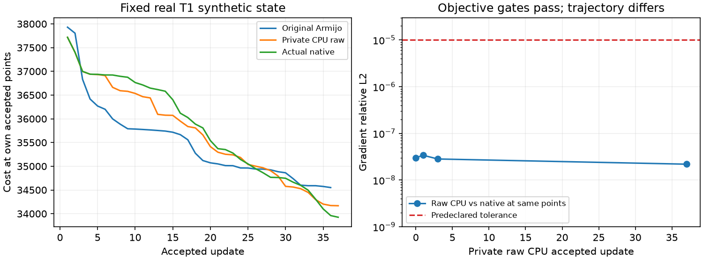

# GEMS CPU：raw prior 目标修复与 37 步有限重放

## 1. 功能与当前范围

这一版在右侧海马／杏仁核真实 T1 的固定 synthetic stage1 状态中，定位并修正 **CPU 网格数据目标内部的 prior 归一化差异**。私有 raw closure 在 initial、step 1、step 3 和 step 37 的相同点上都通过官方 cost、完整投影 gradient、浮点 prior 和 coverage 门。完整分割、各核团 Dice／体积及 CPU 速度目标仍未验收。

本目录是独立验证代码，**不是当前 `TorchGEMS` 生产后端**。它依赖冻结版本的 CPU `1e-15` mixture epsilon、FP64 reference／插值／目标累计、独立 FP32 ownership 和私有 native-definition L-BFGS。这些前提与协调者当前生产 `core.py`／`rasterize.py` 不同；本结果不表示在 main 单改归一化就已经通过。完整 SHA 和接入差异见 [source_bindings.public.json](source_bindings.public.json)。本次没有修改生产、CUDA、Triton、TF32、公开概率接口或 EM。


## 2. Python 调用、输入和输出

下例展示独立优化器接口；`cpu_mesh_closure` 必须是完成 source／capture 检查的 CPU 闭包，不能用公共 `GEMSAtlas.load_npz()` 代替阶段 checkpoint loader。

```python
import torch
from optimizer_candidate_v2 import NativeDefinitionCPU

# closure.start 是固定工作网格的 [顶点数, 3] CPU FP32 坐标，单位 voxel。
initial_vertices = cpu_mesh_closure.start.clone()
mesh_optimizer = NativeDefinitionCPU(
    points=initial_vertices,
    closure=cpu_mesh_closure,          # 返回标量 cost 与 [顶点数, 3] gradient。
    memory_length=12,                 # 采用实际安装 recipe 的 12 对曲率历史。
    maximal_deformation_stop=1e-10,    # 最大移动停止门，单位 voxel。
    interval_stop=1e-10,              # 实际 recipe 覆盖后的线搜索区间门。
    max_search_displacement=50.0,     # 固定上游线搜索最大搜索范围，单位 voxel。
    maximum_iterations=1000,          # 实际 recipe 的最大迭代数。
    evaluations_per_step=64,          # 独立诊断预算；耗尽不算收敛。
    observer=None,                   # 可选试步观察器；不得改变 points。
)
accepted_vertices, step_report = mesh_optimizer.step()
```

`raw_prior_cpu_adapter.SharedClosure` 从 `shared_input.npz` 直接复制阶段数组。`FNIT_GEMS_FROZEN_ADAPTER` 必须指向前一份已验收的 `run_real.py`，且冻结 GEMS source 必须在 `PYTHONPATH` 中；脚本检查二者 SHA。直接 checkpoint 保留平滑后的零 alpha 行。公开 `GEMSAtlas.load_npz()` 会归一化非零行并拒绝零质量行，二者用途不同。

| 输入 | 格式与含义 |
| --- | --- |
| `report.public.json` | 真实 capture 的源码、输入／输出 SHA、背景类和原始初态 cost |
| `shared_input.npz:image` | `[101,117,118]` FP32 工作网格影像；有效 mask 为有限且非零 voxel |
| `vertices`、`reference` | `[20100,3]` FP32 voxel-center 坐标；后者定义形变参考 |
| `tetrahedra` | `[122333,4]` int64，原 atlas 有序四面体角点 |
| `alphas` | `[20100,11]` FP32，该 synthetic 阶段已分组和平滑的节点权重 |
| `means`、`variances` | `[11,1]` 和 `[11,1,1]`，固定 Gaussian 参数；不进行 EM |
| `can_move`、`boundary_transform` | `[20100,3]` bool 与 `[3,3]` affine；定义滑动边界 |
| `stiffness`、`background_class` | 固定形变刚度和背景类；沿用 capture |
| `optimizer_state.private.npz` | current points／cost／gradient、12 对 s/y/sy、old gradient／direction／alpha、iteration／evaluation／finished |
| 已保存 `trial-*.private.npz` | 每次 trial 的 points／gradient；用于重建续跑 anchor／index，不重新求历史 objective |

输出新建实际 `0700` 目录：

- `summary.public.json` 和 `progress.public.json`：标量、停止原因、trial alpha、source／input SHA；`null` cost 表示非有限 rejected trial。
- `initial.private.npz`、`accepted-*.private.npz`、`trial-*.private.npz`：私密 points／gradient，选定点另含 priors／coverage；不发布这些数组。
- `optimizer_state.private.npz` 和 `closure_state.private.npz`：续跑状态。后者保存 anchor、候选 index 和计数；动态 Python cache 明确可重建，不宣称原对象逐字节保存。
- 原生 scorer 保存同点评分标量、Jacobian 摘要及数组 SHA；不生成完整分割或脑区统计。

## 3. 命令行与全部参数

这些是诊断命令，没有新增生产 CLI。第一段只跑 3 步，第二段复用它的 optimizer state 继续至总计 37 步。

```bash
PYTHONPATH=/private/frozen-source/src python run_raw_limited.py \
  --capture /private/capture-hippo-amygdala-right \
  --base-adapter ../gems_first_trial_20261005/run_real.py \
  --raw-adapter raw_prior_cpu_adapter.py \
  --candidate optimizer_candidate_v2.py \
  --normalized-baseline /private/completed-original-armijo36 \
  --output /private/new-raw3 --steps 3

PYTHONPATH=/private/frozen-source/src python run_raw_limited_v2.py \
  --capture /private/capture-hippo-amygdala-right \
  --base-adapter ../gems_first_trial_20261005/run_real.py \
  --raw-adapter raw_prior_cpu_adapter.py \
  --candidate optimizer_candidate_v2.py \
  --normalized-baseline /private/completed-original-armijo36 \
  --resume /private/new-raw3 --resume-helper resume_raw_cache.py \
  --output /private/new-raw-continue37 --steps 37
```

| 参数 | 含义与默认值 |
| --- | --- |
| `--capture` | 必填，真实阶段 checkpoint 目录；逐文件核对 SHA |
| `--base-adapter` | 必填，前一份逐值复现 capture 的 CPU closure；固定 SHA |
| `--raw-adapter` | 必填，仅 CPU 网格数据目标的 raw-prior 闭包 |
| `--candidate` | 必填，独立 CPU optimizer 源码；续跑须与原状态同 SHA |
| `--normalized-baseline` | 必填，已经完成的原 Armijo 结果；只复用 source／五项初态门，不拿 normalized arrays 作为 raw 验收目标 |
| `--output` | 必填，新私密目录；已有目录拒绝覆盖 |
| `--steps` | 总更新上限，默认 3，允许 1–40；是诊断边界，不是收敛条件 |
| `--resume` | 可选，已完成 raw run；续跑先验证 source、state SHA 和同点 cost／gradient 逐值一致 |
| `--resume-helper` | v2 runner 必填，重建已保存 trial 对应的 anchor／index，不重算历史 objective |
| scorer `--mesh` | 必填，capture 对应原作者 atlas；核对 SHA、节点／tet／corner 映射 |
| scorer `--helper` | 必填，前一份已验收 `native_trials_v5.py`；固定 SHA |
| scorer `--prior-native` | 必填，已完成的 v5 原生评分；只读参考 |
| scorer `--previous-decomposition` | 必填，同一 capture 的 topology／reference 证明；此参数复用结构门，不采用 v2 错误的独立 data／prior 字段 |
| scorer `--actual-native-trajectory` | 必填，已保存官方 37 步；不再次更新 native optimizer |
| scorer `--python-run` | 必填，已完成的 raw Python run |
| continuation scorer `--prior-raw-gates` | 必填，已通过 initial／1／3 的同点评分；同 binary／input／candidate SHA 才复用 |

`score_raw_limited.py` 在 raw initial／1／3 评分；`score_raw_continuation.py` 只评分续跑末点，复用已通过门。`native_decompose_limited_v3.py` 和 `diagnose_third_point_v3.py` 分别输出官方 data／prior／全梯度及 FNIT baseline／raw 两种目标。v2 文件为原始失败记录，独立 data／prior 不用于归因。

## 4. 原软件定义与根因

本步骤没有独立官方 CLI。隔离参考使用实际安装的 `KvlMeshCollection`、`KvlCostAndGradientCalculator` 和一次已保存的 `KvlOptimizer("L-BFGS", ...)` 轨迹。绑定扩展 SHA `8125a39c…`、recipe SHA `beb64fa1…`，上游 samseg commit `2ce2b6be…`。本次实际 recipe options 为 memory 12、最大迭代 1000、最大移动门与线搜索区间门均 `1e-10`；不把上游其他默认 `0.05` 当作安装版值。

官方数据项直接插值 alpha，并计算 `-log(sum_l(p_l * L_l) + 1e-15)`。冻结 FNIT 原始 compact raster 把插值后的 prior 除以其质量。忽略极小 epsilon 的影响，后者为数据项增加 `log(sum_l p_l)`，也多出相应的梯度。当平滑节点中存在全零 alpha 行时，某个四面体内的 prior mass 随位置变化，归一化不再是无影响操作。

这份实际 capture 有 **118 个全零 alpha 行**；其余行 mass 最大约 `1.00000026`。原第三步仅 **1 个 covered voxel** 质量略低于 1，造成约 4 个顶点的局部 gradient 偏差。该点没有负 prior 或 clamp 截断。FP64 ownership／零 tolerance 的诊断没有改变 owner／coverage，也没有解决误差。正确的 K0-before-get_mesh 分解表明 prior 和滑动投影本身已匹配，差异来自 data normalization。

修复范围是 **CPU mesh likelihood 的内部 raw prior**；公开 normalized probability、Atlas loader、posterior、EM、CUDA 和 Triton 保留原定义。完整生产接入还须把 source_bindings 中的共同前提单独验收。

## 5. 真实精度、时间与输出

### 正确分解后的第三点

| 固定相同点 | 原 normalized data gradient rel L2 | raw data gradient rel L2 | prior gradient rel L2 | raw full gradient rel L2 |
| --- | ---: | ---: | ---: | ---: |
| 原 Armijo step3 | `5.6210e-4` | `3.2285e-8` | `3.6473e-8` | `1.8455e-8` |
| private L-BFGS v2 step3 | `2.4595e-4` | `1.5753e-8` | `2.0016e-8` | `2.8243e-8` |

### raw 有限重放的同点门

预先固定 cost 绝对差 ≤0.01、gradient relative L2 ≤1e-5、prior 最大绝对差 ≤1e-6、coverage 逐值一致。下面所有门通过；它们不是最终核团 Dice／体积门。

| 相同 raw accepted points | native−CPU cost | full gradient rel L2 | raw prior 最大绝对差 | coverage 差 |
| --- | ---: | ---: | ---: | ---: |
| initial | 0.002151825 | `3.0129e-8` | `2.00e-15` | 0 |
| step1 | 0.002152226 | `3.3910e-8` | `1.89e-15` | 0 |
| step3 | 0.002152928 | `2.8243e-8` | `1.11e-15` | 0 |
| step37 | 0.002155692 | `2.1865e-8` | `1.67e-15` | 0 |

### 两条实际优化轨迹仍不同

step1 官方内部 FP64 points 转为 FP32 后与 private points 全相等。step3 最大坐标差 `0.0018594` voxel；到 step37 最大差 `0.50804`、RMSE `0.0088932`、P99 `0.0130724` voxel。**same-point objective 已通过，独立优化轨迹尚未匹配**。FP32 point／投影 gradient 与官方 Double 内部状态、梯度差分 y、历史方向及 line search 的最早分叉仍待控制变量定位。

| 总步数 37 的不同接受状态 | private raw CPU | 实际官方 |
| --- | ---: | ---: |
| cost | 34168.19389 | 33925.65263 |
| 最后最大移动，voxel | 0.0125145，FP32 实际 0.0125097 | 0.0320351 |
| 是否收敛 | 否，诊断步数上限 | 否，诊断步数上限 |
| 最小 Jacobian | 0.0234991 | 0.0339916 |
| 非正／非有限 tet | 0 / 0 | 0 / 0 |
| Jacobian <0.1 的 tet | 4 | 4 |
| 最大 Jacobian | 2.85483 | 5.04402 |

private37 的 cost 比官方对应不同接受点高 `242.54`。没有用这些点生成完整新分割，因此没有新的 Dice、硬体积或脑图。原有完整候选的分割图／负结果见[历史完整报告](../gems_cpu_epsilon_20261004/README.md)，不能改标成本版结果。

### 时间与续跑恢复

同一 CPU 节点、相同 8 物理核心、Torch／Numba／OMP／BLAS／ITK 线程 8，并持共有锁。首 3 步观察 `10.0069 s`；仅新增 34 步 `126.5159 s`；分段相加约 `136.5229 s`。另有 accepted3 恢复评分 `2.3397 s`，cost／gradient 逐值一致。缓存重建、导入、等待、两段进程之间暂停和额外 scorer 不计入这个分段更新累计；**这不是一次 fresh end-to-end benchmark**。

初段保存了完整 optimizer history／old direction／alpha，但没有 Python cache 对象。续跑用保存的 trial points 和原 refresh>1.5 规则重建 anchor／index，严格绑定 SHA，再检查 resume cost／gradient。继续前后 cache keys、候选数组／anchor SHA、计数和 static state 来源全部保留；不宣称重建 cache 的对象地址相同。拒绝试步恢复选中的 accepted checkpoint，附加 priors 观察也恢复调用方状态。

原 Armijo36 观察 `83.996 s`，因三次移动≤0.005 停止，但最后 relative cost 变化仍约 `6.74e-4`。本次 raw37 未触发该停止，继续降低目标。原官方37及原Armijo36完全复用，未再次运行；这些不同更新数量／诊断读写时钟不能用来给出公平提速比。CPU 速度一致或超越目标尚未满足。



## 6. 版本、失败记录及剩余工作

| 版本 | 本次事实 |
| --- | --- |
| 前一份首步 v5 | 修复原生参考负 affine 的 tet corner reversal 适配；三 capture 同点通过；原 v2 负结果和三个 setup failure 保留在[首步报告](../gems_first_trial_20261005/README.md) |
| private optimizer v1 | 多步未重置 initial alpha，错误零位移仍报告正位移；原真实负记录保留，不进入生产 |
| private optimizer v2 | 13 项数学／状态合同通过，包含 rejected-trial 恢复、same-alpha fallback 与每轮 alpha0；没有因此宣布 native 等价 |
| third-point decomposition v2 | native K0 设置晚于 get_mesh，使独立 data／prior 字段错误；full objective／梯度和原六变体测量保留有效，错误字段不参与因果结论 |
| decomposition v3 | K0 先于 get_mesh；prior／projection 通过；data raw normalization 改动消除局部误差 |
| raw first3 + continue37 | 四个同点评分门通过，optimizer checkpoint 恢复通过，37仍不收敛／轨迹有差异 |

剩余工作按顺序：

1. 从已保存 native 与 private 点／gradient／方向历史确定最早分叉，核对 FP64 point／投影和 gradient 差分；不重复 native37。
2. 独立生产候选接入最小必要 **CPU epsilon、FP64 geometry、FP32 ownership 与 optimizer**，在实际 source／math 合同和初态门后做 bounded1／3；目前 main 单改 norm 未验收。
3. 短轨迹通过后才运行受影响的右 HA recipe；随后覆盖左 HA、丘脑、脑干／其余核团、全部功能及输出 API／CLI。
4. 每区 Dice ≥0.95、硬体积差 ≤5%，同时检查非有限／翻转网格与完整输出；GPU原路径和性能独立回归。
5. 用同线程、同输入和配对顺序跑真实完整 CPU wall time，区分 JIT、导入、读写与 mesh／EM；当前无完整加速声明。

## 7. 原实现与参考文献

- [samseg 固定版本](https://github.com/freesurfer/samseg/tree/2ce2b6be69f2954ea704e593a5be79c284a3a8c3)：原代码只核对源码，不复制发布 C++。
- [原数据项](https://github.com/freesurfer/samseg/blob/2ce2b6be69f2954ea704e593a5be79c284a3a8c3/gems/kvlAtlasMeshToIntensityImageCostAndGradientCalculator.cxx)：97–100 行 alpha 插值，131／144–151 行 raw mixture 与 epsilon。
- [原 L-BFGS](https://github.com/freesurfer/samseg/blob/2ce2b6be69f2954ea704e593a5be79c284a3a8c3/gems/kvlAtlasMeshDeformationLBFGSOptimizer.cxx)：最大节点范数 H0、12 对 newest-first 历史、实际 bracket／zoom。
- [FreeSurfer subregion 文档](https://surfer.nmr.mgh.harvard.edu/fswiki/SubregionSegmentation)。
- Iglesias et al., 2015, *NeuroImage*, Bayesian segmentation of hippocampal substructures, DOI [10.1016/j.neuroimage.2015.04.042](https://doi.org/10.1016/j.neuroimage.2015.04.042)。
- [Iglesias et al., 2018, *NeuroImage*, histological thalamic nuclei atlas](https://pmc.ncbi.nlm.nih.gov/articles/PMC6215335/)。
