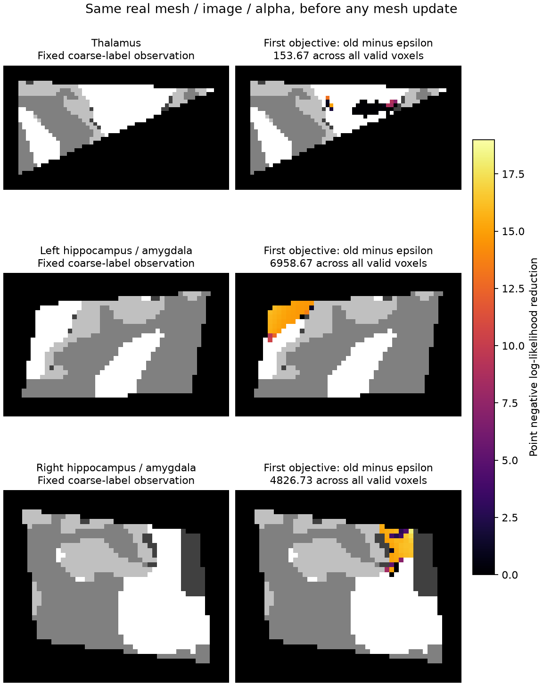

# GEMS 首次目标函数：真实同状态的 epsilon 分歧

## 结论与范围

丘脑、左海马/杏仁核、右海马/杏仁核在**第一次合成标签拟合、尚未移动 mesh**时存在公式差异。官方 GEMS 在各类 `prior × Gaussian likelihood` 求和后加 `1e-15`，再计算负对数和梯度；FNIT compact mesh objective 原先只有 `logsumexp`。这使两侧 HA 的首次梯度相对误差达到 37.7% 和 25.2%。同输入完整 autograd 加入 epsilon 后，两者分别降至 `6.27e-6` 和 `1.37e-4`。

这份提交只有隔离探针、指标和图，没有改生产 CPU/GPU。记录的是首个共享状态，尚未计算 optimizer update、强度 Gaussian EM、最终分割或完整逐区 Dice/硬体积门。此前 CPU 缓存和 crop/HA-v4 候选的失败仍见[原报告](../gems_fixes_20261004/README.md)。

## 同状态与来源

实际读取固定入口 `FNIT/README.md`、`INDEX.json`，使用 canonical `remaining_20261004/gems` 下的新 workspaces/runs。公开脱敏数据为 OpenNeuro ds000114 1.0.2、sub-02 ses-test，CC0；本次输入是已保存的官方 norm/aseg/wmparc 同输入阶段。官方细分标签没有进入探针。

- norm SHA-256：`001021a47f102bb9772f7f736b65f74740334e86dfd1afd0386ca250cb25b698`；aseg：`ea02b3cd278c8eb229a4cd6a5bec982a0a6175f7d34ab3f651696902e1a259f8`；wmparc：`bd45c6371c7d389cfc5d9ce5cabe321e362d32cce6feb35fdaea81e7606a469c`。
- 捕获冻结 `baseline-f1cbdab/src` 的实际生产 recipe；core SHA 为 `0ded484dc066097dc85dcdb95de4409878cbb694401cc944d4238b41f948737b`。每个 GEMS Python 文件、图谱/LUT/AtlasDump 及运行程序 SHA 见 [binding](binding.public.json)和三个 comparison。
- 官方安装为 `freesurfer-linux-centos7_x86_64-8.2.0-20260314-d932c45`。实际 CPython 3.8.13、NumPy 1.24.3、`cpython-38-x86_64-linux-gnu`；直接加载已安装 `gemsbindings`，二进制 SHA 为 `8125a39cd9885ada66ac2945dc5d7e38737e3bb707bce26ad6d796340fadbf82`，`ldd` 无未解析依赖。没有将此 ABI 载入 FNIT Python 3.11。
- 官方 points/reference **来自捕获的 FNIT FP32 值升到 API 所需 FP64**，没有用原 atlas FP64 坐标代替。image FP32 buffer、points、alphas 的 setter/getter 均逐值核验；means/covariances 为实际 fixed Gaussian FP32 值升 FP64；boundary matrix 也按 FNIT 实际 FP32 值升 FP64。双方使用相同有限非零 image mask、node mobility 和 stiffness。
- 每个状态均重新用 FNIT 相同 closure 计算 baseline；cost 和完整 vertex gradient 与捕获的实际生产状态**逐值相同**。三状态 reference/current 相同，官方 deformation prior 为 0。原 FP32 prior 有约 `-6.87e-4 / -3.48e-4 / -3.26e-4` 的舍入残差，均保留。

图谱资源复用已有审核资源，实际 mesh/LUT/AtlasDump SHA 再次记录。许可沿用 `licenses/FreeSurfer.txt` 和 `THIRD_PARTY_NOTICES.md`；官方库仅用于独立 benchmark，未复制二进制或上游代码进生产。完整 mesh/alpha/prior/gradient 数组只保留在私密服务器目录。

## 公式与完整梯度

对一个有效体素，令 `R = Σ_c p_c × exp(log_likelihood_c)`：

```text
原 mesh 数据项：       -log(R)
官方 mesh 数据项：     -log(R + 1e-15)
稳定实现：             -logaddexp(log(R), log(1e-15))
官方 mesh 数据项梯度： -∂R/∂vertex / (R + 1e-15)
```

epsilon 加在类别求和之后。探针没有给每类 prior 单独加 epsilon，没有只拟合 cost 数值；它经过插值、复合 log、prior、FP64 稳定归约和 sliding projection 的完整反向传播。

| 真实首次状态 | 有效体素 | 原 cost − 官方 | epsilon cost − 官方 | 原梯度相对 L2 | epsilon 梯度相对 L2 | 原/epsilon 梯度最大绝对差 |
|---|---:|---:|---:|---:|---:|---:|
| 丘脑 | 97,843 | 153.65907 | -0.005994 | 1.8083e-3 | 3.1658e-4 | 4.11055 / 1.66984 |
| 左 HA | 43,875 | 6,958.66599 | -0.003162 | 3.7707e-1 | 6.2723e-6 | 120.311 / 0.002404 |
| 右 HA | 44,255 | 4,826.72281 | -0.002969 | 2.5227e-1 | 1.3656e-4 | 288.702 / 0.183162 |

FP32 continuous prior 对官方 continuous prior 的最大差为 `3.12e-7 / 2.69e-7 / 2.24e-7`，RMSE 为约 `1.3–1.5e-8`，三个有效 mask 的覆盖均一致。density 低于 `1e-15` 的体素为 `22 / 543 / 416`。这些小 prior 的差异会被原分母放大；不能仅看 prior RMSE 判定梯度等价。官方 uint16 raster `/65535` 的误差另外保留，未把它替换为官方 continuous mesh cost 定义。

全部类别指标、cost/prior/Jacobian、完整梯度误差、array dtype/shape/SHA、原生状态和原始输出 SHA 分别见 [丘脑](thalamus_comparison.public.json)、[左 HA](ha_left_comparison.public.json)、[右 HA](ha_right_comparison.public.json)。

## 有限 CPU 内部精度探针

额外诊断在同一共享状态采用 FP64 geometry 和官方 double Gaussian 计算后转 FP32 的 mixture。梯度相对 L2 降至 `3.74e-9 / 3.16e-8 / 1.53e-8`，cost 差为 `1.70e-4 / 1.17e-4 / -7.63e-7`。它证明剩余大梯度误差主要来自小 prior 下的 FP32 几何算术；不改变默认精度。

直接 FP64 geometry 会使 CPU Numba owner dtype guard 回退，单次丘脑 closure 观察为 20.09 秒，而 epsilon FP32 为 1.32 秒。因此另做混合诊断：**原 FP32 owner IDs、候选顺序和容差，内部 FP64 插值/prior，外部 points/gradient FP32，Gaussian 保持原 FP32 log-likelihood**。

| 同状态混合诊断 | cost − 官方 | 梯度相对 L2 | 梯度最大绝对差 | 单次 closure 观察（秒） |
|---|---:|---:|---:|---:|
| 丘脑 | -0.004631 | 2.5189e-8 | 1.1418e-4 | 1.718 |
| 左 HA | -0.002009 | 3.9611e-8 | 6.5212e-6 | 1.593 |
| 右 HA | -0.002153 | 3.1406e-8 | 3.3586e-5 | 1.433 |

详细记录见 [丘脑混合](thalamus_hybrid.public.json)、[左混合](ha_left_hybrid.public.json)、[右混合](ha_right_hybrid.public.json)。nodecw7 使用相同 8 核 `32,36,40,44,48,52,56,60` 和 `nodecw7.gems.cpu8.lock`，Torch/Numba/OMP/BLAS 均为 8。单次共享状态计算含不同缓存准备，仅作实现选择观察，不声明速度收益。

官方 Python API 不暴露 tetrahedron owner IDs。本轮比较了真实 continuous raster、覆盖和完整梯度；没有宣称所有形变位置上的官方 owner 逐值等价。

## 脑图

下图为实际首次合成标签观察及 epsilon 对负对数似然的修正，选取修正最大的实际轴向层，并裁剪显示已有 ROI。它不是最终亚区分割。公开 NPZ 仅含该二维 coarse-observation 和派生 scalar correction，用于重画；不含图谱、alpha 或细分参考标签。



## 复现

`capture_fnit.py` 接受真实 `--t1/--aseg/--wmparc`、安装图谱 `--atlas`、`--structure` 和新 `--output`；校验固定真实输入 SHA，捕获 recipe 首次完整 objective 后结束。`native_state.py` 在官方 CPython3.8 环境接受 `--shared/--mesh/--output`，只进行 cost/gradient/raster oracle。`probe_shared.py --run` 读取私密共享状态；可用 `--native/--output/--modes` 指定新 oracle、输出和有限变体。`compare_state.py --run --output` 导出安全指标/二维切片；`plot_state.py` 绘图。

```bash
# 全部路径均为本次隔离诊断；生产 FNIT 不加载官方 GEMS
FNIT_BENCHMARK_PYTHON=/absolute/path/fnit/environment/bin/python
FNIT_SHARED_RUN=/absolute/path/new/private/first-state-run
FNIT_NEW_PROBE=/absolute/path/new/private/probe

# 仅做一次混合精度同状态 objective + 完整梯度，不移动 mesh
"$FNIT_BENCHMARK_PYTHON" probe_shared.py \
  --run "$FNIT_SHARED_RUN" --output "$FNIT_NEW_PROBE" \
  --modes epsilon_cpu64_interp_fp32_owner
```

实际脚本和各版本 SHA 在 binding，原队列退出码均记录。v1 捕获脚本未接收 optimizer `cache_key`，退出 1；新 v2 修正后成功，失败记录未删除。首次普通 `samseg` 包导入 90 秒超时，后续直接 ABI 扩展导入成功。baseline/source 不变，未启动完整 T1 pipeline。

公共 JSON 仅合并三报告相同的源码 SHA 表，使用相邻 `binding.public.json` 的 `$ref`；以[现有验证 decoder](../gems_fixes_20261004/report_encoding.py)可还原完整记录。binding 中保留展开后的 canonical SHA，并已逐报告核验完全相同。

## 后续与参考

已选择继续冻结 CPU-only epsilon + 混合内部算术候选，先捕获实际生产首次状态，再测试脑干、丘脑、双侧 HA 完整同输入 recipe 的全部逐区 Dice/硬体积、轨迹、dtype、RSS 和时长。当前完整分割状态仍为**未验证**。

CUDA 路径尚未改动；现有 PyTorch fallback 与 Triton fused cost 也没有这个 epsilon 的源码语义。本轮没有测 GPU 对官方的同状态或最终逐区门，不能据此称 GPU 官方等价。

- 官方实现：[`kvlAtlasMeshToIntensityImageCostAndGradientCalculator.cxx:144`](https://github.com/freesurfer/samseg/blob/2ce2b6be69f2954ea704e593a5be79c284a3a8c3/gems/kvlAtlasMeshToIntensityImageCostAndGradientCalculator.cxx#L144)，[Gaussian likelihood filter](https://github.com/freesurfer/samseg/blob/2ce2b6be69f2954ea704e593a5be79c284a3a8c3/gems/kvlGMMLikelihoodImageFilter.hxx)，[亚区 Python 实现](https://github.com/freesurfer/samseg/tree/2ce2b6be69f2954ea704e593a5be79c284a3a8c3/samseg/subregions)。上游文件实际下载 SHA 在 [oracle source binding](oracle_sources.public.json)，安装 binary 版本单独绑定。
- Iglesias 等，*A computational atlas of the hippocampal formation using ex vivo, ultra-high resolution MRI: application to adaptive segmentation of in vivo MRI*, NeuroImage 115（2015），117–137。
- Iglesias 等，*A probabilistic atlas of the human thalamic nuclei combining ex vivo MRI and histology*, NeuroImage 183（2018），314–326。
- 全部功能调用、官方命令、资产与版本历史见[亚区功能页](../../../docs/subregions/README.md)。本次首次 objective 是内部步骤，无独立官方 CLI。
