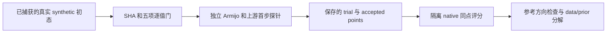
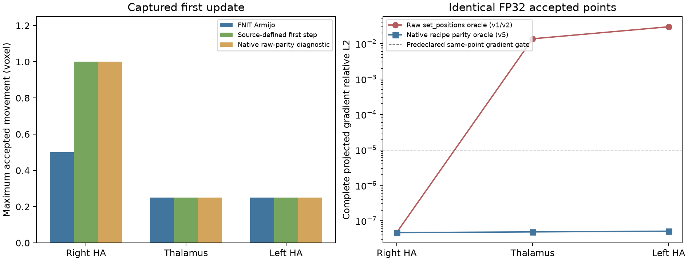

# GEMS CPU：真实共享初态、首步及原生参考方向

## 1. 功能与范围

本报告定位丘脑、左侧和右侧海马／杏仁核 synthetic stage1 的首次优化差异。复用已保存的同一真实影像、顶点、概率、Gaussian 参数和滑动边界，不重跑完整拟合。三个 Python closure 都逐值复现捕获时的 cost、完整 gradient、priors、coverage 和 points；随后分别检查既有 Armijo 首步、按上游定义实现的首步探针，以及安装版 GEMS 的一次实际优化更新。

**当前已确认右侧首步缩放不同：既有实现最大移动 0.5 voxel，安装版为 1 voxel。** 上游定义的首步探针与安装版 accepted points 舍入为 FP32 后完全一致。这个探针没有完整 L-BFGS 历史，也没有替换生产优化器。

v1/v2 原生参考适配遗漏了 `collection.transform()` 对负行列式 affine 的四面体方向修正。它直接 `set_positions()`，使丘脑、左侧在相同点上的原生 prior 为负。**v2 的梯度差异来自参考适配错误。** 三个 v5 实测已经完成；修正方向后相同点的完整梯度 relative L2 均约 `5e-8`，不需要改变 FNIT 的 absolute-reference-volume 公式。失败记录、逐 tet 的方向／ID 检查和 data／prior 分解均保留。



## 2. Python 调用、输入和输出

这组入口是独立验证脚本，不是新的生产 API。生产 `TorchGEMS` 的输入和调用仍见[功能说明](../../../docs/subregions/README.md)。脚本需要原始 capture，公开仓库只保存代码、哈希和标量结果，不保存影像、顶点、梯度或 atlas 导出。

```python
from pathlib import Path
import importlib.util
import sys
import json
import numpy as np

# 冻结的 FNIT source 必须先处于 Python 模块搜索路径中。
adapter_path = Path("validation/smri_cpu/gems_first_trial_20261005/run_real.py")
capture_path = Path("/private/capture-hippo-amygdala-right")
adapter_spec = importlib.util.spec_from_file_location("shared_gems_adapter", adapter_path)
adapter_module = importlib.util.module_from_spec(adapter_spec)
sys.modules[adapter_spec.name] = adapter_module
adapter_spec.loader.exec_module(adapter_module)

# NPZ 是该真实首态的只读快照；必须与 report.public.json 的哈希一致。
with np.load(capture_path / "shared_input.npz", allow_pickle=False) as capture_file:
    captured_arrays = {key: capture_file[key].copy() for key in capture_file.files}
capture_report = json.loads((capture_path / "report.public.json").read_text())
background_class = capture_report["background_class"]  # 读取实际背景类。
shared_closure = adapter_module.SharedClosure(captured_arrays, background_class)
initial_cost, initial_gradient = shared_closure(shared_closure.start)
# cost 为标量，gradient 为 [顶点数, 3]；均在 CPU，调用不更新初始点。
```

上例展示接口；真实验证还执行脚本中的源码／输入哈希检查和五项逐值门，不省略这些检查。

| 输入 | 结构与含义 |
| --- | --- |
| `report.public.json` | 捕获版本、背景类、首次目标和每个源文件／数组的 SHA-256；必须与实际冻结源码相同 |
| `shared_input.npz:image` | `[X,Y,Z]` CPU FP32 工作网格影像；有效 mask 为有限且非零值 |
| `vertices`、`reference` | `[N,3]` CPU FP32 工作网格 voxel-center 坐标；后者定义形变参考 |
| `tetrahedra` | `[T,4]` int64；原 atlas 的四角与四面体顺序 |
| `alphas` | `[N,C]` FP32；该阶段已经分组和平滑的逐节点概率 |
| `can_move`、`boundary_transform` | `[N,3]` bool 与 `[3,3]` affine 线性部分；定义滑动边界允许方向 |
| `means`、`variances`、`stiffness` | 固定 Gaussian 均值／方差与形变刚度；不在本探针内进行 EM 更新 |
| `fnit_vertices.npy`、`fnit_gradient.npy`、`fnit_priors.npy`、`fnit_coverage.npy` | 首态门的既存数组；同 shape、dtype 逐值复现后才执行搜索 |
| `--mesh` | 同一原作者 atlas；原生 scorer 校验其哈希、节点移动标志及 tet ID 顺序 |

可微插值、形变矩阵和标量累计使用这版捕获源码已有的 CPU FP64，外部 points／gradient 和 owner 决策保留 FP32。此处没有改变 CUDA 实现、GPU dtype、TF32 或生产默认配置。

输出为新建的实际 `0700` 私密目录：`summary.public.json`、`initial_gate.public.json`、逐试步 `trace.public.json` 记录标量；`*.private.npz` 保存实际试步的点／梯度／概率，仅保留在私密核验环境。搜索前后显式校验并恢复 image、mesh、likelihood、projection、reference、cache、anchor、refresh counters 和最后一次 scalar 状态。诊断预算耗尽是失败结果，不表示收敛。

## 3. 命令行与参数

```bash
# 独立 Python 首步：冻结 source 必须与 capture 的 source 哈希完全相同。
PYTHONPATH=/private/frozen-source/src python run_real.py \
  --capture /private/capture-hippo-amygdala-right \
  --prototype first_step.py \
  --output /private/new-python-first-step \
  --budget 64

# 已安装原软件隔离评分；不再次执行 FNIT 首步，不进行 recipe 拟合。
/path/to/verified/native/python3.8 native_trials_v5.py \
  --capture /private/capture-hippo-amygdala-right \
  --mesh /path/to/original/AtlasMesh.gz \
  --python-run /private/new-python-first-step \
  --output /private/new-native-parity-first-step
```

`run_real.py` 的 `--capture` 指向上述 capture，`--prototype` 是本目录首步实现，`--output` 必须是新目录，`--budget` 默认为每个搜索最多 64 次 closure。两个搜索从独立且相同的状态开始。`native_trials_v5.py` 的 `--mesh` 是原 atlas，`--python-run` 读取已经完成的两种试步记录；其输出也拒绝覆盖。该脚本绑定本次核验安装版的扩展路径、ABI 和 SHA，作为本次验证的原始代码记录，不能直接当作任意安装环境的通用 runner。

`decompose_same_point.py` 另外接受 `--adapter run_real.py`、`--native-run` 和 `--python-run`，在同一个 accepted point 计算原 FP32 reference 的绝对体积、带符号体积及零刚度三种对照。它不更新 points，不更改生产公式。所有变体必须保持 priors 与 coverage 完全一致。

## 4. 对应原软件内部调用与版本

首步没有独立 FreeSurfer CLI。隔离参考使用安装版内部 Python API：

```python
# calculator 的 image、Gaussian、滑动 boundary 与 FNIT capture 相同。
native_options = {
    "Verbose": False,
    "MaximalDeformationStopCriterion": 1e-10,
    "LineSearchMaximalDeformationIntervalStopCriterion": 1e-10,
    "MaximumNumberOfIterations": 1000,
    "BFGS-MaximumMemoryLength": 12,
}
native_optimizer = gems.KvlOptimizer("L-BFGS", native_mesh, native_calculator, native_options)
native_cost, native_maximal_deformation = native_optimizer.step_optimizer_samseg()
```

这些值来自实际安装的 `samseg/subregions/core.py` synthetic 阶段，而不是 base 类的默认 `0.05`。安装扩展 SHA 为 `8125a39c…`，recipe 源文件为 `beb64fa1…`；完整哈希在各 JSON 和 `bindings.public.json`。包版本 `0.5a0+17.g2ce2b6b` 与 pinned samseg `2ce2b6be69f2954ea704e593a5be79c284a3a8c3` 分开记录，源码关联不能代替实际扩展行为验收。安装 binding 没有暴露原生内部 line-search 序列；本报告公开 Python 探针的试步，原生仅报告实际同点评分与返回点。

参考方向的三项源证据：

- [`pyKvlMesh.cxx:157–204`](https://github.com/freesurfer/samseg/blob/2ce2b6be69f2954ea704e593a5be79c284a3a8c3/samseg/cxx/pyKvlMesh.cxx#L157)：wrapper 先变换 reference／current points，再在 affine 行列式为负时交换各 tet 的 p0、p1。
- [`pyKvlMesh.cxx:235–264`](https://github.com/freesurfer/samseg/blob/2ce2b6be69f2954ea704e593a5be79c284a3a8c3/samseg/cxx/pyKvlMesh.cxx#L235)：`set_positions()` 更新 reference 与 current points，没有上述 corner permutation。
- [`kvlAtlasMeshCollection.cxx:224–240`](https://github.com/freesurfer/samseg/blob/2ce2b6be69f2954ea704e593a5be79c284a3a8c3/gems/kvlAtlasMeshCollection.cxx#L224) 使用带符号的 reference volume；[变换函数](https://github.com/freesurfer/samseg/blob/2ce2b6be69f2954ea704e593a5be79c284a3a8c3/gems/kvlAtlasMeshCollection.cxx#L3645) 失效 reference 逆矩阵／体积缓存。因此不能只替换 points 就声称复现 installed recipe 的 reference frame。

v5 使用相同 captured affine 的线性部分调用真正的 wrapper，保留其 corner permutation，然后恢复**完全相同**的 capture reference/current 点值。[结构／API 前置检查](native_setup_preflight.public.json) 已通过：native 内存的 reference、current、alphas、can_move 和原始 can_move 全部逐值相同。

实际 native 写出的 mesh 验证 cell ID、point ID 的对应关系和四角顺序。static GEMS 的 [Read 函数](https://github.com/freesurfer/samseg/blob/2ce2b6be69f2954ea704e593a5be79c284a3a8c3/gems/kvlAtlasMeshCollection.cxx#L597) 将原始稀疏 ID 压缩为输入行序 ID；因此核对的是这个明确映射和完全相同的 tet 顺序，原始 ID 与导出 ID 的差异仍报告。writer 追加 `.gz`，文本坐标有最大 `5e-5` 的打印舍入。writer 坐标只用于结构检查；实际 cost／gradient 读取的是已逐值验证的内存点，不从打印坐标重建。原生输出不进入生产。

## 5. 实测精度与时间

### 首态与接受点

三处都通过 FNIT 自身捕获的五项逐值门。初态对安装版的完整投影梯度 relative L2 分别为右 `3.14e-8`、丘脑 `2.52e-8`、左 `3.96e-8`；当时形变 prior 为零，因而不能识别 v2 的负 reference 方向问题。

| 真实阶段 | 既有 Armijo 最大位移（voxel） | 上游定义首步探针 | 安装版实际首步 | native FP64 accepted 舍入为 FP32 与探针全相等 |
| --- | ---: | ---: | ---: | --- |
| 右 HA | 0.49999948 | 1.00000068 | 1.00000000 | 是 |
| 丘脑，v2 原始拓扑参考 | 0.24999889 | 0.24999889 | 0.25000000 | 是 |
| 左 HA，v2 原始拓扑参考 | 0.24999920 | 0.24999920 | 0.25000000 | 否；最大坐标差 `3.81e-6` voxel |

丘脑与左侧的 v2 原生首步并未使用 recipe 的 corner normalization，上表保留原始诊断结果，不能作两者最终接受点匹配结论。修正后的同点和首步结果以 v5 JSON 为准。

### v5 修正参考后的同点结果

三处 finite 同点门全部通过：右侧 6 项有限评分，丘脑与左侧各 4 项有限评分。两处负 affine 的 first trial 被双方拒绝，Python cost 为 `inf`，native cost 为最大 FP64 值；这两项不是 finite 接受点，不计入上述门。所有试步与实际 native optimizer 选点均在完整 JSON 中保留。

| 相同 accepted points | native−FNIT total cost | 完整 gradient relative L2 | native／FNIT prior cost | data-only gradient relative L2 |
| --- | ---: | ---: | ---: | ---: |
| 右 HA，0.5 voxel 点 | +0.002152694 | `4.65146e-8` | 4.409323982989 / 4.409323982969 | `4.85593e-8` |
| 丘脑，0.25 voxel 点 | +0.004631005 | `4.86203e-8` | 0.336156174766 / 0.336156174796 | `4.66609e-8` |
| 左 HA，0.25 voxel 点 | +0.002009734 | `5.09694e-8` | 1.121635282798 / 1.121635282761 | `5.13666e-8` |

右侧 122,333 个 reference tet 原本均为正；丘脑 135,299 个和左侧 122,333 个原本均为负，v5 使用 installed wrapper 的 p0/p1 交换后均为正。实际导出 tet/corner 全部符合这一 permutation，point/cell 的 static Read 压缩映射逐项相等。一起交换 reference 和 current 的 corner，relative Jacobian 最大差 `3.553e-15`，符合 FNIT 使用绝对 reference volume 的等价几何。

六个 data／prior 分解在相同点执行：两个负方向 capture 直接使用 signed volume 会重新引入原先的错误，而 absolute volume 与 recipe 方向规范化后的原生目标匹配；三种变体的 priors／coverage 全部逐值相等。prior gradient 是两个 FP32 投影 gradient 相减得到，relative L2 为 `1.65e-6 / 5.16e-6 / 2.44e-6`，另列其减法舍入，不用它代替上表的完整梯度门。

修正后的真实 native first step 仍返回右 1、丘脑 0.25、左 0.25 voxel。右／丘脑 native FP64 接受点转成 FP32 后与首步探针全相等；左侧仍有极小的 FP32 rounding 差，完整指标在 `hippo-amygdala-left_native_v5_summary.public.json`。三处同点评分通过并不等于完整 recipe／最终分割通过。

### v2 原始负结果与适配问题

下表是在**完全相同的 FP32 accepted points** 进行的评分，不是两个不同几何状态的梯度差：

| 阶段 | native−Python total cost | 完整投影 gradient relative L2 | v2 native prior | 解释 |
| --- | ---: | ---: | ---: | --- |
| 右 HA，0.5 voxel 点 | +0.00215269 | `4.65146e-8` | +4.40932398 | 该状态 reference 方向正常 |
| 丘脑，0.25 voxel 点 | −0.66768134 | 1.36867% | −0.33615617 | 原生 scorer 未做负 affine 的 corner reversal |
| 左 HA，0.25 voxel 点 | −2.24126083 | 2.98261% | −1.12163528 | 同上；须修正 scorer 后重新判断 |

这里不把 1.37%／2.98% 归为 FP64→FP32 的点量化。另列的不同 accepted points 梯度敏感性在原始 JSON 中保留，不能替代相同点比较。

v5 在运行前固定同点门：有限接受点的 total cost 绝对差 ≤0.01、完整投影 gradient relative L2 ≤1e-5。它们是同点目标／梯度门，不是完整分割 Dice ≥0.95、体积差 ≤5% 的替代。三例完整 recipe 和 GPU 性能在本诊断中均未验收。

### 时间观察

同一 CPU 节点、8 个物理核心，Torch／Numba／OMP／BLAS 线程都为 8。旧 native v1/v2 没有记录实际 ITK 默认线程数，v5 才通过实际 API 显式设为 8。下列旧首步观察包含不同缓存／导入路径，**没有 ABBA 配对，不能计算提速比或声称完整 recipe 加速**。

| 阶段 | Python Armijo（秒／closure 数） | 上游定义首步（秒／closure 数） | native 一次实际更新（秒） |
| --- | ---: | ---: | ---: |
| 右 HA | 5.2166 / 2 | 2.3659 / 2 | 0.2388 |
| 丘脑，v2 | 6.1083 / 3 | 5.8401 / 4 | 0.3247 |
| 左 HA，v2 | 4.8462 / 3 | 5.0336 / 4 | 0.2892 |

v5 同点评分的观察还包含每个 native mesh 的读取／变换／构造以及首次 topology dump；这些数值在原始 JSON，不能当作原软件生产步骤耗时。

本次没有生成新分割脑图。已有相同真实影像的分割图见[首态报告](../gems_first_state_20261004/README.md)，完整最终 Dice／体积负结果见[完整候选报告](../gems_cpu_epsilon_20261004/README.md)。首步标量图只展示接受位移和同点梯度误差，不作为分割效果图。



## 6. 更新与尚未完成项

| 版本／状态 | 本次变化 | 结果 |
| --- | --- | --- |
| 捕获状态和 Python 首步 | 重建实际冻结 closure，完整 mutable state 保存／恢复 | 三个真实五项逐值门通过；首步只读复用 |
| native v1 | 保留原始原生同点评分；丘脑遇到 Python 非有限拒绝点 | scorer 对 `null` cost 相减报错，原 exit=1 保留；不是拟合失败 |
| native v2 | 报告非有限拒绝点，cost 差记 `null` | 丘脑和左原生评分完成；负 prior / 同点梯度失败保留 |
| v3/v4 前置退出 | 旧右侧目录名字、Write 自动追加 gzip、static Read ID namespace 三项适配问题 | 三项均在首次 cost／gradient 之前退出；列为 setup failures，不计入数值失败；旧 log、exit 和 partial dump 保留 |
| native v5 | 先完成独立 API／映射前置门，再按 recipe 反转负 affine tet corner，native ITK 真实 API 设为 8 线程 | 三个 capture 的 finite 同点门与六个 data／prior 分解全完成，均与原始 v2 分列；没有再次运行 FNIT 首步或完整 recipe |
| 后续工作 | 右 HA 固定 likelihood 的最多 37 步、完整 CPU 优化器历史和停止规则 | 先通过新同点门，再决定有限 replay；完整 recipe 和默认接入仍待验收 |

GPU 分支和生产默认没有修改。旧 mixed CPU 候选的完整 recipe 仍有多数 HA 区域未过，以及丘脑旧通过区域退化；其失败记录保持原结论。

## 7. 原实现和参考文献

- [FreeSurfer / samseg GEMS](https://github.com/freesurfer/samseg/tree/2ce2b6be69f2954ea704e593a5be79c284a3a8c3/gems)：上述固定源码和安装扩展分别校验。
- [L-BFGS 实现](https://github.com/freesurfer/samseg/blob/2ce2b6be69f2954ea704e593a5be79c284a3a8c3/gems/kvlAtlasMeshDeformationLBFGSOptimizer.cxx)、[line search 与停止](https://github.com/freesurfer/samseg/blob/2ce2b6be69f2954ea704e593a5be79c284a3a8c3/gems/kvlAtlasMeshDeformationOptimizer.cxx)：首步最大节点 L2 归一化、strong Wolfe、zoom 的来源。
- Van Leemput et al. (2009), Automated segmentation of hippocampal subfields from ultra-high resolution in vivo MRI. *Hippocampus*, DOI [10.1002/hipo.20615](https://doi.org/10.1002/hipo.20615)。完整核团功能参考继续见[功能页](../../../docs/subregions/README.md)。
