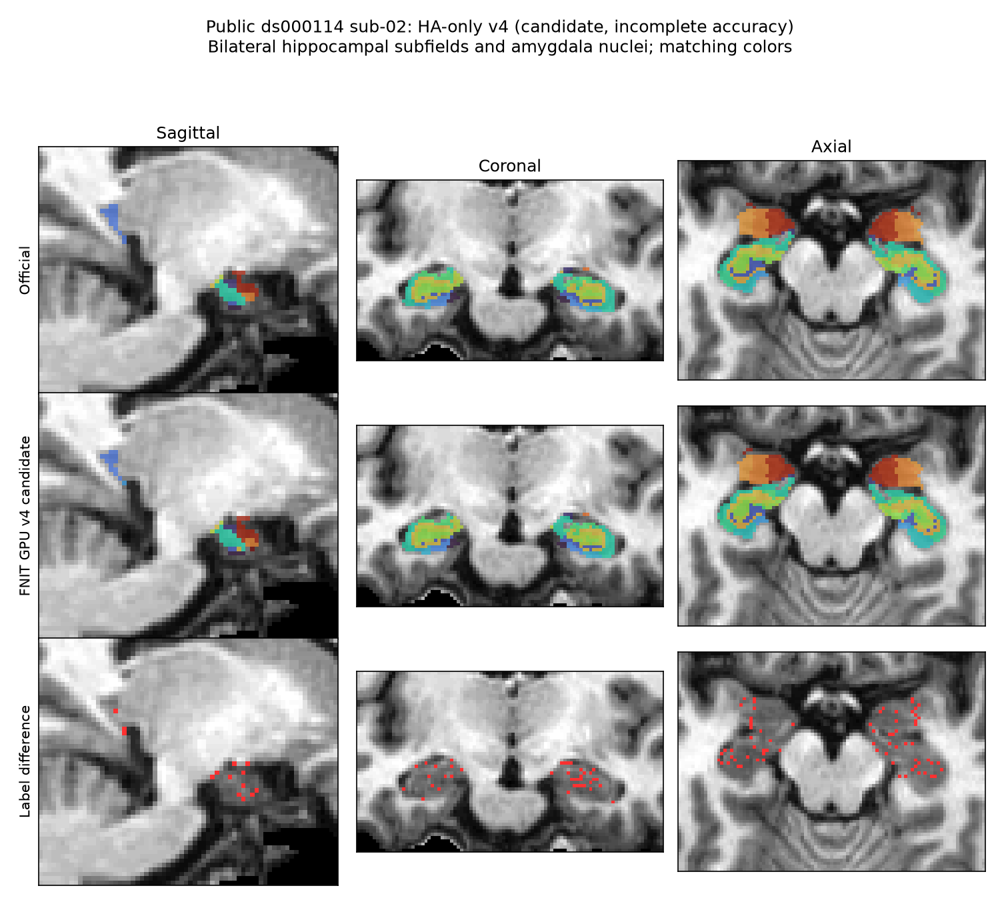

# GEMS Gaussian 修复与未通过的精度、缓存候选（2026-10-04）

本轮基线为 `f1cbdab10fbfd573c3aa1b3461aa086dab220cfb`。生产改动仅修正不带 Gaussian 超参数时的类别均值维度。CPU 固定 EM 数据缓存没有实测收益，裁剪插值候选未通过完整 GPU 逐区不退化门；两者均保存为验证补丁，未启用默认行为。丘脑和海马/杏仁核尚未达到全部区域 Dice ≥ 0.95、硬体积误差 ≤ 5% 的既有标准。

## 1. 可合入的 Gaussian 维度修复

`update_gaussians` 接受单模态图像 `[X,Y,Z]` 或多模态图像 `[M,X,Y,Z]`，以及各 Gaussian 类的责任权重 `[C,X,Y,Z]`，返回均值 `[C,M]` 和协方差 `[C,M,M]`。`mean_hyper`、`n_hyper` 分别为可选先验均值和先验样本数；`variance_floor` 控制不带先验时的协方差对角线下限。

旧代码将 `[C,M]` 的强度加权和除以 `[C]` 的类别质量，单模态可广播成 `[C,C]`，多模态则可能报错。现在使用 `[C,1]` 分母，每类、每模态除以自己的质量。带超参数的现有公式保持原样。四类亚区的强度拟合均提供两项超参数，合成标签拟合使用固定 Gaussian；因此该 bug 修复不能解释本轮亚区精度的改善，也不能计作运行时间优化。

```python
import torch
from fnit.gems.gaussian import update_gaussians

image_modalities = torch.tensor([[[[2., 4., 8.]]], [[[20., 40., 80.]]]])
class_responsibilities = torch.tensor([
    [[[3., 1., 0.]]],   # 第一类：前三个体素的责任权重
    [[[0., 0., 2.]]],   # 第二类：仅第三个体素参与
    [[[1., 1., 1.]]],   # 第三类：三个体素等权
])
gaussian_parameters = update_gaussians(image_modalities, class_responsibilities)
print(gaussian_parameters.means.shape)  # (3, 2)：三类、两模态
```

这是 GEMS 内部子函数，没有独立 FNIT 或 FreeSurfer 命令。完整 Python/命令行输入、输出、流程图、官方调用和参考文献沿用[亚区功能说明](../../../docs/subregions/README.md)。形状回归测试覆盖单模态和多模态。

## 2. 真实数据、来源和资源

使用 OpenNeuro ds000114 snapshot 1.0.2、ses-test 的公开去脸 `sub-02`；数据许可与选择见[原验证记录](../../subregions/ten_public_t1_20261002/data_selection.md)。同阶段拟合只读取已经冻结的 `norm/aseg/wmparc` 和正式图谱；官方亚区标签仅在拟合结束后评分。原始链仍未验收，本轮不以同阶段结果代替从原始 T1 的完整精度。

| 输入 | 字节 | SHA-256 |
|---|---:|---|
| norm.mgz | 1,226,981 | `001021a47f102bb9772f7f736b65f74740334e86dfd1afd0386ca250cb25b698` |
| aseg.mgz | 425,387 | `ea02b3cd278c8eb229a4cd6a5bec982a0a6175f7d34ab3f651696902e1a259f8` |
| wmparc.mgz | 519,626 | `bd45c6371c7d389cfc5d9ce5cabe321e362d32cce6feb35fdaea81e7606a469c` |

官方为现场 FreeSurfer 8.2.0-1。其 SAMSEG Python 源码 SHA 在 [preprocess_official.public.json](preprocess_official.public.json) 中，候选缓存源码及转移包 SHA 在 [cache_v1_source.public.json](cache_v1_source.public.json) 中。GEMS 图谱复用原有许可资源；没有下载或再分发新图谱，没有新增依赖。

服务器固定目录遵循 `FNIT/{workspaces,runs,logs,archive/transfers}/smri_cpu_20261004/remaining_20261004/gems`。历史源码、结果和环境实体均保留。官方预处理探针只用于隔离 benchmark；FNIT 运行时未调用 FreeSurfer、Surfa 或其他原软件。

## 3. CPU 固定 EM 数据缓存：状态一致，但未采纳

候选只在一次 CPU TorchGEMS 调用内保存固定图像的有限、非零样本及保留索引。责任权重选择、类别归约和协方差累计顺序保留，FP64 梯度、目标值和 solver 状态保留，完整后验仍导出；CUDA 不进入缓存。候选补丁见 [cpu_cache_v1_candidate.patch](cpu_cache_v1_candidate.patch)，测试见 [cpu_cache_v1_candidate_checks.py](cpu_cache_v1_candidate_checks.py)。这些文件供隔离复现，不由 FNIT 导入。

nodecw7、8 个固定物理核 `32,36,40,44,48,52,56,60`，锁为 `nodecw7.gems.cpu8.lock`；独立冷进程顺序运行 baseline/cache，计时覆盖加载、拟合、保存和验收所需的参数导出。

| 同阶段完整脑干 | baseline | cache-v1 |
|---|---:|---:|
| 冷进程墙钟（秒） | 636.617 | 639.147 |
| API（秒） | 632.479 | 635.445 |
| 采样进程树峰值 RSS（GB，十进制） | 3.711 | 3.821 |

原网格/高分辨率标签、全部 21 通道后验、最终顶点、Gaussian 均值/协方差、全部 objective、solver 状态和最小 Jacobian、几何、体积表完全相同，[完整 CPU 状态比较](cpu_cache_nodecw7_comparison.public.json)通过。墙钟增加 0.40%，RSS 增加约 3.0%；没有端到端速度或内存收益证据，因此生产入口已恢复无该缓存的实现。过载 nodecw10 的早期运行不与 nodecw7 时间混合；其队列在当前 arm 完成后停止。

GPU0 为同一 H100 UUID `26e41f63-1a65-6b3e-5370-fa9a2934ca8e`、TF32 默认策略。缓存两臂的完整脑干状态也完全相同，[GPU 比较](gpu_cache_comparison.public.json)通过；峰值 allocated 2.641 GB、reserved 3.941 GB 均相同。49.137/46.104 秒的进程时间发生在外部任务占用约 66 GB、GPU 95–100% 利用率期间，只作为观测，不作为稳定速度保证。

## 4. 首次预处理分歧与裁剪候选

三家族合成标签逐值相同，工作图形状相同，网格原点差 ≤ 1.8e-6 个原网格体素。首先可修复的分歧是 T1 三次插值：现实现先在整张图像构造系数再裁剪；官方先裁剪，采用 mirror 边界、逐轴 FP32 系数，并处理非负强度的负振铃和舍入支持范围。[真实消融](cubic_crop_probe.public.json)保留各分量的对照。

| 未加二值掩膜的工作 T1 | 原实现 RMSE | crop-v2 RMSE | crop-v2 最大绝对差 |
|---|---:|---:|---:|
| 丘脑 | 4.2289 | 9.54e-8 | 7.63e-6 |
| 左海马/杏仁核 | 6.5399 | 3.05e-5 | 7.40e-4 |
| 右海马/杏仁核 | 6.7690 | 2.61e-5 | 6.48e-4 |

所有候选强度差均小于 0.001。这个数值仅统计预处理差，不改变标签验收阈值。生产形态学掩膜施加后，丘脑 RMSE 从 4.2315 降至 0.16997；海马仍分别为 0.15604/0.66980，说明掩膜还有独立分歧。[前](preprocess_baseline.public.json)、[后](preprocess_crop_v2.public.json)均已保存。

### 完整 crop-v2 GPU 逐区门：未通过

冻结源为缓存候选加 [crop_v2_candidate.patch](crop_v2_candidate.patch)，两臂均完整运行四项结构、导出全部后验与拟合状态，旧/新进程时间 484.963/482.805 秒。峰值 reserved 均为 6.954 GB；共享 GPU 负载污染计时，不能据此报告提速。评价沿用同一 [固定网格审计](../../subregions/reproducibility_20261002/analyze_repeatability.py)：native 以 norm 为固定网格，HR 以官方原 HR 联合网格为基准，Dice ≥ 0.95、硬体积相对官方误差 ≤ 5%，两者空标签记 NA。

| 家族/网格 | baseline 通过/非空 | crop-v2 通过/非空 |
|---|---:|---:|
| 脑干 native、HR | 4/4、4/4 | 4/4、4/4 |
| 丘脑 native、HR | 30/45、32/47 | 29/45、29/47 |
| 左海马/杏仁核 native、HR | 7/28、5/28 | 5/28、7/28 |
| 右海马/杏仁核 native、HR | 1/28、0/28 | 1/28、1/28 |

丘脑 native/HR 分别丢失 4/5 个既有通过区。该候选已从默认生产路径撤回；强度更接近官方不能替代最终标签验收。[完整逐区报告](gpu_crop_v2_official_score.public.json)保留改善、退化和原有通过区损失。原始 T1 连续链须在同阶段门通过后再运行。

## 5. 二值掩膜的独立定位

重新导出官方实际 `longMask` 及两个中间二值掩膜；没有用 `T1 != 0` 推测掩膜。以 FNIT 自身工作网格的 FP32 坐标及 half-up 最近邻取样，三个家族的 merged mask 均逐值匹配官方；旧 affine64 最近邻分别有 833/1455/419 个不同体素。使用 `rint` 最近邻仍有 2813/780/1457 个不同体素，不能替代 half-up。

左侧线性阈值掩膜的膨胀结果从 17 个差异降为 0，右侧从 314 降为 30；矩阵也采用 FP32、或改用 FP32 三线性求和仍不能消除右侧剩余差异。[binary_mask_v4.public.json](binary_mask_v4.public.json)记录所有变体。取样坐标的精度属于本次 GEMS recipe 候选，评分网格没有变化。

组合候选见 [crop_mask_v3_candidate.patch](crop_mask_v3_candidate.patch)和[源码 hash](crop_mask_v3_source.public.json)。实际工作图在施加掩膜后，丘脑 RMSE 为 1.076e-7、左侧为 1.009e-5，两者非零支持均逐值匹配；右侧 RMSE 为 0.20337，仍差 30 个支持体素，[完整预处理差分](preprocess_crop_mask_v3.public.json)已保存。

完整 GPU v3 新臂复用本轮 baseline，477.612 秒，rc=0。丘脑仍为 native 29/45、HR 29/47，丢失 4/5 个旧通过区；左侧 native 7/28 保留、HR 5/28→6/28，右侧 native 1/28→2/28、HR 0/28→4/28。后两家族没有丢失旧通过区，但仍须检查每个未通过区的变化，[完整区域报告](gpu_crop_mask_v3_official_score.public.json)和[区域变化极值](regional_delta_summary.public.json)均已保留。

| v3 的全部非空区 | 最坏 ΔDice | 最好 ΔDice | 最大硬体积误差增加（比例） |
|---|---:|---:|---:|
| 左海马/杏仁核 native | −0.00410 | +0.04464 | +0.02941 |
| 左海马/杏仁核 HR | −0.00317 | +0.01198 | +0.01031 |
| 右海马/杏仁核 native | +0.00729 | +0.15405 | +0.12500 |
| 右海马/杏仁核 HR | +0.01071 | +0.16267 | +0.01900 |

因此，右侧 Dice 改善也不能证明每项体积误差不退化；该组合没有进入默认生产路径。


此图仅在 norm 网格作最近邻显示，数值评分使用上面的固定网格审计；候选仍未达到完整逐区精度标准。

### HA-only v4：保留旧通过区，但误差仍有退步，未采纳

将改动只用于海马/杏仁核，丘脑返回旧准备路径；[候选补丁](ha_v4_candidate.patch)和[源码 hash](ha_v4_source.public.json)已经冻结。完整 GPU 新臂 475.770 秒、rc=0，原有各家族通过区全部保留：脑干 native/HR 4/4，丘脑 30/45、32/47，左 HA 7/28、6/28，右 HA 2/28、4/28。完整[逐区分数与 Δ](gpu_ha_v4_official_score.public.json)和[全部非空区极值](regional_delta_summary.public.json)记录了每项退步。

| v4 全部非空区 | ΔDice 最小/最大 | 硬体积误差 Δ 最小/最大 |
|---|---:|---:|
| 脑干 native | 0 / +0.000085 | −0.000169 / 0 |
| 脑干 HR | 0 / 0 | 0 / 0 |
| 丘脑 native | −0.000909 / 0 | 0 / +0.001765 |
| 丘脑 HR | 0 / 0 | 0 / 0 |
| 左 HA native | −0.004098 / +0.044643 | −0.062500 / +0.029412 |
| 左 HA HR | −0.003166 / +0.011979 | −0.011321 / +0.010309 |
| 右 HA native | +0.007290 / +0.154052 | −0.200000 / +0.125000 |
| 右 HA HR | +0.010713 / +0.162672 | −0.068924 / +0.018997 |

HR 的未改丘脑指标完全相同；native 合并受其他结构重叠竞争影响仍有微小差异。左侧若干区域 Dice 下降、右侧若干硬体积误差增加，因此 v4 也未作为默认 GPU 改动采纳。默认 CPU recipe 没有改变，没有进行未通过同阶段门的原始 T1 连续链。下一个诊断重点是初始 atlas alignment、首次 mesh evaluation、Gaussian EM/solver 状态；目前丘脑的实际工作图已经匹配到浮点误差，继续只改插值不足以解释最终标签差异。



已无用途的 nodecw7 baseline all 在写入 stop_file 后只对自有进程组发送 SIGTERM，[主动终止事件](nodecw7_recipe_active_termination.public.json)明确记录；该 arm 返回 −15，3151.131 秒，属于主动终止的未完成运行，不作完整 benchmark。过载 nodecw10 的早期脑干 baseline 已完成，4811.045 秒；它与 nodecw7 时间不混合，cache 新臂按预先 stop_file 不启动。

## 6. 复现与版本记录

探针均要求新输出路径，防止覆盖冻结结果。`official_preprocess_probe.py` 在隔离官方环境运行，只执行初始化；`compare_preprocessing.py`、`cubic_crop_probe.py` 和 `binary_mask_probe.py` 在各自冻结 FNIT 源码下运行。`score_stage.py` 只在完整 worker 结束后读取标签并调用原审计 helper；`wait_for_queue.py` 在两臂记录均为 complete 后运行后验/参数比较。

```bash
# 生产修复测试：无需服务器、图谱或原软件
PYTHONPATH=src python -m pytest tests/gems -q

# 拟合结束后的评分，所有变量使用绝对路径；不改变拟合输入
python score_stage.py --candidate "$candidate_artifact_directory" \
  --baseline "$baseline_artifact_directory" \
  --official-root "$official_stage_directory" --like "$norm_image_path" \
  --audit-helper "$fixed_grid_audit_path" --output "$new_score_report_path"
```

候选 patch/test 必须在独立的 f1cbdab 源码中应用；默认测试目录只保留 Gaussian 维度回归。生产修复的 GEMS 测试为 433 passed / 44.51 秒。缓存候选的完整源码包还包含相同的 no-hyper bug 修复，四项成熟亚区 recipe 不经过该分支。2026-10-04：缓存 whole-state CPU/GPU 通过但无收益，crop-v2 GPU 精度退化而撤回，crop+mask-v3 的 HA 部分改善但全家族门仍失败。此前 CPU/raw 和十例 GPU 记录见[功能版本历史](../../../docs/subregions/README.md)。

## 7. 报告无损精简与安全交付文件

三份完整 GPU recipe 报告的 baseline 逐值完全相同，现只在 [gems_shared.public.json](gems_shared.public.json) 保存一次；重复 metric grid 和未观测重复的空统计也使用同文件 JSON pointer。三份源码 manifest 保留完整逐文件 SHA，通过共用基表与各变体覆盖/删除列表表示。
科学指标、所有非空/空区、失败 gate、警告、实际源文件 SHA 均未删除。原 crop-v2 的 `compact` 文件已核验为完整报告的逐值子集，没有独有字段，撤下这个重复副本。

此次仅改变存储形式：相关报告从 **8,035,065 B / 234,307 行**变为 **3,145,368 B / 32,770 行**，包含共用表。
[编码核验 manifest](report_encoding_manifest.public.json)保存精简前 canonical SHA、精简后文件 SHA、逐份大小/行数和无损比较结果。
本地展开后的七份对象均与原对象逐值相同，canonical SHA 也通过独立重读核验；远端冻结原始报告保持原实体和原格式。

```bash
# 从当前文件夹展开完整分数；新的输出路径必须不存在
python report_encoding.py decode gpu_ha_v4_official_score.public.json \
  /absolute/path/new_full_ha_v4_score.json

# 重读所有共享引用，核验原科学记录和 source SHA
python report_encoding.py verify /absolute/path/gems_fixes_20261004
```

直接 `json.load` 会读到 `$ref` / `$base` 存储记录；继续做分析时使用 [report_encoding.load_report](report_encoding.py) 或先展开。
这只影响归档报告的读取，不改变 `score_stage.py` 评分、原网格、阈值或运行时。

| 必要交付 | 文件/用途 |
|---|---|
| 唯一生产修复 | `src/fnit/gems/gaussian.py`、`tests/gems/test_gaussian_class_mass.py`、`docs/subregions/README.md`；仅 no-hyper class-mass 轴修复 |
| recipe 全部科学结果 | 本 README、三份 `gpu_*_official_score.public.json`、`regional_delta_summary.public.json`、`gems_shared.public.json`、`report_encoding.py` 与其核验 manifest；逐区失败和退步均保留 |
| 实际源码与运行/失败身份 | 三份 `*_source.public.json`、`run_manifest.public.json`、`recipe_final_run_manifest.public.json`、`nodecw7_recipe_active_termination.public.json`；共用 source SHA 基表不可单独丢弃 |
| 缓存不采纳证据 | `cpu_cache_nodecw7_comparison.public.json`、`gpu_cache_comparison.public.json`；整例完整状态一致，但 CPU 时间/RSS 无收益 |
| 初次分歧及脑图 | 各预处理/二值 mask/cubic 探针与 JSON，v3/v4 两份 PNG及对应 JSON；失败 recipe patch/checks 保留为诊断附件，不启用为生产路径 |
| 额外只读 FNIRT 定位 | [FNIRT_READONLY.md](FNIRT_READONLY.md)、`fnirt_posthoc_probe.py`、两份 `fnirt_posthoc_*.public.json`；无 FNIRT 运行时修改 |

安全接入结论：只采用 Gaussian-only 修复；CPU cache、crop-v2、crop+mask-v3 和 HA-only v4 均不改变默认执行路径。

## 原实现与参考

- [FreeSurfer SAMSEG subregions](https://github.com/freesurfer/freesurfer/tree/dev/python/packages/samseg/subregions)：各结构预处理、Gaussian 超参数及 mesh 拟合流程。
- [FreeSurfer cubic B-spline 实现](https://github.com/freesurfer/freesurfer/blob/dev/utils/mriBSpline.cpp)：系数及边界规则。
- [FreeSurfer MRI 取样实现](https://github.com/freesurfer/freesurfer/blob/dev/utils/mri.cpp)和[矩阵类型](https://github.com/freesurfer/freesurfer/blob/dev/include/matrix.h)：取样及坐标精度诊断的来源；当前分支链接提供源码入口，实际 benchmark 版本由上面的 SHA 绑定。
- 结构图谱论文和官方命令见[功能参考文献](../../../docs/subregions/README.md)。
