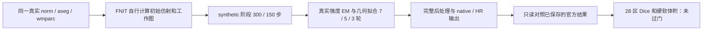
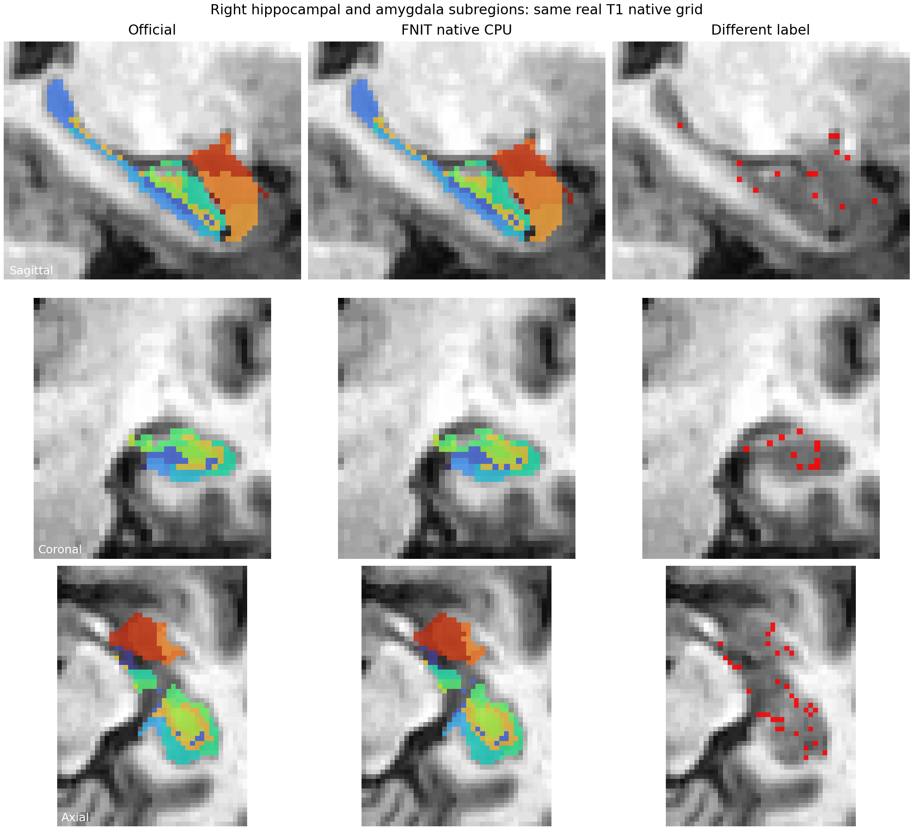

# GEMS CPU 候选：完整右侧海马和杏仁核验收未通过（2026-10-06）

## 1. 功能和结论

显式 CPU 候选完成了一例公开真实 MRI 的右侧海马/杏仁核全部 recipe，API 墙钟 **3110.73 秒（51.85 分钟）**、峰值 RSS **11.84 GB**。原生空间 **9/28** 区、HR 空间 **6/28** 区同时达到预先固定的 **Dice ≥0.95、硬体积差 ≤5%**；全部 28 区均非空。**完整功能验收失败，候选没有进入 main 的运行代码。**

本目录是独立验证报告，基于 main `7eb2a7f2`，不改生产源码、默认 CPU 或 GPU 路径。实际运行源码为候选 `7e9d511ac524`（未合入 main 的候选提交） 的冻结 v2；该提交尚未作为公开已验收功能采用。完整源码/输入/输出 SHA 见 [BINDINGS_V2](BINDINGS_V2.public.json)，快速结果见 [SUMMARY](SUMMARY.public.json)，逐区表见 [REGIONS.csv](REGIONS.csv)。



`synthetic` 是官方 recipe 的阶段名称：将这份真实 T1 对应的粗标签映射成固定类别强度。它不是模拟 MRI。输入已经准备好 `norm/aseg/wmparc`，本例不等于原始 T1 自动预处理或 recon-all 全链验收。公开数据来源为 OpenNeuro `ds000114` 1.0.2。

## 2. Python、输入和输出

### 复现候选完整调用

下列参数属于未采纳的候选源码，不能把示例当作 main 已发布的配置。完整拟合只执行了本报告记录的一次 v2；后续分析没有再拟合。

```python
from fnit import segment_4_subregions

right_subregions = segment_4_subregions(
    t1="/data/example/norm.mgz",                    # 已准备的三维 T1 强度图
    coarse_segmentation="/data/example/aseg.mgz",   # 与 T1 同网格的整数粗分割
    wmparc="/data/example/wmparc.mgz",               # 同网格白质分区，估计 Gaussian 超参数
    atlas_root="/data/verified_subregion_atlases",  # 经大小和 SHA 校验的图谱资源
    structures="hippo-amygdala-right",             # 本次仅验右侧 recipe
    device="cpu", threads=8,                       # 固定 8 个物理 CPU 核
    optimization="balanced",                      # 请求的原配置
    cpu_mesh_profile="native",                    # 候选新增的显式 CPU profile
    output_dir="/data/results/right_subregions",    # 标签、统计、metadata 和报告目录
    save_highres=True, save_posteriors=False,       # 保存 HR 标签；不保存稠密后验影像
)
```

`cpu_mesh_profile=None` 保留原路径，`"native"` 仅允许 CPU；CUDA 请求会报错。该配置使用 Double 点、参考点、QR 投影、Gaussian 和优化器状态，独立 detached FP32 owner 查找。公共 Atlas/EM 概率仍归一化；内部 mesh 数据项保留原 prior 质量并加 `1e-15`。它优先于 fast 的采样、owner hint 和 20 步近似，实际采用完整体素、30 个位置步、EM 上限 100。完整 recipe 没有读取官方保存 affine、精细点或 Gaussian。

### 阅读已保存结果

```python
import json
from pathlib import Path

validation_directory = Path("validation/smri_cpu/gems_native_cpu_rha_failure_20261006")
summary_file = validation_directory / "SUMMARY.public.json"
summary = json.loads(summary_file.read_text(encoding="utf-8"))
print(summary["regional_groups"])                   # 两空间各自通过/非空计数
print(summary["full_run_scalar_receipt"]["API_wall_seconds"])
for regional_result in summary["regions"]:         # 56 行：28 区 × 2 空间
    print(regional_result["space"], regional_result["name"],
          regional_result["dice"], regional_result["hard_volume_relative_to_official"])
```

输入文件和输出结构：

| 项目 | 格式、空间及作用 |
|---|---|
| `norm` | 3D 强度图，原生 256×256×256、1 mm；本次保存 SHA 与 scorer 的 `--like` 相同 |
| `aseg` / `wmparc` | 与 norm 同 shape/affine 的整数标签，分别提供粗目标和组织采样 |
| atlas | 海马/杏仁核网格、标签、对齐影像及必要参数；实际读取文件 SHA 固定 |
| `subregions_native.nii.gz` | int32 原生标签；右侧编码加 10000；qform=0、sform=2，header 与 norm 一致 |
| HR 标签 | int32、约 0.33333 mm；保存输出 shape 150×187×199。评分用官方 HR 基底和 union FOV，固定网格 151×187×199，无标签驱动配准 |
| `REGIONS.csv` | `space,label,name`、官方/FNIT 体素计数、Dice、硬/软 mm³、相对误差、`passed/nonempty` |
| `METADATA.public.json` | 28 个 ID↔名称↔体积表完整性、header、空间和输出 SHA 核验 |
| `CENTROIDS_V2.public.json` | 保存标签各自原空间与固定评分网格质心，RAS mm；没有估计新 transform |
| `SUMMARY.public.json` | 单份 56 行表、5 个阶段时钟、资源/政策/哈希；不重复 step/trial trace |
| `FULL_RHA_RESULTS.public.json` | 原始完整标量评分，1,747,890 B；保留目标历史、线搜索标量和重复审计结构，SHA `feb0c1f4…`。不含 MRI、网格坐标/梯度/prior/posterior/owner 数组 |

硬体积 = 标签体素数 × 固定网格体素体积；相对误差以官方体积为分母。软体积来自各实现的后验积分；native/HR 表中复用同一实现的软体积，不是两次独立估计。Dice 的双方空区值为 `None`，本例双方空区为 0，不用空区充当通过项。

## 3. 命令行

本目录脚本只对已保存输出评分/作图，不会调用原软件、重建或注册。`score_full_rha.py` 的全部必需参数如下：

```bash
python score_full_rha.py \
  --candidate-run /data/results/full-RHA \
  --official-root /data/reference/subregion_results_parent \
  --like /data/example/norm.mgz \
  --bindings /data/results/posthoc_bindings.private.json \
  --output /data/results/full-RHA-score
```

- `--candidate-run`：包含 `summary.private.json` 和 `artifacts/` 的本次完整输出；输出文件大小/SHA、计划和源码必须匹配。
- `--official-root`：官方保存结果的**父目录**，脚本按原规则追加 `hippo-amygdala/`。
- `--like`：本次固定的 norm，定义原生评分网格。
- `--bindings`：本次私密运行的完整参考路径/大小/SHA 和 helper/source25 绑定文件；公开报告保留哈希，不公开服务器路径。
- `--output`：新评分目录，保存原始 JSON 和 CSV。

`audit_completed_metadata.py` 和 `centroids_completed_v2.py` 使用 `--artifacts`、`--official-root`、`--scored-results`、`--output`；分别指候选 artifact 目录、上述官方父目录、已有完整 score JSON、新报告位置。`plot_full_rha.py` 使用 `--like`、`--candidate-artifacts`、`--official-labels`、`--scored-results`、`--output`；官方标签路径是原生 MGZ，其他参数对应 norm、候选 artifacts、已有 score、作图目录。它们先核验已有源/输出 SHA 和计数，不重新运行 mesh。

候选 CLI 对应 `fnit segment-4-subregions ... --cpu-mesh-profile native`，尚未作为 main 已验收选项发布。官方内部 mask/EM/mesh 没有独立新增 CLI。

## 4. 对应原软件

完整官方亚区入口为：

```bash
segment_subregions hippo-amygdala --cross SUBJECT_NAME --sd /data/SUBJECTS_DIR
```

该入口处理两侧，需要已经准备好的 FreeSurfer 被试。本轮复用已有官方 final labels/体积表，不重新运行它，FNIT 完整拟合不调用 FreeSurfer。实际安装版 Python recipe 文件 SHA 为 core `beb64fa1…`、hippocampus `e935323c…`；已审的 C++ 源绑定 upstream `2ce2b6be…` 和实际扩展 SHA，不能把没有 `.git` 的安装包当成 Git checkout。

官方 synthetic 与 intensity 的位置/线搜索区间阈值均为 `1e-10`，LBFGS memory=12；intensity 的 recipe 每 outer EM 仍限制 30 个位置步。该 schedule 已接线，但有限同点门只检查目标与梯度，不自动保证初始对齐、工作图、mask、超参数或最终标签一致。

## 5. 真实精度、耗时、脑图及差异原因

### 完整结果

| 固定评分空间 | 非空区 | 同时通过 Dice/硬体积 | 平均 Dice | 最低 Dice | 最大硬体积差 |
|---|---:|---:|---:|---:|---:|
| native 1 mm | 28 | 9 | 0.87908 | 0.32000 | 43.75% |
| HR 约 0.33333 mm | 28 | 6 | 0.89362 | 0.66165 | 19.24% |

最大软体积差为 **21.29%（Right-fimbria）**。例如 Right-Medial-nucleus 的 native 官方/FNIT 分别为 16/9 体素，Dice 0.32、硬体积差 43.75%，软体积差 3.88%；HR Dice 仍只有 0.66165。小核团的 1 mm 离散计数会放大相对误差，但 HR 仍低，不能把完整差异全部解释为低分辨率舍入。

| 阶段 | mesh 步/评估 | 准备秒 | EM+mesh 秒 | 阶段总秒 |
|---|---:|---:|---:|---:|
| synthetic 1，σ=3 | 300 / 711 | 3.058 | 755.402 | 758.475 |
| synthetic 2，σ=2 | 150 / 341 | 0.228 | 365.030 | 365.260 |
| intensity 1，σ=1.5 | 210 / 561 | 21.805 | 1149.614 | 1171.420 |
| intensity 2，σ=0.75 | 150 / 249 | 9.281 | 507.884 | 517.167 |
| intensity 3，σ=0 | 90 / 107 | 0.004 | 280.373 | 280.379 |

API 3110.729 秒包含本例对齐、准备、全部拟合、后处理和结果保存；runner 包含成功后私密状态转储共 3113.037 秒，启动校验/导入另 2.272 秒。嵌套 stage 不重复相加。EM+mesh 列没有把两者单独剖分，selected-state cache rebuild 计数也不是包含所有 rejected trial 的总工作次数。最小最终 Jacobian 0.203417；CUDA 未初始化。官方同节点新端到端墙钟不可用，**本轮不能报告等价重建提速比**。

### 真实脑图

以下为固定 union foreground bbox 的三正交中点切片。左为官方、中为 FNIT、右为不同标签（红色）；没有挑选最高 Dice 切片，也没有为显示拟合对齐。原始输入是公开真实 MRI。图例另见 [28 区图例](RHA_region_legend.png)。



### 已证实的实现差异与尚未证明的因果

安装版 recipe 与冻结 FNIT 源码的逐段证据、精确 SHA/行号见 [PREPROCESS_SOURCE_AUDIT](PREPROCESS_SOURCE_AUDIT.public.json)。本次是静态审计和保存产物分析，没有新增 mask 或注册运算。

| 环节 | 官方定义与 FNIT 现状 | 当前证据及改进顺序 |
|---|---|---|
| 初始对齐 | 官方 1 mm/margin6/球形开运算后，rigid→affine 两次 robust registration；FNIT 原粗 mask、margin15、FP32 soft-Dice LBFGS | 算法差异已证实，优先独立移植。未找到相应官方初始 affine，尚不能量化其贡献 |
| 工作图 | 官方 mri_convert cubic 分辨率及 aligned-atlas corner 裁剪；FNIT 显式 ceil/center grid、SciPy cubic、mesh-bounds margin 裁剪 | 网格/插值定义不同；尚未逐体素比较阶段准备图 |
| 固定 stage mask | 官方 uint16 原 alpha 质量和 >0.99；FNIT F32 几何全1 occupancy 的 covered。两者再用相同半径3/5侵蚀 | mask primitive 不同且 FP32 发生在准备边界；实际 mask 差尚未测量。同点梯度门不能覆盖该准备环节 |
| Gaussian 超参数 | 组织 median/count 概念接近；partial-volume grid、uint16 原质量阈值 >0.97 与 FNIT normalized-prior covered 不同 | Double EM 接线通过不证明采样支持/超参数相同；需先独立核对输入 |
| 最终概率/后处理 | 官方 uint16 posterior/volume 和直接 LCC；FNIT Double 概率、closing 选 component、native coarse support 截断 | 定义差异已证实；closing 不新增标签体素。应复用保存 final state 拆分其影响 |

不同环节会改变整个拟合路径。此前四个真实保存点的 mesh cost/gradient/coverage 门通过，表明 CPU 网格目标接线正确到所声明精度；本例自行准备的连续 recipe 从对齐/工作图开始，因此不能用这些同点结果替代完整验收。

**不是阶段间 FP32 顶点存储造成的差异**：本候选 Atlas 点/参考点和 `with_vertices` 跨阶段保留实际 Double。源中固定 stage mask 与薄层超参数的 F32 rasterization 是独立边界，应单独分析。

保存标签质心在 RAS mm 的距离：native 中位 0.21790、最大 0.88960；HR 中位 0.19420、最大 0.64243。按官方硬体积加权的 FNIT−官方方向分别约 `[-0.09039,-0.03586,0.00921]` 与 `[-0.07038,-0.03425,-0.00166]` mm；19/28 区与该方向正点积。这个微弱整体方向可以描述已保存标签，**不是初始 affine 的因果证明**，没有根据 final labels 反拟合 transform。

## 6. 最近版本与未完成项目

- v1：有限真实 CPU 同点/EM 和默认 GPU 数值保护完成；新增 materialize 合同发现 native Double 顶点与 F32 output alpha/occupancy 的两个 dtype 错误。v1 完整作业在出口前主动终止，记录于 [FULL_V1_ABORT](FULL_V1_ABORT.public.json)，不记为完成或时间 benchmark。
- v2：仅修这两个 CPU 输出边界，其他 24 源文件 SHA 不变，[source bridge](OUTPUT_DTYPE_SOURCE_BRIDGE.public.json)保留反向字节证明；实际单批 51 合同与默认 GPU 保护已由协调者独立复核。唯一完整 recipe exit0，final ROI 未过门；没有启动第二完整拟合。
- 只读评分：原 waiter 路径前置错误保留于 [POSTHOC_SETUP](POSTHOC_SETUP.public.json)。最终固定网格、LUT、体积表、SHA 和 28 区非空检查通过。
- 作图/质心：默认拟合环境缺 Matplotlib、质心 v1 JSON 的 NumPy shape 类型错误、已有 cache 的 mkdir 前置错误均保留为报告/setup 失败，未混入 ROI failed counts。只改输出整数字段并复用已有绘图环境后，两者 exit0；环境没有安装新包。见 [READONLY_SETUP](READONLY_SETUP.public.json)。

下一步首先独立实现并比较官方 mask 预处理及 robust rigid/affine，对相同输入、shape/header、目标函数/停止规则作单项验收。再检查工作图、stage mask、超参数和保存末态后处理。当前不切换默认，不以这次候选完整耗时宣称加速，也不自动重跑整版 GEMS。

## 7. 原代码、数据与参考文献

- [FreeSurfer/SAMSEG 原代码](https://github.com/freesurfer/samseg/tree/2ce2b6be69f2954ea704e593a5be79c284a3a8c3)：本报告以实际安装文件 SHA 和扩展绑定为准。
- [FreeSurfer 海马亚区](https://surfer.nmr.mgh.harvard.edu/fswiki/HippocampalSubfields)、[杏仁核核团](https://surfer.nmr.mgh.harvard.edu/fswiki/AmygdalaNuclei)。
- Iglesias JE et al. A computational atlas of the hippocampal formation using ex vivo, ultra-high resolution MRI: application to adaptive segmentation of in vivo MRI. *NeuroImage* 115, 117–137 (2015). [DOI](https://doi.org/10.1016/j.neuroimage.2015.04.042)。
- Saygin ZM et al. High-resolution magnetic resonance imaging reveals nuclei of the human amygdala: manual segmentation to automatic atlas. *NeuroImage* 155, 370–382 (2017). [DOI](https://doi.org/10.1016/j.neuroimage.2017.04.046)。
- Reuter M et al. Highly accurate inverse consistent registration: a robust approach. *NeuroImage* 53, 1181–1196 (2010). [DOI](https://doi.org/10.1016/j.neuroimage.2010.07.020)。
- [OpenNeuro ds000114 1.0.2](https://openneuro.org/datasets/ds000114/versions/1.0.2)：公开真实影像；本目录仅发布标量统计、metadata、验证脚本和派生脑图，不发布 MRI/网格数组、模型权重或原软件程序。
