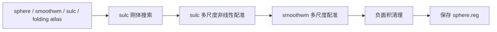

# 完整左半球球面配准：同输入官方对照

## 1. 功能与本轮范围

本轮完整执行 `run_register_sphere`：sulc 刚体搜索和非线性配准、smoothwm 配准、末尾负面积清理、表面保存。输入来自此前完成的公开 OpenNeuro **ds000114 v1.0.2 case01** FNIT CPU v3 重建，为完整左半球 **119,451 顶点、238,898 面**。官方和两版 FNIT 读取同一 sphere、smoothwm、sulc 和 folding atlas。

共同源码冻结于 `eea929d4ab61e92a858ead52eb04a6885893680f`，归档 SHA-256 为 `607a0cc03dc7b5ba007c17c6598134f6f18fd1f531549ecbb96f9eae481dfd50`；运行前后 1,225 份源码的哈希不变。两臂只切换 `mris_register_average_numba.py`，旧 SHA 为 `7ec07156…`，新 SHA 为 `488b2c2d…`。完整哈希见[公开记录](results/full_cpu_registration.public.json)。



本轮核验同一完整阶段输入。原始 T1 的上游拓扑、white/pial 和脑区统计沿用此前整例结果，没有重新运行。

## 2. Python 调用与输入输出

```python
from pathlib import Path
import torch
from fnit.recon_all.mris_register_run import run_register_sphere

subject_surface_directory = Path("/data/subject/surf")  # 同一被试、同一半球的有序表面
folding_atlas_path = Path("/data/assets/average/lh.folding.atlas.acfb40.noaparc.i12.2016-08-02.tif")
registered_surface_path = Path("/data/output/lh.sphere.reg")
registered_surface_path.parent.mkdir(parents=True, exist_ok=True)
torch.set_num_threads(8)  # 与官方同为八个 CPU 线程预算
registration_report = run_register_sphere(
    sphere=subject_surface_directory / "lh.sphere",
    smoothwm=subject_surface_directory / "lh.smoothwm",
    sulc=subject_surface_directory / "lh.sulc",
    atlas=folding_atlas_path,
    output=registered_surface_path,
    overlap_device="cpu",       # 末尾负面积清理在 CPU
    averaging_device="cpu",     # 本次采用 CPU 保序并行平均
)
```

- `sphere`：FreeSurfer 三角表面，float32(N,3) 球面坐标和 int32(F,3) 有序面，surface RAS/mm。
- `smoothwm`：同顶点和面编号的皮层几何，提供距离、面积和曲率目标。
- `sulc`：同一顶点顺序的 (N,) 标量特征；不是影像体素图。
- `atlas`：相应半球的 folding TIFF，沿用已校验的外置模板。
- `output`：保存注册球面；父目录须存在。输出坐标沿用 sphere 的坐标约定，有序面及 volume geometry 保留。
- `overlap_device`、`averaging_device`：分别控制末尾清理和梯度平均设备，均默认 CPU；没有缩减配准轮数。
- 返回字典包含四输入/输出 SHA、sulc seed SHA、选中步长和尺度轨迹、清理 history、API 及子阶段时间。子阶段时间包含关系见下表，不能重复相加。完整参数和异常见[公开接口](../../../docs/recon_all/SPHERE_REGISTRATION_PERFORMANCE.md#函数输入输出与默认值)。

## 3. CLI 与重放

产品 CLI 仍是 [fnit-recon-all-python](../../../docs/recon_all/README.md)；本轮独立阶段使用诊断 CLI。每臂使用独立新进程、新输出目录和独立 Numba 缓存，固定 `PYTHONPATH` 为共同源码，仅通过 `--average-source` 选择旧或新平均器：

```bash
CUDA_VISIBLE_DEVICES= OMP_NUM_THREADS=8 MKL_NUM_THREADS=8 \
OPENBLAS_NUM_THREADS=8 NUMBA_NUM_THREADS=8 \
PYTHONPATH=/data/frozen_common_source/src \
NUMBA_CACHE_DIR=/data/results/candidate_numba_cache \
taskset -c 3,7,11,15,19,23,27,31 \
python validation/smri_cpu/recon_fixes_20261004/benchmark_full_registration.py \
  --sphere /data/subject/surf/lh.sphere \
  --smoothwm /data/subject/surf/lh.smoothwm \
  --sulc /data/subject/surf/lh.sulc \
  --atlas /data/assets/average/lh.folding.atlas.acfb40.noaparc.i12.2016-08-02.tif \
  --average-source /data/frozen_candidate/src/fnit/recon_all/mris_register_average_numba.py \
  --output /data/results/candidate --threads 8
```

`--sphere/smoothwm/sulc/atlas` 为实际阶段输入；`--average-source` 是唯一切换的源码；`--output` 必须是新目录；`--threads` 固定 Torch、Numba 线程预算，Torch interop 为 1。诊断包装记录 108 次实际平均调用，保存完整注册表面及私密轨迹报告。

[比较脚本](compare_full_registration.py)接收 `--runs` 和 `--report`：前者含 baseline/candidate/official 表面和相应队列 `record.json`，检查全部进程已成功后比较；后者保存报告。[绘图脚本](plot_full_registration.py)读取声明的真实表面和报告，不运行重建。原始 MRI、完整表面数组和私密路径不随仓库发布。

## 4. 官方命令

独立参考为 **FreeSurfer 8.2.0-1**。实际程序 SHA-256 为 `75137b92fcbed63b441e6214b5b923d7664f05d00c454b62da724dec26636f80`。

```bash
# 在独立 benchmark 的 FreeSurfer 模块环境运行；FNIT 生产不调用它。
mris_register -curv -threads 8 \
  /data/subject/surf/lh.sphere \
  /data/assets/average/lh.folding.atlas.acfb40.noaparc.i12.2016-08-02.tif \
  /data/results/official/lh.sphere.reg
```

原程序从同目录读取对应的 smoothwm/sulc。三臂在 nodecw7 同一组八个物理核心 `3,7,11,15,19,23,27,31` 内串行执行，CUDA 隐藏。Torch 2.5.1、Numba 0.61.2、NumPy 1.26.4、nibabel 5.4.2。

## 5. 最新精度、完整时间和脑图

三份保存结果的 **358,353 个坐标分量均相同**，MAE/RMSE/max 为 0 mm；有序面和完整解码 volume geometry 相同，坐标有限，保存后负面积面数量均为 0。旧/新 sulc seed、刚体角度/分数/评价次数、接受步长、尺度/轮数、清理 history 均相同。官方文件与 FNIT 文件的整体 SHA 不同，报告分别保留，未宣称文件逐字节一致。

| 范围 | 旧 FNIT | 新 FNIT | 官方 |
|---|---:|---:|---:|
| 新进程墙钟：导入、JIT、读取、完整配准与保存 | 764.907 s | 348.038 s | 261.199 s |
| 完整 API，含输入输出 | 762.455 s | 345.714 s | 未拆分 |
| 108 次平均累计，含首次 JIT，包含在 API 中 | 227.280 s | 48.069 s | 未拆分 |
| sulc 总阶段，含下行刚体搜索 | 605.737 s | 195.651 s | 未拆分 |
| sulc 刚体搜索 | 152.859 s | 49.294 s | 未拆分 |
| smoothwm 总阶段，含准备/积分/清理 | 156.673 s | 150.018 s | 未拆分 |
| 进程树采样最大 RSS | 0.724 GB | 0.723 GB | 0.237 GB |

本组新进程旧/新为 **2.198 倍**；新 FNIT 仍比官方慢 **33.25%**。这是每臂一次的共享节点观测。旧、新、官方运行前后 1 分钟负载分别为 21.07→34.18、34.18→31.62、31.62→25.43。未修改的刚体搜索在平均器调用之前执行，其耗时也大幅波动；不能把整段 416.87 秒减少全归因于平均器。此前平均器 ABBA 的 4.189 倍独立保留。


左图为同一真实输入的 smoothwm+sulc；中间两图为官方/新 FNIT 的 sphere.reg，按同一输入 sulc 着色。此图展示球面注册坐标，未将其解读为新的 white/pial 或皮层厚度图。

## 6. 近期记录与剩余工作

| 记录 | 范围及结论 |
|---|---|
| `c2485205` | GPU 保序平均与已有完整配准回归，见功能页的冻结历史记录 |
| `f1cbdab1` → 本轮平均器 | 119,451 点真实梯度的 CPU/GPU 1/16/256 轮 ABBA，逐值相同；CPU 256 轮 4.189 倍 |
| `eea929d4` 共同源码与旧/新单文件 | 本轮完整左半球与官方同输入逐点一致，CPU 新进程 348.038/官方 261.199 秒 |

没有新跑完整双侧配准或原始 T1 recon-all。上游拓扑不同导致此前 44 张顶点图、12 张注释缺少同索引对应，仍为 NA。官方皮层分区、厚度/面积/体积/曲率的整例门继续见[剩余清单](../REMAINING.md)。同输入阶段通过不能填补上游输入差异。

## 7. 原代码与文献

原实现入口：[FreeSurfer mris_register](https://github.com/freesurfer/freesurfer/tree/d932c45b7941662ea380a05efef580568b98d41a/mris_register)，积分与变形位于[utils](https://github.com/freesurfer/freesurfer/tree/d932c45b7941662ea380a05efef580568b98d41a/utils)。本轮源码为 FNIT 已有移植和保序并行平均，运行时不依赖 FreeSurfer 安装。

Fischl B, Sereno MI, Tootell RBH, Dale AM. *High-resolution intersubject averaging and a coordinate system for the cortical surface*. Human Brain Mapping 8(4):272–284, 1999。[论文](https://pubmed.ncbi.nlm.nih.gov/10619420/)。
