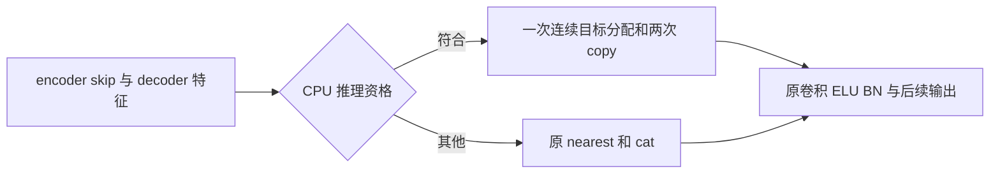

# SynthSeg CPU decoder 拼接候选

## 1. 功能简介

本候选只减少普通 SynthSeg 2.0 分割与皮层分区 U-Net 的 CPU 临时缓冲。
最后四级 decoder 的原操作先将特征最近邻放大两倍，再与 encoder skip 拼接；
候选直接构造同样连续的 NCDHW 拼接张量。先写 skip 通道，再通过整数索引
复制低分辨率特征。卷积、ELU、BN、后验、标签、软体积及精度策略不变。

适用条件是 CPU、FP32、eval、无梯度、无调用者 autocast、全网络无观察 hooks、
连续 NCDHW 输入及精确两倍空间尺寸。其他调用保留原路径，包括 CUDA、训练、
有梯度、channels-last、容器/叶子/global hooks。`cpu_conv.py` 的原后端分块与
大 1×1×1 oneDNN 投影防崩分支保留。没有新增依赖。



这是独立候选分支，完整原始 T1 与实际 H100 回归通过前不作生产验收。
本仓库 `SynthSegPlus` 对应普通 `--parc`，仍未实现 robust SynthSeg+。

## 2. Python 调用与输入输出

公开 API 与参数没有变化，见 [SynthSeg](../../../docs/synthseg/README.md)
和 [皮层分区](../../../docs/synthseg_plus/README.md)。例如：

```python
from fnit import SynthSeg

segmentation_model = SynthSeg(
    weights="/path/to/verified_weights",  # 已校验的 H5 与配套标签目录
    device="cpu",  # 本候选的适用设备
    threads=8,  # 相同官方对照的计算线程预算
)
segmentation_result = segmentation_model(
    image="case02_T1w.nii.gz",  # 单幅真实3D T1，不读取参考标签
    keep_geometry=False,  # 返回约1 mm的RAS网格
    color_lut=None,  # 沿用原保存接口
)
segmentation_result.segmentation.save("case02_synthseg.nii.gz")
segmentation_result.write_volumes_csv(
    source="case02_T1w.nii.gz",  # CSV的输入标识
    path="case02_synthseg.vol.csv",  # 32前景结构与颅内软体积
)
```

内部 `join_nearest_cpu(skip, value)` 输入均为 CPU FP32 五维张量：
`skip=(B,C_skip,2D,2H,2W)`、`value=(B,C_value,D,H,W)`。调用方先完成上述资格
检查。输出为新的连续 `(B,C_skip+C_value,2D,2H,2W)` 张量；前部通道来自
skip，后部是 factor-two nearest，输出与两输入不共享存储。内部函数不修改
线程、oneDNN、TF32或autocast状态，不提供公共参数。

## 3. 命令行与阶段复现

公开命令仍为：

```bash
fnit synthseg --i case02_T1w.nii.gz --o case02_synthseg.nii.gz \
  --weights /path/to/verified_weights --csv-vols case02_synthseg.vol.csv \
  --device cpu --threads 8
# 皮层普通模式加 --parc；皮层快速模式再加 --fast。
```

有限阶段脚本 `stage.py` 的参数如下。数组与 checkpoint 保留在私密运行目录，
不随本报告分发。

| 参数 | 含义 |
|---|---|
| `--mode capture` | 用已验收 CPU CNN 产生最后级 skip/nearest source，在尚未消费的最后卷积之前声明停止；不输出完整预测 |
| `--mode baseline/candidate` | 对同一 checkpoint 比较原 nearest+cat 与候选 broadcast copy |
| `--source` | 已冻结、六个实际源码 SHA 符合门槛的 FNIT src 目录 |
| `--checkpoint` | 新的 capture 目录；后续阶段只读取并校验文件 SHA |
| `--report` | 本阶段独立 JSON 路径 |
| `--array` | 已绑定 case02 的正确192×224×256预处理 FP32数组；仅 capture 读取 |
| `--input` | 同一公开原始T1；capture核对其SHA |
| `--weights` | 已核验的模型资源目录；仅capture使用 |
| `--helper` | 冻结候选 `cpu_join.py`；candidate记录其SHA |
| `--repeats` | 进程内操作次数，默认4；各次保留耗时和输出SHA |

`run_stages.py` 配置上述 Python/worker/source/helper/input/array/weights，
另指定 `--run` 新运行目录、`--lock` 同节点共享锁和 `--affinity` 同一八物理核。
按 capture→A1→B1→B2→A2 串行；每阶段 timeout 600秒、10秒后强制结束。
冷进程/GNU time/RSS与内部copy秒数分别记录，checkpoint读写/hash不计为copy。

## 4. 原软件调用

```bash
mri_synthseg --i case02_T1w.nii.gz --o official_synthseg.nii.gz \
  --cpu --threads 8 --vol official_synthseg.vol.csv --noaddctab
# --parc 与 --fast 使用相应普通2.0模式。
```

nearest+cat 是 CNN 内部操作，没有独立官方命令。原软件只用于隔离参考；
候选推理不调用 FreeSurfer 或 TensorFlow。

## 5. 本版精度、时间与验证范围

基线提交 `6763958572d577e33258f5a2e83bb796e451cae3`。CPU卷积分块文件 SHA
`78a0fac2300a45a01ff6790d24218f825ebc21a21f2033a8e6b8c58ebb60dc47` 不变，
实际阶段 producer 六个 SynthSeg 文件与已验收 `candidate_large_pointwise_v3`
逐个核对。预先声明门见 [acceptance.json](acceptance.json)。

本地关键合同：**31 passed**，包括两网络32³完整输出逐值对照、四级实际分派、
单体素轴/多batch/通道顺序、signed zero/NaN bits、stride、独立storage、
autocast、训练/梯度及各类hooks回退。这些不是真实速度 benchmark。

完整 `tests/synthseg_parc` 回归为 **70 passed、6 skipped、3 subtests**。
其中四个WMH mock缺少成熟pipeline已要求的状态属性，使用协调者原源码也会失败；
本候选未修改WMH生产代码。test-only 提交 `be1cc745` 给TinyModel补入该属性后通过，
不将原有失败归因于本候选。

公开CC0 OpenNeuro ds003138 case02的正确模型网格为192×224×256。
有限阶段先由合格原CNN捕获最后一级decoder输入，在尚未消费的最后卷积之前
声明停止；这是partial capture，没有完整预测。v3复用同一不可变checkpoint，
候选资格检查与实际全网络no-hooks遍历包含在每次计时内。

| 有限阶段v3（四个ABBA冷进程、每个4次） | 原 nearest+cat | 候选 |
|---|---:|---:|
| 16次操作的中位耗时 | 0.9723 s | 0.5294 s |
| 两个进程的最大RSS | 6,773,888 / 6,773,828 KiB | 4,804,300 / 4,804,240 KiB |
| 两个进程墙钟（包含读取/hash） | 35.916 / 33.612 s | 35.662 / 31.762 s |

每次输出含792,723,456个FP32值，全部bits、shape、stride、skip-first通道顺序
与独立storage通过；输入值未改。局部中位提速 **1.84×**；copy/hash/io的冷进程墙钟
单列。全部门及SHA见 [CPU_JOIN_STAGE.public.json](CPU_JOIN_STAGE.public.json)。
旧小尺寸profile不用于本版占比。完整原始T1 CPU与实际H100 GPU分别验收，
此阶段通过不代表完整网络提速；当前两者仍待完成，不作全功能通过声明。

原33类 CPU已完成的严格标签与CSV门和实际脑图见
[已有实测](../../smri_cpu_20261004/t2_seg/README.md)；这些是历史基线，
不能改标为本候选结果。

## 6. 本次记录

- v1：CPU限定一次目标分配、split spatial axes broadcast copy；卷积和精度未改。
- harness首次将controller命名 `queue.py`，遮蔽标准库queue，Torch导入前失败。
  没有产生CNN checkpoint；失败receipt/log保留。更名 `run_stages.py` 后在
  全新目录派发，不覆盖失败记录或在跑源码。
- v2：同一真实checkpoint的helper-only计时及逐值结果通过，但其资格检查未在timer内，
  未作正式性能验收；v3在同一checkpoint上加入实际网络资格检查，16次再次通过。
- 全oneDNN slab和中层oneDNN混合的case02新标签误差保持在原报告；不复跑
  已拒路线，不放宽tie或硬标签门。

## 7. 参考文献与源码

原实现：[SynthSeg](https://github.com/BBillot/SynthSeg)；Billot et al.,
NeuroImage 2023；普通皮层入口及原权重定义见
[FreeSurfer mri_synthseg](https://github.com/freesurfer/freesurfer/tree/dev/mri_synthseg)。
nearest与cat的候选是仓库自有张量拷贝实现；现有 WMH生命周期helper提供
资格与hook保护设计参考，没有复制无关原软件代码。
