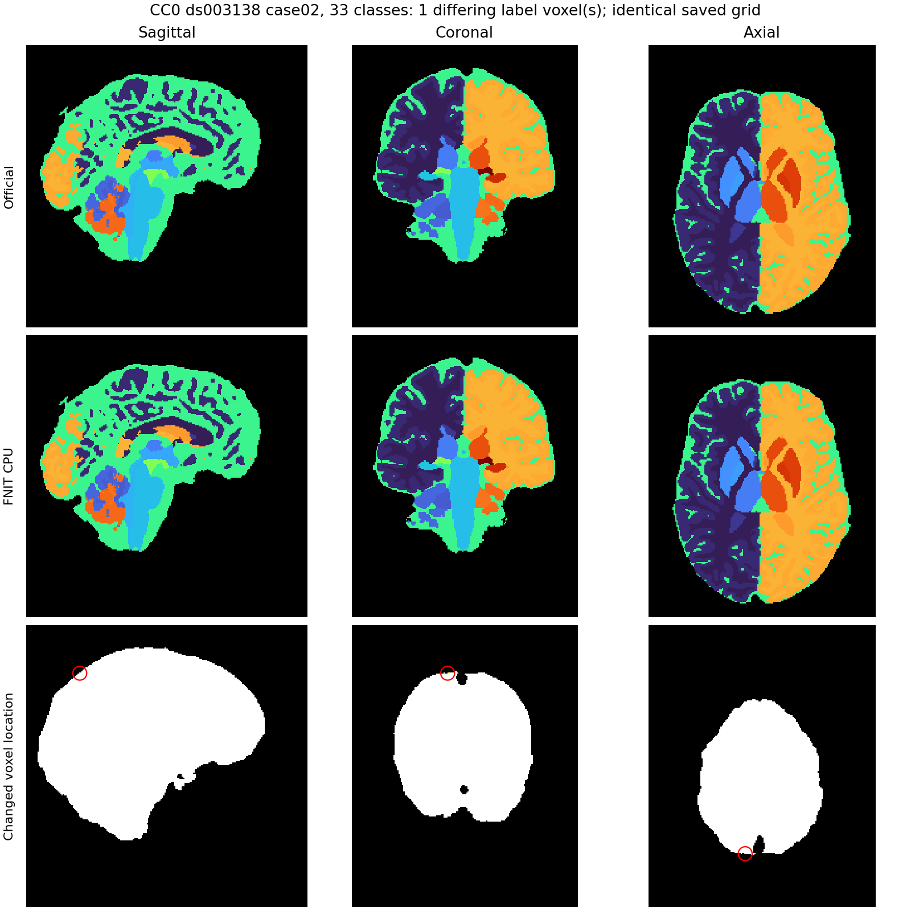

# SynthSeg 普通体积分区：CUDA精度作用域修复

## 1. 功能简介

本阶段修复普通 SynthSeg 2.0 `--parc` / `--parc --fast` 首次调用时，lazy皮层模型构造覆盖调用者全局CUDA精度的bug。构造与实际前向分离；默认True保留此前计算，新增False/None覆盖两个网络和全部高斯平滑。缓存声明匹配，正常和异常退出均恢复调用者开关。CPU不写CUDA状态，没有新增依赖或低精度模式。


生产源码冻结为 `46eead65807265395982e6968b0ce48c750c1672`，对照基线为已通过CPU单缓冲拼接的 `0215f0c480a4ff566d1ebf853a59a481b4e4d5e7`。本次12个原始T1完整进程、CPU/GPU真实特征阶段与有限合同门均通过。完整输出保留在私密运行目录，公开报告只包含标量指标、资源/源码SHA与匿名设备采样。

`SynthSegPlus` 对应普通2.0加体积分区；原版 `--robust` SynthSeg+ 仍未实现。本次不更改普通33类 `SynthSeg` 类/模型数学、CPU卷积、大体积防崩、CPU拼接或安装入口。

## 2. Python调用与输入输出

```python
from fnit import SynthSegPlus

parcellation_model = SynthSegPlus(
    weights="/data/fnit-weights",       # 已校验的主网络与标签资源
    parc_weights="/data/fnit-weights",  # 已校验的皮层网络
    device="cuda:0",                   # 明确目标CUDA设备
    cudnn_tf32=True,                    # 默认；False关闭cuDNN TF32，None逐次继承
)
parcellation_result = parcellation_model(
    t1="case02_T1w.nii.gz",  # 原始3D T1，仅资源校验读取输入，不读取官方结果
    keep_geometry=False,    # 原版RAS约1mm输出网格
    fast=False,             # 普通主网络翻转集成；True为原版fast
    min_pad=128,            # 最小补零体素数
    volumes=True,           # 101列软体积，mm³
)
parcellation_result.segmentation.save("case02_33class.nii.gz")
parcellation_result.cortical_parcellation.save("case02_cortex.nii.gz")
parcellation_result.combined.save("case02_combined.nii.gz")
parcellation_result.write_volumes_csv(
    source="case02_T1w.nii.gz",  # CSV的输入标识
    path="case02_volumes.csv",   # 101个数值列
)
actual_precision = parcellation_result.precision  # 实际网络与平滑的标量记录
```

完整输入格式、原参数及输出结构见[功能页](../../../docs/synthseg_plus/README.md#2-python-调用)。`cudnn_tf32`是新增关键字参数；`precision`是结果末尾默认None的可选字段，原位置参数顺序不变。

| 策略 | CUDA实际执行 | 退出状态 |
|---|---|---|
| True，公开默认 | cuDNN TF32=True、matmul TF32=True | 恢复两个原开关 |
| False | cuDNN TF32=False、matmul TF32=True | 恢复两个原开关 |
| None | cuDNN继承每次调用前开关、matmul TF32=True | 恢复两个原开关 |
| CPU上的任一声明 | 不写CUDA开关 | 保留原CUDA状态 |

FP32张量、调用者autocast和CPU后端策略保持原样。False不是关闭所有TF32；缓存按声明的True/False/None匹配，不以临时有效状态判断。缓存不匹配在读T1前抛ValueError；缓存拒绝或内部分区调用失败时Plus.precision为None。None缓存可在后续串行调用中继承不同cuDNN状态。`device=None`的既有自动选择兼容保留，没有更改其预处理设备参数。进程全局CUDA开关要求串行调用或独立进程。

源码及合同证据：

| 文件 | SHA-256 |
|---|---|
| precision.py | `3790b1b661f6934287ca7b90c9c445470f81b97e99ea3a10c3656b7d0e688147` |
| pipeline.py | `9405c223a6fe3c8b1caa18c8d5a0b1112187bc011d3e0f627ad53b71bb509f29` |
| segment.py | `9329348c6174785df4de2624344e63b141ad7c795238c8b7dd62f47f34495061` |
| synthseg_plus.py | `6ee00e460e2aed9156b3981950aefa007c06c78b6e9a731d68429aee4e4870a0` |

普通33类Segmenter整class AST与基线相同，公开synthseg.py文件SHA未改。所有13/14份实际源码SHA、同输入与五资源的大小/SHA见完整JSON，首次验证及最后本地检查均一致。

## 3. 命令行与复现

```bash
fnit synthseg --parc --i case02_T1w.nii.gz --o case02_combined.nii.gz \
  --weights /data/fnit-weights --parc-weights /data/fnit-weights \
  --csv-vols case02_volumes.csv --device cuda:0 --threads 8
# fast分区加 --fast。CLI沿用True，没有新增精度开关。
```

阶段与完整验证脚本是本报告的固定输入核验工具，不是新公共入口。

| 脚本/参数 | 含义 |
|---|---|
| real_stage.py `--root` | 已核对FNIT固定索引的根目录；从已声明任务位置取真实输入、准备数组和资源 |
| real_stage.py `--source/--binding` | 冻结FNIT src及两组源码SHA/commit绑定 |
| real_stage.py `--arm/--device/--output` | baseline或candidate、cpu或cuda:0、不存在的输出目录 |
| run_stage.py `--root/--python/--worker/--binding/--baseline/--candidate` | 现有Conda与冻结worker/源码；按旧/新两个进程运行 |
| run_stage.py `--run/--lock/--affinity/--device` | 新运行目录、共用锁、八核亲和性与设备；每arm单独取锁 |
| collect_stage.py `--run/--output` | 只比较已保存阶段五数组SHA，不推理；输出必须不存在 |
| full_policy.py `--root/--source/--binding/--output` | 已核对索引、冻结源码/绑定和不存在的完整结果目录 |
| full_policy.py `--arm/--mode/--policy/--device` | baseline/candidate、parc/parc-fast、true/false/none、cpu/cuda:0；baseline只允许true |
| run_full_policy.py `--root/--python/--worker/--binding/--baseline/--candidate` | 冻结整例配置；每arm独立进程，600秒上限 |
| run_full_policy.py `--run/--lock/--affinity/--device` | 新目录与每arm共用锁；CPU4arm、GPU8arm，GPU另外测试False/None |
| collect_full_policy.py `--run/--binding/--comparator/--official/--output` | 只比较已保存图/CSV/影像头；既有官方目录只在此读取 |
| run_collect_policy.py `--root` | 对两份完整队列顺序做只读比较，600秒上限；不再运行网络或原软件 |

完整worker校验原始T1和资源后走原公开API，不替换preprocess或后验。Python函数观察不添加Module hooks，保留CPU拼接资格。完整worker SHA `383ed337…`；controller `4c560f14…`；collector `4b946ad6…`。每份JSON绑定实际执行版本，未回填后改源码。

## 4. 原软件调用

```bash
mri_synthseg --parc --i case02_T1w.nii.gz --o reference/case02_parc.nii.gz \
  --vol reference/case02_parc.csv --cpu --threads 8 --noaddctab
# --fast对应快速体积分区。
```

本次复用此前同输入、nodecw7相同八物理核/八线程的正式官方结果，不重跑官方。原软件源码、五资源SHA及每个输出SHA绑定于[正式官方记录](../seg_memory_20261005/OFFICIAL_NODE7_FAST_BA_REPEAT.public.json)，本次重新核对参考map/CSV SHA相同；该报告SHA为 `37a0d5fed95cbd6a3aaae097ea6e7dab5c6473f2f0f54613f813223aa8bc3e55`。原软件只用于对照，不进入FNIT生产路径。

## 5. 最新精度、时间和内存

### 完整原始T1输出门

公开CC0 OpenNeuro ds003138 case02，同一原始T1 SHA `73e3866d…`，真实网络网格192×224×256。CPU为nodecw7八物理核32,36,40,44,48,52,56,60；H100显式目标UUID `e25cac06-0ce8-a833-abf9-09ab18c9c9ba`，内部cuda:0，八CPU线程。各arm独立进程、依次取得原共用锁。

| 门 | CPU | H100 |
|---|---|---|
| 默认普通/fast旧新三图 | 不同体素0，三图压缩文件SHA逐项相同 | 不同体素0，三图压缩文件SHA逐项相同 |
| 完整header/affine/dtype/extensions | 逐项相同 | 逐项相同 |
| 101列软体积旧新 | 最大差0，CSV文件SHA相同 | 最大差0，CSV文件SHA相同 |
| 实际模型/输入/输出 | FP32、CPU；CUDA全局不写 | FP32、目标CUDA；模型参数FP32，无autocast |
| candidate构造/正常退出 | 开关保留 | 开关恢复；修复旧版lazy构造的matmulFalse→True副作用 |
| False与None继承关闭状态 | 小网格CPU保持CUDA开关 | 两个完整模式三图/CSV/header相同并恢复调用者状态 |

CPU/GPU有限真实特征阶段各有旧版2case+新版8case，完整小CNN/平滑FP32执行，默认五输出数组逐值/文件SHA相同；True/None继承True、False/None继承False均相同。五个声明异常覆盖preprocess、seg网络、fast平滑、parc网络、parc平滑；实际CUDA模型/输入下均恢复开关。该32³ cube来自已校验真实192×224×256准备数组，替换preprocess并使用诊断affine，**不是原始T1整例或空间精度benchmark**。

有限合同共116 passed、5 skipped、3 subtests，5.57s，覆盖CPU/模拟CUDA状态、device=None自动选择、正常/异常恢复、缓存提前拒绝、动态None和结果位置兼容。这些有限测试不替代上述真实全流程。

### 同已保存官方结果的差异

| 设备/策略 | 普通parc不同体素 / 最小Dice | fast不同体素 / 最小Dice | 普通/fast CSV最大差，mm³ |
|---|---|---|---|
| CPU默认True | 5 / 0.99982140 | 1 / 0.99997630 | 0.657 / 0.220 |
| GPU默认True | 328 / 0.99843211 | 498 / 0.99581940 | 118.280 / 121.600 |
| GPU新增False | 0 / 1.00000000 | 2 / 0.99997630 | 0.200 / 0.346 |
| GPU新增None，调用前cuDNN=False | 与False同 | 与False同 | 与False同 |

默认输出与此前相同，没有通过换默认策略缩小旧新误差。False是在接口新增后单独验收的效果：本例普通parc硬标签逐值同官方，软体积仍有浮点尾差；fast还有2个不同体素。不能据此称所有输入或全部官方指标完全等价。每区Dice/硬体积及每列CSV差见两份完整JSON。

### 完整计时与分步骤

| 设备/模式/声明 | 旧/新API，s | 旧/新冷进程外层，s |
|---|---|---|
| CPU普通True，AB | 49.898 / 51.018 | 52.680 / 53.577 |
| CPUfast True，BA | 35.474 / 35.347 | 38.009 / 38.160 |
| H100普通True，AB | 10.068 / 9.732 | 14.859 / 13.609 |
| H100 fast True，BA | 7.097 / 6.937 | 10.830 / 10.773 |
| H100普通False / None继承False | 10.410 / 10.706 | 14.756 / 15.506 |
| H100 fast False / None继承False | 7.713 / 7.758 | 12.140 / 11.928 |

旧/新顺序对普通为AB、fast为BA，每功能只有这一组；共享GPU同时有其他进程，不能用这些时间宣称稳定加速或精度开关无任何计时影响。CPU普通新API本次比旧版约慢2.2%，fast约快0.36%；主要CNN数学未变，本次不作为CPU性能优化。既有同节点官方冷CLI普通/fast为48.296/33.784s；本worker另有资源校验、三图与报告，而官方只保存合并图/CSV，两种冷边界并列，CPU速度目标仍未通过。

| 新版阶段 | CPU普通/fast，s | H100默认普通/fast，s | 原软件同边界 |
|---|---|---|---|
| 资源校验、导入及准备 | 1.742 / 1.963 | 2.581 / 2.557 | 既有报告未独立记录 |
| Plus外层构造，模型lazy加载包含在API | 0.001 / 0.001 | 0.002 / 0.001 | 未独立记录 |
| 完整API（含lazy加载、预处理、网络、后处理及软体积） | 51.018 / 35.347 | 9.732 / 6.937 | 未拆同边界 |
| 三图和CSV保存 | 0.439 / 0.454 | 0.526 / 0.584 | 未拆同边界 |

单个CNN/平滑没有开启同步计时，避免改变完整执行；真实特征阶段的诊断时间包含多种政策和故意异常，不能与完整API或官方时间累加。

### 显存

所有CUDAarm设置20,000,000,000 B分配器上限，实际allocated/reserved均在上限内。默认旧新两种峰值逐字节相同。

| 策略/模式 | allocated峰值，GB | reserved峰值，GB | 本进程树driver采样最大值，GB |
|---|---|---|---|
| 默认True普通（旧=新） | 12.568 | 18.207 | 18.772 |
| 默认True fast（旧=新） | 12.568 | 18.900 | 19.464 |
| False/None普通 | 10.454 | 15.162 | 15.724 |
| False/None fast | 10.454 | 15.590 | 16.152 |

GB按10⁹ B计。分配器硬上限为18.63GiB；它不限制cuDNN/driver的全部外部分配。本次另外从controller子进程树匹配目标GPU，按同一时刻求本树合计driver内存：每arm18–26个采样、14–20个非零本树采样，查询失败0，实际最大间隔0.786s。采样值均小于20GB，**不能证明未采样的绝对物理峰值**。不保存其他进程PID/命令。匿名整GPU最高约67.2GB，包含共享背景，与本树和Torch数值分开。

### 脑图

下图复用此前公开case02 CPU标签图：本次默认CPU普通/fast合并NIfTI压缩SHA与图所绑定前版CPU输出分别相同，已有官方结果SHA也相同。它展示本次不变的CPU输出和差异，不是新增False/None脑图；未重读/发布原始MRI。



## 6. 版本、验收记录与工具失败

| 记录 | 范围 | 结果 |
|---|---|---|
| [STAGE_CPU.json](STAGE_CPU.json) / [STAGE_GPU.json](STAGE_GPU.json) | 真实小特征、实际权重/网络、正常与异常作用域 | 两端通过；不是whole benchmark |
| [CPU_FULL.public.json](CPU_FULL.public.json) | 原始T1默认普通/fast四进程 | 三图/完整header/101CSV/作用域通过 |
| [GPU_FULL.public.json](GPU_FULL.public.json) | 原始T1默认旧新四进程+新False/None四进程 | 默认全部严格同；新继承门与内存通过 |
| [acceptance.json](acceptance.json) | 预声明门与最终来源核对 | 参数、source、参考输出和图复用依据 |

完整v1 harness错误地要求普通parcel CNN两次前向，实际成熟代码为主分割普通2/fast1，parcel始终1。两端第一baseline已计算后因测试断言退出，没有保存完整报告；保留这两条失败日志，不作正式时间证据。v2在真实stage的20个已保存case中核实计数后修正仅测试脚本，生产源码未变，必要12arm重新完成。第一次只读collector18秒超时且未产报告；后以独立600秒只读队列完成GPU/CPU比较68.56/27.44s，这些时间不计推理。有限合同的一次mock descriptor问题也仅修测试上下文，没有修改生产后端。

生产冻结目录和此前验收目录保留原实体；本次source/report命名仍为20261005，当前阶段交付日期为2026-10-06。旧CPU拼接的完整记录见[上一阶段](../seg_memory_20261005/README.md)，本次未复跑其stage、33类整例或原软件拟合。

## 7. 参考、原实现与资源

- [FreeSurfer 8.2 `mri_synthseg`](https://github.com/freesurfer/freesurfer/tree/v8.2.0/mri_synthseg)。
- Billot et al., *Robust machine learning segmentation for large-scale analysis of heterogeneous clinical brain MRI datasets*, PNAS (2023), [doi:10.1073/pnas.2216399120](https://doi.org/10.1073/pnas.2216399120)。
- [公开OpenNeuro ds003138](https://openneuro.org/datasets/ds003138)。本次复用已核验CC0 case02，原始MRI和预测数组没有放进Git。
- 模型与标签使用相同五资源，大小/SHA符合现有WEIGHT_FILES和assets-v1清单；未新下载/转换/再分发模型，许可见[功能资源表](../../../docs/synthseg_plus/README.md#7-参考文献原软件和资源)及[统一资源清单](../../../docs/RESOURCE_MANIFEST.md)。
