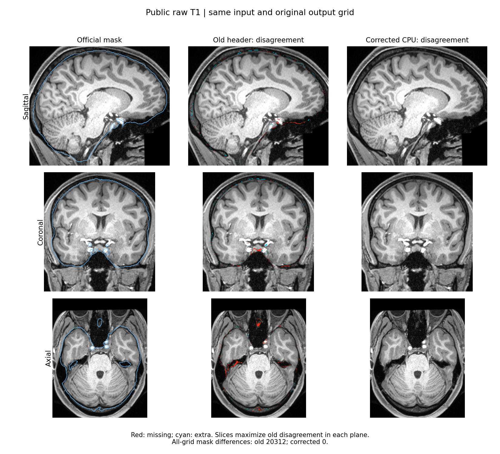

# SynthStrip / SynthSR：完全物化的 SpatialImage CPU API

2026-10-04，在 nodecw10 上补齐默认 Python API 的真实内存输入验收。此前 `nib.load()` 返回的对象仍含 ArrayProxy；本轮先解码全部体素，复制为自有 ndarray，再调用公开 API。每项只执行一次默认 API，官方和已有 FNIT 路径结果均复用，不另行推理。

## 输入、冻结版本和资源

输入为 [OpenNeuro ds003138 v1.0.1](https://openneuro.org/datasets/ds003138/versions/1.0.1) 的同源原始 T1，公开标识为 `case01`；实际影像、被试标识和模型留在服务器。输入与权重的大小、SHA-256，以及参考文件和比较器 SHA，均列于 [匿名结果](report.public.json)。来源及既有官方对照见[父目录报告](../README.md)。

源代码冻结为 `task5_candidate_cpu_v5`：提交 `00fedf3544291b9c3e1db9b6c2d6fcef3917d958`，归档 SHA `ab9a2d587d0fb9599fc2b6200011907b86e12b60f2630db131b62641ee755a72`，无未提交修改。运行前后核对 `SOURCE.private.json`、共享几何 helper、Strip/SR 的 pipeline/model/geometry/spatial 共七个文件、输入、权重和全部保存参考。冻结源码、环境及 GPU 策略均未修改。

原 NIfTI 存储为 `int16`，ArrayProxy 的 slope 为 `0.059418629854917526`，intercept 为 `1947.0296630859375`。`np.asanyarray(proxy)` 解码后为 float64/F-layout，shape `224×288×288`，strides 为 `8,1792,516096` 字节。`np.array(decoded, copy=True, order="K")` 保留解码值和布局，并获得自有存储。构造后 `dataobj` 为 ndarray、非 proxy；原解码值、affine、zooms、qform/sform 逐值保持，输入在调用后未被修改。

Strip 的路径和 SpatialImage 分支都使用 `asanyarray(dataobj)`，随后 conform/网络转 float32；SR 的路径分支使用 `get_fdata()` 默认 float64，对象分支使用 `asanyarray(dataobj)` 后统一 float64，最后网络转 float32。本轮保留这些实际政策，没有提前请求 proxy 的 float32 数据。缩放 proxy 直接解码 float32 与先解码 float64 后再转换可能存在舍入差异，不能把这两种入口人为混用。

## Python API 和输出

```python
import nibabel as nib
import numpy as np
from fnit._nib import new_image
from fnit.synthstrip import SynthStrip
from fnit.synthsr import SynthSR

input_image_path = "/path/to/T1w.nii.gz"
source_image = nib.load(input_image_path)
decoded_voxels = np.asanyarray(source_image.dataobj)  # 保留原解码精度
owned_voxels = np.array(decoded_voxels, copy=True, order="K")
materialized_image = new_image(owned_voxels, source_image)  # 保留原几何

# 每个模型分别调用一次；CPU 默认参数，显式指定已下载的官方权重。
strip_model = SynthStrip(weights="/path/to/synthstrip.1.pt", device="cpu", threads=8)
strip_result = strip_model(image=materialized_image)
strip_result.image.save("brain.nii.gz")
strip_result.mask.save("mask.nii.gz")
strip_result.distance.save("distance.nii.gz")

sr_model = SynthSR(weights="/path/to/synthsr_v20_230130.h5", device="cpu", threads=8)
sr_result = sr_model(image=materialized_image)
sr_result.image.save("synthsr.nii.gz")  # uint8 量化图
sr_result.image.save("synthsr.npz")     # 同次预测的未量化 vol_data
```

`image` 是真实 3D nibabel SpatialImage；`weights` 是已校验的外置官方权重；`device="cpu"`、`threads=8` 只选择本轮 CPU 后端和线程预算。其他公共参数及 CLI、对应原软件命令和文献见 [SynthStrip 说明](../../../../docs/synthstrip/README.md)和 [SynthSR 说明](../../../../docs/synthsr/README.md)。内存对象通过 Python API 传入；CLI 仍读取文件路径。

Strip 输出原图网格上的脑图、二值 mask 和有符号距离场。SR 输出 1 mm 合成图，分别保存 uint8 NIfTI 和浮点 NPZ；NPZ 不含 affine，几何另外检查同次保存的 NIfTI。没有用量化结果替代浮点验收。

## 数值和几何结果

沿用[既有比较器](../compare_outputs.py)及运行前固定门槛，未事后放宽。所有比较覆盖完整保存网格，shape、dtype、affine 和有限值有效。

| 功能及参考 | 完整网格结果 | 固定门槛 |
|---|---|---|
| Strip vs 官方，18,579,456 体素 | 脑图、mask 逐值同；Dice 1、体积差 0；SDT MAE `6.48336446e-7 mm`、RMSE `9.06100077e-7 mm`、max `2.62260437e-5 mm` | 通过：脑图/mask 逐值同，SDT `rtol=1e-5, atol=1e-4 mm` |
| Strip vs 保存的 FNIT 路径默认输出 | 脑图、mask、SDT 全部逐值同，三份文件 SHA 也同 | 通过 |
| SR uint8 vs 官方，9,072,000 体素 | 527 点差 1；99.9941909171% 逐值同；MAE `5.80908289e-5` | 通过：一致率 ≥99.99%、max ≤1、MAE ≤1e-4 |
| SR uint8 vs 保存的 FNIT 路径默认输出 | 全部逐值同，文件 SHA 同 | 通过 |
| SR 浮点 vs 官方 | MAE `3.24730210e-5`、RMSE `9.82070268e-5`、max `0.019134521484375` | **未通过** `rtol=1e-5, atol=1e-3` |
| SR 浮点 vs 保存的 FNIT 默认浮点输出 | 全部逐值同，NPZ 文件 SHA 同 | 通过：`rtol=1e-5, atol=1e-4` |

因此本轮确认内存入口与同版本 FNIT 保存输出一致；SR 对官方的浮点等价仍未通过。既有[浮点尾部报告](../reports/synthsr_float_tail.public.json)记录 3,522 点超原门槛。由于本轮浮点输出逐值且文件 SHA 等于该默认 FNIT 保存结果，这一既有尾部结论仍适用；本轮没有追加网络或诊断模式。

Strip 对官方的有效 affine 与 sform 逐值同，但整份 NIfTI header 和 `pixdim` 不是逐字节相同，qform 最大差 `1.4998256352150019e-9 mm`；三份输出均记录该差异。对 FNIT 路径参考，三份完整 header、qform、sform 均逐值同。SR NIfTI 对官方及 FNIT 路径参考的完整 header、affine、sform 逐值同，qform code 都为 0。数据容差通过和 header 逐字节相同分别报告。

## CPU 时间和内存

两项在同一共享 CPU 锁内顺序执行，亲和性固定为 `0,4,8,12,16,20,24,28`，PyTorch threads 为 8、interop 为 1，各库线程预算为 8。实际模型参数和前向输入/输出均为 CPU float32；Strip 保持生产 CPU channels-last，SR 保持 contiguous。Strip 一次、SR 默认翻转两次网络前向；CUDA 前后均未初始化。

| 阶段/汇总，秒 | Strip | SR |
|---|---:|---:|
| 冻结来源/资源检查 | 0.191 | 0.265 |
| 导入运行时 | 1.560 | 2.209 |
| 加载 metadata | 0.002 | 0.003 |
| 解码原始数组 | 0.416 | 0.527 |
| K-layout 自有复制 | 0.086 | 0.137 |
| 构造 SpatialImage | 0.001 | 0.001 |
| 验证物化输入 | 0.382 | 0.526 |
| 模型构造/权重加载 | 0.053 | 0.675 |
| **默认 API** | **6.606** | **29.987** |
| 绑定实际网络张量哈希 | 0.538 | 0.613 |
| 同次结果全部保存 | 2.898 | 1.949 |
| 保存参考比较/geometry | 12.041 | 3.801 |
| 运行后来源/资源检查 | 0.166 | 0.283 |
| API＋全部保存 | 9.505 | 31.936 |
| runner 完整进程墙钟，含全部诊断 | 25.530 | 41.545 |
| GNU time 完整进程墙钟 | 25.38 | 41.38 |
| GNU time max RSS，KiB | 5,364,880 | 10,125,016 |

前十三行为非重叠阶段；`API＋全部保存` 和两种完整进程墙钟是汇总项，不能与阶段再次相加。网络 hook 在 API 内只保留实际张量引用；数组哈希和保存比较在 API 外执行，未增加前向。本次只运行各一例，完整进程包含 provenance、物化、张量哈希和保存比较，与[既有成对 CLI benchmark](../README.md)的范围不同，不能用 `25.530/41.545 s` 计算新的官方加速比。

runner 采样的驻留进程树线程峰值分别为 17、51，包含运行库线程和后续比较子进程；它们不等于同时计算的物理核数。实际 affinity 和计算线程预算仍限定上述 8 核/8 线程。节点 load-before 为 `71.69/73.40/72.96` 和 `69.09/72.84/72.80`；结果为共享节点上的单次观察。完整标量、GNU time、资源采样、退出码和输出存在性见 JSON。

## 复现脚本及参数

- [prepare_jobs.py](prepare_jobs.py)：`--server-root` 为现场 FNIT 统一入口，`--output` 为新的私密 plan 文件；预置已验收的冻结来源、输入、权重和参考 SHA，生成两个 CPU job，不加载体素或运行网络。
- [worker.py](worker.py)：`--config` 为该 feature 的私密配置，`--output` 为必须尚不存在的产物目录；按独立阶段执行一次默认物化 API、保存同次全部输出、复用保存参考比较并检查前后来源。原始路径只写私密报告。
- [collect_public.py](collect_public.py)：`--server-root` 与上述一致；仅汇出完成的两项 scalar/hash 白名单到 stdout，不读取影像数组或再推理。

执行仍使用既有 `queue_runner_v3.py` 的共享 `nodecw10.cpu8.lock`、8 线程和相同 affinity。它排除等锁时间，记录 GNU time、进程树采样和输出存在性；保留已经完成的 receipt，不自动重复 API。新服务器工作区和产物的索引别名分别为 `W/task1_memory_v1`、`R/task1_memory_v1`。公共报告没有命令、绝对服务器路径、凭据、原被试 ID、影像或模型。

## 脑图、记录与来源

复用上一轮同源脑图；本轮确认 FNIT 保存数组逐值一致，因此不再生成新的图或网络结果。




- 2026-10-04：新增原解码值/K-layout 的完全物化默认 API 验证；两项进程退出 0，全部保存参考比较完成，SR 官方浮点失败原样保留。
- 之前的几何修复、Strip 生产 CPU layout、SR 未接入的 layout/BN 原型及 GPU 回归记录：[父报告](../README.md)、[Strip 文档](../../../../docs/synthstrip/README.md)、[SR 文档](../../../../docs/synthsr/README.md)。
- 原软件：FreeSurfer v8.2.0 [mri_synthstrip](https://github.com/freesurfer/freesurfer/blob/v8.2.0/mri_synthstrip/mri_synthstrip)、[mri_synthsr](https://github.com/freesurfer/freesurfer/blob/v8.2.0/mri_synthsr/mri_synthsr)。论文与完整调用参数沿用上述功能文档。

公开文件来源及 SHA-256 见 [manifest.public.json](manifest.public.json)。本目录不修改运行函数，也不把 SR 浮点容差失败改成完整官方等价。
