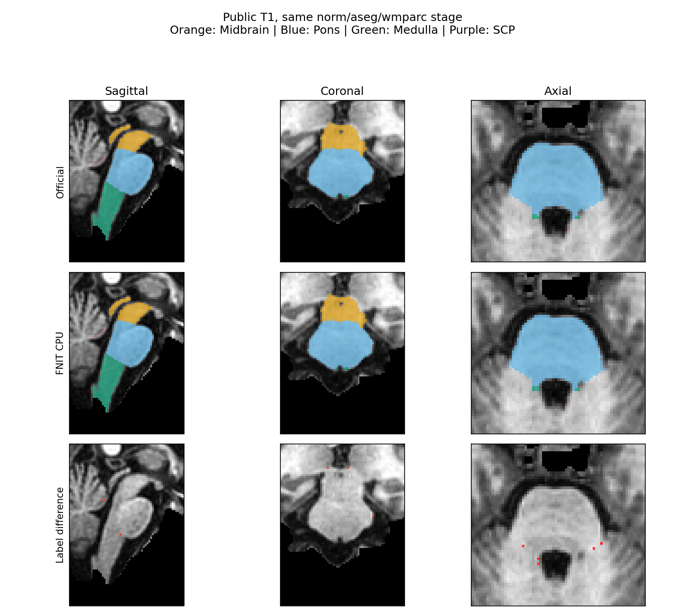
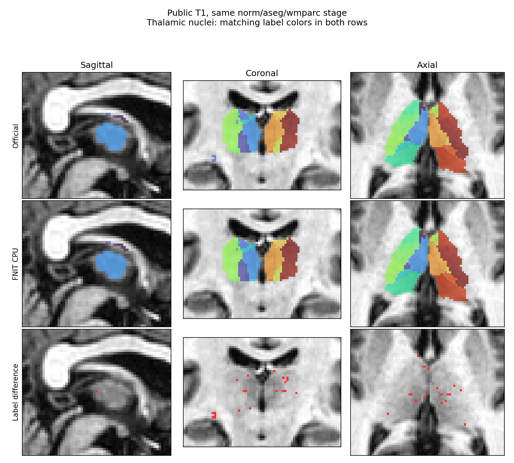
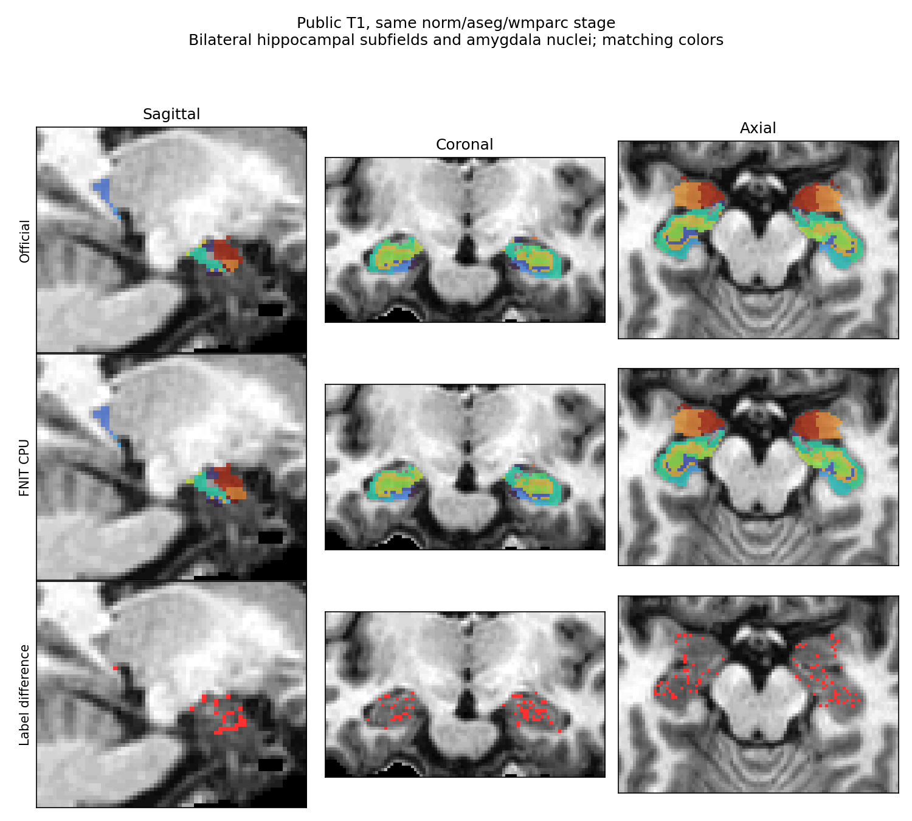

# 亚区分割与 recon-all：CPU 官方对照

本轮基线为 `1d31e7baaebbb644ab199471f7fe6282721455fd`。在 nodecw10 使用相同线程设置与 8 个物理核预算，官方软件仅作为独立验证参考。stage 正式配对使用 `32,36,40,44,48,52,56,60`；完整 recon-all 使用 `64,68,72,76,80,84,88,92`。每组内取得文件锁后串行运行，不跨组计算提速。完整协议见[总页](../README.md)。

## 输入、范围和输出

输入为 OpenNeuro ds000114 snapshot 1.0.2 的公开去脸 T1，先采用未参与旧开发的 sub-02。其文件 SHA-256 为 `eb2bc2ff1f30441b0aff54685cfdd7f196bd02dccad4698100a8bad40421de22`。数据许可为 CC0，不提交影像。既有官方 norm/aseg/wmparc 仅用于冻结同输入的亚区阶段诊断；原始 T1 整例使用新空目录，官方标签不进入 FNIT 拟合。

| 范围 | FNIT 输入 | 独立官方参考 | 比较输出 |
|---|---|---|---|
| 亚区 stage | 同例 norm、aseg、wmparc | 新 scratch subject 的三个 `segment_subregions` 命令 | 原网格和高分辨率标签、全部 110 分区硬/软体积 |
| 亚区 raw | 一张公开 T1 | 同 T1 新 recon-all 加三个亚区命令 | 原始 T1 网格标签和全部分区；分别报告预处理与拟合 |
| recon-all raw | 同一张公开 T1、新空目录 | FS8.2 V8 默认、`-all -openmp 8` | 138 项完整性、分割、网格、顶点图、图谱和脑区统计 |

`worker.py` 只调用公开 Python API，写运行元数据；评分在计时任务结束后单独执行。`--profile` 输出 cProfile，仅用于热点定位，不能计作性能验收。正常基准关闭 profiler。完整冷进程墙钟与 API 计时、保存时间分列，不能把 profiler、准备复制、队列等待或事后评分混入正式性能结论。

```bash
# stage：官方准备输入作为两种实现共同的冻结检查点
# 使用全名变量，路径替换为自己实际已校验的文件
FNIT_CPU_PYTHON=/absolute/path/conda/bin/python
FNIT_STAGE_T1=/absolute/path/checkpoint/norm.mgz
FNIT_STAGE_ASEG=/absolute/path/checkpoint/aseg.mgz
FNIT_STAGE_WMPARC=/absolute/path/checkpoint/wmparc.mgz
FNIT_ATLAS_ROOT=/absolute/path/subregion_atlases
FNIT_OUTPUT_DIR=/absolute/path/new_cpu_stage

"$FNIT_CPU_PYTHON" validation/smri_cpu/task5/worker.py subregions \
  --t1 "$FNIT_STAGE_T1" --aseg "$FNIT_STAGE_ASEG" --wmparc "$FNIT_STAGE_WMPARC" \
  --atlas-root "$FNIT_ATLAS_ROOT" --output-dir "$FNIT_OUTPUT_DIR" \
  --device cpu --threads 8 --structures all --optimization fast
```

Python/CLI 参数与完整返回结构见 [亚区功能页](../../../docs/subregions/README.md) 和 [recon-all 功能页](../../../docs/recon_all/README.md)。Python 高分辨率标签默认保存，而 CLI 默认不保存；计时必须显式对齐。后验 NIfTI 输出另设 `--save-posteriors`，保留通道顺序和几何验证。

## 线程和资源

Torch intraop、Numba 掩码、OpenMP、BLAS、ITK、TF 与进程亲和性均记录。8 核表示相同最大预算，不表示所有阶段都并行 8 线程。N4 拟合和拓扑 GA 保留单线程；半球双 worker 模式各分配 4。Conda GCA 缓存当前只在已验收的 4 线程预算自动选择；8 线程 `auto` 保留原始 GCA评分。

亚区 CPU 入口临时设置并恢复 Torch 和 Numba，Numba 预算不超过其已初始化的线程池容量，不改变拟合与停止规则；GPU 调用直接进入原路径。合同回归不能替代真实 CPU 标签回归和受影响 GPU 的真实输入回归。图谱、权重和原生程序均保留来源、大小与 SHA-256，不下载或公开个人许可证内容。

## 精度与验收

逐分区报告 Dice、不同体素数、硬体积和后验软体积偏差。单方缺失保留零 Dice，双方空单列 NA，不删除小区。几何与 dtype、posterior 有限性、网格 Jacobian 单列。原有每区 Dice ≥0.95、硬体积差 ≤5% 的门不事后放宽。

recon-all 比较全部脑区、分割和顶点量；只有先证明顶点及有序面对应时才能同索引比较，否则使用双向点到三角面距离。执行完成、输出齐全、网格质量与数值等价分开。既有 GPU 两例对官方严格 6/138、2/138；亚区旧 raw/stage 仍有海马与丘脑细核差异，因此现阶段不能把时间优势称为等价重建加速。

## 当前状态与版本记录

- **完整脑干 CPU stage 已完成，精度通过、速度未通过。** 同一 norm/aseg/wmparc、同一 8 核预算、默认 Conda 环境，FNIT 冷进程墙钟 764.691 秒、官方 205.553 秒，FNIT 为官方的 3.72 倍；仅一组正式配对，节点为共享负载。API 762.071 秒，内部计算 761.362 秒，保存 0.271 秒。采样进程树 RSS 峰值分别为 3.69 和 1.62 GB。记录中的 OS 线程峰值包含空闲线程池，不表示实际同时运行超过所分配八核。
- 脑干原网格 4/4 区和高分辨率网格 4/4 区均通过既定 Dice ≥0.95、相对官方硬体积差 ≤5% 的门。原网格有 173 个标签差异体素；软体积单独报告，没有宣称逐值相同。原网格、高分辨率的完整逐区数值、哈希与源码身份见[机器可读结果](brainstem_stage.public.json)。
- CPU owner lookup 使用仓库 Numba 内核，顺序候选、首次平局和 FP32 FMA 算式保持一致；只编译离散所有者搜索，插值及梯度仍使用原 PyTorch。六批真实图谱共 119,232 个点，所有者与 coverage 无差异；小组件热时间不能代替整例时间。CUDA 不导入这个 CPU 内核。
- 后续合并 CPU 查找并缓存固定 log-prior 的联合候选已通过完整脑干回归。同一 `0,4,…,28` 八核组旧/新 API 为 733.021 / 668.801 秒、冷进程为 735.900 / 671.733 秒，API 耗时减少 8.76%。原网格和高分辨率标签、完整 21 通道后验、Gaussian 参数、最终网格、61 个 objective、Jacobian 和 solver 状态逐值相同。GPU 全部字段也逐值相同，reserved 仍为 3.941 GB。[源码和完整结果](cpu_compact_20261004/README.md)明确记录核组；不与另一组的官方 205.553 秒直接计算新速度比。旧新标签的恒等核验允许沿用上述官方分区精度。
- 同输入脑干 GPU A-B-B-A 回归中，原网格、高分辨率、全部 21 个图谱后验通道、labels/volumes 表及几何逐值一致；自身 allocated 峰值 2,641,245,184 字节，reserved 3,940,548,608 字节，各臂相同。保留首次冷调用的时间，不由几次共享 GPU 测量声明速度优劣。
- **全部结构 GPU 回归完成。** 四张高分辨率标签、原网格合并图和各图谱全部后验通道（脑干 21、两侧海马各 40、丘脑 66）逐位一致；labels/volumes 表、affine、dtype 和关键 header 相同。allocated 5,648,806,912 B、reserved 6,954,156,032 B，旧/新相同且低于 20 GB。旧/新完整进程为 454.886 / 345.830 秒，API 内阶段累计为 450.233 / 342.366 秒；只有各一例，加载和缓存状态不同，不能归因为本轮 CPU 优化的 GPU 加速。[完整 GPU 结果](all_structures_gpu.public.json)绑定当时的 v2 冻结源，不代替后续候选回归。
- **丘脑 CPU stage 完成，精度和速度均未通过全部验收。** 同一 8 核组 FNIT 2464.294 秒、官方 275.893 秒，本例慢 8.93 倍。原网格 45 个非空可评分区域有 29 个通过、16 个未通过，另 5 个双方为空记 NA；高分辨率 47 个可评分区域有 32 个通过、15 个未通过，另 3 个双方为空。相对体积门和 Dice 门不放宽，小区域不剔除。全部 50 项、网格、软体积和阶段时间见[丘脑结果](thalamus_stage.public.json)。
- **两侧海马/杏仁核 CPU stage 完成，逐区精度和速度未通过。** FNIT 冷进程 3455.410 秒、API 3452.589 秒，官方 442.305 秒，本例慢 7.812 倍。左右原网格分别 3/28、1/28 区通过既定门；高分辨率分别 4/28、1/28 区通过，所有组均无双方空区域。标签命名空间和固定物理评价网格已核查，不能把高整体前景 Dice 当作细分区通过。[完整逐区结果](hippo_amygdala_stage.public.json)绑定 v2 冻结源码。
- 官方同输入完整 CPU recon-all 已结束，墙钟 4600.035 秒。FNIT v2 冷进程在 1970.411 秒退出：部署前缀缺少 `tifffile`，已完成 24 个阶段，尚未生成完整统计和厚度输出，不能据此计算整体速度比。另发现阶段间异常写回部分报告时访问缺失的 `total_seconds`，导致报告遗留 `running`；独立进程 receipt 正确记录 `failed`，原证据保留。标准依赖、失败报告及比较器的进程状态检查均已修复，v3 在新空目录从原始 T1 重跑；其源码归档 SHA-256 为 `aa78c9547f2941d16308c686d4b2f1e8cb00ddf224b5b7b1e166df9f9d8ae357`，采用 task 专用 `tifffile 2024.9.20` 目录，未修改正在使用的 Conda 前缀。两张真实 TIFF 图谱已解码并校验哈希。原始 T1 自动预处理的 CPU 亚区整例尚未完成。本版 recon-all 含从固定源码构建的 Conda C++ 程序，属于 Python 调度与原生辅助程序组成的流程。
- 基线和真实输入已核对；第一轮真实 CPU stage 脑干 profiling 在批准的 600 秒诊断上限中断，墙钟 600.109 秒、采样进程树 RSS 峰值 1,884,676,096 字节，未生成完整分割或 cProfile。这是诊断中断，不是正式性能结果或算法失败；CPU 锁已交还其他正式任务。后续使用有独立中断保存的有限 evaluation worker。
- 旧 Conda 前缀的两次 CPU 诊断发生 SIGSEGV，默认前缀的上述整例完成；两环境 Torch 版本相同而 MKL、Numba 等不同，尚未定位到具体库。原错误和环境身份保留，不能把“换环境后完成”写成已证明的库修复。
- CPU 线程预算及异常恢复合同测试通过后，继续同输入标签和 GPU 回归；完整结果另追加版本绑定 JSON/TSV，不覆盖旧记录。
- 2026-10-02 亚区十例 GPU 和 recon 两例 GPU 历史结果保留原设备、线程和源码身份，见各功能页，不作为本轮 CPU 时间。

### 脑干本轮逐区结果

| 原网格区域 | Dice | 硬体积相对官方差 | 软体积对称相对差 |
|---|---:|---:|---:|
| Midbrain（173） | 0.994760 | 0.1014% | 0.1511% |
| Pons（174） | 0.996973 | 0.5056% | 0.5559% |
| Medulla（175） | 0.995968 | 0.5604% | 2.7272% |
| SCP（178） | 0.964871 | 3.3333% | 0.6360% |

硬体积门使用 `abs(FNIT - 官方) / 官方`；软体积描述采用 `abs(FNIT - 官方) / mean(FNIT, 官方)`，两者分母不同。双方为空记 NA，单方缺失记零 Dice。

### 脑干实际阶段时间

| FNIT CPU stage | 秒 |
|---|---:|
| 对齐 | 3.041 |
| 粗分割网格拟合 | 62.663 |
| 强度影像准备 | 3.670 |
| 强度网格拟合（60 evaluations） | 689.308 |
| 后处理 | 0.925 |
| recipe 总计（包含以上） | 759.607 |

这些是正常完整调用内保存的阶段时间，未开 profiler。强度网格拟合占 recipe 约 91%，是当前 CPU 提速缺口；查找内核加速还不足以达到原软件整例速度。原有准确矩阵策略和 FP64 标量成本累计保留，没有引入 FP16/BF16。



脑图按真实 norm 网格显示同一切面；颜色叠加与差异图仅用于显示，不改变独立评分。切片、图像及输入哈希见[绘图清单](brainstem_cpu_stage.json)。

### 丘脑 CPU 阶段

丘脑可评分原网格区域的 Dice 为 0.8000–1.0000，硬体积最大相对差 16.74%；高分辨率 Dice 为 0.6667–1.0000，极小区域的硬体积相对差可达 100%。这些结果按原有每区门判断，不能由整体前景重叠替代。双方为空的区域保留在 50 项表中且不赋 Dice=1。



显示使用相同 norm 网格及相同标签颜色；数字评分另由固定网格 audit 执行。绘图输入、输出哈希和切片位置见[清单](thalamus_cpu_stage.json)。

### 双侧海马与杏仁核 CPU 阶段

| 范围 | 通过 / 全部区域 | Dice 范围 | 相对官方硬体积最大差 |
|---|---:|---:|---:|
| 左侧原网格 | 3 / 28 | 0.600000–0.978852 | 33.33% |
| 左侧高分辨率 | 4 / 28 | 0.739332–0.976883 | 7.36% |
| 右侧原网格 | 1 / 28 | 0.230769–0.956357 | 37.50% |
| 右侧高分辨率 | 1 / 28 | 0.565953–0.950374 | 17.30% |

原网格 shape 和 affine 完全相同，体素为 1 mm³。高分辨率裁剪的 shape/origin 不同，但方向和间距相同，以预定 scanner-RAS 网格最近邻评价，未拟合额外配准。右侧官方标签按声明的 +10000 命名空间对齐；112 条软体积均完整，未发现未知标签。左右原网格整体前景 Dice 为 0.979225 / 0.963550，说明总结构重叠高于内部亚区重叠。当前结果证实了细分区边界和标签分配差异，尚未定位到具体拟合或后处理步骤。



同标签在左右两种实现中使用相同颜色，显示重采样不改变独立逐区评分。[绘图清单](hippo_amygdala_cpu_stage.json)记录原始输出哈希与切面。

## 原软件与参考文献

- [FreeSurfer SAMSEG 亚区源码](https://github.com/freesurfer/samseg/tree/2ce2b6be69f2954ea704e593a5be79c284a3a8c3/samseg/subregions)。
- [FreeSurfer 8.2 固定源码](https://github.com/freesurfer/freesurfer/tree/d932c45b7941662ea380a05efef580568b98d41a)。
- Fischl B. FreeSurfer. *NeuroImage* 2012;62:774–781. [DOI](https://doi.org/10.1016/j.neuroimage.2012.01.021)。
- Gorgolewski KJ et al. A test-retest fMRI dataset for motor, language and spatial attention functions. *GigaScience* 2013;2:6. [DOI](https://doi.org/10.1186/2047-217X-2-6)。
