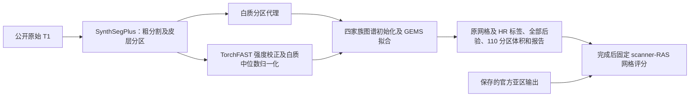
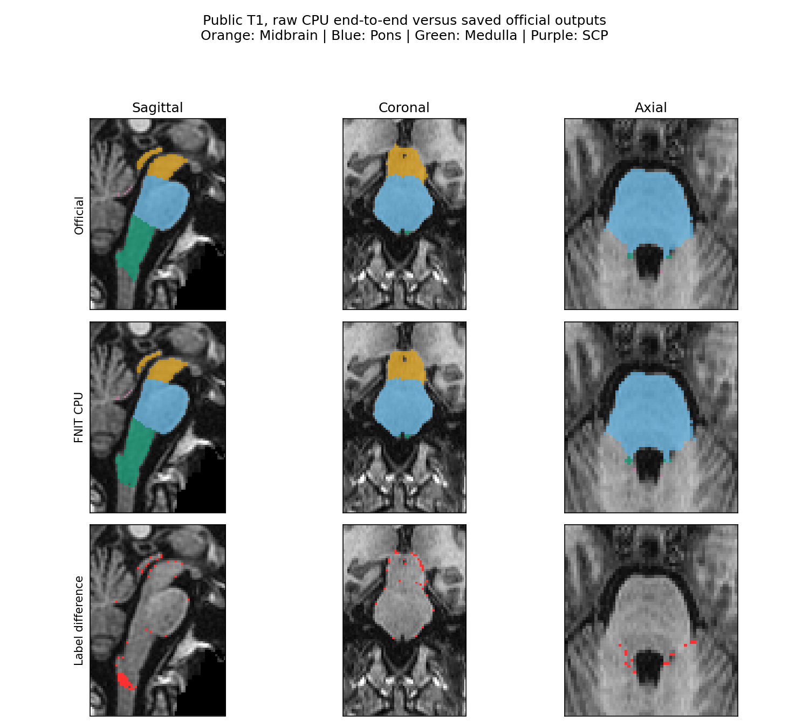
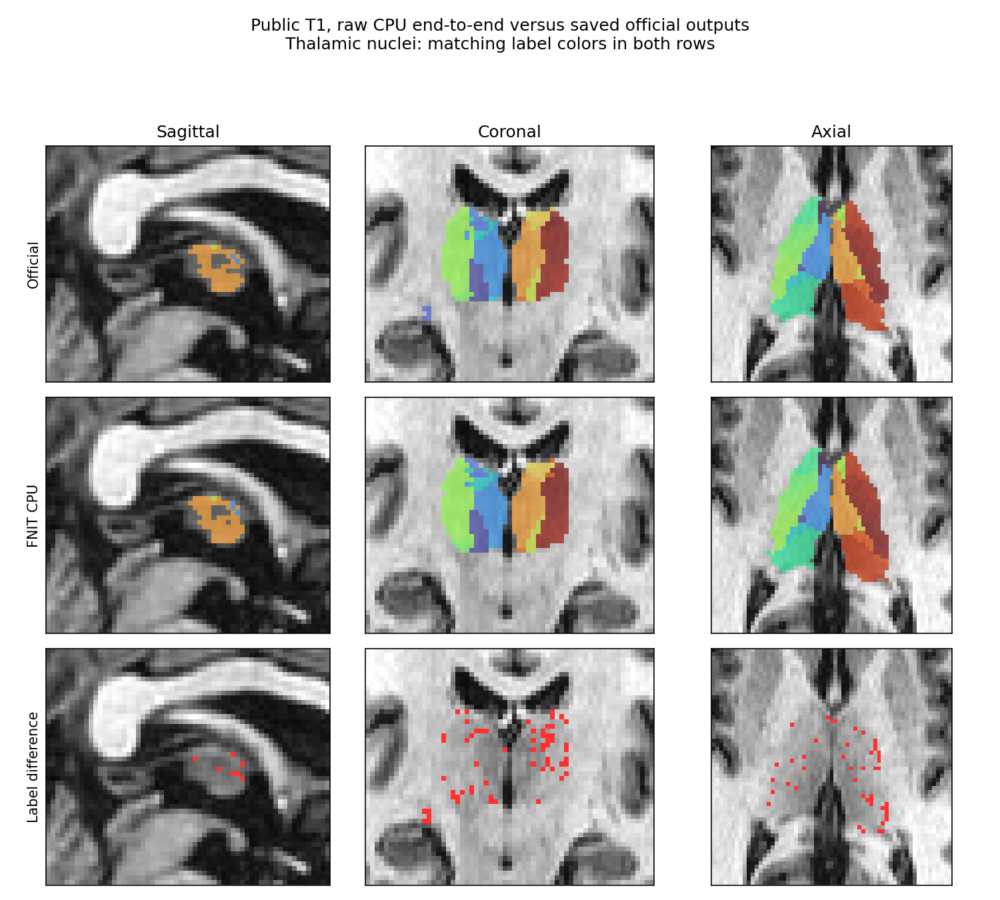
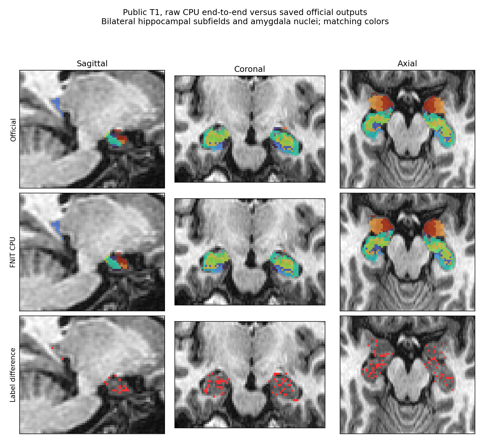

# 原始 T1：全部亚区 CPU8 端到端验证

2026-10-04，在 nodecw10 完成一张公开 T1 的 `segment_4_subregions(structures="all")` 完整 CPU 调用。输入为 OpenNeuro ds000114 snapshot 1.0.2（CC0），原始文件 SHA-256 为 `eb2bc2ff1f30441b0aff54685cfdd7f196bd02dccad4698100a8bad40421de22`。源码冻结为 `00fedf3544291b9c3e1db9b6c2d6fcef3917d958`，归档 SHA-256 为 `ab9a2d587d0fb9599fc2b6200011907b86e12b60f2630db131b62641ee755a72`。

## 流程、输入和输出



完整进程墙钟 **6241.435 秒（104.024 分钟）**，API **6238.458 秒**，保存 **29.235 秒**。默认 Conda 环境，8 个物理核 `32,36,40,44,48,52,56,60`，Torch intraop 8 / interop 1、Numba 8；调用前后线程状态完全恢复。进程树 RSS 采样峰值 **21.647 GB**。未启用 profiler，既有编译缓存未清空。

输入仅为 T1、外置权重和图谱。`SynthSegPlus` 调用一次，`SynthSeg` 零次；粗分割及皮层分区由本次推理生成，白质分区为 FNIT 代理。官方标签仅在运行结束后参与评分。13 项输出齐全：原网格合并标签、4 张 HR 标签、4 张全通道后验、labels/volumes 两张表、运行及工作进程两份 JSON。[文件大小、哈希、几何、后验有限性及源码核查](artifact_inventory.public.json)保留全部项目。

```python
from pathlib import Path
from fnit import segment_4_subregions

input_t1_path = Path("/absolute/path/T1w.nii.gz")
subregion_atlas_directory = Path("/absolute/path/subregion_atlases")
model_weight_directory = Path("/absolute/path/fnit_weights")
subregion_output_directory = Path("/absolute/path/new_subregion_output")

subregion_result = segment_4_subregions(
    t1=input_t1_path,                         # 一张原始 3-D T1
    atlas_root=subregion_atlas_directory,      # 外置四家族图谱
    synthseg_weights=model_weight_directory,   # 自动粗分割权重
    synthseg_parc_weights=model_weight_directory,
    structures="all", device="cpu", threads=8,
    optimization="fast",                     # 此次实际使用的优化配置
    output_dir=subregion_output_directory,
    save_highres=True, save_posteriors=True,   # 保存 HR 标签及全部图谱通道
)
```

命令行及所有参数、返回结构、原软件命令和文献见[功能说明](../../../../docs/subregions/README.md)。本次正式测量由 [worker.py](../worker.py) 调用上述公开 Python API。

## 全部 110 分区的精度

原网格 **4/105** 非空区域通过、101 个未通过，另 5 个双方空记 NA；HR **5/107** 通过、102 个未通过，另 3 个双方空记 NA。**当前原始 T1 端到端输出未通过逐区等价门。** 阈值保持每区 Dice ≥0.95、相对官方硬体积差 ≤5%；单方缺失为零 Dice，双方空的 Dice 和门状态为 null。软体积另按对称分母 `abs(FNIT-官方)/mean(FNIT,官方)` 逐区报告。

| 家族 / 网格 | 通过 / 未通过 / NA | 非空 Dice 范围 | 相对官方硬体积最大差 | 总前景 Dice |
|---|---:|---:|---:|---:|
| brainstem / native | 1 / 3 / 0 | 0.911175–0.985966 | 7.60% | 0.969732 |
| brainstem / hr | 1 / 3 / 0 | 0.876816–0.985938 | 8.61% | 0.968466 |
| thalamus / native | 3 / 42 / 5 | 0.000000–0.967742 | 100.00% | 0.966138 |
| thalamus / hr | 3 / 44 / 3 | 0.333333–0.957967 | 400.00% | 0.969296 |
| hippo-amygdala-left / native | 0 / 28 / 0 | 0.252252–0.946083 | 41.30% | 0.957272 |
| hippo-amygdala-left / hr | 1 / 27 / 0 | 0.442482–0.953643 | 36.74% | 0.961349 |
| hippo-amygdala-right / native | 0 / 28 / 0 | 0.204082–0.940048 | 45.45% | 0.950416 |
| hippo-amygdala-right / hr | 0 / 28 / 0 | 0.244354–0.919444 | 39.20% | 0.951760 |

[母报告](raw_all_cpu.public.json)包含 8 组、220 条具名分区记录、每区软硬体积、评分网格及源图几何。评价使用固定 scanner-RAS 网格和最近邻采样，未额外拟合配准或修改标签。标签命名空间核查未见未知 ID，右侧海马按已声明的 +10000 对齐；八组的前景质心距离为 0.172–0.511 mm。总结构位置接近，细分区边界仍有差异；本次输出核查不能独立定位到某个拟合或后处理环节。

## 官方参考来源与计时范围

保存的官方亚区输出来自独立 CPU8 stage，其 legacy `norm/aseg/wmparc` 已与本轮同 T1 官方 CPU recon 三图只读核查：shape、dtype、数组逐值、affine 和 zooms 全部一致，三图不同体素均为 0。`aseg/wmparc` 文件哈希也相同；`norm` 压缩文件哈希不同，解码数据及几何相同。[来源核验](../official_upstream_identity.public.json)保留各自 SHA。

这些参考可用于同一原始 T1 的输出评价。FNIT 自动生成的预处理输入与官方检查点不同，所以 raw 差异包含预处理和亚区拟合；[同官方检查点的 CPU stage](../README.md)单独报告。此次没有单次官方 raw 全亚区冷进程计时，官方完整墙钟及提速比均为 **null**，不相加 recon 和独立亚区命令耗时。

## 实际阶段时间

| 父阶段 | 秒 |
|---|---:|
| 共享预处理 | 162.214 |
| brainstem | 643.776 |
| thalamus | 2245.035 |
| hippo-amygdala-left | 1583.290 |
| hippo-amygdala-right | 1563.757 |
| 保存 | 29.235 |

以上父阶段包含其内部计时，不再次相加子阶段。脑干 643.776 秒中，对齐 3.672、粗分割拟合 55.814、强度准备 3.359、强度网格拟合 580.025、后处理 0.906 秒。自动强度预处理中的 TorchFAST 为 56.546 秒，包含在共享预处理 162.214 秒内。其余 recipe/mesh solver 的测得字段均保留在母报告。

## 脑图

三幅图在原始 T1 网格上仅为显示做最近邻采样；数值评分来自独立固定网格。每幅图为官方、FNIT CPU、标签差异三行；只显示结构邻域。切面和输入/输出哈希见对应 JSON。







## 本轮更新记录

- 原始 T1 v4 在大尺寸 oneDNN 1×1 末层发生 SIGSEGV；[局部 CPU 修复与真实 CPU/GPU 回归](../../../smri_cpu_20261004/t2_seg/README.md#9-大体积-plus-cpu-崩溃定位与修复)通过后，本次 v5 从新空目录完整运行。原失败及冻结源码保留。
- 事后评分完成后，新公开导出器首次遇到 MGH shape 的 NumPy int32 JSON 编码失败。修复为显式 Python int，并保留真实脑干计时 schema；只续导出及绘图，未重跑模型、官方命令或评分。原失败快照保留，canonical 分析状态恢复为 complete。
- 核对评分报告、各标签文件及所用 frozen worker 的哈希和路径，防止不同运行证据混用；全部 1,257 个 manifest 源码文件在运行后再次核验哈希不变。

## 原实现与文献

- [FreeSurfer SAMSEG 亚区固定源码](https://github.com/freesurfer/samseg/tree/2ce2b6be69f2954ea704e593a5be79c284a3a8c3/samseg/subregions)。
- [OpenNeuro 数据 DOI](https://doi.org/10.18112/openneuro.ds000114.v1.0.2)。
- Gorgolewski KJ et al. A test-retest fMRI dataset for motor, language and spatial attention functions. *GigaScience* 2013;2:6. [DOI](https://doi.org/10.1186/2047-217X-2-6)。
