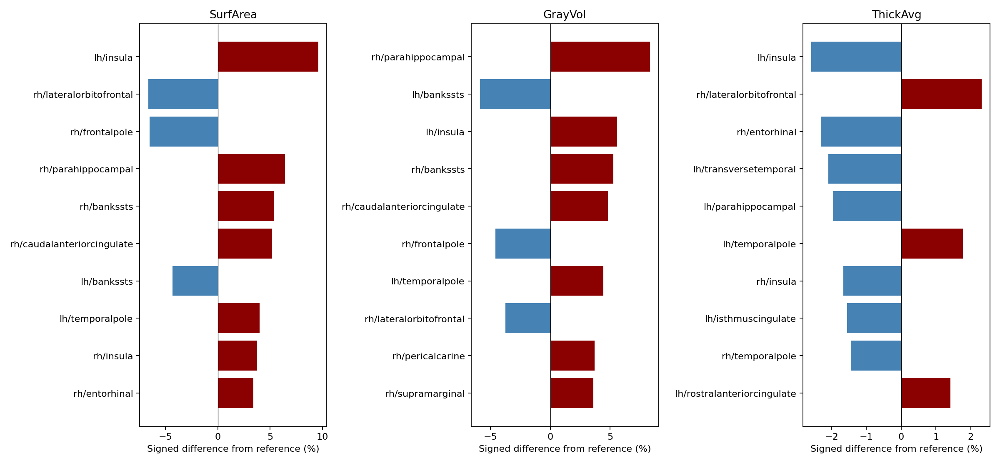
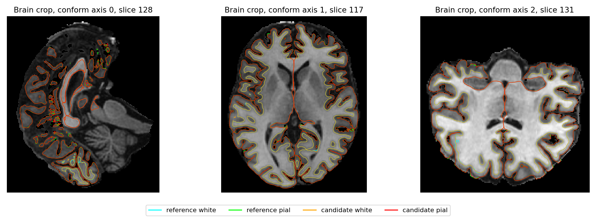

# 完整 CPU recon-all v3：同输入官方对照

[返回任务 5](../README.md) · [CPU 总报告](../../README.md) · [recon-all 功能与参数](../../../../docs/recon_all/README.md)

2026-10-04，两侧从同一张公开原始 T1 和新空目录完成重建。官方完整墙钟为 **4600.035 秒**，FNIT 冻结 v3 为 **4829.697 秒**；两端返回码均为 0，FNIT 输出 **138/138** 项。FNIT 在这次单例观测中用时长 **4.99%**，没有达到超越官方 CPU 的速度目标。该流程仍是 Python 调度、PyTorch/NumPy/Numba 计算与 Conda 源码构建的 C++ 辅助程序组成的实现。

全部 68 个 aparc 脑区的厚度平均绝对差为 **0.017 mm**，面积为 **30.559 mm²**，灰质体积为 **75.529 mm³**。部分局部标签仍有明显差异，双方顶点数和有序三角面也不同，不能称逐点一致。整体数值等价没有已确认的验收门槛，状态保持 `not_assessed`。

## 1. 数据、源码和环境

- 输入为 OpenNeuro ds000114 snapshot 1.0.2 的公开去脸 T1，许可 CC0；匿名记为 case01。[固定来源与许可](../../../subregions/ten_public_t1_20261002/data_selection.md)保留上游快照与字节校验。原文件 SHA-256：`eb2bc2ff1f30441b0aff54685cfdd7f196bd02dccad4698100a8bad40421de22`。没有将官方中间分割作为 FNIT 重建输入。
- 候选为 `task5_candidate_cpu_v3`，源码 head `e91dd25ffc72852c8f1f5217e847198fb5e2a49e`，实际归档 SHA-256：`aa78c9547f2941d16308c686d4b2f1e8cb00ddf224b5b7b1e166df9f9d8ae357`。事后比较前 **1240 个归档文件**逐个 SHA 核验；版本身份以归档为准，不能把本次测量重标为后续 main 或 v4。
- 官方为 FreeSurfer 8.2.0-1，`FS_V8_XOPTS=1`、`recon-all -all -openmp 8`；独立官方安装只参与参考计算。FNIT 不调用该安装的调度脚本或命令，而使用已核验的 Conda 辅助程序。
- nodecw10，两端均绑定同一组 8 个物理核 `64,68,72,76,80,84,88,92`，线程环境预算 8，CUDA 不可见。候选 `hemisphere_workers=1`，Torch/Numba 有效线程均为 8，调用后恢复；CPU float32，无 autocast、FP16 或 BF16。
- 节点有其他工作负载，两端正式运行各一次，之间有其他工作，不是邻接 AB-BA。OS 线程池数量和八核计算预算分别记录。没有清空文件缓存，也没有修改活跃 Conda prefix。
- v3 使用独立的 `tifffile 2024.9.20` 纯 Python 依赖目录。先前 v2 因部署 prefix 缺少该包失败；原失败保留，本次采用新空目录重跑。此记录不构成全新 Conda 环境安装验收。
- [运行身份](runtime.public.json)、[源码与产物 manifest](manifest.public.json)和[比较器源 SHA](status.json)绑定实际实现。权重、模板、原始影像及许可证不随报告发布；资源下载规则见功能页。

## 2. 完整耗时与分步骤

| 完整进程范围 | 官方 | FNIT v3 |
|---|---:|---:|
| 新进程启动至全部约定输出落盘，秒 | 4600.035 | 4829.697 |
| FNIT pipeline 内 API 总计，秒 | — | 4826.916 |
| 采样进程树 RSS 峰值，十进制 GB | 28.066 | 20.183 |
| 采样 OS 线程峰值，含空闲线程池 | 44 | 80 |
| 开始时节点 load1 | 90.86 | 107.15 |
| 结束时节点 load1 | 103.19 | 53.80 |

完整墙钟包括启动、校验、读取、计算和保存，排除等待锁和事后评分。API 与进程时间不互相替代。采样 RSS 不是严格连续内存峰值，节点 load 也不能用于事后修正速度。

候选主要父阶段如下，全部 **66 个阶段**见[阶段 CSV](candidate_stages.public.csv)和[计时 JSON](timing.public.json)：

| 候选阶段 | 秒 |
|---|---:|
| 左半球球面配准 `register_lh` | 977.904 |
| 右半球球面配准 `register_rh` | 779.323 |
| 左半球初始表面链 `surface_lh` | 546.834 |
| 右半球初始表面链 `surface_rh` | 496.518 |
| 左半球最终 white/pial 与指标 `finish_surface_lh` | 319.185 |
| 右半球最终 white/pial 与指标 `finish_surface_rh` | 340.307 |
| MNI 非线性完整子链 | 205.866 |
| SynthSeg | 202.935 |
| N4 | 118.109 |
| 生产网格检查 | 70.152 |

候选球面配准两侧合计占完整墙钟约 36.4%，是本例主要时间来源。它与原版单条 `mris_register` 的范围不完全相同，不能据此计算算子加速倍数。本次 GCA 采用原生完整优化器 `original` 后端；8 线程预算未启用只验证过其他预算的缓存优化。white 采用已验证的原生热点程序，pial 保留原生程序，具体程序 SHA 和能力选择见运行身份。

官方原日志含 **209 条 `@#@FSTIME`**，逐条保留在[官方命令 CSV](official_command_timers.public.csv)。例如 `fs-synthmorph-reg` 为 433.980 秒、`rca-surfreg` 为 424.890 秒，它们包含子命令；`mri_synthmorph` 264.350 秒、两条 `mris_register` 165.880/255.980 秒可能嵌套其中。**这些行不累加，也不与候选父阶段直接相除**。完整官方时间仅采用独立进程收据。

## 3. 68 区厚度、面积、体积和曲率

四项指标均实际匹配 68 区，缺失和额外区域均为空。按保存 `.stats` 中的同名脑区配对；这些输出值含原统计写出的舍入，不能替代未量化的逐顶点误差。全部 **272 条区域/指标记录**见[CSV](cortical_regions.public.csv)及[完整 JSON](regions.json)。相对差以官方非零值为分母，零参考值单独保留，不硬除以零。

| 指标 | MAE | 绝对相对差中位数 / P90 | 最大绝对差 |
|---|---:|---:|---:|
| 厚度 `ThickAvg`，mm | 0.017000 | 0.484% / 1.586% | 0.070000 |
| 表面面积 `SurfArea`，mm² | 30.558824 | 1.141% / 4.085% | 202.000000 |
| 灰质体积 `GrayVol`，mm³ | 75.529412 | 1.209% / 3.948% | 335.000000 |
| 平均曲率 `MeanCurv`，mm⁻¹ | 0.001368 | 0.847% / 2.558% | 0.009000 |

最大面积和厚度差均位于 LH insula：面积官方 2103→FNIT 2305 mm²（+9.61%），厚度 2.714→2.644 mm（−2.58%）。最大灰质体积差在 RH lateraloccipital：11416→11081 mm³；最大曲率差在 LH temporalpole：0.181→0.190 mm⁻¹。局部差异不因平均误差小而删除。

`aseg.stats` 匹配 45 区，体积 MAE 2.173 mm³、最大差 31.800 mm³；`wmparc.stats` 匹配 70 区，MAE 81.889 mm³、最大差 434.300 mm³。16 个共同全局 brainvol 指标无缺失，完整数值见 JSON；例如 CortexVol 相对差 −0.0423%、TotalGrayVol −0.0246%。DKT、a2009s、BA 等其他统计文件进入 138 项文件诊断，本次未另生成其具名逐区摘要，也未新增三图谱同公式 no-TH3 体积控制。顶点 TH3 `volume` 与脑区 `GrayVol` 分别处理。



## 4. 七张分割图逐标签比较

双方在同一 conform 网格上直接比较，不重采样或修补一方。标签 0 不进摘要；只要一方存在该非零标签就保留它。全部 **601 条非背景标签记录**包括体素数、交集和 Dice，见[CSV](segmentation_labels.public.csv)与[JSON](dice.json)。dtype、affine 和文件 SHA 另列。

| 标签图 | 不同体素 | 最低 Dice | P05 Dice | 中位 Dice |
|---|---:|---:|---:|---:|
| aseg | 11096 | 0.888889 | 0.986368 | 1.000000 |
| aparc+aseg | 19271 | 0.888889 | 0.924000 | 0.969592 |
| aparc.a2009s+aseg | 29755 | 0.632353 | 0.859253 | 0.939745 |
| aparc.DKTatlas+aseg | 17288 | 0.888889 | 0.941228 | 0.974992 |
| wmparc | 30033 | 0.888889 | 0.925480 | 0.968005 |
| ribbon | 13849 | 0.982381 | 0.982627 | 0.989682 |
| filled | 9 | 0.999982 | 0.999983 | 0.999991 |

aseg 最低项是标签 77 WM-hypointensities：官方 4、FNIT 5、交集 4 个体素，Dice 0.888889，未剔除小区。a2009s 最低项为 RH S_suborbital（12171）：官方 297、FNIT 247、交集 172，Dice 0.632353。wmparc 中 RH entorhinal 同样达到最低值 0.888889（1245/1293/1128 个体素），属于明确的局部脑区差异。


## 5. 表面、顶点对应与质量

双方 scanner/conform 和 surface RAS 几何可比；LH 官方/FNIT 为 119551/119451 个顶点，RH 为 118624/118550 个顶点，有序面不同。四张最终 white/pial 均保持各自 white 的内部拓扑，但两端没有同索引对应。因此 **44 份顶点指标图、12 份 annotation 的逐点差异均为 NA**，状态 `not_assessed_vertex_correspondence`，不能记为 0 或通过。完整对应性条件和每项状态见[几何 JSON](geometry.json)、[顶点 JSON](vertices.json)。

下面实际使用全部源顶点到目标**完整三角面**的距离，两方向均已计算，没有遗漏行或事后重复评分。它是表面空间距离，不是厚度/曲率的逐顶点对应误差，也不是连续表面的 Hausdorff 距离。无新的接受阈值。

| 表面 | FNIT→官方 mean / P99 / max，mm | 官方→FNIT mean / P99 / max，mm |
|---|---|---|
| LH white | 0.02412 / 0.18243 / 2.50598 | 0.02376 / 0.18248 / 2.39782 |
| LH pial | 0.05318 / 0.42626 / 3.08057 | 0.05433 / 0.42955 / 3.58793 |
| RH white | 0.03195 / 0.22439 / 1.65188 | 0.03230 / 0.22774 / 2.08424 |
| RH pial | 0.05502 / 0.41191 / 3.31265 | 0.05443 / 0.39492 / 2.35194 |

[全部表面结果](surfaces.json)保留输入 SHA、拓扑和超过 0.1 mm 的顶点数量；该计数是诊断，不是本轮新增验收门。

两端最终表面均单连通、Euler=2，边界边、非流形边、重复面、退化索引面和 vertex-link 异常均为 0。候选生产检查的 white/pial 各自自相交计数为 0；独立扩展扫描仍发现 **white↔pial proper 穿越对**，两者是不同检查：

| 质量项 | 官方 LH / RH | FNIT LH / RH |
|---|---:|---:|
| white↔pial proper 穿越对 | 52 / 128 | 76 / 195 |
| sphere 负方向面 | 0 / 30 | 0 / 0 |
| sphere.reg 负方向面 | 0 / 32 | 0 / 0 |

所有 white 面完成候选扫描，没有预算截断；各球面零面积和非有限计数为 0。上述数量不直接判断总体几何优劣。非 proper hit 只作为内核诊断，不是穷尽的接触计数；没有包含关系证明。完整作用域、参数、源码和计数见[FNIT 质量](quality_fnit.json)及[官方质量](quality_official.json)。原有生产网格门与这些扩展诊断分开。



## 6. 严格文件诊断与仍未完成的验收

[138 项严格诊断](strict.json)通过 **3/138**：`mri/orig/001.mgz`、`mri/rawavg.mgz`、`stats/synthseg.tiv.dat`。这套比较包含 dtype/header、连续值、网格与文本等规则，不能解释为 138 个独立科学指标。全表保留 135 个未通过项；例如 T1 图的 41 个强度体素不同，以及皮层标签和存储 dtype 差异，都没有隐藏。

当前明确未匹配项包括分区边界、white/pial 空间差、皮层统计和部分头信息。顶点对应性不成立的指标不可评估。脑干、丘脑、海马亚区由独立工作包评价，本例的 138 项 recon profile 不包含它们。更多病例、官方与候选邻接重复、三图谱统一公式体积、顶点有效对应以及后续整合版的完整 CPU/GPU 回归，仍需独立完成。现有完整时间差不称为等价重建加速。

## 7. 实际调用与匿名导出

本次 worker 调用下列公共 Python API；输出目录必须不存在或为空。以下路径供用户替换，完整参数含义见功能页：

```python
from fnit.recon_all.native_free import run_recon_all_python

t1_input = "/path/to/case01_T1w.nii.gz"       # 输入：原始单帧 T1
subject_output = "/path/to/new_subject"     # 输出：新空被试目录
weight_directory = "/path/to/fnit_weights"  # 已校验的官方模型权重
asset_directory = "/path/to/fnit_assets"    # 已校验的模板、图谱和标签资源
native_directory = "/path/to/conda/bin"     # FNIT 从固定源码构建的辅助程序
report = run_recon_all_python(
    t1=t1_input,
    subject_dir=subject_output,
    weights_dir=weight_directory,
    assets_dir=asset_directory,
    native_bin_dir=native_directory,
    device="cpu", threads=8, hemisphere_workers=1,
    native_optimizations="auto",
)
# report 给出阶段、138项存在性和生产网格检查；不表示已与官方等价。
```

官方独立参考命令为：

```bash
t1_input=/path/to/case01_T1w.nii.gz
reference_subjects=/path/to/new_reference_subjects
reference_subject=case01_reference
recon-all -i "$t1_input" -s "$reference_subject" \
  -sd "$reference_subjects" -all -openmp 8
```

`publish_report.py` 只读现有比较目录与 `recon_timing_report.py` 导出的计时 JSON，验证两端 complete/rc0、138 项及 68 区，写匿名 JSON 和 CSV。`plot_brains.py` 复用既有绘图逻辑，以两端保存的非零 aseg 并集裁剪显示；指标和 benchmark 输入保持原值。绘图使用已有原软件分析 Python 的 Matplotlib/Nibabel，**没有运行原软件算法**；headcw CPU4 环境的独立绘图墙钟为 **70.839 秒**，不加入重建或比较时间。三张 PNG、输入与脚本 SHA、绘图收据见[图 manifest](figures/manifest.public.json)，均已人工查看。

原始私密 JSON、许可证、原始 MRI、完整表面文件和命令路径未发布；匿名导出保留它们的 SHA 与统计。目录内代码仅负责事后导出和绘图，没有改变冻结重建源码、比较阈值或旧结果。

## 8. 原实现和相关资料

- [FreeSurfer 8.2 recon-all 源码](https://github.com/freesurfer/freesurfer/blob/v8.2.0/scripts/recon-all)与[官方使用说明](https://surfer.nmr.mgh.harvard.edu/fswiki/recon-all)。
- [FNIT 138 项比较方法](../../../../docs/recon_all/BENCHMARK_METHODS.md)与[生产接入及实现归属](../../../../docs/recon_all/PERFORMANCE_INTEGRATION.md)。
- 表面重建原理：Dale et al., *Cortical surface-based analysis I*, NeuroImage (1999), [DOI](https://doi.org/10.1006/nimg.1998.0395)；Fischl et al., *Cortical surface-based analysis II*, NeuroImage (1999), [DOI](https://doi.org/10.1006/nimg.1998.0396)。
