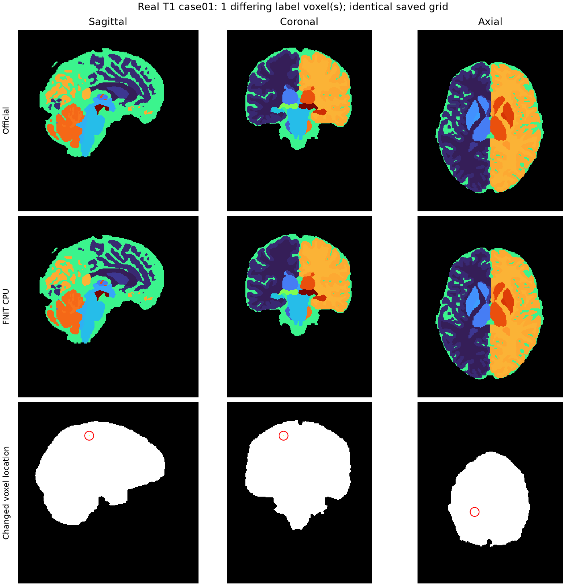

# SynthSeg、皮层分区和 WMH-SynthSeg：CPU 对照记录

日期：2026-10-04。源码起点：`1d31e7baaebbb644ab199471f7fe6282721455fd`。
本目录记录真实影像、冻结源码和实际保存的输出；原软件只作为独立参考运行。
FNIT 生产推理不调用 FreeSurfer、TensorFlow、Surfa 或其他神经影像软件封装。

## 1. 本轮修改与适用范围

| 入口 | 本轮保留的功能 | CPU 修改 | GPU 路径 |
|---|---|---|---|
| `SynthSeg` | 33 类、原图/约 1 mm 输出、翻转集成、拓扑类别后处理、软体积 CSV、显式色表 | 修正预处理网格与浮点顺序；安全卷积分块；6 邻接连通域；真正保存 CTAB | 原卷积、连通域和精度作用域；修正同一预处理网格计数 |
| `SynthSegPlus` | 普通 SynthSeg 2.0 + `--parc`、fast/非 fast、3 份返回影像、101 列数值 CSV、mask | 同一预处理和连通域修复；保留原有完整 oneDNN 卷积 | 原卷积、翻转与后处理 |
| `WMHSynthSeg` | T1/FLAIR、crop/完整体积、label 77 概率图、33 列软体积 | 网络与空间处理保留；修复新网格保存头信息 | 网络与空间处理保留；20 GB 完整回归未通过 |

`SynthSegPlus` 是本仓库普通 SynthSeg 2.0 皮层分区入口，对应 `mri_synthseg --parc`。
它不代表论文中的 robust SynthSeg+，不对应 `--robust`。普通 33 类入口也没有
目录批处理、原版 QC/posterior/CT/Photo/v1 模式；未实现的模式不列为通过。

CPU 分块只在普通 SynthSeg 既有的“禁用完整体积 oneDNN”作用域内启用。
每块保留深度方向完整卷积邻域，内部边界不补零；只有真实体积边缘补零。
单次输入/输出块目标 256 MiB，不是整例 RSS 上限。分块保留普通入口原有
禁用 oneDNN 的计算后端，退出时恢复调用者设置。默认 Plus 已能使用完整 oneDNN
卷积，因此保留该路径；最初对所有
CPU 层分块使 fast 变慢，其结果仍保留在下表。

## 2. 数据、资源与计时边界

- 输入：OpenNeuro ds003138 的 3 幅原始 T1，均为 `224×288×288`，
  约 `0.8×0.7777778×0.7777778 mm`。输入 SHA、几何见
  [完整证据](latest_evidence.public.json) 的 `preprocessing`。
- 官方：FreeSurfer 8.2.0-1 的 `mri_synthseg --cpu --threads 8`；原模型五个
  H5/NPY 文件与 FNIT 权重逐个 size/SHA 相同。模型依照既有 FNIT 权重清单获取。
- FNIT：Python 3.11 / PyTorch 2.5.1 / NumPy 1.26.4 / SciPy 1.17.1。
  官方 fspython 的 Python/TensorFlow 环境独立保留，不与 FNIT 替换环境混用。
- 正式 CPU 配对组：nodecw10，8 个物理核 `1,5,9,13,17,21,25,29`，
  8 个计算线程，任务专用串行锁。进程还会创建库辅助线程，报告实际线程峰值，
  所有线程仍受相同 8 核亲和性约束。该节点与其他任务共享。
- 完整命令 wall 包含冷进程、Python/模型读取、预处理、全部网络和后处理、
  CSV 与影像保存。记录 `/usr/bin/time -v` RSS、进程树采样 RSS/线程与节点负载。
  GPU API 时间另列，不能当完整命令时间。
- GPU 回归：gpucw1 的同一 H100 GPU0、同一串行锁，20,000,000,000 B allocator
  上限；FP32/既有 TF32 策略保留，没有新增 FP16/BF16。

早期公共 CPU 核组 `0,4,...,28`、错误尺寸诊断和后续 NUMA1 组分别保留，
不合并计算速度比。输入/输出标签比较不重采样、不修补任何一方。

## 3. 发现并修复的成熟子函数问题

### 3.1 重采样少一层改变了网络输入

原版用带浮点起点、终点和步长的 `np.arange`。先计算 `ceil`、再生成固定整数
个坐标并不总是等价。case01 旧 FNIT 为 `180×224×224`，官方为
`180×224×225`；网络 padding 因而从 `192×224×224` 变为
`192×224×256`。case03 也少一层。这属于网格错误，不能作为浮点容差忽略。

已恢复原坐标数，并在 CPU 保留原版 SciPy Gaussian/线性插值与 NumPy
percentile/normalize 的顺序。3 幅真实 T1 最终送入网络的 float32 数组均与原版
逐值一致，数组 SHA 相同：

| 输入 | 正确网络张量形状（不含批次/通道） | float32 数组 SHA-256 |
|---|---|---|
| case01 | `192×224×256` | `49c49ed5cb1e1e508f48334464714456c62c5a9e8fc76c1ea9ab68d2eedddb1a` |
| case02 | `192×224×256` | `d34b6799879799e9156a0a0a2c7a977dd084adb82c8847b883adfeaf6d3769ce` |
| case03 | `192×256×256` | `f9b211bab83d40ace80c9366106a5d1dabf24bca5d85d871a7b93d0ddcf9e3cd` |

所有数组控制来源为安装版官方脚本
中原预处理函数，脚本 SHA 为
`f3c182cd100721e8ae4ae4e0661b6ac3c45e80453f716d668d53ca0fe189279b`。
验证脚本抽取原函数仅发生在 reference 检查中，FNIT 运行时不读取原软件源码。

### 3.2 保存后色表丢失

旧 `color_lut` 只写 Python `extra`，保存后消失。现用 nibabel 写 FreeSurfer
NIfTI 扩展 14（不捆绑 LUT）。原软件 Surfa 实际回读了所请求的 1811 个条目，
ID/名称/RGBA 全相同，原软件再次保存和回读后标签仍逐值相同。
Surfa 只用于独立验证，不是 FNIT 依赖。

斜位原图输出还有一个 header 问题：再次编码未启用的 qform 会将原 `pixdim`
替换为 affine 列范数。`25e876f1` 改为只设置 qform code 为 0。独立原软件
保存函数的同标签控制，以及实际 GPU 公共 CLI 普通/fast 皮层 keepgeom 输出，
shape、affine、pixdim 都逐值相同，int32 和 qform/sform code 为 0/2；普通
keepgeom 的硬标签对同一 GPU aligned 输出恢复后差异为 0，CSV 数值差异为 0。
原软件再次读写该输出的 1811 个 CTAB 条目全相同。见
[保存几何证据](keep_geometry.public.json)。

### 3.3 CPU 连通域和卷积热点

CPU 原 PyTorch 图传播连通域改成 SciPy 6 邻接标记；等大连通域保留栅格先后顺序。
原普通入口 CPU profile 中卷积共约 96.12 秒，最慢的最终上采样 `conv0` 两次前向
约 47.21 秒；连通域约 11.86 秒。该 profile 使用修复前的较小网格，只用于定位
热点，不作为正确尺寸的最终计时或阶段总量；嵌套计时不能直接相加。

## 4. 正确网格的真实 CPU 结果

`baseline_corrected` 仅给原 FNIT 修复相同预处理与共享 header，网络/连通域仍为
原算法。`candidate_corrected` 是先前全 CPU 层分块候选；最终
`candidate_selective` 只在既有禁用上下文中分块，Plus 保留原完整卷积。
每个冻结目录的源码逐文件 SHA 见 `source_files`，不把后来的代码修改套用到旧时间。

case01，依次 official → baseline → candidate → candidate → baseline → official：

| 模式 | 官方完整 wall（秒） | 修正输入后的 FNIT baseline（秒） | 全层 slab 候选（秒） |
|---|---|---|---|
| 33 类 | 60.086 / 151.961 | 154.960 / 153.961 | 54.077 / 59.338 |
| `--parc --fast` | 56.582 / 164.963 | 56.331 / 52.573 | 63.589 / 58.332 |
| `--parc` | 157.452 / 133.929 | 74.360 / 82.869 | 81.842 / 82.607 |

两次官方 wall 波动很大，原值和采样负载都保留，不能用最快一次或均值宣称稳定
官方加速。33 类同输入 FNIT baseline/slab 约 2.6–2.9 倍，fast 全层 slab 未达到
提速目标，因此选择策略保留 Plus 完整卷积。case01 选择策略的实际公共 CLI
ABBA 已完成，硬标签与数值 CSV 在所有配对/自重复中都逐值相同：

| case01 公共 CLI | 同输入 baseline 两次（秒） | 保留 Plus 完整卷积的 selective 两次（秒） |
|---|---|---|
| `--parc --fast` | 54.331 / 58.346 | 51.826 / 50.075 |
| `--parc` | 73.868 / 71.115 | 71.864 / 70.364 |

选择策略对官方 fast 仍差 1 个体素、CSV 最大差 0.10 mm³；非 fast 差 6 个
体素、前景最小 Dice 0.99961215、CSV 最大差 0.90 mm³。原版和 FNIT 的
不同框架剩余误差完整保留，不能把改用原 FNIT 后端称为官方逐值一致。

| case01 比较 | 不同硬标签体素 | 前景最小 Dice | 软体积 CSV 最大绝对差 |
|---|---:|---:|---:|
| 33 类：官方 vs 全层 slab | 1 | 0.9999979512 | 0.31 mm³ |
| 33 类：修正 baseline vs 全层 slab | 0 | 1 | 0.10 mm³ |
| fast 皮层：官方 vs 全层 slab | 1 | 0.9999077746 | 0.10 mm³ |
| fast 皮层：修正 baseline vs 全层 slab | 0 | 1 | 0 |

全部上述保存网格的 shape、affine、dtype、qform/sform、zoom 相同。
33 类候选/baseline CSV 最大相对差 `1.7647889e-6`，绝对差 P99 为
`0.0808 mm³`，相对差 P99 为 `1.2749117e-6`。官方/候选 CSV 最大相对差
`1.7647889e-6`、绝对差 P99 `0.2972 mm³`。33 类、fast 皮层各臂自重复硬标签
与 CSV 都相同。case01 没有事先固定软体积数值门槛，状态为 `not_assessed`；
不能称官方逐值一致，也不以观测结果反设通过阈值。逐标签/逐列数值见
[硬标签表](per_label_errors.public.csv) 和 [软体积表](soft_volume_errors.public.csv)。

## 5. 正确输入的 GPU 回归

两类控制各做 33 类与非 fast 皮层的 baseline/candidate/candidate/baseline。
prepared 控制使用同一官方预处理数组，加载后和 CUDA 上传前后 SHA 相同；其
计时排除 T1 预处理。raw 控制从同一原始 T1 开始，计入修正后的更大输入尺寸。

| raw 完整 wall（秒） | baseline 两次 | 全层 slab CPU 修改后的 candidate 两次 |
|---|---|---|
| 33 类 | 7.274 / 7.020 | 7.028 / 7.021 |
| 非 fast 皮层 | 11.040 / 10.527 | 11.034 / 10.780 |

16 次推理的配对/自重复，以及 prepared/raw 候选交叉比较，硬标签和数值 CSV
差异均为 0，几何完全相同。正确尺寸 raw 33 类 GPU 峰值 allocated
10,712,466,944 B、reserved 14,615,052,288 B。皮层及每次实际峰值见完整证据。
这些控制证明 CPU 分支未改变 CUDA 网络数学；与官方 TensorFlow 的逐值一致
不是该控制的结论。最终 selective 冻结源码的短 raw ABBA 也已完成 8/8：

| 最终 selective raw wall（秒） | 同输入 baseline 两次 | selective 两次 |
|---|---|---|
| 33 类 | 7.021 / 7.270 | 7.273 / 7.522 |
| 非 fast 皮层 | 11.529 / 11.281 | 11.279 / 11.350 |

保存的硬标签、数值 CSV、几何在所有配对/自重复中差异均为 0。33 类单次约
0.25 秒的短 wall 波动原样保留，不把几次短观测视为稳定 GPU 性能提升。
raw 皮层 allocated 12,568,181,760 B、reserved 18,205,376,512 B，仍在 20 GB
allocator 预算内。CPU 构造/推理和异常退出的 CUDA flags 状态合同另有实际小型
前向单元检查；该检查不是速度 benchmark。

## 6. 事先固定的第二例验收与 WMH 状态

第二例网络结果读取前保存 [acceptance_case02.json](acceptance_case02.json)，
并将其 SHA `0902c0bb6048ecd0c7ce5ae4ddbed1a9bc875987cbca76928e9acdef4119b1d4`
绑定到 job：候选/同输入修正 baseline 硬标签逐值相同，CSV 列名顺序相同且
`rtol=1e-5, atol=0.01 mm³`；官方差异继续逐标签原样报告。最终 selective
模式采用独立结果记录，不能把全层 slab 的 gate 自动当作选择策略的结果。

case02 全层 oneDNN slab 的结果如下。普通 33 类严格硬标签门失败，两个体素
均为原 baseline 与官方相同而候选改变，不能称无损优化；fast/非 fast 皮层
通过本次候选与修正 baseline 的预先固定门，但官方仍有剩余差异。

| case02 全层 slab | 官方/baseline/候选完整 wall（秒） | baseline/候选不同体素 | 官方/候选不同体素 | 官方最小 Dice | 官方 CSV 最大差（mm³） |
|---|---|---:|---:|---:|---:|
| 33 类 | 106.151 / 158.181 / 57.088 | 2，失败 | 3 | 0.99999571 | 0.50 |
| fast 皮层 | 60.339 / 61.834 / 68.343 | 0 | 1 | 0.99997630 | 0.22 |
| 非 fast 皮层 | 114.407 / 67.356 / 81.636 | 0 | 5 | 0.99982140 | 0.657 |

定位显示：第一卷积逐值相同；第二卷积在 oneDNN slab 下出现最大
`1.43e-5` 的浮点差异。两处 posterior 的 top1/top2 间距降至 `4.47e-7` 和
`2.98e-8`，使一处进入既有数值平局规则、另一处改变最大类。保留原 CPU
后端的分块诊断在这两层逐值相同，并在整幅 case02 保存硬标签恢复为与
baseline 完全相同，CSV 最大差 0.30 mm³、最大相对差 `6.0e-7`，通过原数值门。
对官方仍差 1 个体素、CSV 最大差 0.80 mm³。

诊断包含 hook，不作为正式完整命令 benchmark，也不修改既有平局阈值。
随后保留原后端的正式两例 ABCCBA 已完成 12/12，新候选没有 diagnostic hook。
结果读取前固定 [验收文件](acceptance_original_backend.json)，SHA 为
`a128a0c4fe1b24cbac85982a64130aa14124acfc577801d7f1493fb724687234`。
两例的两次 baseline/候选配对均满足：硬标签逐值相同、保存几何相同、CSV
列名与顺序相同，数值满足 `rtol=1e-5, atol=0.01 mm³`。不同框架的官方输出
仍有下表误差。oneDNN slab 的失败结果保留，但不作为默认路径。见
[数值差异定位](reduction_diagnostic.public.json)。

额外小诊断只给中间层启用 oneDNN，首末高分辨率卷积和 likelihood 保留原后端。
两例完整观测为 114.414/113.159 秒，但 case02 仍比 baseline 改变 2 个标签、
比官方改变 3 个标签。该策略未通过严格门，不进入生产默认，也未改变 CUDA。
诊断单次观测不作为正式配对提速结论。

| 原后端分块正式普通 33 类 | 官方两次 wall（秒） | 修正 baseline 两次（秒） | 最终候选两次（秒） | baseline/候选硬标签差 | 官方/候选硬标签差 | 官方最小 Dice | 官方 CSV 最大差（mm³） |
|---|---|---|---|---:|---:|---:|---:|
| case01 | 127.192 / 56.339 | 145.217 / 143.453 | 133.706 / 171.511 | 0 | 1 | 0.9999979512 | 0.28 |
| case02 | 46.052 / 97.340 | 135.113 / 129.138 | 124.613 / 124.866 | 0 | 1 | 0.9999985686 | 0.80 |

候选/baseline CSV 最大绝对差分别为 0.04 和 0.30 mm³；各臂自重复硬标签和
数值 CSV 均相同。候选进程树采样 RSS 峰值约 15.06–15.35 GB，baseline
约 94.00 GB，完整命令显著降低内存需求。case01 第二次候选比 baseline 慢，
官方时间仍明显波动，因此普通 CPU 速度尚未达到稳定一致或超越官方的目标。

最终原后端修改的 GPU raw ABBA 为 baseline 7.772/7.520 秒、候选
8.277/7.272 秒。配对与自重复硬标签和数值 CSV 均逐值相同，保存几何相同；
allocated 10,712,466,944 B、reserved 14,615,052,288 B。短 wall 波动不证明
性能改善，结果支持本次仅 CPU 后端选择未改变 CUDA 数学与保存输出。

WMH 新测试使用真实原始 ds003592 FLAIR（CC0），没有拿既有 6 mm、脑外置零
派生例子当原始影像。原 FS 安装缺少 WMH checkpoint 的失败保留；仅在私密
reference overlay 链接同 SHA 权重补齐安装，不修改公共 FS 模块。
另一次 CSV 父目录未预建属于本次 benchmark 准备错误，已记录并修正后重排；
不计为原软件算法时间。原始 T1/FLAIR 的 crop/完整体积矩阵已完成 16/16，
全部保存的硬标签、33 列数值 CSV、label 77 概率图与官方及自重复均逐值相同。
网格 shape/affine/dtype/zoom 相同；该矩阵旧 FNIT 输出 header 的 form code
和扫描扩展不同，后续单独修复与核验，不重标旧计时的源码身份。

| WMH CPU 输入与模式 | 官方两次 wall（秒） | FNIT 两次 wall（秒） | 硬标签/数值 CSV/WMH 概率 |
|---|---|---|---|
| 原始 FLAIR crop | 121.909 / 114.893 | 83.364 / 83.861 | 逐值差异均为 0 |
| 原始 FLAIR full | 65.588 / 103.131 | 59.331 / 61.589 | 逐值差异均为 0 |
| 原始 T1 crop | 180.240 / 137.197 | 107.158 / 94.373 | 逐值差异均为 0 |
| 原始 T1 full | 107.648 / 91.330 | 76.350 / 79.598 | 逐值差异均为 0 |

新 WMH header 使用与原版相同的空 float32 NIfTI header，qform/sform 为 0/2，
不继承输入扫描扩展。实际 FLAIR full 和 T1 crop 补验均保持硬标签、CSV 和
概率逐值相同，全部保存几何字段也与官方相同；完整命令分别为 53.329 和
94.368 秒。只改变保存函数，网络/空间处理文件 SHA 保持相同，详见
[WMH 保存头信息核验](wmh_output_header.public.json)。WMH CPU 的采样内存
峰值约 24–36 GB，当前没有引入降低内存的网络算法。

WMH GPU crop 同输入 ABBA 四次均在原有 GroupNorm 超过 20,000,000,000 B
allocator 限额；较小 full 的 baseline 同样 OOM，candidate 在 CUDA 初始化时
OOM。它们均发生在新保存代码执行前，不列为完整 GPU 回归通过，没有提高
预算或降低精度。旧 GPU 模型实际需求约 29.7 GiB，显存适配仍待完成。

## 7. 复现与文件

- 子功能完整参数/输入输出/调用示例：
  [SynthSeg](../../../docs/synthseg/README.md)、
  [皮层分区](../../../docs/synthseg_plus/README.md)、
  [WMH-SynthSeg](../../../docs/wmh_synthseg/README.md)。
- `compare_outputs.py`：保存影像的几何、逐标签 Dice/硬体积、CSV 逐列软体积、
  可选 WMH 概率 max/MAE/RMSE；不重采样输出。
- `inspect_preprocess_official.py`：独立参考预处理控制；`gpu_prepared_control.py`
  与 `gpu_guard.py`：真实网络和公共 CLI GPU 控制。
- `profile_api.py`：真实 API 分阶段/卷积观测；`check_ctab_official.py`：原软件回读。
- `collect_evidence.py`：从私密运行记录导出没有凭据的实测证据；计时调度器和
  私密输入/输出计划由本次主任务保留，不把服务器路径当通用用户接口。
- 公开 JSON 保留每次真实计时、hash、状态和关键误差；不同几何只保存一份，
  各比较引用其标识。逐标签/逐列表各保存一份；完整逐层 profiling 和运行日志
  留在私密运行目录，不重复发布数组或多份冻结计划。
- [冻结源码清单](source_freeze.public.json)：最终 16 个 task2 生产文件与
  `candidate_wmh_header` 冻结源码逐文件 SHA 相同；普通原后端分块完整矩阵
  来自 `candidate_original_backend`，WMH 网络矩阵来自 `candidate_header`。
  三者仅有明确列出的 CPU 后端和 WMH 保存函数差别，共享 CLI/header 由主任务
  整合。当前 CLI 明确拒绝 `--parc --color-lut`，该组合不列为支持。
- 最终针对性测试：35 passed，涵盖完整 halo、边缘/分组/bias、autograd、
  调用者 autocast、CPU/CUDA 全局状态保留、色表写出和真实几何的 endpoint 回归。

## 8. 更新记录与原实现

- 2026-10-04：修复少一层的真实网格问题、3 例 float32 输入与官方 SHA 相同；
  CPU 连通域和安全卷积分块；CTAB 实际保存/原版回读；修复原图 pixdim 写出；
  保留 fast 全分块变慢及 case02 oneDNN 标签门失败证据；原后端两例严格标签门
  与 GPU 保存输出回归完成；WMH 四模式 CPU 逐值一致，保存头信息单独修复。
- 2026-10-01：既有 recon-all 集成精度作用域和后验缓冲回归，见各子功能文档。
- 2026-09-27：既有独立验证属于原源码/原输入版本，不作为本轮原始图像的结果。

原软件命令：`mri_synthseg --i INPUT --o OUTPUT --vol CSV --cpu --threads 8
--noaddctab`；皮层另加 `--parc`，fast 另加 `--fast`，原图网格另加 `--keepgeom`。
WMH：`mri_WMHsynthseg --i INPUT --o OUTPUT --csv_vols CSV --threads 8
[--crop] [--save_lesion_probabilities]`。

原实现：[FreeSurfer](https://github.com/freesurfer/freesurfer)、
[SynthSeg](https://github.com/BBillot/SynthSeg)、
[WMH-SynthSeg](https://github.com/rosanna-tri/WMH-SynthSeg)。
参考文献：Billot et al., NeuroImage 2023, SynthSeg；Billot et al., PNAS 2023,
robust SynthSeg；WMH-SynthSeg 参考及对应原始资源 DOI 见子功能文档。
