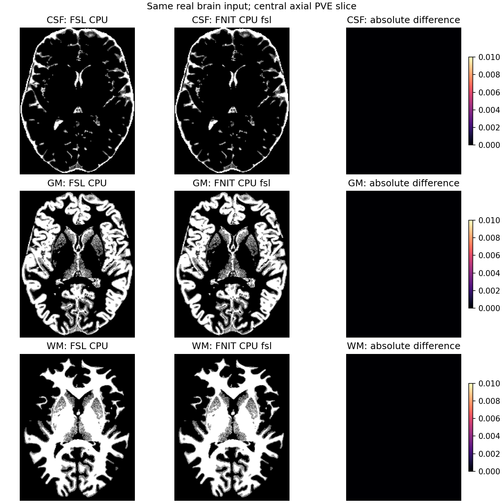

# TorchFAST 与 FastVBM：CPU 精度和速度审计

[TorchFAST 功能说明](../../../docs/fast/README.md) · [FastVBM 功能说明](../../../docs/fast_vbm/README.md)

## 1. 本轮范围与计时协议

冻结 main 为 `1d31e7baaebbb644ab199471f7fe6282721455fd`。本轮修改 CPU `execution="fsl"` 的顺序扫描、随机流、bias 卷积及 PVE 热点；CUDA `fsl` 和 CPU/CUDA `tensor` 保留原执行路径。FastVBM 新增显式 `fast_execution` 选项，默认仍为 `tensor`。

真实输入来自公开 ds003138 的一例 T1w，224×288×288 网格。第一轮使用冻结的 SynthStrip brain 和 mask，给原 FAST 与 FNIT 相同 brain；显式 mask 与正输入取交集。该检查点来自修正输入网格前的 SynthStrip，只用于隔离 FAST。新的公开 CLI 和原始 T1 流程采用任务 1 修正后的 brain（SHA-256 `fd8c3253a6960777715c85844a38e760959b6bf80849bd28b7e5b906dee0dea4`）。两侧没有使用彼此的分割结果进行初始化。FAST stage 结果不能替代原始 T1 到 VBM 的完整对照。

CPU 为 nodecw10 的 Intel Xeon Gold 6418H。同一组 8 个物理核心 `0,4,8,12,16,20,24,28`，线程环境和进程 affinity 均记录，所有受测进程使用共同排他锁串行运行。原 FAST 未提供线程参数，仍设置相同 8 线程环境和核心预算，并记录其实际线程。每次测量为新进程；完整墙钟含启动、输入读取和 gzip 输出。API 时间另列，不含 `save()`。首次 Numba JIT 与后续磁盘缓存加载分别报告；嵌套 stage 时间不能相加。

这是共享节点，不是独占机器或独占物理核心：现场有其他计算进程使用全节点 affinity，第一轮负载约 32，后续组约 80–110。本组测量相互串行，原参考与候选均记录运行前后 load。第二轮默认 tensor 复测使用 NUMA 3 的 `3,7,11,15,19,23,27,31`，同组新旧串行；不跨组计算提速倍数。

官方参考通过独立 benchmark 进程调用 FSL 6.0.7.4。FNIT 运行时不启动该程序。完整参考返回码为 0，八幅预期影像均存在；不能沿用既有另一环境的 exit 255 记录。

输入、源码和八幅输出 SHA-256、有限值、shape、affine、dtype、qform/sform、逐体素差、组织 Dice 和体积分别记录。私人服务器路径、身份信息、原始 MRI、权重和模板不进入公开报告。

## 2. CPU 热点与替换

真实脑图中央 24×26×28 区域有 14,453 个有效正体素，用于定位旧 Python 调度成本。没有用模拟脑代替这项诊断，也没有把小区域时间外推到全脑。

| 实现 | 冷进程完整墙钟 | API 时间 | 状态 |
|---|---:|---:|---|
| 冻结 main `fsl`，第 1 次 | 13.017 s | 10.493 s | 完成 |
| CPU 编译版本，首次 JIT | 6.765 s | 4.366 s | 完成 |
| CPU 编译版本，新进程命中磁盘缓存 | 4.258 s | 1.553 s | 完成 |
| 冻结 main `fsl`，第 2 次 | 10.768 s | 8.479 s | 完成 |

候选首次输出与冻结 main 的八幅完整区域图逐位相同，数值差均为 0。旧版后验扫描分别占 9.949 / 8.004 s，约为 API 的 95%；新进程命中缓存后为 0.067 s。编译后的卷积在这个小区域为 0.471 s，包含缓存加载和并行启动，旧 PyTorch 为 0.055–0.071 s，因此该处的小区域速度尚未改善。全脑应以独立完整测量判断。

替换策略如下：

| 热点 | 新 CPU 路径 | 必须保留的语义 |
|---|---|---|
| Tanaka 后验扫描 | Numba，连续 X 行，z→y→x 原地扫描 | 18 邻居依赖、累加顺序、double 中间量与 float32 存储 |
| 混合类型 ICM | Numba 原地扫描 | 候选顺序、首次最大分数选择、float32 乘积与 exp |
| glibc 随机流 | Numba uint32 加法生成器 | 31 元环状态、溢出、连续调用流，不改变全局 RNG |
| separable bias 卷积 | Numba，独立体素并行 | 每项累加回写 float32、double 乘加、边界零值 |
| mixel evidence / PVE | Numba，独立体素并行 | 101 个固定积分点、反复 float32 加步长、首次最小能量候选 |

所有内核关闭 `fastmath`。CPU 公共入口将 Numba 并行线程掩码限制到 PyTorch 调用预算和 Numba 配置上限，正常返回和异常均恢复原掩码。CUDA/tensor 不导入这个 CPU 模块。

## 3. 完整脑 CPU 对照

本轮完整图像有效脑体素为 **2,843,723**。完整冷进程包括启动、读写与八幅输出，候选进程读取已建立的 Numba 磁盘缓存。

| 完整脑图实现 | 冷进程 | API | 保存 | 采样树 RSS 峰值 |
|---|---:|---:|---:|---:|
| 官方 FAST | 357.197 s | 原程序未拆分 | 原程序未拆分 | 2.312 GB |
| FNIT CPU `fsl`，新进程加载编译缓存 | 97.349 s | 91.947 s | 3.087 s | 2.921 GB |
| 冻结 main CPU 默认 `tensor` | 70.814 s | 报告中另列 | 报告中另列 | 4.357 GB |

同 8 核预算下，本输入 FNIT `fsl` 的完整进程观测为官方的 **3.67 倍速度**。官方 FAST 实际为 1 线程，记录中另两个线程来自 shell 和 `/usr/bin/time`。FNIT `fsl` 采样驻留线程峰值为 72，默认 tensor 为 64；驻留库线程池数量不是同时活跃线程数，执行 affinity 始终限于同一 8 个物理核心，PyTorch/OMP/BLAS/Numba 均设置 8 的预算。因此这条结果不是两程序均有 8 个活跃线程的结论。候选限制到 1 核/1 线程后实际完整运行 **325.275 s**，八图压缩文件 SHA、体素及几何均与 8 核版本相同；它是单独运行的敏感性检查，不能与前一轮 8 核 affinity 的官方时间当作严格单核心配对。正确 brain 上的两端严格单核心 CLI 配对见下节。

全部八图的 shape、affine、dtype、dim/pixdim、qform/sform code、单位和 intent code 相同，数值有限。以下为脑内指标；差异计数和最大差在全网格上相同。

| 输出 | Pearson r | RMSE | 最大绝对差 | 不同体素 |
|---|---:|---:|---:|---:|
| CSF PVE | 0.9999999986 | 1.875×10⁻⁵ | 0.01000001 | 10 |
| GM PVE | 0.9999999955 | 4.065×10⁻⁵ | 0.01000001 | 47 |
| WM PVE | 0.9999999966 | 3.607×10⁻⁵ | 0.01000005 | 37 |
| seg | 1 | 0 | 0 | 0 |
| pveseg | 0.9999996463 | 5.930×10⁻⁴ | 1 标签 | 1 |
| mixeltype | 1 | 0 | 0 | 0 |
| bias | 0.99999999999999 | 1.020×10⁻⁸ | 1.192×10⁻⁷ | 22,779 |
| restore | 1.0000000000 | 8.079×10⁻⁶ | 2.441×10⁻⁴ | 26,789 |

seg 的三组织 Dice 均为 1，mixeltype 六标签 Dice 均为 1；pveseg 仅一个 GM/WM 临界体素改变，GM / WM Dice 为 0.999999628 / 0.999999499，CSF 为 1。PVE 0.5 Dice 和软体积也逐组织记录；软体积相对差绝对值小于 0.00001%。该实现与官方非常接近，但不是八图逐点完全相同。少数 PVE 差异达到相邻离散候选间隔约 0.01，与 bias / restore 的微小浮点差分开报告，不能只用硬分割 Dice 抹去它们。

默认 `tensor` 的旧/新完整八图 SHA 相同。第一轮冷进程为 70.814 / 95.083 s；后续 NUMA 3 的 baseline → candidate → candidate → baseline 为 **92.890 / 91.383 / 85.362 / 88.376 s**，API 为 86.552 / 85.432 / 79.569 / 82.677 s，八图 SHA 仍全部相同。这些时间范围重叠，没有显示稳定的默认路径变慢。

默认 `tensor` 与官方的差异明显大于原序 `fsl`：CSF/GM/WM PVE 脑内 RMSE 为 **0.05697 / 0.07594 / 0.05017**，最大差均为 1；PVE 最大标签的不同体素为 30,340，三组织 Dice 为 **0.98455 / 0.98890 / 0.99233**。mixeltype 不同体素 159,626，其中少量 CSF/WM 混合类型 Dice 为 0.43968。软体积差为 +0.523%、−0.465%、+0.325%。这是既有同步算法与原序扫描的差异，本轮没有改变该路径；需要接近官方的 CPU 输出时显式选择 `execution="fsl"`。



上图为固定的中央轴位，不代表最大差所在位置；全部八图逐体素误差见 JSON。这里的 API worker 完整进程不是公共 CLI 计时。完整脑图旧 CPU `fsl` 的 Python 慢路径没有重复运行，保真依据为真实区域逐位对照、原序测试、完整官方输出差异和独立 CUDA 回归。

### 修正 brain 后的公共 CLI

以下为另一组真实完整测量，使用修正后的同一 brain/mask，在 NUMA 3 同锁运行。有效体素为 2,843,038。候选调用实际公共入口 `python -m fnit.cli fast`；旧队列误用了没有 `__main__` 的 `python -m fnit`，两次约 0.254 秒即退出，未执行算法。原错误记录保留；补跑采用新输出目录，没有重标失败运行。

| 公共 CLI 范围 | 官方完整进程 | FNIT 完整进程 | 输出比较 |
|---|---:|---:|---|
| 默认，8 核预算 | 388.216 / 394.790 s | 121.683 / 132.939 s | seg / mixeltype 同；PVE 5 / 27 / 22 个体素有差；pveseg 2 个体素有差 |
| 默认，严格同一核心和 1 线程环境 | 391.390 s | 349.989 s | 与上述官方差异相同；候选 1/8 核八图逐位同 |
| `-N -W 5 -I 2 -O 2 -f 0 -H 0 -R 0`，8 核预算 | 130.213 s | 53.327 s | 八图逐位一致；几何、dtype、关键 header 相同 |

CPU8 的实际次序为 R-R-C-C，之间穿插其他同锁 task4 作业；不是连续 R-C-C-R。单核两侧也不是紧邻运行；共享节点 load 和开始时间均保留。单核速度比为 1.118，八核与单核结果分别解释，不能把八核并行收益称为相同活跃线程下的加速。候选峰值 OS 线程 64/72 包含空闲库池，affinity 与环境线程数分别为单核/1 和八核/8。

默认 bias / restore 最大差为 1.192×10⁻⁷ / 2.441×10⁻⁴，PVE 最大差仍约 0.01；八图 shape、affine、dtype、关键 header 全同。非默认配对关闭偏置更新并缩短初始化/EM，保留完整网格、PVE 候选与保存；其通过不能代替默认配置的少数差异。[JSON](report.public.json)中的 `corrected_public_cli` 分列三项完整评分和全部实际计时。

## 4. 完整脑 CUDA 回归

gpucw1 的 H100 PCIe 上，CUDA 设备和共同锁固定，CPU budget 为 8 核，PyTorch allocator budget 为 20 GB。`fsl` 与 `tensor` 各运行两次冻结 main / 候选对照，共 32 对保存的 gzip NIfTI；**全部 SHA-256 相同**。这项检查覆盖完整数据、几何和文件内容。

| 路径与缓存轮次 | main 冷进程 | 候选冷进程 | main API | 候选 API |
|---|---:|---:|---:|---:|
| `fsl`，首轮编译缓存 | 39.616 s | 39.129 s | 32.257 s | 32.296 s |
| `fsl`，缓存建立 | 24.069 s | 25.831 s | 17.721 s | 18.066 s |
| `tensor`，第 1 次 | 9.532 s | 9.028 s | 2.614 s | 2.522 s |
| `tensor`，第 2 次 | 9.029 s | 9.534 s | 2.610 s | 2.531 s |

两版本显存峰值相同：`fsl` allocated 2,643,126,272 B、reserved 3,378,511,872 B；`tensor` allocated 3,874,571,264 B、reserved 5,523,898,368 B。这是 PyTorch allocator 读数，不能当作整个进程 GPU 驱动内存。缓存、读写和共享机器波动影响墙钟；本轮 CUDA 源码计算路径未修改，结果和显存没有回归。

## 5. 公开功能覆盖与剩余工作

| 功能/参数 | 本轮证据 | 剩余验收 |
|---|---|---|
| 三组织 T1 `fsl` 默认配置 | 真实区域旧/新、完整 CUDA 旧/新一致；旧 brain 完整 stage 与正确 brain 公共 CLI 均完成官方对照 | 更多真实病例 |
| 默认同步 `tensor` | 完整 CPU 两组和 CUDA 两轮旧/新文件相同；本输入的官方误差已逐图评分 | 更多真实病例 |
| `threads` | 预算及异常恢复测试；正确 brain 上官方/FNIT 同核单线程完整配对；候选 1/8 核八图逐位相同 | 更多重复 |
| bias 开关、迭代/MRF/PVE 参数 | 新 RNG 不同种子/分段流逐位核验；真实完整 `-N -W5 -I2 -O2 -f0 -H0 -R0` 官方八图逐位相同 | 其他非默认组合 |
| 3D/单帧 4D、显式 mask、内部 X 翻转及几何 | 现有输入/几何测试和本轮八图 header 检查 | 非默认真实影像功能病例 |
| CLI 保存八图、覆盖保护 | 原有测试和真实公共 CLI 完整冷进程、八图评分 | 更多病例 |
| FastVBM `fast_execution` | 默认 tensor 不变测试；冻结 v2 在同 raw T1 上以 `fsl` 跑通两条 CPU 流程 | 最终源码全链重测、其他 FAST 配置 |
| FastVBM SynthMorph/FNIRT 后端 | 冻结 v2 已完成独立官方输出、13 图精度、阶段时间与脑图，见[独立报告](fast_vbm_cpu_20261004/README.md) | FNIRT 数值差异、SynthMorph 反向场差异和更多病例；官方 SynthMorph 只有分支实测，不作冷完整链时间比 |

任务 1 负责 SynthStrip，任务 3 负责 SynthMorph；FLIRT、FNIRT、ApplyWarp 与 CLI 由主任务协调。若上游成熟组件发现 bug，记录到相应组件，修复后再冻结完整 VBM。FAST commonbrain 的受控对照不借用官方 brain 作为生产输入。

VBM GM 模板 SHA-256 为 `ab933db7455d7c4b88624d54f41a3065be4ba4289d00b9230daec0cdb1597a77`（707,776 B），已现场核对其 UKB 原始来源；FSL 模板掩膜 SHA-256 为 `342d41e1c445d87a812ca288786a116306e96a5595a198e46ba7e7515d4f221c`（11,132 B）。仅在私密服务器复用，不随代码发布。公开下载遵循项目资产清单及原作者许可。

## 6. 复现入口与更新记录

`worker.py` 接收真实 `--image`、`--mask`、`--device`、`--threads`、`--execution` 和独立 `--output-dir`。`--mode profile` 保存真实中央区域和嵌套阶段时间；`--mode fast` 保存八幅完整图；`--mode vbm` 调用完整 FastVBM。`gpu_worker.py` 增加 GPU 上下文、allocator 预算和峰值记录。`compare.py` 在推理计时结束后比较全部八幅输出，分别计算脑内和全网格数值误差、Dice、软/硬体积及几何。

主任务统一 `queue_runner.py` 的完整进程时钟作为速度验收入口，worker 内 API 和嵌套 stage 为辅助诊断；不自行替换计时边界。本轮源码、输入和结果哈希绑定在 [report.public.json](report.public.json)。

| 日期 | 更新 |
|---|---|
| 2026-10-04 | CPU 编译热点、Numba 线程预算恢复、显式 VBM FAST 选择；277 项受影响测试通过；完整 CPU `fsl` 官方对照、修正 brain 的公共 CLI、两端严格单核心、非默认配置、默认 tensor 同组重复和完整 CUDA 检查完成。冻结 v2 两条 VBM CPU 链已完成对各自官方输出的比较，详见[独立报告](fast_vbm_cpu_20261004/README.md)。 |

## 7. 原软件与参考

```bash
fast -t 1 -n 3 -I 4 -W 15 -O 4 -f 0.02 -l 20 -H 0.1 -R 0.3 \
  -b -B -o official_fast T1_brain.nii.gz
```

上式仅用于独立原软件 benchmark。FastVBM 的完整 FSL 原流程及各参数见 [FastVBM 文档](../../../docs/fast_vbm/README.md#4-原软件调用)。

- [FAST 官方说明](https://fsl.fmrib.ox.ac.uk/fsl/docs/structural/fast.html)，[FAST4 官方源代码](https://git.fmrib.ox.ac.uk/fsl/fast4)。
- [FSL-VBM 官方说明](https://fsl.fmrib.ox.ac.uk/fsl/docs/structural/fslvbm.html)，[fslvbm 源代码](https://git.fmrib.ox.ac.uk/fsl/fslvbm)。
- Zhang, Brady & Smith (2001), *IEEE TMI*, [doi:10.1109/42.906424](https://doi.org/10.1109/42.906424)。
- Ashburner & Friston (2000), *NeuroImage*, [doi:10.1006/nimg.2000.0582](https://doi.org/10.1006/nimg.2000.0582)。
