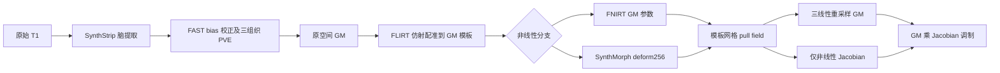
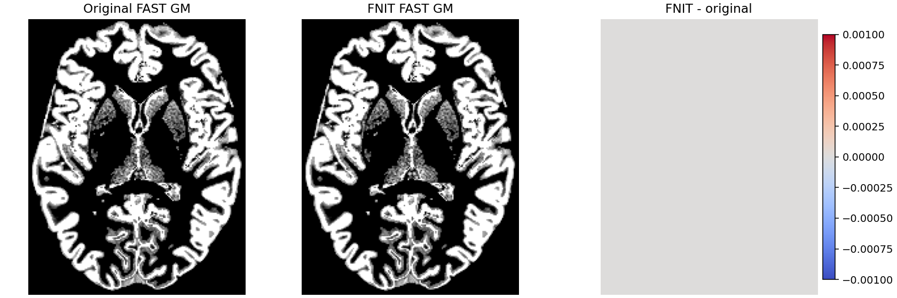

# FastVBM：真实 T1 的 CPU 全流程对照（2026-10-04）

本报告补充 [任务 4 的 TorchFAST 审计](../README.md)。功能接口、完整参数与输入约束见 [FastVBM 说明](../../../../docs/fast_vbm/README.md)；逐图、逐区域指标和冻结源码 SHA-256 见 [report.public.json](report.public.json)。本目录保存验证脚本、脱敏报告和公开数据派生脑图，未包含影像输入、模板或模型。

## 1. 范围、输入与流程

输入是 OpenNeuro **ds003138 v1.0.1** 的一例真实原始 T1w（CC0），网格 **224×288×288**，不是 skull-stripped derivative。SHA-256 为 `afd1a20fe75fdea44313f0eda05020b916c87234e7a2045f7ccc6bb7c6e90b19`。GM 模板为既有的 **91×109×91、2 mm** 网格，SHA-256 为 `ab933db7455d7c4b88624d54f41a3065be4ba4289d00b9230daec0cdb1597a77`；该模板仅用于本次验证，不随报告分发。参考 mask 是原版 dilated MNI152 2 mm brain mask。模板、mask、SynthStrip/SynthMorph 权重的 SHA-256 均记录在机器报告中，本子任务没有新增下载或再分发资源。



本次候选冻结于 `task5_candidate_cpu_v2/src`，基线 main 为 `1d31e7baaebbb644ab199471f7fe6282721455fd`；逐文件 hash 记录于 JSON。后续主任务整合的最终源码没有在本子报告中重新跑完整 FastVBM，不能将这里的时间和指标标作最终整合版的新实测。

两条 FNIT 分支从原始 T1 各自完整运行。官方 FNIRT 参考独立完成 SynthStrip→FAST→FLIRT→FNIRT→applywarp→fslmaths。另一个参考复用**官方自身**的 SynthStrip、FAST、FLIRT 产物，运行官方 SynthMorph，并由独立 NumPy 坐标适配器和官方 FSL 后处理产生相同三幅标准空间图。该适配器不导入 FNIT 的变换、配准或重采样代码。官方参考只在验证脚本中运行，FNIT pipeline 不启动 FSL/FreeSurfer。

原版前处理采用 SynthStrip，因此本报告的参考是 **SynthStrip/FSL VBM 链**。它没有执行 standard FSL-VBM 的 BET 脑提取流程。

### 本次固定配置

| 参数 | 本次值与作用 |
|---|---|
| `image` / `--image` | 单幅原始 3D T1 NIfTI；输出原空间网格继承其 geometry |
| `template` / `--template` | 3D GM 模板；定义三幅标准空间输出的完整网格 |
| `reference_mask` / `--reference-mask` | 模板网格二值 mask；FNIRT 估计使用它，SynthMorph 分支记录它但网络没有 mask 输入 |
| `brain_mask` / `--brain-mask` | 本次省略，由每条链自己的 SynthStrip 提取 |
| `device` / `--device` | `cpu`；CUDA 对进程不可见 |
| `threads` / `--threads` | `8`；并设置 OMP、MKL、OpenBLAS、Numba、TF 的 8 线程环境 |
| `fast_execution` / `--fast-execution` | 显式 `fsl`，使用仓库实现的顺序更新路径；内部 CPU Numba 核心不调用原版 FAST；生产默认仍为 `tensor` |
| `bias_correction` / `--no-bias` | 开启校正，未传 `--no-bias` |
| `synthstrip_weights` / `--synthstrip-weights` | 已校验的官方 `synthstrip.1.pt` |
| `synthmorph_weights` / `--synthmorph-weights` | 已校验的 `synthmorph.deform.3.h5`，SynthMorph 分支使用 |
| `registration_backend` / `--registration-backend` | 分别运行 `fnirt` 与 `synthmorph` |
| `synthmorph_extent/hyper/steps` | `256 / 0.5 / 7`；deform 模式，不使用 mid-space，保留官方双向反对称网络计算 |
| `fnirt_strides` / `fnirt_steps` | `(4,2,1,1)` / `(5,5,10,5)`，GM 四层估计 |
| `fnirt_input_fwhm_mm` / `fnirt_reference_fwhm_mm` | `(6,4,2,2)` / `(4,2,0,0)` |
| `fnirt_warp_resolution_mm` / `fnirt_regularization` | `10` / `(150,75,50,30)` |
| 插值与 Jacobian | GM 三线性重采样；非线性残差的密集场有限差分 Jacobian；调制图为 warped GM×Jacobian |

## 2. Python 与命令行复现

以下参数重现本次 CPU 配置；先按主页安装 FNIT，并配置已有合法模板、mask 与权重。`template_mask_path` 应指向用户配置的 mask 文件，FNIT 不依赖 FSL 安装来读取它。

```python
from pathlib import Path
from fnit.fast_vbm import FastVBM

raw_t1_path = Path("inputs/subject01_T1w.nii.gz")
gm_template_path = Path("templates/template_GM.nii.gz")
template_mask_path = Path("templates/MNI152_2mm_dilated_brain_mask.nii.gz")
synthstrip_checkpoint_path = Path("weights/synthstrip.1.pt")
synthmorph_checkpoint_path = Path("weights/synthmorph.deform.3.h5")

# 两条分支分别处理同一原始 T1；不复用对方的组织分割结果。
for nonlinear_backend in ("fnirt", "synthmorph"):
    vbm_pipeline = FastVBM(
        device="cpu", threads=8, fast_execution="fsl",
        synthstrip_weights=synthstrip_checkpoint_path,
        synthmorph_weights=synthmorph_checkpoint_path,
        registration_backend=nonlinear_backend,
    )
    vbm_result = vbm_pipeline(
        raw_t1_path, gm_template_path, reference_mask=template_mask_path,
    )
    output_directory = Path("outputs") / nonlinear_backend
    vbm_result.save(output_directory)  # 13 幅影像和 fast_vbm_report.json
```

```bash
# 用同一组 8 个物理核心限制受测进程；修改文件路径为自己的输入。
export OMP_NUM_THREADS=8 MKL_NUM_THREADS=8 OPENBLAS_NUM_THREADS=8 NUMBA_NUM_THREADS=8
export CUDA_VISIBLE_DEVICES=""
taskset -c 3,7,11,15,19,23,27,31 python -m fnit.cli fast-vbm \
  --image inputs/subject01_T1w.nii.gz --template templates/template_GM.nii.gz \
  --reference-mask templates/MNI152_2mm_dilated_brain_mask.nii.gz \
  --synthstrip-weights weights/synthstrip.1.pt \
  --synthmorph-weights weights/synthmorph.deform.3.h5 \
  --device cpu --threads 8 --fast-execution fsl \
  --registration-backend fnirt --output-dir outputs/fnirt
# 将 registration-backend 和 output-dir 改为 synthmorph 即为另一分支。
```

### 13 幅输出

| 文件 | 网格与内容 |
|---|---|
| `T1_brain.nii.gz` | 原 T1 网格，mask 外截为非正背景的脑影像 |
| `brain_mask.nii.gz` | 原 T1 网格，uint8 脑 mask |
| `T1_brain_pve_0.nii.gz` | 原 T1 网格，CSF 部分容积，float32 |
| `T1_brain_pve_1.nii.gz` | 原 T1 网格，GM 部分容积，float32 |
| `T1_brain_pve_2.nii.gz` | 原 T1 网格，WM 部分容积，float32 |
| `T1_brain_seg.nii.gz` | 原 T1 网格，三组织硬标签 |
| `T1_brain_pveseg.nii.gz` | 原 T1 网格，从 PVE 得到的组织标签 |
| `T1_brain_mixeltype.nii.gz` | 原 T1 网格，纯组织/混合组织类型 |
| `T1_brain_bias.nii.gz` | 原 T1 网格，乘法 bias field |
| `T1_brain_restore.nii.gz` | 原 T1 网格，bias 校正后的脑影像 |
| `T1_GM_to_template_GM.nii.gz` | 完整模板网格，配准后的 GM PVE |
| `T1_GM_JAC_nl.nii.gz` | 完整模板网格，仅非线性 Jacobian |
| `T1_GM_to_template_GM_mod.nii.gz` | 完整模板网格，Jacobian 调制后的 GM |

结果另外写入 `fast_vbm_report.json`，含配置、API 分段耗时和几何/QC。该 JSON 不属于 13 幅影像。

## 3. 官方参考与独立评分

FNIRT 参考入口 [vbm_reference.py](../vbm_reference.py) 的参数是 `--image`（原始 T1）、`--template`（GM 模板）、`--reference-mask`（模板 mask）、`--synthstrip-weights`（checkpoint）、`--threads`（默认 8）、`--output-dir`（新输出目录）。它在独立、已配置许可的原软件环境中依次执行下面的命令：

```bash
mri_synthstrip -i subject01_T1w.nii.gz -o T1_brain.nii.gz \
  -m brain_mask.nii.gz -t 8 --model synthstrip.1.pt
fast -t 1 -n 3 -b -B -o T1_brain T1_brain.nii.gz
flirt -in T1_brain_pve_1.nii.gz -ref template_GM.nii.gz -omat gm_affine.mat
fnirt --in=T1_brain_pve_1.nii.gz --ref=template_GM.nii.gz \
  --aff=gm_affine.mat --config=GM_2_MNI152GM_2mm \
  --refmask=MNI152_T1_2mm_brain_mask_dil.nii.gz \
  --cout=gm_coeff.nii.gz --fout=gm_field.nii.gz --jout=T1_GM_JAC_nl.nii.gz
applywarp -i T1_brain_pve_1.nii.gz -r template_GM.nii.gz \
  -w gm_coeff.nii.gz -o T1_GM_to_template_GM.nii.gz --interp=trilinear --datatype=float
fslmaths T1_GM_to_template_GM.nii.gz -mul T1_GM_JAC_nl.nii.gz \
  T1_GM_to_template_GM_mod.nii.gz -odt float
```

SynthMorph 参考入口 [vbm_synthmorph_reference.py](../vbm_synthmorph_reference.py) 的 `--upstream` 是完成上述 SynthStrip/FAST/FLIRT 的官方目录，`--template` 和 `--weights` 是模板/deform 权重，`--threads` 默认 8，`--output-dir` 必须为新目录。可选 `--reuse-native-field` 只重放原版场的后处理，不能作为神经网络推理时间。脚本独立将 FLIRT forward matrix 转为 world LTA，检查斜切源网格八角点与 LTA 回读，再执行：

```bash
mri_synthmorph register -m deform -e 256 -r 0.5 -n 7 -j 8 \
  -i original_flirt_initial.lta -w synthmorph.deform.3.h5 \
  -t original_ras_pull.nii.gz T1_brain_pve_1.nii.gz template_GM.nii.gz
# NumPy 将原版 RAS pull 转为 FSL relative field，并计算指定的 nonlinear-only Jacobian。
applywarp -i T1_brain_pve_1.nii.gz -r template_GM.nii.gz \
  -w original_fsl_relative.nii.gz -o T1_GM_to_template_GM.nii.gz \
  --rel --interp=trilinear --datatype=float
fslmaths T1_GM_to_template_GM.nii.gz -mul T1_GM_JAC_nl.nii.gz \
  T1_GM_to_template_GM_mod.nii.gz -odt float
```

[vbm_compare.py](../vbm_compare.py) 从已完成产物评分，不重跑模型。`--candidate` 指向 FNIT 13 图目录，`--reference` 是官方目录；Morph 仅有三幅标准空间图时，`--reference-native` 指向官方原空间 10 图目录。`--template`、`--reference-mask` 定义独立评分区域，`--scope` 明确是否同算法，`--output` 是 JSON 路径。

```bash
python validation/smri_cpu_20261004/task04/vbm_compare.py \
  --candidate outputs/fnirt --reference references/fnirt \
  --template templates/template_GM.nii.gz \
  --reference-mask templates/MNI152_2mm_dilated_brain_mask.nii.gz \
  --scope "same-estimator FNIRT complete chain" --output scores/fnirt.json
```

全 FOV 与脑内分别报告 MAE、RMSE、P99/max、Pearson r、不同体素和 `NRMSE=RMSE/(参考 P99−P1)`。原空间脑区取官方 mask；组织评分再与官方正脑强度相交（2,843,038 体素）。标准空间取显式 mask 与正 GM 模板交集（257,125 体素）；全模板网格 902,629 体素没有裁切。mask 和组织标签另列 Dice/硬体积，PVE/warped/mod 图列积分软体积与 0.5 阈值 Dice。shape、affine、dtype、qform/sform、关键 header 和文件 SHA-256 单独核对。

## 4. CPU 完整进程与分步骤耗时

机器为 nodecw10 的 Intel Xeon Gold 6418H。每条受测链均设定 **8 线程环境、相同 8 物理核 affinity `3,7,11,15,19,23,27,31`**，共同锁保证本组链相互串行。节点同时有其他任务，运行前后 load 范围约 75–117；不是独占节点。采样驻留 OS 线程峰值 FNIT 72、官方 FNIRT 链 31、官方 Morph 子链 27，库线程池驻留数不等于同时执行线程数。

下表为新进程完整墙钟，包含启动、读写和 13 图输出；没有清空文件系统缓存。候选的 CPU Numba 编译缓存已由前序 FAST 验证建立。顺序实际为候选 FNIRT→候选 Morph→官方 FNIRT→官方 Morph 子链，仅各一次，没有完整 pipeline 的 AB-BA 重复。

| 实现与范围 | 完整进程墙钟 | 采样树 RSS 峰值 | 结果 |
|---|---:|---:|---|
| FNIT FNIRT，原始 T1→13 图 | **610.899 s** | 5.678 GB | 完成，尚未数值等价 |
| 官方 SynthStrip/FSL FNIRT，原始 T1→13 图 | **769.365 s** | 6.016 GB | 完成 |
| FNIT SynthMorph，原始 T1→13 图 | **355.802 s** | 12.629 GB | 完成，三幅标准图误差见下表 |
| 官方 Morph 子链，复用官方上游 | 152.992 s | 18.537 GB | 原版推理完成；旧后处理几何随后修正 |
| 官方 Morph 修正后处理，复用同一原版场 | 19.534 s | 机器报告记录 | 无模型推理，不能当完整链耗时 |

本输入完整 FNIRT 链的观测耗时比为 `769.365/610.899=1.259`。空间图没有达到数值等价，因此不能将该比值称作等价重建加速。当前优势主要来自脑提取与 FAST，FNIT 合并的配准/Jacobian/调制部分仍慢于原版对应部分。

| 分步骤范围 | 官方 FNIRT | FNIT FNIRT API | FNIT SynthMorph API |
|---|---:|---:|---:|
| SynthStrip 脑提取 | 40.151 s | 10.746 s | 11.338 s |
| FAST | 359.118 s | 124.939 s | 135.719 s |
| FLIRT | 33.865 s | 计入下方合计 | 计入下方合计 |
| 非线性配准 | 326.097 s | 合并统计 | 合并统计 |
| applywarp | 7.868 s | 合并统计 | 合并统计 |
| Jacobian 调制 | 0.249 s | 合并统计 | 合并统计 |
| 配准+Jacobian+调制合计 | 368.080 s | **466.510 s** | **200.106 s** |
| API 总计，含输入读取及首调用权重加载，排除 `save()` | 原程序无对应 API | 602.760 s | 347.725 s |

官方各阶段是子进程墙钟，包含该子进程读写/启动；FNIT 阶段为 API 范围，最终 save 不在其中。两者用于定位耗时，不能作严格独立 kernel 加速比。候选没有保存每个非线性/重采样阶段的互斥计时，本报告不推算这些缺失时间。

官方 Morph 实测网络阶段 **138.976 s**。最终使用实际 NIfTI 网格的后处理分别为：FLIRT→LTA 准备 3.712 s、NumPy 场转换/Jacobian 1.360 s、applywarp 2.839 s、调制 0.119 s。加上官方自身前三阶段 **433.135 s**，重建的阶段和为 **580.141 s**。该值由不同进程的阶段汇总，没有重新从 T1 跑一条完整 Morph 冷进程；不据此给出正式端到端提速倍数。

TorchFAST 的公开 CLI、代表性非默认参数和严格单核结果详见 [父报告](../README.md) 的 `corrected_public_cli`：正确 brain 的默认参考 388.216/394.790 s，候选 121.683/132.939 s，实际为 R-R-C-C 且有其他 job 穿插；严格单核参考 391.390 s、候选 349.989 s；代表性 `-N -W5 -I2 -O2 -f0 -H0 -R0` 参考 130.213 s、候选 53.327 s，八图数据与受查 geometry/header 逐位相同。它们是独立 FAST 结果，不替代本表的 VBM 全链。

## 5. 精度：13 图已比较，哪些仍不一致

两条 FNIT 分支的前处理输出相同。原空间脑影像、脑 mask、`seg`、`mixeltype` 的体素值逐位相同；mask Dice=1，脑体积均为 **1,376,016.379 mm³**。

| 原空间输出 | 脑内 RMSE | 全 FOV 最大绝对差 | 不同体素 |
|---|---:|---:|---:|
| CSF PVE | 1.326×10⁻⁵ | 0.010000005 | 5 |
| GM PVE | 3.082×10⁻⁵ | 0.010000005 | 27 |
| WM PVE | 2.782×10⁻⁵ | 0.009999990 | 22 |
| `pveseg` | 8.387×10⁻⁴ | 1 标签 | 2 |
| bias | 1.017×10⁻⁸ | 1.192×10⁻⁷ | 22,641 |
| restore | 8.055×10⁻⁶ | 0.000244141 | 26,568 |

PVE 的积分组织体积差均小于 **6.1×10⁻⁶%**；pveseg 的 GM/WM Dice 为 **0.99999926 / 0.99999900**。PVE 的少数 0.01 步长差和 pveseg 两体素差仍需保留，不能宣称全部离散输出逐点相同。

标准空间下表是**同估计方法的独立完整链**比较，脑内 NRMSE 按各自参考图的 P99−P1 归一化。括号为全 FOV NRMSE；max 也是全 FOV。

| 输出 | FNIRT 脑内 NRMSE（全 FOV） | FNIRT max | Morph 脑内 NRMSE（全 FOV） | Morph max |
|---|---:|---:|---:|---:|
| warped GM | **0.0189811**（0.0101545） | 0.716199 | **0.000561591**（0.000303010） | 0.0115110 |
| 非线性 Jacobian | **0.0100674**（0.00811336） | 0.285669 | **0.000352361**（0.000266831） | 0.00564694 |
| modulated GM | **0.0160380**（0.0101008） | 1.146858 | **0.000450764**（0.000281794） | 0.0163648 |

FNIRT warped/mod GM 脑内积分体积差分别为 **+0.009263% / −0.003708%**，Morph 为 **−0.001470% / −0.003883%**。很小的总体积分差不意味着局部空间图等价。FLIRT forward transform 在完整源网格上的最大世界坐标距离为 **0.0172093 mm**，也没有达到任务 3 的 0.001 mm 门槛。

另存的 FNIT Morph 与原版 FNIRT 比较是**不同算法**对照：warped GM/Jacobian/mod GM 的脑内 NRMSE 为 **0.267605 / 0.189387 / 0.216299**，不能据此判断 Morph 移植精度。其完整指标独立放在 JSON 的 `synthmorph_vs_original_fnirt_different_estimators`。

### Header 与字段转换

13 图 shape、dtype、affine 与 sform 均相同，空间 pixdim 相同，native qform 最大差 **2.98×10⁻⁹ mm**。header 不全部逐位同：原空间候选 pixdim[5:8] 为 0、官方为 1；warped/mod 图候选非空间 pixdim[4] 为 1，官方继承 T1 的 2.4。它们均为 3D 图，不代表空间体素间距不同，但报告保留该差异。

原版保存的 Morph warp extension 对 source geometry 有舍入，解析后的 affine 最大元素误差为 **0.000761012 mm**。第一次参考后处理使用这段舍入 geometry；最终重放**同一个原版 RAS 场**，改用实际 moving/fixed NIfTI geometry，没有重跑网络或使用候选输出。上表使用修正后的参考。

[vbm_validate_conversion.py](../vbm_validate_conversion.py) 在全部 **902,629** 目标体素、真实斜切源网格上，将独立 FSL relative field 回转为源坐标，与官方 Surfa `disp_crs` oracle 比较：世界分量最大差 **2.26×10⁻⁵ mm**、RMSE **5.33×10⁻⁶ mm**，向量最大差 **2.66×10⁻⁵ mm**。通过预先固定的分量 max≤10⁻³ mm、RMSE≤10⁻⁴ mm 门槛。参数分别是 `--moving`（实际源 GM）、`--fixed`（模板）、`--original-ras-field`（原版场）、`--fsl-relative-field`（独立适配器的场）、`--output`（JSON）。

## 6. 差异原因与下一步

**FAST**：默认组织硬分割与混合类型已相同，剩余少数 PVE/pveseg 差及微小 bias/restore 差应继续定位原程序浮点存储/混合组织离散搜索。当前本输入体积影响很小；严格离散标签验收仍要逐体素检查。

**FLIRT/FNIRT**：FLIRT 初始化存在可测世界坐标差，FNIRT 标准空间图的局部差明显大于原空间分割差。后续需隔离“同官方输入+同官方初始化”的优化器/插值/梯度验收，再回到全链。不得仅用总体体积或图像相关性替代空间误差。

**Jacobian**：FNIT 共同后处理采用 `det(I + d residual_fsl/d target_fsl)`，其中残差剥离 FLIRT 仿射；内点中心差分，边界单侧差分。原版 FNIRT `--jout` 使用 spline 导数，原版 `fnirtfileutils --withaff` 才追加 affine 的 Jacobian。[FNIRT 官方文档](https://fsl.fmrib.ox.ac.uk/fsl/docs/registration/fnirt/user_guide.html)

[vbm_jacobian_diagnostic.py](../vbm_jacobian_diagnostic.py) 用**同一原版 FNIRT 系数场**导出不含 affine 的密集残差，不重跑配准，再单独比较导数定义：

| 脑内比较 | MAE | RMSE | max |
|---|---:|---:|---:|
| 同原版场：密集有限差分 vs 原版解析导数 | 0.004374 | **0.005931** | 0.048863 |
| 候选密集 Jacobian vs 原版密集 Jacobian | 0.006400 | **0.012275** | 0.265896 |

因此 FNIRT Jacobian 差同时包含导数定义差与估计场差。两项不是正交误差，不相加或相减 RMSE 归因。若目标是原版 `jout` 数值匹配，FNIRT 分支应进一步匹配 spline 解析导数；密集场可继续采用当前一致的后处理定义。该脚本参数为 `--reference`（原版含 gm_coeff/jout 的目录）、`--template`、`--reference-mask`、`--candidate-jacobian` 和 `--output-dir`。

**SynthMorph**：同方法三幅标准图脑内 NRMSE 均小于 10⁻³，完整链仍不是 13 图逐位同。该结果覆盖 deform256、当前参数和这一例 T1；不能替代任务 3 的 rigid/affine/joint、反向场及边界分组验收。本轮未重跑完整 FastVBM GPU pipeline。

下一步保留：更多真实被试、完整链 AB-BA 重复、FLIRT/FNIRT 空间匹配、PVE/pveseg 的少数差异和非空间 header 匹配。当前报告只增加 CPU 验证证据，没有修改生产代码。

## 7. 脑图与验证脚本

下面均为真实公开 T1 的派生输出，只对显示区域加脑 mask；指标仍使用完整原网格。差值色条按脑内绝对差 P99 设定，下限 0.001，超过色条范围的值会截断。Morph 与 FNIRT 使用相同一行色条，Morph 的细微差在图上可能难以辨认，数值见上表。




[vbm_figure.py](../vbm_figure.py) 接收 `--candidate-fnirt`、`--candidate-morph`、`--reference-fnirt`、`--reference-morph` 四个产物目录，以及 `--template`、`--reference-mask`、`--output-dir`，输出两幅 PNG 和色条/切片说明 JSON。绘图使用已有 Matplotlib；没有增加运行时依赖。

`build_public_report.py --collected PRIVATE.json --output report.public.json` 从已收集的私密运行记录生成公开 JSON；只保留指标、相对源码 SHA、配置和命令的文件名。不会调用推理或读取 MRI。

## 8. 本轮记录与原实现

- 保留最初 reference 启动失败：`reference_env.sh` 非可执行，旧 runner 直接启动，0.254 s 内失败，未运行任何原版算法。新队列显式用 `/bin/bash -l`，官方完整链返回 0。
- 完成 FNIT 两分支及官方 FNIRT 链的 13 图评分；候选产物没有重复运行。
- 追加独立官方 Morph 同方法参考；修正 warp extension 的 source geometry 舍入影响，仅重放后处理，旧参考评分留作诊断，不用于最终表。
- 保留旧 coordinate harness 的 `disp_vox` 属性错误记录；改为 Surfa 实际公开格式 `disp_crs` 后完成全网格验证，未改估计器。
- 单独验证同原版 FNIRT 场的解析/有限差分 Jacobian 差，避免将整个差异归因于优化器。
- 公开报告保存候选冻结文件 SHA-256、原版版本、权重/模板/输入 hash、实际 load、进程 RSS/线程、全部 13 图指标和失败记录摘要。

原实现与参考文献：

1. [FSL FAST 官方文档](https://fsl.fmrib.ox.ac.uk/fsl/docs/structural/fast.html)；Zhang et al., *IEEE TMI* 2001, [10.1109/42.906424](https://doi.org/10.1109/42.906424)。
2. [FSL FLIRT 官方文档](https://fsl.fmrib.ox.ac.uk/fsl/docs/registration/flirt/index.html)；Jenkinson & Smith, *Medical Image Analysis* 2001, [10.1016/S1361-8415(01)00036-6](https://doi.org/10.1016/S1361-8415(01)00036-6)。
3. [FSL FNIRT 官方指南](https://fsl.fmrib.ox.ac.uk/fsl/docs/registration/fnirt/user_guide.html)，[原 FNIRT 源码](https://git.fmrib.ox.ac.uk/fsl/fnirt)。
4. [FreeSurfer 8.2 SynthMorph 注册代码](https://github.com/freesurfer/freesurfer/blob/v8.2.0/mri_synthmorph/synthmorph/registration.py)；Hoffmann et al., *Imaging Neuroscience* 2024, [10.1162/imag_a_00197](https://doi.org/10.1162/imag_a_00197)。
5. [SynthStrip 源码](https://github.com/freesurfer/freesurfer/tree/v8.2.0/mri_synthstrip)；Hoopes et al., *NeuroImage* 2022, [10.1016/j.neuroimage.2022.119474](https://doi.org/10.1016/j.neuroimage.2022.119474)。
6. [公开输入数据 ds003138](https://openneuro.org/datasets/ds003138/versions/1.0.1)。
