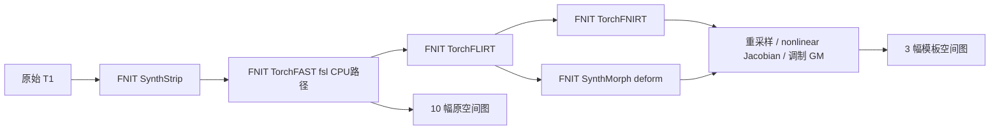

# 最终整合 v4：FastVBM CPU 完整链复测

## 1. 输入、源码与覆盖范围

本轮使用此前同一张 OpenNeuro **ds003138 v1.0.1、CC0 原始 T1**，完整网格 `224×288×288`；GM 模板网格为 `91×109×91`。T1、模板、显式参考 mask、SynthStrip/SynthMorph 权重的大小和 SHA-256 均重新核对，与[原独立官方对照](../README.md)相同。本轮没有下载或发布原始影像、模板及权重。

候选为 **`task5_candidate_cpu_v4`**，基于 `6f1e2b38925a481df3fa622f925af076df5436a9`，包含已审查、尚未提交的修改，实际身份由归档确定：

```text
ffda47a74376fbaec07c3e8aedaacdc30f2a60398b919c0d5feae38e3beba0d9
```

启动前逐项核验了 **1257 个归档文件**；运行后重新核验 **472 份 Python 源文件**，均未变化。不是“1257 份 Python 文件”。机器报告保存 manifest 哈希及本链49个相关模块的源码哈希。

两条公开 `fast-vbm` CLI 均从原始 T1 开始，自动脑提取、FAST、FLIRT、非线性配准、重采样、Jacobian 调制及保存 **13 幅影像**。显式设置 `fast_execution="fsl"`，其含义是 FNIT 内部顺序 CPU 分割实现，运行时不调用原版 FAST。其他配置保留默认值，包括偏置校正、Morph extent/hyper/steps `256/0.5/7`。



## 2. CPU 资源与完整进程耗时

nodecw10，Intel Xeon Gold 6418H；两个进程串行使用同一组 **8 个物理核 `3,7,11,15,19,23,27,31`、8 线程配置**，CUDA 不可见。每条链启动新进程，完整墙钟包括启动、输入/权重读取、实际编译成本、计算和最终保存。没有清空 OS/Numba 缓存，未另测首次安装 JIT。双方 receipt 为 `complete`、returncode **0**，13 图评分均完成。

节点有其他任务；FNIRT 前后 load1 为 `60.42→115.81`，Morph 为 `115.81→111.31`。下表的 RSS 是进程树采样峰值。驻留 OS 线程峰值均为72，其中包含库的空闲线程池，实际进程 affinity 仍限定上述八核。

| 范围 | 本轮 v4 完整 CLI | 内部 API，不含最后 save | 采样 RSS 峰值 | 既有参考时间 |
|---|---:|---:|---:|---|
| FNIRT，原始 T1→13 图 | **536.788 s** | 529.225 s | 5.678 GB | 官方 **769.365 s**，此前完整链 receipt |
| SynthMorph，原始 T1→13 图 | **317.736 s** | 310.025 s | 12.631 GB | 官方 **580.141 s**，复用上游/场的阶段和，非完整冷进程墙钟 |

本轮没有重跑官方，两份参考时间继承原报告并保留原始 receipt。它们与本轮候选不是邻接配对，没有 pipeline AB-BA 重复；不据此计算稳定提速倍数。既有 v2 候选完整墙钟分别为610.899、355.802秒，也属于不同时间的观测。

| 候选内部步骤 | v4 FNIRT | v4 SynthMorph |
|---|---:|---:|
| 自动脑提取，含首次模型加载 | 9.383 s | 10.243 s |
| FAST | 97.443 s | 109.200 s |
| 配准＋Jacobian＋调制合计 | 421.900 s | 190.122 s |
| API 总计，含输入读取 | 529.225 s | 310.025 s |

上述三个步骤没有覆盖全部 API 准备开销；配准合计没有拆成互斥的 FLIRT/非线性/重采样时间。官方既有 SynthStrip/FAST/FLIRT/FNIRT/applywarp/调制为40.151/359.118/33.865/326.097/7.868/0.249秒，包含各原程序子进程的启动和读写，不能与候选 API 范围直接计算 kernel 加速比。

## 3. 输出与 v2、官方的差异

### v4 对既有 v2

**两个分支各13图的全部数组位模式均相同**：不同数值、不同位模式、MAE、RMSE和最大误差均为0。shape、dtype、affine、qform/sform、17个已报告科学 header 字段及扩展信息全部相同。变换报告中的 pull affine 也相同。没有将这些结果扩大为整个 NIfTI header 或 gzip 文件字节一致。

### v4 对独立官方输出

四组独立评分各覆盖13图。原空间10图的差异在两个分支中相同：

| 原空间输出 | 不同体素数 | 全网格最大绝对误差 |
|---|---:|---:|
| brain、mask、seg、mixeltype | 各0 | 0 |
| CSF / GM / WM PVE | 5 / 27 / 22 | 各约0.01 |
| pveseg | 2 | 标签分配差异 |
| bias | 22,641 | 1.19209×10⁻⁷ |
| restore | 26,568 | 2.44141×10⁻⁴ |

三幅模板图以 **`NRMSE=RMSE/(参考 P99−P1)`** 评价。脑内为显式参考 mask 与正 GM 模板交集，共257,125体素；全模板网格902,629体素，均未裁切。

| 模板图 | FNIRT 脑内 / 全网格 NRMSE | Morph 脑内 / 全网格 NRMSE | FNIRT / Morph 全网格最大绝对误差 |
|---|---:|---:|---:|
| warped GM | 0.0189811 / 0.0101545 | 0.000561591 / 0.000303010 | 0.716199 / 0.0115110 |
| nonlinear-only Jacobian | 0.0100674 / 0.00811336 | 0.000352361 / 0.000266831 | 0.285669 / 0.00564694 |
| modulated GM | 0.0160380 / 0.0101008 | 0.000450764 / 0.000281794 | 1.14686 / 0.0163648 |

这些指标逐值复现此前v2对官方的评分。**FNIRT仍未达到数值等价；Morph三幅标准图脑内NRMSE小于10⁻³，但完整13图非逐位相同。** 两条链共用的FLIRT在完整原空间网格上的最大世界坐标差为0.0172093 mm。原空间非空间pixdim尾项、标准图pixdim[4]及约10⁻⁹ mm的qform差仍保留，详见机器报告，不由图像外观判定通过。

## 4. 本轮实际输出的脑图


先应用官方脑mask再显示，显示框和切片没有改变完整网格评分。误差色限按两个分支脑内绝对差的P99统一设置，下限0.001；超色限值截断，最大误差仍在上表和JSON中保留。图像来自本次v4保存结果，未用旧图代替。

默认受测prefix缺少Matplotlib，首次绘图以rc1、0.254秒退出；四项数值评分和两个pipeline均已成功。随后复用此前成功的独立分析Python绘图，只读取保存影像，不重新推理或运行官方算法；成功绘图22.288秒。没有安装或修改受测prefix。失败receipt、成功receipt、PNG大小/哈希和显示范围见[图manifest](figures/manifest.public.json)。这些分析时间均不计入pipeline墙钟。

## 5. 报告与复现

[匿名机器报告](report.public.json)包含两条正式rc0 receipt、四组13图评分、各图哈希/几何/体积和强度误差、既有官方receipt、源码/资源哈希及失败绘图记录。私密命令和原始MRI不发布；派生脑部PNG另附manifest。

- [功能、输入输出、Python/CLI参数](../../../../../docs/fast_vbm/README.md)
- [此前独立原软件调用与参考文献](../README.md)
- [原实现 FSL](https://git.fmrib.ox.ac.uk/fsl) 与 [FreeSurfer SynthMorph](https://github.com/freesurfer/freesurfer/tree/dev/mri_synthmorph)

```bash
# 读取服务器保存的四组评分与进程记录，不触发推理。
FNIT_PRIVATE_COLLECTED_JSON=/absolute/path/collected.private.json
FNIT_PREVIOUS_PUBLIC_REPORT=/absolute/path/previous/report.public.json
FNIT_NEW_PUBLIC_REPORT=/absolute/path/new/report.public.json
python build_v4_report.py \
  --collected "$FNIT_PRIVATE_COLLECTED_JSON" \
  --prior-public "$FNIT_PREVIOUS_PUBLIC_REPORT" \
  --output "$FNIT_NEW_PUBLIC_REPORT"

# 复核两份FNIT保存结果的13图；输入目录必须包含fast_vbm_report.json。
FNIT_CURRENT_V4_OUTPUT=/absolute/path/v4/candidate_fnirt
FNIT_PREVIOUS_V2_OUTPUT=/absolute/path/v2/candidate_fnirt
FNIT_REVISION_COMPARISON=/absolute/path/new/revision_comparison.json
python vbm_revision_compare.py \
  --candidate "$FNIT_CURRENT_V4_OUTPUT" \
  --reference "$FNIT_PREVIOUS_V2_OUTPUT" \
  --output "$FNIT_REVISION_COMPARISON"
```

`build_v4_report.py`只需Python标准库；三个参数分别是私密收集JSON、已发布的前版JSON、新输出JSON。`vbm_revision_compare.py`使用项目已有Nibabel/NumPy，拒绝覆盖已有评分；输出全部13图的数值、位模式、已报告几何、扩展及pull affine比较，不调用FNIT推理或原软件。

## 6. 版本记录与剩余工作

- **本轮v4**：两条最终整合源码CPU完整链重新执行；13图与冻结v2逐位/几何一致，官方误差复现，536.788/317.736秒；新脑图、成功与失败分析记录单列。
- **此前v2**：两条候选610.899/355.802秒；独立官方FNIRT完整链769.365秒、Morph阶段和580.141秒，保留其版本和范围。

后续仍需更多病例及邻接完整链重复；FNIRT空间差异、少数FAST PVE/pveseg差及非空间header差未在此次复测修改。本轮没有重跑完整FastVBM GPU链，也不把其他组件的GPU回归扩大为本pipeline的GPU验收。
