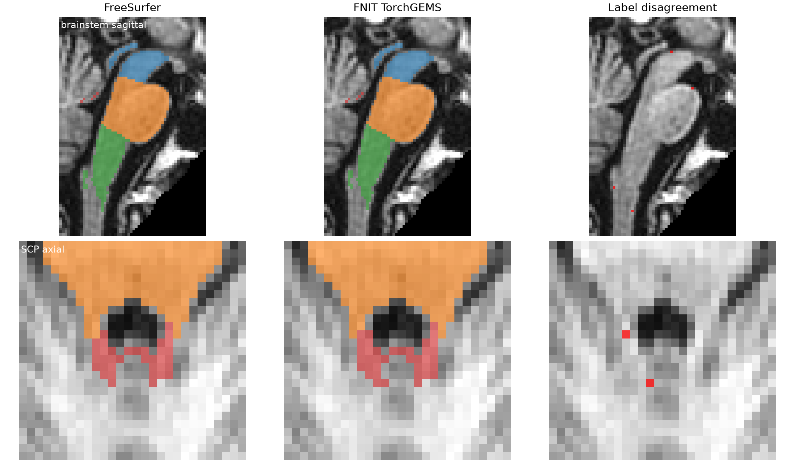

# TorchGEMS 脑干亚区：真实 T1 与 FreeSurfer 8.2 对照

## 验收口径

对每个亚区分别计算硬标签 Dice，要求 **≥0.95**；在相同体素网格上的硬标签体积差要求 **≤5%**。官方 `brainstemSsLabels.FSvoxelSpace.mgz` 根据仿射以最近邻重采样到 FNIT 输出网格后统计，避免把背景体素计入主要指标。两个病例均为真实 T1，且用于发现和修正工作网格问题，因此属于开发回归验证，不是独立留出集。以下数字只评价脑干亚区，不外推到丘脑核团、海马、杏仁核或 recon-all 皮层指标。

## 输入与运行条件

| 病例 | 两程序实际接收的阶段输入 | 输入 SHA-256 | 官方来源 |
|---|---|---|---|
| sub-01 | `norm.mgz` + `aseg.mgz` | `d9b6b94c…1615` + `29fbcff5…bc2` | 同一原始 T1（`f20410a4…70c6a`）经官方 recon-all 得到；两程序读取完全相同的这两个文件。 |
| sub-02 | 原始 `sub-02_T1w.nii.gz` + FNIT 33 类 SynthSeg 粗标签 | `326d1e0a…747d` + `27073cd1…4dc` | 把同一 T1 和粗标签无插值写成 `norm.mgz`、`aseg.mgz` 供官方程序读取；MGH 与 NIfTI 的 shape 和 affine 一致。 |

参考程序为 headcw 上 FreeSurfer 8.2.0-1 的 `segment_subregions brainstem`，四个 CPU 线程；FNIT 为 gpucw1 的 H100 上纯 conda PyTorch 运行，不调用 FreeSurfer。模型数据为该版 `BrainstemSS/atlas/{AtlasMesh.gz,AtlasDump.mgz,compressionLookupTable.txt}`。网格有 4,432 个顶点、25,659 个四面体和 21 个标签；图谱 `AtlasMesh.gz` 的 SHA-256 为 `90b0c6a6…b2df3f`。完整值由[图谱安装器](../../src/fnit/recon_all/assets.py)校验。`sigma2.npy`、`sigma1.npy` 由本包 PyTorch 准备函数生成，不从官方程序读取。

标准配置采用掩膜仿射配准、40 步粗标签网格拟合、0.5 mm 工作图像、13 类 Gaussian、三层网格各 20 步，每 10 步更新一次 Gaussian 参数，Adam 步长 0.12。`em_iterations=25`，`block_size=12`。输出按最大连通域筛选并以最近邻返回输入 T1 网格。

## 逐区结果

| 病例 | 标签 | Dice | 官方体素数 | FNIT 体素数 | 硬体积差 |
|---|---|---:|---:|---:|---:|
| sub-01 | 173 Midbrain | 0.9896 | 4,876 | 4,845 | −0.64% |
| sub-01 | 174 Pons | 0.9935 | 11,029 | 10,963 | −0.60% |
| sub-01 | 175 Medulla | 0.9899 | 3,738 | 3,703 | −0.94% |
| sub-01 | 178 SCP | 0.9632 | 165 | 161 | −2.42% |
| sub-02 | 173 Midbrain | 0.9920 | 4,556 | 4,525 | −0.68% |
| sub-02 | 174 Pons | 0.9959 | 10,826 | 10,770 | −0.52% |
| sub-02 | 175 Medulla | 0.9933 | 3,052 | 3,023 | −0.95% |
| sub-02 | 178 SCP | 0.9623 | 169 | 176 | +4.14% |

[病例 1 机器报告](brainstem_compare_sub01.json) · [病例 1 阶段报告](brainstem_runtime_sub01.json) · [病例 2 机器报告](brainstem_compare_sub02.json) · [病例 2 阶段报告](brainstem_runtime_sub02.json)。两例四区均通过约定阈值。第二例先前的 SCP Dice 为 0.8675；问题出在各向异性原始 T1 转换为 0.5 mm 工作图像时，网格尺寸与中心未匹配官方。修正后，工作图像为 `180×152×196`，网格仿射与官方相差约 `10⁻⁵ mm`，SCP Dice 提至 0.9623。第二例的 169 个 SCP 参考体素仍使 Dice 对少量边界体素敏感；两例达标不等于其他 T1 已完成验收。




## 时间、显存与图谱数值

| 病例 | 官方命令墙钟 | FNIT 命令墙钟 | 官方强度网格拟合 | FNIT 强度网格拟合 | FNIT 峰值显存 |
|---|---:|---:|---:|---:|---:|
| sub-01，分块 12 | 240.10 s | 502.49 s | 113 s | 406.54 s | 16.82 GiB |
| sub-02，分块 12 | 204.32 s | 488.25 s | 149 s | 404.49 s | 17.17 GiB |

| FNIT 内部阶段 | sub-01 | sub-02 |
|---|---:|---:|
| 图谱载入与仿射配准 | 3.81 s | 3.30 s |
| 粗标签网格拟合 | 86.34 s | 74.86 s |
| 0.5 mm 工作图像准备 | 3.78 s | 4.21 s |
| 强度网格拟合 | 406.54 s | 404.49 s |
| 后处理与原网格重采样 | 2.02 s | 1.39 s |

官方 sub-02 日志还记录预处理 8 s、初始配准 2 s、粗标签网格拟合 6 s。官方内部阶段时长与外层命令墙钟的计时范围不同，不能直接相加。当前等价阶段**没有速度优势**：sub-01 与 sub-02 的 FNIT 命令分别约为官方的 2.09 和 2.39 倍。分块 12 的 PyTorch 张量峰值为 16.82 和 17.17 GiB；强度网格拟合分别占 FNIT 总时长的大部分。栅格化复用分块的 GPU 坐标、候选四面体和索引，并按整块写入，减少每轮网格优化中的 CPU/GPU 同步。相对优化前，两例墙钟分别缩短 32.5% 和 15.5%；新旧标签图各自[逐体素相同](brainstem_raster_cache_parity.json)。测试在共享 GPU 上运行，耗时仍受其他任务影响。

对实际 BrainstemSS 图谱，独立 Python 平滑先验与官方 GEMS 平滑结果的顶点 alpha 平均绝对差：`sigma1` 为 `0.000723`，`sigma2` 为 `0.001495`；二类初始拟合的 `sigma3` 为 `0.001072`。后者目前只作源码数值诊断，标准 FNIT 配置未启用。PyTorch 0.5 mm 工作图像与官方的尺寸分别同为 `162×198×136`（sub-01）及 `180×152×196`（sub-02），仿射差约 `10⁻⁵ mm`；两者共同非零体素上的强度 MAE 分别为 `0.0556` 和 `1.077`。这些局部数值相近并不替代逐区输出验收。

FNIT 分割运行无需安装 FreeSurfer；官方程序只在本报告中用作参考。图谱由 FNIT 安装器按固定大小和 SHA-256 校验后下载。

## 复核命令

```bash
# 官方：--cross 是已有 subject 名；--sd 是该 subject 的父目录；--threads 是 CPU 线程数
segment_subregions brainstem --cross fs_sub01 \
  --sd /absolute/path/subjects --threads 4

# FNIT：--t1 是同一 norm.mgz；--coarse 是同一 aseg.mgz
# --atlas-root 是 fnit-setup-brainstem-atlas 的 --output-root；--out-label 是原 T1 网格 NIfTI
# --out-report 记录仿射、分步骤时间和显存；--device 是 PyTorch 设备
python validation/subregions/benchmark_brainstem.py \
  --t1 /absolute/path/subjects/fs_sub01/mri/norm.mgz \
  --coarse /absolute/path/subjects/fs_sub01/mri/aseg.mgz \
  --atlas-root /absolute/path/atlases \
  --out-label /absolute/path/brainstem_fnit.nii.gz \
  --out-report /absolute/path/brainstem_runtime.json \
  --device cuda:0 --em-iterations 25

# --official 是官方 FSvoxelSpace 标签；--fnit 是 FNIT NIfTI；--output 是逐区 JSON
python validation/subregions/compare_brainstem.py \
  --official /absolute/path/brainstemSsLabels.FSvoxelSpace.mgz \
  --fnit /absolute/path/brainstem_fnit.nii.gz \
  --output /absolute/path/brainstem_compare.json
```
