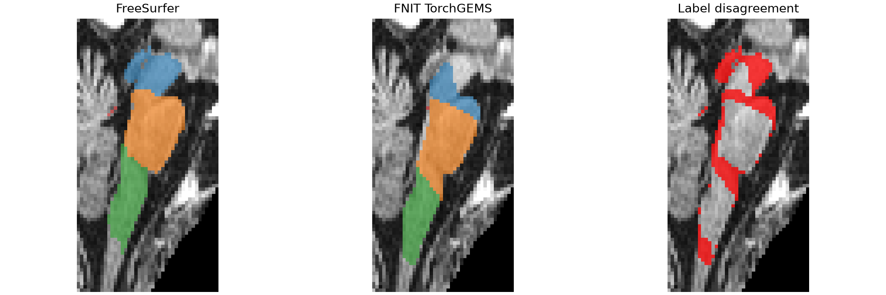

# TorchGEMS 脑干亚区：真实数据与 FreeSurfer 对照（2026-09-28）

输入是仓库公开去面容 T1 `examples/data/sub-01_T1w.nii.gz`，SHA-256 `f20410a4efd8e6a05cd04d55730a4a5492ecf9ad1b234fe0fd4661e448270c6a`。官方 FreeSurfer 8.2.0-1 曾对**同一原始 T1** 完成 `recon-all`，本轮在该 subject 上运行官方 Python `segment_subregions brainstem --cross fs_sub01`；FNIT 候选运行时只读取用户提供的 T1、粗标签和图谱，不调用 FreeSurfer。两者结果按空间仿射将官方 `brainstemSsLabels.FSvoxelSpace.mgz` 最近邻重采样到 FNIT 输出网格后比较。

官方图谱 `BrainstemSS/atlas/AtlasMesh.gz` 有 4,432 个顶点、25,659 个四面体及 21 个标签；本包解析同版 thalamus 图谱为 23,027 顶点、135,299 四面体、66 标签，hippocampus/amygdala 图谱为 20,100 顶点、122,333 四面体、40 标签。后两套只验证了真实文件解析，**没有**完成核团分割或对照。Brainstem 图谱 SHA-256 为 `90b0c6a6ade8aa388ef7c682b652ffc6bbd602271fd6b6068f47197514b2df3f`，查找表为 `8c343757d9ee13ed2d02daeb5f5f5fc764a6adb850b19b9d1b0ad352c96ca15b`。

本轮 brainstem 图谱包 `config.json` 为：

```json
{"include_label_ids": [173, 174, 175, 178], "support_coarse_label_ids": [16]}
```

使用 `em_iterations=2`、`deform_iterations=0`。这组参数仅验证通用引擎输出，**不是**官方的标签分组、超先验、三层网格拟合或后处理参数。

| 亚区标签 | 原始 T1 + FNIT SynthSeg 粗标签：Dice | 硬体积差 | 官方 norm + aseg：Dice | 硬体积差 |
|---|---:|---:|---:|---:|
| 173 Midbrain | 0.3561 | −36.37% | 0.3716 | −34.09% |
| 174 Pons | 0.6870 | −28.98% | 0.6847 | −27.82% |
| 175 Medulla | 0.6630 | −23.54% | 0.6460 | −27.07% |
| 178 SCP | 0.0684 | +7.09% | 0.0533 | +4.85% |

完整体素数和体积见[原始 T1 机器报告](brainstem_compare_raw_t1.json)及[官方阶段输入机器报告](brainstem_compare_official_inputs.json)。总体包含背景的体素一致率会被大量背景稀释，因此验收以逐亚区 Dice 和体积差为主。右侧图的红色区域显示同一 T1 切片的不同标签。



官方 Python `segment_subregions brainstem` 在 headcw 上墙钟 `240.10 s`。FNIT 从原始 T1 与已有 SynthSeg 粗标签开始的 brainstem 命令在 H100 上 `51.40 s`；用官方 `norm.mgz` 与 `aseg.mgz` 作阶段输入、在第二张 H100 上 `109.46 s`。这些时间都只包括脑干亚区命令，不含官方 recon-all 或生成粗标签的时间；两个 H100 当时有其他作业，且方法不等价，不能据此宣称等价加速。GEMS 峰值显存本轮未单独计量。FNIT 原始 T1 输出 SHA-256 `f78b67978080d731fd086a2e9f872f381b04ff94ccaffbcf5504f3b2bceb0c06`；官方 FSvoxelSpace 输出 `35ed6e6871bd86d16b39090c22c243a4b57a4e7f0836a812243483fa2339b5c6`；官方阶段输入的 FNIT 输出 `eab89ce80e5449eafc3f3f958c4d14b09ef1113a1ac85c6361497aae0164ded5`。

官方阶段输入的 FNIT NIfTI 与官方 FSvoxelSpace 的 affine 完全一致，这轮同时核实了 MGH→NIfTI 写出时显式 sform 的修复。三个实际 atlas 的解析与六项合成单元测试通过；真实图像 brainstem 分割能够运行，但精度**未通过等价验收**。误差在固定官方 `norm`/`aseg` 后仍大，说明主要缺口是结构专用图谱初始化、Gaussian 标签分组与超先验、多分辨率网格拟合/变形、后处理及 0.5 mm 输出，而非单纯的 T1 载入或格式转换。当前命令必须在报告和下游流程中标记为实验性，不应替代官方临床或研究核团体积。

复核命令：

```bash
# 官方：--cross 是 recon-all subject；--sd 是 subject 根目录；--out-dir 是输出目录
segment_subregions brainstem --cross fs_sub01 \
  --sd /absolute/path/official_subjects --out-dir /absolute/path/official_output --threads 4

# FNIT：--i 是原始 T1；--coarse-segmentation 是同网格 SynthSeg 标签；图谱包见上文
fnit subregions --i examples/data/sub-01_T1w.nii.gz \
  --o brainstem_subregions.nii.gz --atlas-root /absolute/path/atlases \
  --structure brainstem --coarse-segmentation coarse.nii.gz \
  --em-iterations 2 --deform-iterations 0 --device cuda:0

# --official 是官方 FSvoxelSpace MGZ；--fnit 是本包 NIfTI；--output 是 JSON 报告
python validation/subregions/compare_brainstem.py \
  --official /absolute/path/official_output/brainstemSsLabels.FSvoxelSpace.mgz \
  --fnit brainstem_subregions.nii.gz --output brainstem_compare.json
```
