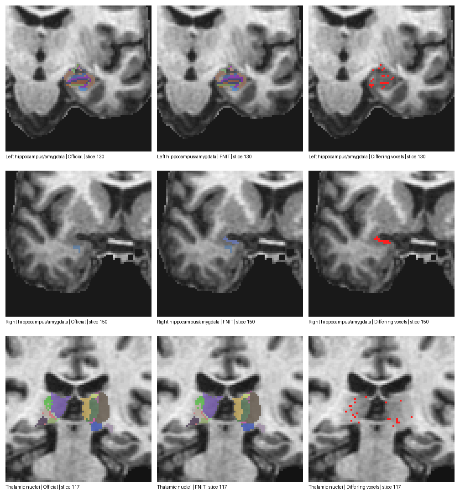

# 丘脑、海马与杏仁核：同输入真实 T1 对照

## 输入和验收

病例 `fs_sub01` 的原始 T1 经已有 recon-all 处理后，固定使用相同的 `norm.mgz`、`aseg.mgz`、`wmparc.mgz` 作阶段输入。三文件 SHA-256 依次为 `d9b6b94c365d2b2b789edbed016953ae64e6cae65072c53ecb42f12410ab1615`、`29fbcff5dff5300599ee863e0c7c425867af725134631741685b41ca44639bc2`、`7cf2c8f0ab1405da795b162ea9d19cf40cb41eedab40d41abb56a6f3baaf9f79`。官方参考为同一 gpucw1 上 FreeSurfer 8.2.0-1 已保存的横断面结果。FNIT 在 headcw 从该 YAML 新建 Conda 环境，随后发现较新的 `libcurand` 无法在 gpucw1 的 glibc 2.17 上导入，于是在该环境中固定 CUDA 11.8 及 `libcurand` 10.3.5.147；这两项约束已写回 YAML，修订后的 YAML 通过离线求解，尚未再次从空目录安装。最终环境为 Python 3.11、NumPy 1.24.3、SciPy 1.10.1、PyTorch 2.5.1、ITK 5.4.7、Surfa 0.6.3；扩展由该环境的 GCC 11 在 gpucw1 编译，不链接 FreeSurfer 运行库，并完成三组真实输入运行。

对每个非零硬标签，验收要求 Dice≥0.95 且相对硬体积差≤5%。体积差按同网格标签体素数计算；`.volumes.txt` 的后验软体积不是这项指标。两幅 FSvoxelSpace 图在相同体素网格，无须对标签再次重采样。`compare_nuclei.py` 对候选与参考标签的并集逐一计数，候选独有标签也计为未达标。

## 结果

| 结构 | 官方/并集标签数 | 达标数 | 最小逐区 Dice | 前景 Dice | 不同体素数 | FNIT 墙钟 | 官方命令墙钟 |
|---|---:|---:|---:|---:|---:|---:|---:|
| 左海马/杏仁核 | 28/28 | 7/28 | 0.4000 | 0.9819 | 400 | 447.92 s | 双侧合计 1005.17 s |
| 右海马/杏仁核 | 27/28 | 24/28 | 0.0000 | 0.9906 | 133 | 447.99 s | 双侧合计 1005.17 s |
| 双侧丘脑核团 | 44/44 | 32/44 | 0.6667 | 0.9957 | 245 | 465.56 s | 596.84 s |

机器可读逐区记录：[左侧](nuclei_left_sub01.json)、[右侧](nuclei_right_sub01.json)、[丘脑](nuclei_thalamus_sub01.json)。左侧 `7006` 的官方参考有 3 个体素，FNIT 有 2 个，Dice 为 0.40；右侧候选独有标签 `7010` 为 24 个体素；丘脑 `8127` 的官方参考有 5 个体素，FNIT 有 4 个，Dice 为 0.6667。微小核团里一两个边界体素可同时改变 Dice 和相对体积。不能因整体前景 Dice 接近 1 而认定逐区已通过。

另将五份后验软体积表按同名结构比较。左海马 21/22、左杏仁核 6/10、右海马 22/22、右杏仁核 10/10、丘脑 51/52 个条目相对差≤5%；各组最大差依次为 8.41%、8.79%、3.92%、0.56% 和 7.70%。逐项数值见[软体积报告](nuclei_soft_volumes_sub01.json)。软体积接近并不消除硬标签差异。

此前使用 NumPy 1.24.3、SciPy 1.10.1 的 PyPI wheel 兼容环境运行同一源码，左、右、丘脑分别为 18/28、14/27、38/44 达标，软体积为 115/116 达标。对应的[左侧](nuclei_left_compat_sub01.json)、[右侧](nuclei_right_compat_sub01.json)、[丘脑](nuclei_thalamus_compat_sub01.json)、[软体积](nuclei_soft_volumes_compat_sub01.json)与[脑图](nuclei_comparison_compat_sub01.png)保留为环境敏感性记录，不代表当前 Conda YAML 的结果。两套 SciPy 分别链接 wheel 附带的 OpenBLAS 与 Conda 的 LAPACK；丘脑初始配准仿射逐项相同，最终硬标签却相差 169 个体素，[逐项诊断记录](nuclei_environment_probe_sub01.json)保存了仿射及库依赖。后续网格拟合对数值环境敏感；尚未定位到单个算子。

同一全新 Conda 环境、同样 4 个线程再次运行丘脑，墙钟为 498.89 秒；相对首轮[逐标签报告](nuclei_thalamus_repeat_sub01.json)为 44/44、前景 Dice 1.0、**0 个不同体素**，后验软体积文本逐字节相同。该复测未发现同环境重复运行的标签漂移；不同环境的差异仍需逐阶段定位。



## 阶段时间与差异定位

| FNIT 日志阶段 | 左侧 | 右侧 | 丘脑 |
|---|---:|---:|---:|
| 预处理 | 13 s | 14 s | 8 s |
| 初始图谱配准 | 1 s | 1 s | 1 s |
| 初始网格拟合 | 79 s | 81 s | 102 s |
| 强度网格拟合 | 311 s | 309 s | 325 s |
| 其余阶段、启动与写盘（外层墙钟减去以上日志整数秒） | 43.92 s | 42.99 s | 29.56 s |

官方日志对左、右、丘脑分别记录粗标签网格拟合 94、98、110 秒，强度网格拟合 351、331、385 秒。FNIT 与官方都主要耗时在强度网格拟合；FNIT 在该阶段用 Conda 内编译的 C++/ITK 核心，避免 Python 逐四面体循环。本轮 FNIT 左右两项任务同时运行，丘脑单独运行；官方参考是在不同时间运行。这些墙钟只描述各自的实际运行，不能据此计算同等负载下的提速。逐区验收也尚未通过。

已逐阶段核对的输入：左、右和丘脑的预处理 `tempImage.mgz` 与 `targetMask.mgz` 在全部体素及仿射上相同。左右海马的最近邻粗掩膜也逐体素相同；三线性海马掩膜最大强度差为 `2.38×10⁻⁷`。配准后的 `alignedAtlasImage.mgz` 的强度体素逐个相同，但相对官方的最终仿射最大差为左侧 `7.63×10⁻⁶ mm`、右侧 `3.81×10⁻⁶ mm`、丘脑 `2.64×10⁻⁴ mm`。此前兼容环境的受控试验使用已保存的官方配准头信息后，左、右、丘脑分别达到 28/28、27/27、44/44 逐区验收；它只能定位该环境下的误差来源，不能作为独立流程或当前 Conda 环境的精度结果。

在当前 Conda 环境又做一次受控试验：两个配准调用均返回同一份已保存的官方丘脑 `alignedAtlasImage.mgz`，其余 FNIT 拟合和后处理照常运行。耗时 475.40 秒，与官方标签仍有 275 个体素不同，逐区 **31/44** 达标；与该环境独立运行的 FNIT 标签相差 53 个体素。记录见[官方配准图替换试验](nuclei_official_atlas_probe_sub01.json)。因此，当前环境不能把剩余误差仅归因于配准头信息。把配准迭代上限由 5 调至 8 或 12、终止阈值由 0.01 调至 0.001 或 0.0001，丘脑仿射误差也未稳定下降；未将这些参数改动加入正式流程。下一步需逐阶段核对网格拟合中的线性代数和数值精度，再检查微小核团的最近邻写回。

按源码使用关系裁掉 33 个未参与构建或未被链接的上游 GEMS 文件后，在同一 Conda 环境重新编译并成功导入三个扩展。实际 ThalamicNuclei 与 HippoSF 图谱均能读取，分别为 23,027 和 20,100 个网格顶点。这次源码裁剪没有重新运行完整病例；上面的逐区精度和耗时仍是裁剪前同一计算路径的实测，不能算作新构建的重新验收。

同一官方程序用不同线程数生成的两份丘脑标签，按相同阈值也只有 27/44 区相互达标，前景 Dice 为 0.9940。这说明当前逐区阈值对少量体素的核团高度敏感；本报告仍按既定阈值判定 FNIT **未通过**。此前兼容环境中，一次仅改变配准重采样头信息的试验使丘脑从 38/44 降到 27/44；该变更已回退。

## 复核命令

```bash
# --norm、--aseg、--wmparc：三幅同网格输入；--atlas-root：经哈希校验的图谱目录
# --output-dir：分结构输出根目录；--threads：ITK 线程数
fnit-nuclei run --norm /absolute/path/subjects/fs_sub01/mri/norm.mgz \
  --aseg /absolute/path/subjects/fs_sub01/mri/aseg.mgz \
  --wmparc /absolute/path/subjects/fs_sub01/mri/wmparc.mgz \
  --atlas-root /absolute/path/nuclei_atlases \
  --output-dir /absolute/path/fnit_nuclei --threads 4

# --cross：已有官方 subject；--sd：其父目录；--threads：官方线程数
segment_subregions thalamus --cross fs_sub01 --sd /absolute/path/subjects --threads 4
segment_subregions hippo-amygdala --cross fs_sub01 --sd /absolute/path/subjects --threads 4

# --reference：已保存的官方原网格标签；--candidate：FNIT 对应标签
# --output：逐标签 Dice、硬体积差和通过状态的 JSON
python validation/subregions/compare_nuclei.py \
  --reference /absolute/path/official/ThalamicNuclei.FSvoxelSpace.mgz \
  --candidate /absolute/path/fnit_nuclei/thalamus/ThalamicNuclei.FSvoxelSpace.mgz \
  --output /absolute/path/thalamus_compare.json

# --reference：官方后验软体积表；--candidate：FNIT 同名表；--output：逐结构比较 JSON
python validation/subregions/compare_nuclei_volumes.py \
  --reference /absolute/path/official/ThalamicNuclei.volumes.txt \
  --candidate /absolute/path/fnit_nuclei/thalamus/ThalamicNuclei.volumes.txt \
  --output /absolute/path/thalamus_volumes_compare.json
```

## 参考文献与原实现代码

- [Iglesias 等，2018，丘脑核团概率图谱](https://pmc.ncbi.nlm.nih.gov/articles/PMC6215335/)。
- [Iglesias 等，2015，海马亚区图谱](https://doi.org/10.1016/j.neuroimage.2015.04.042)。
- [Saygin 等，2017，杏仁核图谱](https://doi.org/10.1016/j.neuroimage.2017.04.046)。
- [FreeSurfer 原实现代码库](https://github.com/freesurfer/freesurfer)；[原流程说明](https://surfer.nmr.mgh.harvard.edu/fswiki/SubregionSegmentation)。
