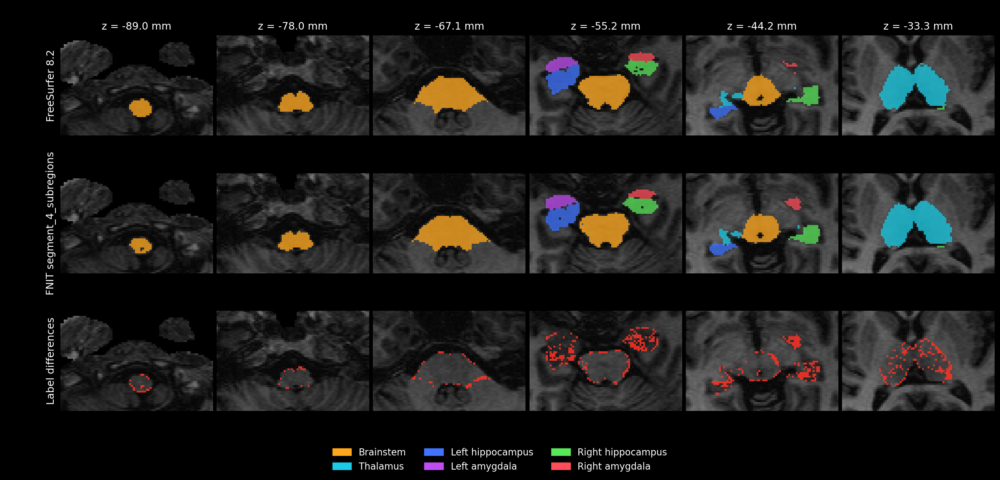
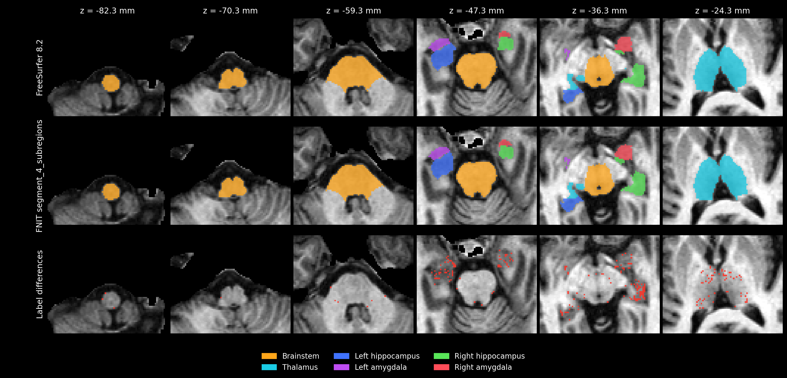

# segment_4_subregions：修复前的完整真实 T1 记录

**历史快照，保留原计时和文件身份。当前低 Dice 优化、完整复测指标与脑图见[最新 benchmark](raw_precision_analysis/README.md)。**

[功能、参数和流程图](../../../docs/subregions/README.md) · [数据与复核方法](../README.md) · [v16 C6 冻结基线](../speed_v16/README.md)

2026-10-01 使用新的唯一公开函数 `segment_4_subregions` 完成两次独立整例运行。沿用 v16 C6 的原生 GPU 拟合算法，整理脑干分支并删除兼容入口，同时合入 main 已有的配准、预处理实现更新。下面分别报告时间、结构外形和细亚区指标。

## 输入、配置与耗时

一例 OpenNeuro ds000114 公开去面部 T1（CC0），形状 `256×156×256`，[来源记录](../../../examples/data/SOURCES.json)。原始 T1 SHA-256 为 `f20410a4efd8e6a05cd04d55730a4a5492ecf9ad1b234fe0fd4661e448270c6a`。

- **原始 T1 全流程**：内部一次 SynthSeg+、DK68 分区、白质代理，再拟合脑干、双侧丘脑、左/右海马与杏仁核。
- **官方同阶段输入**：同一人的 `norm.mgz`、`aseg.mgz`、`wmparc.mgz`；FNIT 读取已保存官方分割进行比较。

两次均为完整四项结构，默认 `optimization="fast"`、4 个 CPU 线程、FP32/TF32、共享 H100 物理 GPU 1；保存原网格标签、110 项硬/软体积和四份高分辨率标签。每约 5 秒记录共享 GPU 负载及本进程显存，以 19,073 MiB 为本进程上限。

| 输入范围 | 计算 | API 含保存 | 监控进程总墙钟 | PyTorch 分配峰值 | 本进程显存采样峰值 |
|---|---:|---:|---:|---:|---:|
| 原始 T1 全流程 | 425.862 s（7.10 min） | 426.354 s | 452.074 s | 15.47 GiB | 18,906 MiB |
| 官方同阶段输入 | 489.905 s（8.17 min） | 490.499 s | 531.436 s | 4.91 GiB | 9,460 MiB |

计算包括影像读入、共享准备、全部拟合及合并；API 另含自动保存。监控进程总墙钟还含 Python 导入、CUDA 初始化及验证驱动记录。首次下载、一次性图谱安装及独立官方程序运行不计入；完整 CPU 整例尚未测量。共享 GPU 的负载记录随结果保存，以上为本例实测时间。

## 输出与结构比较

两次各 29 项输入、几何、dtype、标签、来源及完成状态检查通过；110 项软体积均有限且非负，四个最终网格最小 Jacobian 为正。原网格和四份高分辨率标签的形状、affine 与对应 C6 结果一致。

| 结构 | 原始 T1：与 C6 Dice | 同阶段：与 C6 Dice | 原始 T1：官方 Dice | 同阶段：官方 Dice |
|---|---:|---:|---:|---:|
| 脑干 | 0.999518 | 0.999619 | 0.936082 | 0.993439 |
| 双侧丘脑 | 0.984179 | 0.985104 | 0.909533 | 0.976797 |
| 左海马 | 0.968195 | 0.997539 | 0.898382 | 0.965980 |
| 左杏仁核 | 0.970213 | 0.998519 | 0.874664 | 0.976488 |
| 右海马 | 0.956044 | 0.994893 | 0.877409 | 0.959497 |
| 右杏仁核 | 0.974569 | 0.997331 | 0.850797 | 0.963790 |

相对 C6，原始 T1 的家族硬/软体积变化最大 5.03%，逐标签 84/110 项软体积变化在 5% 内；同阶段输入的家族体积变化最大 0.384%，逐标签 96/110 项在 5% 内。细小亚区的相对变化可以更大，完整表保留在各次记录。

## 细亚区官方对照

| 官方逐标签 Dice（参考体素加权） | C6 基线 | 当前新入口 |
|---|---:|---:|
| 原始 T1：全部 105 个可评估标签 | 0.835749 | 0.833728 |
| 原始 T1：45 个丘脑细核 | 0.764980 | 0.776716 |
| 同阶段输入：全部 104 个可评估标签 | 0.958648 | 0.945012 |
| 同阶段输入：44 个丘脑细核 | 0.964068 | 0.910995 |

同阶段输入的丘脑细核 Dice 明显下降，结构外形与总体体积接近仍伴随内部标签变化。原始 T1 的丘脑细核指标有所提高，全部标签指标略降。两种输入范围使用各自完整参考，空标签单独记录；可评估标签数为 105/104，不能将这些分母直接替换成 110。当前证据来自一例开发病例。

同阶段输入的 T1/aseg/wmparc、丘脑初始矩阵、工作网格及拟合配置相同；日志中最早分岔出现在丘脑的合成标签拟合阶段，随后优化轨迹不同。该阶段不使用 FLIRT、FAST 或 SynthStrip。具体逐阶段证据见[数值变化分析](numerical_variation.md)。

六层轴位切片分别显示官方结果、FNIT 结果及标签差异。家族颜色相同；差异行同时反映结构边界和细标签变化。

### 原始 T1 与官方

### 同阶段输入与官方

另见 [原始 T1 与 C6 切片](raw/segment4_full_raw_20261001_vs_c6_axial.png)、[同阶段输入与 C6 切片](stage/segment4_full_stage_20261001_vs_c6_axial.png)。

## 可复核记录

| 记录 | 原始 T1 | 同阶段输入 |
|---|---|---|
| 运行、显存、几何及逐结构汇总 | [summary](raw/summary.json) | [summary](stage/summary.json) |
| 原始函数报告 | [api_report](raw/segment4_full_raw_20261001/api_report.json) | [api_report](stage/segment4_full_stage_20261001/api_report.json) |
| 逐标签官方对照 | [comparison](raw/segment4_full_raw_20261001/comparison.tsv) | [comparison](stage/segment4_full_stage_20261001/comparison.tsv) |
| 逐标签 C6 对照 | [comparison](raw/segment4_full_raw_vs_c6_20261001.tsv) | [comparison](stage/segment4_full_stage_vs_c6_20261001.tsv) |
| 细核变化 | [nucleus_differences](raw/nucleus_differences.json) | [nucleus_differences](stage/nucleus_differences.json) |
| 逐组件耗时 | [timing_summary](raw/timing_summary.json) | [timing_summary](stage/timing_summary.json) |
| 共享 GPU 负载 | [gpu_load](raw/segment4_full_raw_20261001_gpu_load.jsonl) | [gpu_load](stage/segment4_full_stage_20261001_gpu_load.jsonl) |
| 源码及实际输出审计 | [audit](raw/actual_source_and_output_audit.json) | [audit](stage/actual_source_and_output_audit.json) |
| 下载记录及脑图校验 | [records](raw/records_manifest.json) | [records](stage/records_manifest.json) |

冻结源清单含 457 个文件、407 个运行时 Python 文件，两次运行全部核对大小和 SHA-256；每次的 8 项服务器实际输出也记录大小及 SHA-256。影像、图谱和权重保留在服务器，仓库保存报告及公开数据派生脑图。与历史 C6 相比，339 个共同运行时文件 SHA 相同，48 个路径改变；具体差异见 [source_facts](raw/source_facts.json)。历史 C6 报告及计时保留原身份。

本地相关功能测试 **331 passed、6 skipped**，见 [测试日志](tests_local.log)；最终合入 main 的独立字典学习及 MSM/surface 更新后，公开入口等定向复核 **65 passed**，见 [合并后测试](tests_after_main_merge.log)。[本地冻结源核对](source/local_source_verification.json)、[发布时依赖核对](source/publication_source_verification.json)和[发布包验收](packaging_verification.json)分别记录实测快照、最终源码依赖与 wheel/sdist 检查。最终 main 更新涉及的 9 个冻结源路径属于公开导出或其他功能，四类分割使用的 36 个源文件大小及 SHA 保持一致。

## Reference

原软件命令、实现及四类亚区算法文献见[功能文档末尾](../../../docs/subregions/README.md#reference)。
