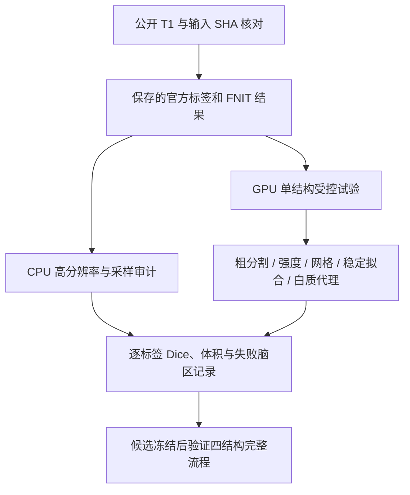
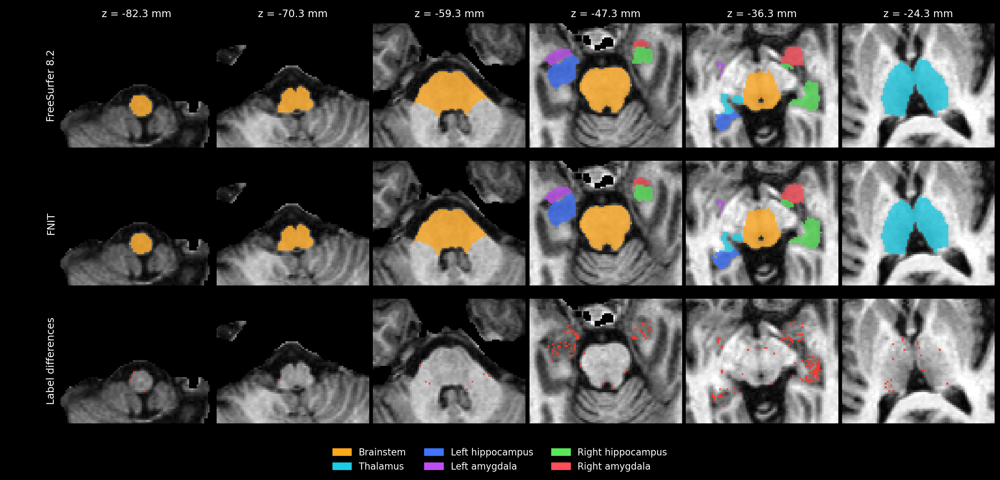

# 原始 T1 与低 Dice 脑区的精度分析

## 1. 分析目的与范围

本报告解释 `segment_4_subregions` 在原始 T1 上的精度损失，并检查海马、杏仁核和丘脑的小标签。先比较保存的官方高分辨率标签，再分别改变粗分割、强度、工作网格、拟合数值路径和白质代理，避免把不同因素的收益混在一起。

数据是 FNIT 已发布、去面部处理的 OpenNeuro ds000114 `sub-01_T1w.nii.gz`，许可 CC0；来源见[数据清单](../../../../examples/data/SOURCES.json)。服务器输入已核对为 3,847,853 字节，SHA-256 为 `f20410a4efd8e6a05cd04d55730a4a5492ecf9ad1b234fe0fd4661e448270c6a`。本页所有数字来自这一例真实数据。

下文的 **同阶段** 使用官方保存的 `norm/aseg/wmparc`，在官方 1 mm 网格上评价；**raw** 使用该公开 T1 的原始网格，体素间距约为 1 × 1.299 × 1 mm。raw 的官方参考标签以最近邻映射到同一网格。两类指标分别报告。



单结构试验只运行指定的丘脑或一侧海马–杏仁核。它们用于选择改动，不能替代四结构完整流程的精度、耗时或显存验收。完整调用、14 个公开参数和输出结构见[功能说明](../../../../docs/subregions/README.md)。

## 2. 输入、输出与指标

### 输入与输出

- **公开 T1**：3D NIfTI；各试验保持同一影像及可核对的输入哈希。
- **官方参考**：已保存的 FreeSurfer 8.2 `norm/aseg/wmparc`、原始高分辨率和 `FSvoxelSpace` 标签、软体积文本；仅用于验证。
- **自动粗分割缓存**：本轮重新记录来源的 SynthSegPlus 粗分割和皮层分区；[缓存清单](controls/shared_cache/preprocessing.json)保留模型调用、五个资源哈希和缓存文件哈希。
- **分析结果**：每项 `analysis.json` 记录逐标签 Dice、硬/软体积、处理及测量网格、耗时、拟合统计和源码哈希；`report.json` 保留结构内部步骤。
- **CPU 审计**：[高分辨率采样记录](high_resolution_label_sampling_audit.json)与[当前粗分割、代理和拟合轨迹记录](current_coarse_proxy_and_control_trace.json)，均关联实际运行的分析脚本 SHA。

### 指标定义

- **标签 Dice**：`2 × 交集体素数 / (官方体素数 + FNIT 体素数)`。
- **mean**：可评价标签 Dice 的算术平均。双方均无硬标签的区域记为 `both_empty`、Dice 为 `null`，排除均值；不计为 Dice 1 或通过。
- **weighted**：以各标签的官方体素数加权的 Dice；不是把整个结构前景合并后计算的 Dice。官方体素数为 0 的标签不贡献加权分子或分母。
- **严格通过**：同时满足 Dice ≥ 0.95、硬体积相对误差 ≤ 5%；表中同时列出通过数和可评价标签数。
- **硬体积**：最终 argmax 标签的体素数乘体素体积。**软体积**：后验概率积分；体积相近不能证明空间形状相同。
- **耗时**：单结构表中的 `compute` 是结构拟合时间；偏置校正另列或明确加总，不含缓存生成、模型加载和进程启动。`GPU GiB` 为 PyTorch 峰值分配，区别于完整流程表中的进程显存。

别名映射沿用各结果中的标签表。原始 atlas ID、输出 ID、标签名称、空标签状态和测量网格均保留在 JSON 中，比较均值时需保持同一标签集合。

## 3. 复现 CPU 分析

以下两个脚本只读取保存的结果，使用 nibabel、NumPy 和 SciPy 在 CPU 上做坐标采样和汇总，不重新拟合、不启动 GPU。`benchmark_root` 指服务器上已经保存本轮结果的目录；输出可以写到独立目录。

```bash
# 已保存的真实数据及官方对照所在目录。
benchmark_root=/path/to/fnit_subregions_unified_20260930
analysis_output=/path/to/precision_audit
mkdir -p "$analysis_output"

# 比较官方与 FNIT 高分辨率标签，以及各自的 1 mm 采样损失。
python validation/subregions/analyze_label_sampling.py \
  --root "$benchmark_root" \
  --output "$analysis_output/high_resolution_label_sampling_audit.json"

# 检查当前 SynthSegPlus 缓存、白质代理和四项 raw 丘脑试验轨迹。
python validation/subregions/analyze_coarse_inputs.py \
  --root "$benchmark_root" \
  --output "$analysis_output/current_coarse_proxy_and_control_trace.json"
```

脚本：[高分辨率采样](../../analyze_label_sampling.py)、[当前输入审计](../../analyze_coarse_inputs.py)。GPU 受控试验由[验证驱动](../../analyze_raw_precision.py)执行；最初四项试验使用[保存的驱动版本](controls/analyze_raw_precision.py)。驱动中的实例级数值开关用于消融，未增加公开函数参数。

## 4. 官方参考的取得

本轮分析读取此前保存的官方结果，没有在 FNIT 运行时调用 FreeSurfer。对应官方命令为：

```bash
segment_subregions brainstem --cross fs_sub01 --sd /absolute/path/subjects --threads 4
segment_subregions thalamus --cross fs_sub01 --sd /absolute/path/subjects --threads 4
segment_subregions hippo-amygdala --cross fs_sub01 --sd /absolute/path/subjects --threads 4
```

官方流程先生成 `norm/aseg/wmparc`，再进行细分割。读取这些中间结果的同阶段对照用于检查细分割算法；raw 对照另包含自动预处理的差异。此轮没有重新测量完整官方 CPU 流程，因此不提供新的官方总耗时或速度比。

## 5. 已完成的精度与耗时对照

### 5.1 已接受的完整流程基线

这里引用本轮精度优化开始前的回溯修复版，作为基线。候选试验的结果放在后续小节。GPU 试验在 gpucw1 的共享 H100 上进行，使用 PyTorch 2.5.1、CUDA 11.8 和 4 个 CPU 线程；各组保存 GPU 负载与本进程显存日志，耗时为本例的实际观测值。

| 输入 | 四结构 compute | API 含保存 | 进程 wall | PyTorch 峰值 / 进程峰值 | 丘脑 mean / weighted | 严格通过 / 标签数 | 官方丘脑体素数 |
|---|---:|---:|---:|---:|---:|---:|---:|
| [同阶段](../stability_fix/full_stage/summary.json) | 533.77 s（8.90 min） | 534.37 s | 578.30 s | 4.91 GiB / 9718 MiB | 0.90864 / 0.96052 | 17 / 44 | 10123 |
| [raw](../stability_fix/full_raw/summary.json) | 410.72 s（6.85 min） | 411.24 s | 435.16 s | 15.47 GiB / 18930 MiB | 0.63012 / 0.77579 | 0 / 46 | 7793 |

同阶段基线的 RAS 轴位脑图如下；它展示的是上述已接受版，不是后续候选试验。



[raw 基线脑图](../stability_fix/full_raw/vs_official_axial.png)。本轮低 Dice 候选的脑图和新的四结构完整验收由最终验证记录回填。

### 5.2 小标签：1 mm 硬标签与原始高分辨率标签

以下比较均来自**同阶段基线**。`native` 指官方 1 mm 输出网格；`HR` 在官方原始高分辨率方向和分辨率上建立覆盖双方的共同网格，以最近邻采样标签。海马–杏仁核约 0.333 mm，丘脑 0.5 mm。没有挑选平移或重新配准来提高 Dice。

| 区域 | 官方 native 体素数 | native Dice | HR Dice | 官方软体积 mm³ |
|---|---:|---:|---:|---:|
| 左 parasubiculum | 41 | 0.60759 | 0.56259 | 46.01 |
| 右 parasubiculum | 35 | 0.59155 | 0.66897 | 46.42 |
| 左 CA3-body | 61 | 0.74016 | 0.75225 | 72.55 |
| 右 CA3-body | 81 | 0.51648 | 0.58120 | 96.09 |
| 左 GC-ML-DG-head | 147 | 0.72727 | 0.79833 | 150.03 |
| 右 GC-ML-DG-head | 151 | 0.61745 | 0.61851 | 148.84 |
| 左 GC-ML-DG-body | 99 | 0.86000 | 0.86655 | 113.16 |
| 右 GC-ML-DG-body | 108 | 0.71681 | 0.69905 | 122.93 |
| 左杏仁核 Medial | 3 | 1.00000 | 0.82353 | 11.93 |
| 右杏仁核 Medial | 3 | 0.00000 | 0.32479 | 12.98 |
| 左杏仁核 Cortical | 11 | 0.80000 | 0.80737 | 17.78 |
| 右杏仁核 Cortical | 15 | 0.71429 | 0.63476 | 19.11 |
| 左 AAA | 23 | 0.80000 | 0.89550 | 44.85 |
| 右 AAA | 0 | 0.00000 | 0.00000 | 45.25 |
| 左丘脑 CL | 3 | 0.85714 | 0.86420 | 22.84 |
| 左丘脑 LD | 30 | 0.86667 | 0.88937 | 29.14 |
| 左丘脑 L-Sg | 10 | 0.53333 | 0.66667 | 14.46 |
| 右丘脑 L-Sg | 7 | 0.71429 | 0.75556 | 13.25 |
| 左丘脑 MV(Re) | 8 | 0.71429 | 0.77941 | 10.81 |
| 左丘脑 Pf | 32 | 0.75000 | 0.76325 | 43.69 |
| 右丘脑 Pf | 46 | 0.81395 | 0.80909 | 49.22 |
| 左丘脑 PuL | 127 | 0.86290 | 0.88822 | 143.58 |
| 右丘脑 PuI | 118 | 0.88596 | 0.89760 | 144.64 |
| 左丘脑 VAmc | 5 | 0.72727 | 0.88095 | 25.36 |
| 右丘脑 VAmc | 4 | 0.85714 | 0.88372 | 23.06 |

小标签对边界采样很敏感。例如右 Medial 的官方 HR 硬体积为 2.815 mm³，FNIT 为 1.518 mm³，质心差 1.488 mm；FNIT HR 映射到 1 mm 后的一个体素又被最终支持掩膜去掉。预先固定的 27 个 ±0.25 体素网格相位下，其 Dice 从 0 到 0.8。该探针只测采样敏感性，没有将最好相位作为结果。

**右 AAA 是硬/软体积不一致的典型例子。** 官方 HR 仅有一个硬标签体素（0.037 mm³），native 为 0；FNIT HR 有 621 个体素（22.999 mm³），native 为 22，因此硬标签 Dice 为 0。但官方和 FNIT 软体积为 45.251 与 44.515 mm³，相差 −1.63%。需要同时保留形状差异和软体积结果，不能为匹配空硬标签而直接压掉该区域。

高分辨率采样没有消除右 CA3-body、DG-head/body 的差异，说明仍有真实的分类或形变边界差异。海马左/右 weighted 从 native 的 0.87076 / 0.81344 变为 HR 的 0.88404 / 0.82068。丘脑在**同一组 44 标签**上，native mean/weighted 为 0.90864 / 0.96052，HR 为 0.91369 / 0.96292；全部 HR 可评价标签为 47，分母不同，不能直接混用均值。[完整采样审计](high_resolution_label_sampling_audit.json)还记录了双方各自 HR→1 mm→HR 的损失。

### 5.3 raw 丘脑：粗分割、缩放、强度与工作网格

最初四项使用同一冻结源码和有来源记录的缓存。所有指标都测在原始 T1 网格，官方参考体素数为 7793；严格通过数均为 0。

| 单丘脑试验 | 粗分割 / 强度 | mean | weighted | 可评价标签 | compute |
|---|---|---:|---:|---:|---:|
| [synthseg_raw](controls/synthseg_raw/analysis.json) | SynthSegPlus / 原始强度 | 0.62995 | 0.77552 | 46 | 130.56 s |
| [official_raw](controls/official_raw/analysis.json) | 官方 coarse、wmparc 映射到 raw / 原始强度 | 0.63488 | 0.77299 | 45 | 131.51 s |
| [official_wm110](controls/official_wm110/analysis.json) | 同上 / 侵蚀白质中位数缩放到 110 | 0.64088 | 0.77469 | 45 | 128.44 s |
| [official_norm_native](controls/official_norm_native/analysis.json) | 同上 / 官方 norm 线性采样到 raw | 0.69990 | 0.83764 | 45 | 124.01 s |

替换官方粗分割没有提升细核 weighted；仅做全局白质缩放比 `official_raw` 增加 0.00170，而使用官方 norm 增加 0.06465。三个使用官方粗分割的试验具有完全相同的 synthetic 代价轨迹哈希，并完成 300 + 150 个 synthetic 步，不是零步提前停止导致这次 raw 差异。

下表前两项在 `precision_source` 上分别检查工作网格和项目现有的 TorchFAST 偏置校正；最后一项是 `proxy_source` 的组合试验：

| 单丘脑试验 | 改动与测量网格 | mean / weighted | 严格通过 / 标签数 | 拟合 + 偏置耗时 | GPU GiB |
|---|---|---:|---:|---:|---:|
| [official_grid_raw](mesh_grid_controls/thalamus_official_grid_raw/analysis.json) | 原始强度到官方 1 mm 网格拟合；回 raw 测量 | 0.73838 / 0.82963 | 0 / 44 | 125.99 + 0 s | 3.21 |
| [official_fast_wm110](mesh_grid_controls/thalamus_official_fast_wm110/analysis.json) | raw 网格上 TorchFAST 恢复强度，再缩放 WM 到 110 | 0.70906 / 0.82342 | 0 / 45 | 121.64 + 2.68 s | 3.29 |
| [bias_own_grid](proxy_controls/thalamus_bias_own_grid/analysis.json) | SynthSegPlus、TorchFAST + WM110、raw header 自建 1 mm 网格；回 raw 测量 | 0.83606 / 0.91627 | 1 / 44 | 122.80 + 2.62 s | 3.21 |

最后一项使用 `proxy_source`，组合了多个处理步骤；收益不能分配给其中任意单一步骤。它不依赖官方 norm、aseg 或 wmparc 作为拟合输入，官方文件仅作验证参考。总拟合加偏置时间为 125.42 s，自动粗分割及加载另计，仍是单丘脑试验。

CPU 几何审计从 raw 自身的 affine 和尺寸推导 256³ 冠状 1 mm 网格，不使用官方 affine 修正、不进行 uint8 量化。与保存的官方 orig/norm 比较，最大角点 RAS 距离为 0.0000503 mm。raw synthetic 的 sigma=3/2 体素按平均间距换算为 3.299/2.200 mm，同阶段为 3/2 mm；网格改变也改变了这一步的物理尺度。另有[不重新拟合的标签重采样对照](stage_result_resampled_raw_geometry_control.json)，可将最终采样效应与重新拟合分开检查。

固定 ±5 强度先验、缺失类的固定回退值和背景样本范围也会使 raw 强度路径与官方 norm 不同。当前证据支持优先验证偏置、强度和工作网格组合；不能仅凭低 Dice 推断整体 affine 或重采样实现错误。[强度与几何原始审计](raw_norm_intensity_geometry.json)保留相关记录。

### 5.4 当前粗分割与白质代理

当前 SynthSegPlus 与官方粗分割映射到 raw 后，丘脑左/右 Dice 为 0.95339 / 0.95453，海马为 0.92860 / 0.93526，杏仁核为 0.90716 / 0.92664。当前最终支持掩膜仅排除 4/7793 个官方丘脑细核体素、左杏仁核 1/1052，双侧海马和右杏仁核均为 0。因此，大部分 raw 精度损失不能由最终支持裁剪解释。

CPU 审计确认旧 `build_wmparc_proxy` 只让三个颞叶皮层标签传播，其他区域的白质也可能被分到这三个标签。候选改为全部同侧 DK 皮层标签竞争：排除 Unknown，保留同侧白质限制、物理距离最近邻和 15 mm 截止，再按原 wmparc 编码写出各自标签。

下表测的是三个颞叶目标标签的**输入白质掩膜**，不是海马细分割 Dice：

| 侧别 | 官方目标体素 | 旧代理体素 / Dice | 全皮层竞争体素 / Dice | 侵蚀样本数：官方 / 旧 / 新 | 侵蚀强度中位数：官方 / 旧 / 新 |
|---|---:|---:|---:|---:|---:|
| 左（3006/3007/3016） | 5999 | 33090 / 0.26979 | 6812 / 0.77293 | 2158 / 18273 / 2386 | 669.5 / 722 / 684 |
| 右（4006/4007/4016） | 5851 | 32336 / 0.25962 | 6549 / 0.74887 | 1877 / 17564 / 2194 | 566 / 614 / 586 |

新旧代理均没有写入同侧 coarse 白质以外的体素。修复改善了先验样本的区域归属；相关 CPU 契约测试[18 项通过](tests_wmparc_competition_cpu.log)。使用相同 `proxy_source`、相同右侧 raw balanced 拟合，仅切换缓存旧代理与重建新代理的 GPU 对照也已完成：

| raw 单侧 balanced 试验 | 海马 weighted | 杏仁核 weighted | 合并 weighted | 可评价标签 / 官方体素 | compute / GPU GiB |
|---|---:|---:|---:|---:|---:|
| [右侧旧代理](proxy_controls/right_raw_stable_balanced_old_proxy/analysis.json) | 0.64369 | 0.79604 | 0.68799 | 28 / 3332 | 169.60 s / 4.93 |
| [右侧新代理](proxy_controls/right_raw_stable_balanced_new_proxy/analysis.json) | 0.64747 | 0.80502 | 0.69329 | 27 / 3332 | 178.56 s / 4.93 |
| [左侧新代理](proxy_controls/left_raw_stable_balanced_new_proxy/analysis.json) | 0.66191 | 0.81414 | 0.70882 | 28 / 3414 | 183.67 s / 5.07 |

右侧新代理的单因素收益较小：海马 +0.00378、杏仁核 +0.00898。其 AAA 双方硬标签均空，导致可评价标签从 28 变为 27；加权分母保持 3332，算术均值需另按共同标签比较。左侧缺少匹配的旧代理 balanced 对照，不能用与 fast 试验的差异判断代理修复有害。三项严格通过数均为 0；完整流程默认效果仍需单独验收。

### 5.5 右侧同阶段稳定拟合与逐标签结果

`precision_source` 将选定 recipe 的 synthetic 和 intensity 拟合一起切到稳定路径：有序高精度归约、FP64 代价与 L-BFGS 状态、实际 FP32 位移的 Armijo 回溯、正 Jacobian 守卫，以及拟合闭包内精确小矩阵运算。影像、顶点和输出梯度保留 FP32。作用域是一次指定结构，未证明整个 pipeline 全部计算 bitwise 稳定。

| 右侧同阶段版本 | 海马 weighted | 杏仁核 weighted | 合并 mean / weighted | 严格通过 / 标签数 | 官方体素 | compute / GPU GiB |
|---|---:|---:|---:|---:|---:|---:|
| 完整流程基线 | 0.81344 | 0.91769 | 0.73293 / 0.84428 | 1 / 28 | 4343 | 见 5.1 四结构时间 |
| [stable fast](mesh_grid_controls/right_stable_fast/analysis.json) | 0.84649 | 0.93449 | 0.78515 / 0.87253 | 1 / 28 | 4343 | 145.93 s / 4.81 |
| [stable balanced](mesh_grid_controls/right_stable_balanced/analysis.json) | 0.88870 | 0.94665 | 0.86935 / 0.90584 | 3 / 27 | 4343 | 175.09 s / 4.81 |

balanced 的 AAA 双方硬标签均空，杏仁核按 8 标签、合并按 27 标签计算。限制到相同 27 标签后，基线、stable fast、stable balanced 的合并 mean 分别为 0.76008、0.81423、0.86935。

| 右侧区域 | 官方 1 mm 体素数 | 基线 Dice | stable fast | stable balanced |
|---|---:|---:|---:|---:|
| parasubiculum | 35 | 0.59155 | 0.68571 | 0.90909 |
| CA3-body | 81 | 0.51648 | 0.65116 | 0.74444 |
| GC-ML-DG-head | 151 | 0.61745 | 0.69565 | 0.81911 |
| GC-ML-DG-body | 108 | 0.71681 | 0.75117 | 0.74757 |
| 杏仁核 Medial | 3 | 0.00000 | 0.50000 | 0.57143 |
| 杏仁核 Cortical | 15 | 0.71429 | 0.70968 | 0.81250 |
| AAA | 0 | 0.00000 | 0.00000 | 双方硬标签均空 |

balanced 改善多个低 Dice 标签，但不是逐标签全部改善：DG-body 略低于 stable fast。不能据此将 balanced 作为 raw 输入的普遍精度提升方案。

### 5.6 左侧与 raw 回归试验

下列 `precision_source` 试验保持 fast，只对指定的一侧开启稳定拟合，使用原有代理；每项只运行该侧海马–杏仁核。

| 试验 | 基线合并 weighted | 候选 mean / weighted | 海马 / 杏仁核 weighted | 严格通过 / 标签数 | 官方体素 | compute / GPU GiB |
|---|---:|---:|---:|---:|---:|---:|
| [左侧同阶段](hippo_regressions/left_stable_fast/analysis.json) | 0.89265 | 0.87098 / 0.90744 | 0.88923 / 0.94818 | 4 / 28 | 4438 | 166.29 s / 5.01 |
| [左侧 raw](hippo_regressions/left_raw_stable_fast/analysis.json) | 0.71303 | 0.64615 / 0.73533 | 0.70652 / 0.79999 | 0 / 28 | 3414 | 119.67 s / 5.08 |
| [右侧 raw](hippo_regressions/right_raw_stable_fast/analysis.json) | 0.67099 | 0.57499 / 0.69408 | 0.65643 / 0.78591 | 0 / 27 | 3332 | 149.08 s / 4.94 |

稳定拟合在这三项中提高了加权 Dice；原始 T1 的提升仍有限，支持继续处理其强度和工作网格。右侧 raw 同样存在双方硬标签均空的 AAA，可评价数为 27。各单侧耗时不能直接相加作为完整流程耗时。

### 5.7 完整 raw 候选：固定类别导出网格的影响

新完整 raw 候选采用相同的 TorchFAST、WM110 和 raw header 自建 1 mm 处理网格，但尝试直接将 HR 硬标签采样回原始 T1。其丘脑 weighted 为 0.81255，明显低于 5.3 单丘脑试验的 0.91627。CPU 核查确定这次差距来自类别导出路径：两次丘脑 HR 标签的 shape、affine、每个体素均相同，数组 SHA 一致；两个 synthetic 和四个 intensity 阶段的完整代价轨迹也逐项完全相同。

单丘脑试验先生成标准 1 mm 类别图，再以最近邻回原始 T1；官方参考同样来自 `FSvoxelSpace` 的标准 1 mm 类别图。直接从 HR 采样采用另一种边界取样方式。以下用**同一份保存的 HR 标签**和固定 affine 做 CPU 对照，不重新拟合、不选择网格相位：

| 结构 | 完整候选直接 HR 导出 weighted | CPU 重建标准 1 mm 后回 raw weighted | 原始 HR 对官方 HR weighted | 标签数：直接 / 标准 / HR | 官方体素：raw / HR |
|---|---:|---:|---:|---:|---:|
| 丘脑 | 0.81255 | 0.91627 | 0.91980 | 45 / 44 / 47 | 7793 / 81129 |
| 左海马–杏仁核合并 | 0.69266 | 0.85295 | 0.86513 | 28 / 28 / 28 | 3414 / 126268 |
| 右海马–杏仁核合并 | 0.67373 | 0.78129 | 0.80979 | 28 / 28 / 28 | 3332 / 123866 |

丘脑 HR 直接采样与标准类别图导出相差 1774 个 raw 体素；从 HR 重建的标准导出与此前单丘脑试验保存的导出结果为 **0 体素差异**。完整候选与重建的直接采样加支持掩膜仅差 18 个丘脑体素，左右海马–杏仁核分别仅差 6 和 7 个，说明支持掩膜和结构合并不是主要原因。

因此撤回直接 HR→raw 的默认类别导出候选，保留标准 1 mm 类别图后回原网格的合同；标签、置信度和支持掩膜沿同一处理网格转换。HR 标签及其与官方 HR 的对照单独保留，不把两种类别导出方式的差异归因于拟合退化。这一 CPU 对照说明原先 raw Dice 的下降存在评价路径差异，不能据此宣称所有低 Dice 区域已与官方等价。

完整记录见[类别导出审计](categorical_export_audit.json)，其中包含脚本 SHA、双方 HR 数组与文件哈希、测量几何、逐标签指标和六阶段轨迹哈希。[CPU 分析脚本](analyze_categorical_export.py)可复现该审计；这是保存结果的诊断，不是新的 GPU 性能 benchmark。最终标准导出版本的完整流程见5.8。

### 5.8 最终标准导出版本：四结构完整验收

本次冻结 `precision_export_final_20261002`，通过统一公开函数 `segment_4_subregions` 从原始 T1 和同阶段输入分别完成整例；各模式均为默认 fast。

| 输入 | compute / API 含保存 / 进程 wall | PyTorch 峰值 / 进程显存采样峰值 |
|---|---:|---:|
| raw | 436.344 / 436.867 / 461.450 s | 15.47 GiB / 16468 MiB |
| 同阶段 | 473.205 / 473.775 / 515.738 s | 5.01 GiB / 9728 MiB |

| 家族 | 同阶段：更新前 → 最新 weighted | raw：更新前 → 最新 weighted |
|---|---:|---:|
| 脑干 | 0.991306 → 0.991383 | 0.924751 → 0.945839 |
| 丘脑 | 0.960523 → 0.960579 | 0.775793 → 0.915134 |
| 左海马 | 0.870763 → 0.888019 | 0.678531 → 0.833178 |
| 右海马 | 0.813436 → 0.844525 | 0.634352 → 0.742617 |
| 左杏仁核 | 0.941614 → 0.948179 | 0.790483 → 0.914368 |
| 右杏仁核 | 0.917690 → 0.934494 | 0.760340 → 0.872840 |

分母、严格通过数、完整逐标签与硬/软体积见[汇总](benchmark_summary.json)、[同阶段表](final_full_stage/comparison.tsv)和[raw表](final_full_raw/comparison.tsv)。[同阶段审计](final_full_stage/actual_source_and_output_audit.json)与[raw审计](final_full_raw/actual_source_and_output_audit.json)全部通过：450个冻结文件及415个报告源码文件按大小/SHA一致；输入及五个模型身份核验、原图几何、110项体积与四个正Jacobians、显存监控均通过。

六组多层 RAS 轴位脑图与参数详见[功能说明](../../../../docs/subregions/README.md)。本地[365项GEMS测试](tests_gems_final.log)及[50项入口/CLI测试](tests_public_cli_final.log)通过；[wheel检查](packaging_verification.json)确认五个修改的运行时模块与实测源码相同，旧native_samseg后端未打入包。本轮未增加依赖。

### 5.9 最新版与上一接受版：固定高分辨率网格复核

本节直接读取两版完整运行保存的 HR 标签，比较对象是 10 月 1 日的 `thalamus_backtracking_final_20261001` 与 10 月 2 日的 `precision_export_final_20261002`。两版分别通过 443 / 450 个源文件的大小和 SHA-256 校验，原始 T1 输入也通过公开示例的固定 SHA-256 校验。具体源清单身份、四次运行的报告 SHA、标签文件 SHA 和数组 SHA 均保存在 [CPU 复核记录](highres_before_after.json)。

每个结构只使用一个共同网格：保留官方原始 HR 图像的轴向、分辨率和整数相位，视野覆盖官方及两版 raw / stage 标签的并集；全部标签按 scanner RAS 坐标以最近邻采样。丘脑为约 0.5 mm，海马和杏仁核为约 0.333 mm。四次结果共用同一网格，未移动相位来提高 Dice。以下 weighted 都是逐细标签的官方参考体素加权 Dice。

| 输入 | 家族 | 官方 HR 体素 | weighted：旧 → 新 | mean：旧 → 新 | strict：旧 → 新 |
|---|---|---:|---:|---:|---:|
| 原始 T1 | 丘脑 | 81129 | 0.81652 → 0.91980 | 0.65186 → 0.81479 | 0/48 → 1/47 |
| 原始 T1 | 左海马 | 86914 | 0.76744 → 0.84027 | 0.73417 → 0.82579 | 0/19 → 0/19 |
| 原始 T1 | 右海马 | 86809 | 0.72616 → 0.77197 | 0.69937 → 0.76227 | 0/19 → 0/19 |
| 原始 T1 | 左杏仁核 | 39354 | 0.84471 → 0.92005 | 0.62432 → 0.82161 | 0/9 → 2/9 |
| 原始 T1 | 右杏仁核 | 37057 | 0.82576 → 0.89840 | 0.45792 → 0.61795 | 0/9 → 0/9 |
| 同阶段 | 丘脑 | 81129 | 0.96288 → 0.96288 | 0.88090 → 0.88090 | 21/47 → 21/47 |
| 同阶段 | 左海马 | 86914 | 0.88404 → 0.90102 | 0.86048 → 0.88421 | 1/19 → 2/19 |
| 同阶段 | 右海马 | 86809 | 0.82068 → 0.86886 | 0.79430 → 0.85179 | 0/19 → 3/19 |
| 同阶段 | 左杏仁核 | 39354 | 0.94902 → 0.95218 | 0.87519 → 0.87891 | 2/9 → 3/9 |
| 同阶段 | 右杏仁核 | 37057 | 0.92614 → 0.94138 | 0.67604 → 0.71744 | 1/9 → 2/9 |

原始 T1 的丘脑全部可评价标签从 48 个变为 47 个；在固定共同 47 标签上，mean 为 **0.66573 → 0.81479**，weighted 与表中相同。双方都为空的标签不计入 mean 或 strict 分母。其他行的两版分母一致。HR 参考体素数与第 5.8 节原始空间输出的分母不同，不能跨网格混合计算。

这份复核确认改善也出现在 HR 分割本身：原始 T1 的五个家族 weighted 均提高；同阶段丘脑在共同网格上 **0 个标签体素变化**，两侧海马与杏仁核总体提高。小标签仍有差异，也有局部回退：

| HR 细标签 | 原始 T1 Dice：旧 → 新 | 同阶段 Dice：旧 → 新 | 官方 HR 体素 |
|---|---:|---:|---:|
| 右 CA3-body | 0.59703 → 0.68988 | 0.58120 → 0.77859 | 2647 |
| 右 GC-ML-DG-head | 0.49920 → 0.67873 | 0.61851 → 0.70476 | 3941 |
| 左 Medial nucleus | 0.34263 → 0.71186 | 0.82353 → 0.77632 | 81 |
| 左 AAA | 0.80000 → 0.71600 | 0.89550 → 0.89007 | 758 |
| 右 AAA | 0 → 0 | 0 → 0 | 1 |

右 AAA 的官方 HR 硬标签仍只有 1 体素；其硬标签 Dice 与第 5.2 节的软体积是两种不同量。本节是单例已保存结果的 CPU 测量，未重新拟合，也未分配各项组合改动的独立收益。

[可复现 CPU 脚本](analyze_highres_before_after.py)只依赖 nibabel、NumPy 和 SciPy。`--root` 指向保存四次完整运行及两版源码清单的验证根目录，`--output` 指定 JSON 输出路径：

```bash
# 目录结构与 highres_before_after.json 中的 runs / sources 对应。
validation_root="/path/to/saved/subregions-validation"
python analyze_highres_before_after.py \
  --root "$validation_root" \
  --output highres_before_after.json
```


## 6. 源码与更新记录

### 冻结源码与数据记录

| 记录 | 源码身份与区别 | 复核入口 |
|---|---|---|
| 四项 raw 丘脑消融 | 原已接受回溯版冻结源码，443 文件；不混用后续源码 | [源码核对](controls/source_verification.json)、[取回清单](controls/retrieval_manifest.json) |
| `precision_source` | `precision_controls_20261001`，基于 `d2b89da`；444 文件。该快照保留丘脑默认稳定路径，驱动可对单个海马 recipe 开启稳定拟合 | [源码清单](precision_source/source_manifest.json)、[差异](precision_source/source_patch.diff)、[远端校验](precision_source/remote_verification.json)、[归档哈希](precision_source/archive_audit.json) |
| `export_final_source` | `precision_export_final_20261002`，450 文件；双侧海马稳定拟合、自动强度/网格、全部皮层竞争与标准导出 | [源码清单](export_final_source/source_manifest.json)、[远端校验](export_final_source/remote_verification.json)、[归档哈希](export_final_source/archive_audit.json) |
| `proxy_source` | `precision_proxy_controls_20261002`，同一基础提交；444 文件。含全同侧皮层竞争的白质代理，以及偏置/网格验证驱动 | [源码清单](proxy_source/source_manifest.json)、[差异](proxy_source/source_patch.diff)、[远端校验](proxy_source/remote_verification.json)、[归档哈希](proxy_source/archive_audit.json) |

`precision_source` 归档 SHA-256 为 `6059d34b25b1be6ad02f1efa16379430c7988a456491f2db554159becd9b192f`；`proxy_source` 为 `34dfca7b00a3fb22a08b40f6f91fd3ba09b8e6f8720b1fabdb227ad25e464f79`。每次取回保留实际驱动和源码哈希，不能将两个目录当作同一个版本。[网格与稳定拟合记录](mesh_grid_controls/retrieval_manifest.json)、[单侧回归记录](hippo_regressions/retrieval_manifest.json)、[代理试验记录](proxy_controls/retrieval_manifest.json)分别关联对应的冻结源码。

### 本轮进展

| 顺序 | 已完成检查 | 当前结论 |
|---|---|---|
| 1 | 官方原始 HR 标签、双方采样往返与固定相位审计 | 部分极小核对 1 mm 采样敏感；右 CA3/DG 的差异在 HR 上仍存在 |
| 2 | 四项 raw 丘脑输入消融 | coarse 替换和全局缩放收益小；norm 强度改善更明显 |
| 3 | 单因素网格、TorchFAST 与组合试验 | 原始 header 自建 1 mm + 原生强度处理的单丘脑 weighted 达到 0.91627；最终完整raw为0.91513 |
| 4 | 右侧同阶段稳定 fast/balanced、左侧与 raw 回归 | 多个低 Dice 标签改善；balanced 不保证 raw 优于 fast |
| 5 | WM 代理 CPU 输入审计与匹配右侧 GPU 消融 | 目标白质样本范围修复明确，细分割收益较小 |
| 6 | 新自动强度/网格处理的四结构候选及 CPU 类别导出审计 | 直接 HR 导出候选撤回；标准类别导出的两个最终完整流程均验收通过，见5.8 |

早期 [coarse/超参数记录](historical_coarse_proxy_and_hyperparameters.json)保留排查历史，但其预处理来源不如本轮缓存完整，本报告主结论使用新缓存审计和冻结试验。尚未测试的各向异性 PV 平滑等候选不作为已完成修复。

## 7. Reference 与原软件代码

- 脑干：[Iglesias 等，2015，NeuroImage](https://doi.org/10.1016/j.neuroimage.2015.02.065)。
- 丘脑：[Iglesias 等，2018，NeuroImage](https://pmc.ncbi.nlm.nih.gov/articles/PMC6215335/)。
- 海马：[Iglesias 等，2015，NeuroImage](https://doi.org/10.1016/j.neuroimage.2015.04.042)。
- 杏仁核：[Saygin 等，2017，NeuroImage](https://doi.org/10.1016/j.neuroimage.2017.04.046)。
- SynthSeg：[Billot 等，2023，Medical Image Analysis](https://doi.org/10.1016/j.media.2023.102789)；皮层分区：[Billot 等，2023，PNAS](https://doi.org/10.1073/pnas.2216399120)。
- 官方细分割：[FreeSurfer 文档](https://surfer.nmr.mgh.harvard.edu/fswiki/SubregionSegmentation)、[GEMS subregions 代码](https://github.com/freesurfer/freesurfer/tree/dev/attic/python/gems/subregions)；白质强度归一化：[mri_normalize 文档](https://surfer.nmr.mgh.harvard.edu/fswiki/mri_normalize)。
- 公开数据：[OpenNeuro ds000114 v1.0.2](https://doi.org/10.18112/openneuro.ds000114.v1.0.2)，FNIT 发布影像的处理及许可见[数据清单](../../../../examples/data/SOURCES.json)。
