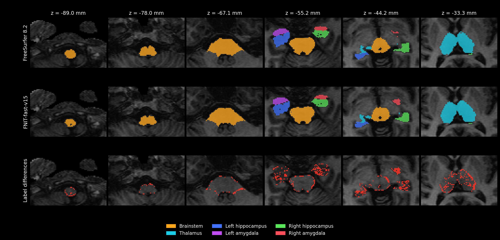
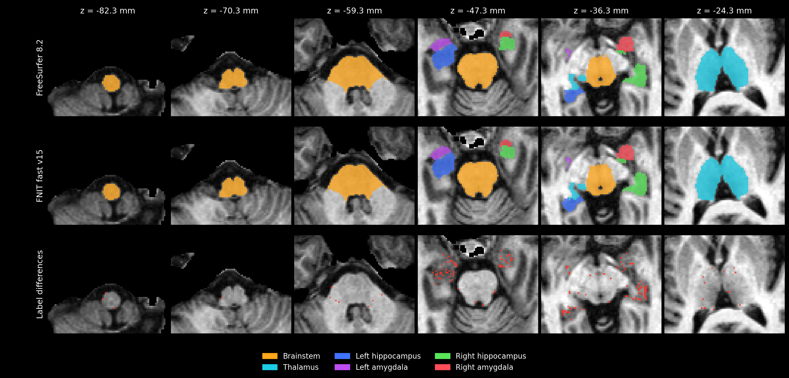

# 统一亚区接口：完整细网格日程的速度与精度

冻结执行源码为 `971a07f529f07b7103e7d4b68cd1347d81005610`。主入口 `segment_subregions` 接收原始三维 T1；一次共享预处理后拟合脑干、丘脑、左侧和右侧海马/杏仁核，并在同一次调用中保存统一标签、110 项硬/软体积及四份高分辨率标签。旧 `segment_nuclei` 通过薄兼容层调用同一 PyTorch 流程。

最终代码在 `9c1caa8` 补齐保存计时和实际预处理来源/调用次数，未修改分割计算或影像输出。[源码审计](final_metadata_source_audit.json)逐文件检查冻结包与最终代码，仅报告元数据和对应测试有变化；其余 421/426 项相同，去除报告记录后主流程及预处理方法的 AST 相同。整例数据仍按原执行版本标注。冻结版本的保存计时包含报告首次写盘，当前 `save_seconds` 只计目录、影像与 TSV，排除最终报告序列化及落盘。

使用 [统一验证页](../unified.md) 中的一个公开、去面部 T1 开发病例。原始 T1 与已有 `norm/aseg/wmparc` 输入的验证分别报告；图谱、权重及影像沿用已核验的文件。两项均使用四个 CPU 线程、FP32 和 TF32，GPU 可以被其他任务占用。该病例不是独立留出集。

## 配置和改动

丘脑保持 0.5 mm，海马/杏仁核保持约 0.333 mm 的裁剪工作网格。取消 v13/v14 的粗强度初始化，保留原精修图像、固定掩膜、Gaussian 分组和超先验、部分容积模型、全部平滑级别及外层日程：丘脑 7/5/5/3，每侧海马 7/5/3。默认 `fast` 每轮网格更新上限 20 次；`balanced` 为 30 次并采用更严格的停止阈值，本页整例使用 `fast`。

计算复用包括有效体素先验和数据成本、当前及参考四面体几何、形变先验解析梯度、L-BFGS 接受点成本与梯度缓存、CPU 候选索引批量构建。最终先验和后验仍在各结构细网格输出。CPU 仍负责图谱准备、裁剪和插值、平滑与形态学、白质传播及最终 Nibabel 重采样。

## 原始 T1：完整一站式运行

| 指标 | 历史 v12 | 当前 v15 |
|---|---:|---:|
| 计算墙钟，包含共享预处理、全部拟合和合并 | 41.33 min | **21.56 min** |
| 本次 API 总时间，包含输出保存 | — | 1294.184 s |
| 本次输出保存 | — | 0.480 s |
| PyTorch 分配峰值 | 15.47 GiB | 15.47 GiB |
| 本次进程显存采样最大值 | 17,762 MiB | 18,928 MiB |

旧/新计算耗时比为 1.917；GPU 1 的利用率中位数为 100%，其他进程负载不同，该比值是共享卡上的整例观测。新运行每约 5 秒采样一次，共 257 次，最大间隔 5.38 秒；本进程未触发 19,073 MiB（约 20 GB）停止上限。分配峰值包含 SynthSeg 预处理，不等于 `nvidia-smi` 进程显存。

### 六类结构相对 v12 的变化

体积为候选相对 v12 的有符号百分比；质心使用世界坐标。此表检查优化带来的变化，与下方官方对照分别解释。

| 结构 | 旧/新前景 Dice | 硬体积变化 | 软体积变化 | 质心位移 |
|---|---:|---:|---:|---:|
| 脑干 | 0.9994 | −0.03% | +0.01% | 0.008 mm |
| 丘脑 | 0.9910 | +0.16% | −0.20% | 0.044 mm |
| 左海马 | 0.9837 | −1.44% | −1.35% | 0.139 mm |
| 左杏仁核 | 0.9825 | −0.60% | −0.42% | 0.070 mm |
| 右海马 | 0.9663 | +2.27% | +2.73% | 0.203 mm |
| 右杏仁核 | 0.9670 | +1.67% | +0.65% | 0.183 mm |

右海马相对 v12 的硬/软体积变化从 v14 的 +7.45%/+8.27% 收回到 +2.27%/+2.73%。细标签仍有变化：右海马原网格前景并集中 22.50% 的体素标签不同，右杏仁核为 11.90%；整体体积接近不能代替亚区边界检查。

### 时间减少在哪里

[同一日志解析器的输出](timing_raw_v15.json)显示，丘脑和双侧海马/杏仁核的 50 个强度外层均完成。对应网格成本、反向及 L-BFGS 日志累计时间由 v12 的 1444.27 秒降至 787.06 秒，实际目标评估由 3378 次减为 2149 次；新版另有 604 次接受点缓存命中。Gaussian EM 为 15.15→15.73 秒。合成标签拟合三结构合计为 431.48→59.70 秒，其中有效点路径、停止条件及数值轨迹共同改变，不能把全部差值归于一个 kernel。

细网格准备累计仍为 181.23 秒，占整例约 14.01%；该计时同时包含 CPU 和 GPU 操作。强度阶段仍有 405 次索引重建，已包含在上述网格计时中；CPU 索引组件测量不能乘以重建次数推算整例节省。脑干没有纳入这三个结构的子计时，子阶段时间不与父阶段重复相加。上述数据描述实际运行范围，并不构成共享负载下的单项因果实验。

### 同一人的官方结果对照

| 结构 | v12 前景 Dice | v15 前景 Dice |
|---|---:|---:|
| 脑干 | 0.9359 | 0.9358 |
| 丘脑 | 0.9100 | 0.9111 |
| 左海马 | 0.8991 | 0.8969 |
| 左杏仁核 | 0.8805 | 0.8869 |
| 右海马 | 0.8865 | 0.8865 |
| 右杏仁核 | 0.8780 | 0.8607 |

右海马恢复到历史前景指标；右杏仁核比 v14 的 0.8397 改善，但仍比 v12 低 0.0173。严格逐区门槛仍为 Dice≥0.95 且硬体积差≤5%，v12 为 0/104，v15 为 0/105；没有修改阈值。新增受评标签是 `Right-Pc`（8217）：官方硬标签为空，候选有一个体素，按既定规则记失败。全部 110 项软体积单独保留，双方硬标签为空的项不纳入硬标签门槛。该原始 T1 流程尚不能宣称官方逐区等价。

四组最终强度网格的最小 Jacobian 为 0.257936、0.212073、0.232636、0.163694，均为正。29 项输入、源码、标签表和几何检查通过；原始 T1 主输出保持 `256×156×256` 及输入 affine、`int32`，四份高分辨率输出分辨率正确。检查通过不代表精度达标。

## 相同阶段输入：完整四结构运行

使用与官方相同的 `norm.mgz`、`aseg.mgz`、`wmparc.mgz`，仍由同一主函数完成四结构拟合、合并及保存，跳过粗分割网络。计算耗时为 **25.02 min**，历史 v12 为 **45.02 min**，旧/新观测耗时比 1.799。API 总计 1501.703 秒，输出保存 0.520 秒。PyTorch 峰值为 **6.35 GiB**，本进程采样峰值 **10,908 MiB**，低于 19,073 MiB 上限。v12 使用物理 GPU 0，完整重跑使用物理 GPU 1；两张共享卡均为 H100，负载不同，不能视为同条件因果加速比。

| 结构 | 旧/新前景 Dice | 硬体积变化 | 软体积变化 | 质心位移 | 官方前景 Dice：v12→v15 |
|---|---:|---:|---:|---:|---:|
| 脑干 | 0.9997 | +0.01% | −0.01% | 0.006 mm | 0.9931→0.9932 |
| 丘脑 | 0.9931 | −0.44% | −0.49% | 0.034 mm | 0.9883→0.9906 |
| 左海马 | 0.9389 | +7.00% | +6.76% | 0.249 mm | 0.9456→0.9629 |
| 左杏仁核 | 0.9266 | +2.89% | +3.17% | 0.279 mm | 0.9364→0.9739 |
| 右海马 | 0.9849 | +1.59% | +1.32% | 0.066 mm | 0.9735→0.9682 |
| 右杏仁核 | 0.9910 | −0.23% | +0.50% | 0.050 mm | 0.9809→0.9790 |

左海马相对 v12 的体积变化超过 5%，同时其官方整体 Dice 改善；这两项事实分别保留，不称旧新逐区等价。整体前景 Dice 为 0.9909，硬体积增加 0.63%；标签变化为前景并集 38,690 体素中的 2,005 个（5.18%），其中 698 个为前景边界变化，1,307 个为前景内标签变化。

官方严格门槛的达标数由 **26/103 增至 35/103**：脑干 4/4，丘脑 26/44，左海马 1/19，左杏仁核 2/9，右海马 0/19，右杏仁核 2/8；双方硬标签为空的 7 项排除于硬标签门槛。11 项新达标，2 项失去达标（10226、10236）。全部 110 项软体积仍单列，未通过标签保留原数值。

官方软体积相对误差≤5% 的条目从 87/110 增至 **102/110**，最大相对误差从 24.17% 降至 13.48%。相对 v12 自身软体积，最大绝对变化为 `Left-CA1-head` 的 +51.70 mm³（+11.15%），最大相对变化为 `Left-fimbria` 的 +36.09%（+32.72 mm³）。旧新逐标签 Dice 中位数为 0.9324，最小为 0：`Left-Medial-nucleus` 旧新各 2 个硬体素，位置不同。整体结构的改善不消除这些亚区差异。

29 项输入、源码和输出检查通过；主输出为 `256×256×256`、原输入 affine 和 `int32`，四份细网格输出均保留。四组最终强度网格最小 Jacobian 为 0.249585、0.187516、0.065265、0.116294，均为正。严格逐区官方等价目标尚未达到。

## 可复核记录

- [原始 T1 汇总](raw_v15_summary.json)、[完整报告](full_raw_fast_v15_20261001/report.json)、[API 输出报告](full_raw_fast_v15_20261001/api_report.json)、[全部官方逐标签 TSV](full_raw_fast_v15_20261001/comparison.tsv)。
- [阶段输入汇总](full_stage_fast_v15_gpu1_20261001_summary.json)、[完整报告](full_stage_fast_v15_gpu1_20261001/report.json)、[全部官方逐标签 TSV](full_stage_fast_v15_gpu1_20261001/comparison.tsv)、[与 v12 比较](full_stage_fast_v15_gpu1_20261001_vs_v12.json)、[六层轴位 v12 对照](full_stage_fast_v15_gpu1_20261001_vs_v12_axial.png)。
- [阶段输入原始日志](full_stage_fast_v15_gpu1_20261001.log)、[GPU 负载](full_stage_fast_v15_gpu1_20261001_gpu_load.jsonl)、[完成状态](full_stage_fast_v15_gpu1_20261001_status.json)、[17 项远端小文件 SHA 清单](stage_v15_gpu1_small_file_archive_manifest.json)。
- [与 v12 的六类结构和全部标签比较](full_raw_fast_v15_20261001_vs_v12.json)、[与 v14 比较](full_raw_fast_v15_20261001_vs_v14.json)、[六层轴位 v12 对照](full_raw_fast_v15_20261001_vs_v12_axial.png)。
- [源码清单](source_manifest.json)、[真实服务器源码核验](raw_v15_source_hash_verification.json)、[小文件传输 SHA-256 核验](raw_v15_remote_artifact_verification.json)。执行源码包含 426 项文件，大小与 SHA-256 全部核对；数据报告和图表的小文件传输另行逐项核验。
- [实际 GPU 负载](full_raw_fast_v15_20261001_gpu_load.jsonl)、[运行状态及显存上限](full_raw_fast_v15_20261001_status.json)、[完整日志](full_raw_fast_v15_20261001.log)。
- [合成标签拟合源码检查](raw_v15_synthetic_source_review.json)及[三个版本的拟合末态](raw_v15_synthetic_baseline_comparison.json)：观察到评估次数和轨迹不同，不能单独据此归因最终边界变化。
- [相关 CPU 测试](tests_gems_public_cpu.json)：218 passed；[原始测试日志](tests_gems_public_cpu.log)。
- [最终报告修正后的 CPU 测试](tests_final_cpu.json)：222 passed；[完整日志](tests_final_cpu.log)。
- [真实 CPU 索引组件](../speed_v14/index_csr_real_cpu.json)和[真实网格目标函数组件](../speed_v13/README.md)：组件收益与整例计时分开报告。

### 共享 GPU 显存耗尽的失败记录

第一轮阶段输入运行在物理 GPU 0，已完成脑干、丘脑、左侧海马/杏仁核，但在右侧第一级强度拟合后的后验生成中中断。CUDA 需要分配 776 MiB，当时整卡仅余 443 MiB；本进程 PyTorch 已分配约 2.99 GiB，未达到分配器上限或 19,073 MiB 进程停止上限。动态共享占用会影响实际可用显存。此轮只有运行至失败的 36.60 分钟，不能作为完整耗时；未生成最终输出，精度、最终 Jacobian 和保存时间均留空。

[失败小结](stage_v15_failed_summary.json)、[原始日志](full_stage_fast_v15_20261001.log)、[状态](full_stage_fast_v15_20261001_status.json)、[完整负载](full_stage_fast_v15_20261001_gpu_load.jsonl)、[传输与源码核验](stage_v15_failed_remote_verification.json)均保留。后续完整重跑使用独立目录 `full_stage_fast_v15_gpu1_20261001`，源码和拟合配置不变。

本页不提供未实测的完整 PyTorch CPU 亚区时间，也不把历史官方 CPU 运行或单个组件耗时用于计算同条件官方提速比。
