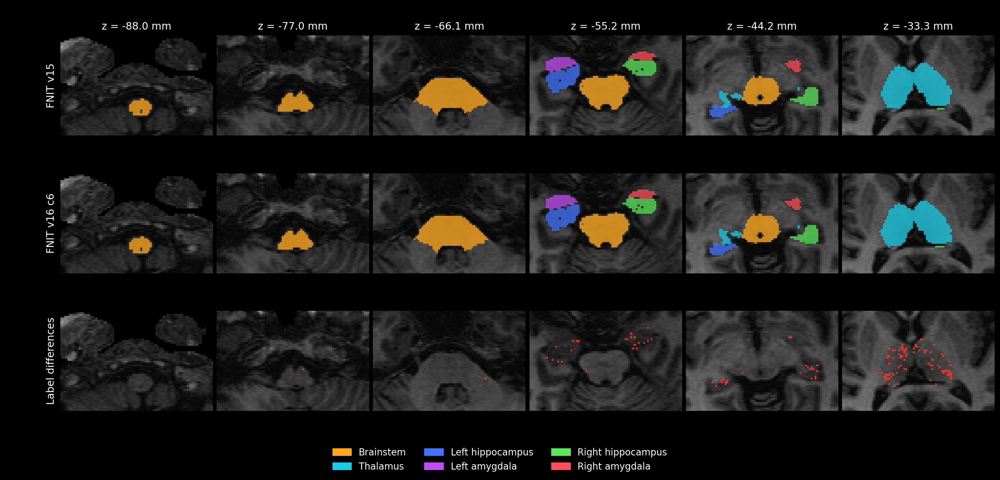
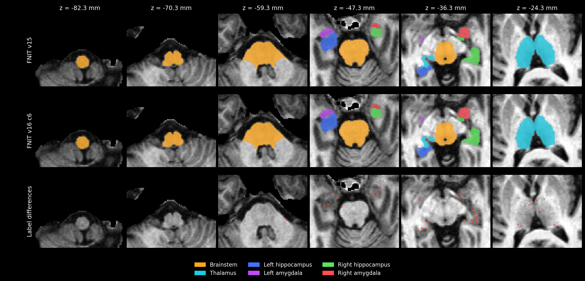
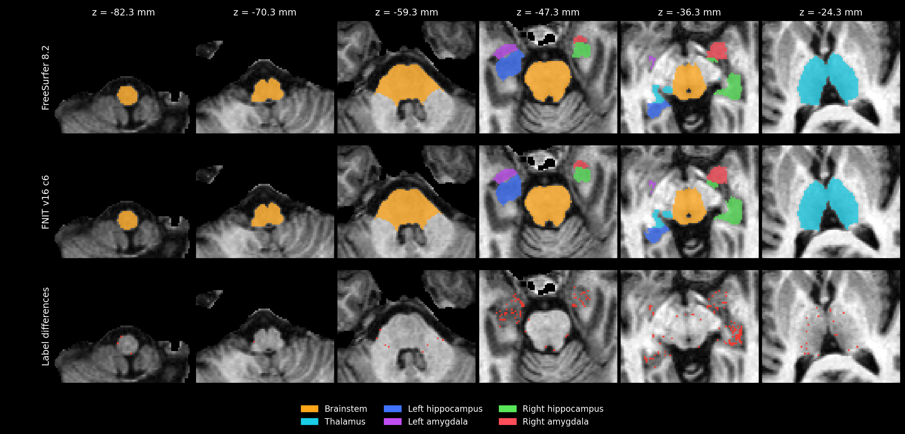

# v16 冻结基线：10 分钟目标的实测与 GPU 优化

本页保留整合前 v16 C6 的真实计算与源码记录；原冻结数据不改写成新入口的测量。当前唯一函数、参数和流程图见[segment_4_subregions](../../../docs/subregions/README.md)，新入口完整验收见[当前验证](../README.md)。

## 完整真实个体结果

采用[公开 sub-01 开发病例](../unified.md)，原始 T1 的 SHA-256 为 `f20410a4efd8e6a05cd04d55730a4a5492ecf9ad1b234fe0fd4661e448270c6a`。共享 H100 物理 GPU 1，四个 CPU 线程，FP32 与 TF32。最终选择冻结版本 **C6**：原始 T1 的全部四项结构计算为 **430.879 秒（7.18 分钟）**，相同官方阶段输入为 **509.840 秒（8.50 分钟）**。两项从启动 Python 进程到退出也均低于 10 分钟。资源已准备，首次下载与一次性图谱安装不计入耗时。

| 完整流程 | v15 计算基线 | v16 计算 | v16 API 含保存 | Python 进程全程 | PyTorch 分配峰值 | 本进程显存采样峰值 |
|---|---:|---:|---:|---:|---:|---:|
| [原始 T1 → 全部四项结构](raw/README.md) | 21.56 min | **7.18 min** | 431.356 s | 7.60 min | 15.47 GiB | 18,930 MiB |
| [相同 norm/aseg/wmparc → 全部四项结构](stage/README.md) | 25.02 min | **8.50 min** | 510.469 s | 9.25 min | 4.91 GiB | 9,736 MiB |

计算包含读入、共享预处理、全部拟合和合并；API 总时间包含自动保存，保存分别为 0.448/0.589 秒。进程全程另含导入、CUDA 初始化和 API 外的对照计算。原始 T1 相对 v15 的耗时观测比为 3.00；共享卡负载不同，该比值是整例观测。进程显存停止上限为 19,073 MiB（约 20 GB），未使用 FP16/BF16。完整 PyTorch CPU 整例本轮未测；历史官方四线程亚区总耗时为 1,842.11 秒（30.70 分钟），不含 `recon-all`，详见[原始记录](../unified.md)。

## 慢在哪里，改了什么

主要开销来自每次候选索引重建后的 Python/CUDA 初始化，以及重复生成完整先验和后验。只测预热 kernel 会漏掉这些开销：真实丘脑重建后一次成本/梯度评估约 2.68 秒，布局稳定后约 0.09 秒。

| 模块 | 原开销 | 本次实现 |
|---|---|---|
| 有效体素与完整网格布局 | 每个 batch/block 单独生成 CUDA 坐标、pad、mask，反复小量传输 | CPU 按原次序打包，每类缓冲区一次 H2D，GPU 使用连续 view；候选、体素和 padding 布局相同 |
| 网格数据项 | 先验插值、混合似然与反向图分开执行 | FP32 Triton 合并混合似然成本和解析顶点梯度；不支持的输入回退 PyTorch autograd |
| 四面体归属 | 每次闭包搜索全部候选 | `fast` 验证严格内部的旧归属；边界完整搜索，每八次闭包完整刷新；EM 和最终输出完整搜索 |
| 中间阶段输出 | 每个阶段生成完整标签、先验和后验 | 中间阶段保留网格、Gaussian 和数值报告；最后强度阶段生成完整输出 |
| alpha 与部分容积准备 | 重复参考栅格、CPU 平滑和设备往返 | 复用相同类分组的参考栅格，GPU 可分离平滑和部分容积计算；图谱或类分组改变时缓存失效 |
| 脑干粗拟合 | 完整网格 autograd 和重复几何准备 | 有效点融合成本、当前/参考几何复用及解析形变梯度 |

[真实布局组件对照](layout_components/README.md)使用真实 T1 工作网格，每次重新创建布局，交替执行旧/新路径。丘脑完整有效点为 **2.679 → 0.281 秒**，左海马为 **1.844 → 0.218 秒**；完整网格初始化加一次栅格化为丘脑 **3.606 → 0.381 秒**、左海马 **4.726 → 0.632 秒**。24 次布局比较完全一致；compact 成本差为 0，梯度最大相对 L2 差为 8.56×10⁻⁸；dense 先验及 coverage 差为 0。[融合、准备和脑干组件](components/README.md)另列首次调用和终态差异。组件耗时不乘重建次数推算整例节省。

CPU 仍负责候选 bounding-box 索引、裁剪/cubic 插值、组织样本 median/KDE、形态学/连通域、白质代理传播和 Nibabel 最终重采样。L-BFGS 控制流、停止条件及自适应索引仍有 GPU 标量同步。整例实测已经达到目标。

## 算法与输出

丘脑保留 0.5 mm，海马/杏仁核保留约 0.333 mm 工作网格，全部平滑级别和强度外层日程保留：丘脑 7/5/5/3，每侧海马 7/5/3，共 50 轮上限。`fast` 每轮最多 20 次网格更新。丘脑非零 sigma 的网格数据积分使用固定四分之一空间采样并按有效点总数加权，最后 sigma=0 恢复全部有效点；海马/杏仁核所有阶段均使用全部有效点。Gaussian EM、超先验、掩膜和最终标签/后验一直使用全部有效点。网格数据成本只在最终求和时使用 float64；几何、图像和梯度保持 FP32/TF32。`balanced` 全阶段保留全部有效点，每轮最多 30 次更新，采用更严格的停止阈值。

归属复用依赖网格没有全局重叠；边界搜索和定期刷新减少归属误差，但正 Jacobian 只能证明局部未翻转。[真实网格归属组件](candidates/v16_c3_owner_thalamus.json)的 64 组受控位移比较中，owner 与 coverage 差异为 0；该组件结果不证明整条优化轨迹逐体素相同。

部分容积准备曾在薄组织分支把 NumPy float32 标量赋给 PyTorch 掩膜切片。已改成 Python 标量，修复兼容问题；测试覆盖该分支。没有新增依赖，使用主页 Conda 环境，运行时使用 FNIT 原生实现。12 个图谱资源、5 个权重已现场核对大小与 SHA-256，资源许可/下载规则沿用项目清单；源码上传包不含影像、权重或凭据。

## 分割差异

两个流程的 29 项输入、标签表、源码和几何检查全部通过：110 个 soft volume 完整、有限且非负，主标签保留输入网格、affine 和 `int32`，四份细网格标签的分辨率与编号正确。原始 T1 的四项最小 Jacobian 为 0.25316, 0.07037, 0.11353, 0.24729，阶段输入为 0.24161, 0.15052, 0.16501, 0.19520，均为正。

### 原始 T1 全流程

| 结构 | v15/v16 前景 Dice | 硬体积变化 | 软体积变化 | v16 对官方前景 Dice | 相对 v15 的官方 Dice 变化 |
|---|---:|---:|---:|---:|---:|
| 脑干 | 0.9985 | -0.01% | -0.03% | 0.9362 | +0.0004 |
| 双侧丘脑 | 0.9716 | -0.71% | -1.01% | 0.9095 | -0.0016 |
| 左海马 | 0.9927 | -0.79% | -0.66% | 0.8938 | -0.0032 |
| 左杏仁核 | 0.9953 | +0.09% | -0.01% | 0.8892 | +0.0023 |
| 右海马 | 0.9843 | -1.32% | -1.45% | 0.8866 | +0.0001 |
| 右杏仁核 | 0.9868 | +0.09% | -0.23% | 0.8671 | +0.0064 |
### 相同官方阶段输入

| 结构 | v15/v16 前景 Dice | 硬体积变化 | 软体积变化 | v16 对官方前景 Dice | 相对 v15 的官方 Dice 变化 |
|---|---:|---:|---:|---:|---:|
| 脑干 | 0.9993 | +0.06% | +0.03% | 0.9934 | +0.0002 |
| 双侧丘脑 | 0.9924 | -0.33% | -0.39% | 0.9866 | -0.0039 |
| 左海马 | 0.9926 | -0.75% | -0.56% | 0.9655 | +0.0026 |
| 左杏仁核 | 0.9878 | -0.37% | -0.63% | 0.9757 | +0.0018 |
| 右海马 | 0.9852 | +1.69% | +1.51% | 0.9614 | -0.0068 |
| 右杏仁核 | 0.9772 | +2.42% | +0.64% | 0.9634 | -0.0155 |

六类总体结构相对 v15 的 Dice 均大于 0.97，体积变化均低于 5%；这是开发一致性检查。原始 T1 的家族硬/软体积变化最大为 1.45%，阶段输入为 2.42%。细核变化另列：

- 原始 T1：**80/110** 个细标签软体积变化在 5% 内，超过 5% 的 30 个标签均属于丘脑。Left-PuM 增加 114.80 mm³（15.33%），其对官方 Dice 由 0.7615 升至 0.8080，软体积更接近官方；Left-CL 增加 6.96 mm³（27.01%）。[全部细标签](raw/full_raw_v16_c6_vs_v15_20261001.json)与[逐丘脑核官方差异](raw/nucleus_differences.json)保留改善及下降的结果。
- 原始 T1 的 45 个已评估丘脑核官方平均 Dice 为 0.6483 → 0.6125，按参考体素数加权为 0.7779 → 0.7650；15 个核 Dice 改善、17 个核软体积误差改善。
- 相同阶段输入：**108/110** 个软体积变化在 5% 内。Left/Right-L-Sg 分别变化 −2.19/−1.22 mm³（−15.84%/−10.29%）；右杏仁核官方前景 Dice 比 v15 低 0.01554。44 个已评估丘脑核按参考体素数加权的官方 Dice 为 0.9727 → 0.9641。[全部阶段指标](stage/full_stage_v16_c6_gpu1_vs_v15_20261001.json)与[细核差异](stage/nucleus_differences.json)可逐项复核。

两种输入包含不同共享预处理，原始 T1 用一次 SynthSeg+ 与白质代理，阶段输入用官方已保存的 norm/aseg/wmparc。允许体素差异的速度目标已达到，逐区官方等价尚未达到；目前是一例公开开发数据验证。

## 整例时间分布与复核

| 原始 T1 结构 | 墙钟秒 |
|---|---:|
| 脑干 | 25.65 |
| 丘脑 | 106.91 |
| 左海马/杏仁核 | 146.05 |
| 右海马/杏仁核 | 130.14 |

四结构以外的 22.13 秒包含共享预处理 9.72 秒及其余流水线工作。三项 fine mesh 日志共 267.49 秒、1838 次目标评估，EM 为 8.48 秒，fine preparation 为 26.03 秒；这些已包含于结构时间，不能重复相加。未归属时间不能直接解释为 CPU 时间。[完整日志计时解析](raw/timing_summary.json)列出阶段与外层记录。

[最终本地核验](final_verification.json)确认源码与两次 C6 运行的冻结文件一致：435 个上传文件逐一核对大小和 SHA-256，其中 389 个为 FNIT 运行时源码；每次八个输出的实际文件身份已在服务器核对。资源核验见[图谱](assets_current_verification.json)和[权重](weights_current_verification.json)。完成状态、输出 SHA、共享 GPU 负载和源码审计见[原始 T1](raw/README.md)及[阶段输入](stage/README.md)。原始 T1 的 89 次显存采样最大间隔 5.35 秒；阶段输入为 108 次、5.59 秒。采样峰值与 PyTorch 分配峰值分别报告。

[本地 CPU/CUDA 测试](tests_local_c6.log)：**298 passed / 40.70 s**，覆盖融合梯度、空/稀疏布局、缓存失效、完整网格位图、部分容积、阶段日程和公共 API；[最终 profile 测试](tests_profiles_c6.log)为 **4 passed**。测试不代替整例 benchmark。

### 未采用的候选

保留原始结果，便于复核选择：

- [C2 超时取消](candidates/full_raw_v16_c2_20261001_cancellation.json)：融合预热 kernel 加速，整例仍未达到目标。
- [C3](candidates/c3_complete/README.md)：18.64 分钟；进一步发现布局冷启动开销。
- [C4](candidates/c4_complete/README.md)：compact 打包后 10.64 分钟，继续优化 dense 布局。
- [C5 原始 T1](candidates/c5_raw/README.md)与[阶段输入](candidates/c5_stage/README.md)：8.42/7.21 分钟，但右海马/杏仁核差异偏大；C6 恢复其所有阶段完整积分。
- [C7 全积分原始 T1](full_valid/raw/README.md)与[阶段输入](full_valid/stage/README.md)：8.08/9.32 分钟。原始 T1 的细丘脑加权官方 Dice 由 C6 的 0.7650 改善至 0.7771；同阶段输入由 0.9641 降至 0.9159。两种输入表现不同，因此选择 C6 作为统一默认。[原始 T1](full_valid/raw/c7_vs_c6_thalamus_official.json)及[阶段输入](full_valid/stage/c7_vs_c6_thalamus_official.json)保留逐核比较。C7 源码快照与当前 C6 版本不同。

### Reference

- [函数输入、参数、官方命令、原实现和文献](../../../docs/subregions/README.md#reference)。
- 脑干：[Iglesias 等，2015，NeuroImage](https://doi.org/10.1016/j.neuroimage.2015.02.065)。
- 丘脑：[Iglesias 等，2018，NeuroImage](https://pmc.ncbi.nlm.nih.gov/articles/PMC6215335/)。
- 海马：[Iglesias 等，2015，NeuroImage](https://doi.org/10.1016/j.neuroimage.2015.04.042)；杏仁核：[Saygin 等，2017，NeuroImage](https://doi.org/10.1016/j.neuroimage.2017.04.046)。
