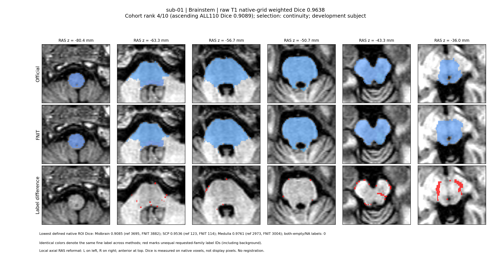
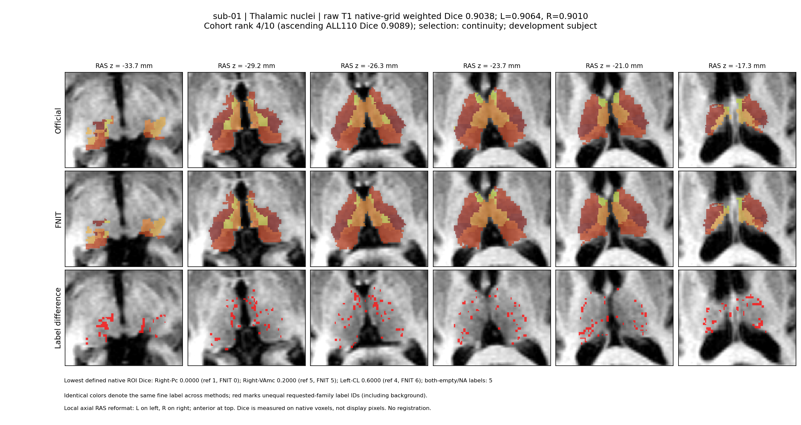
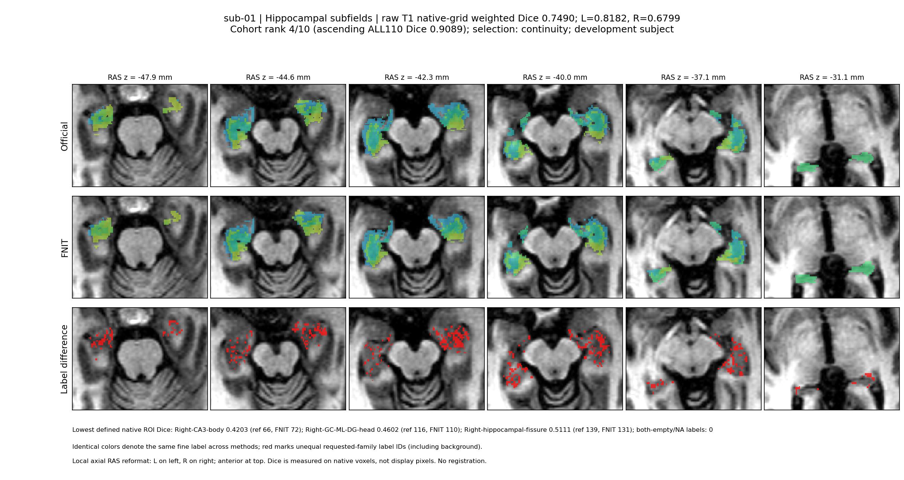
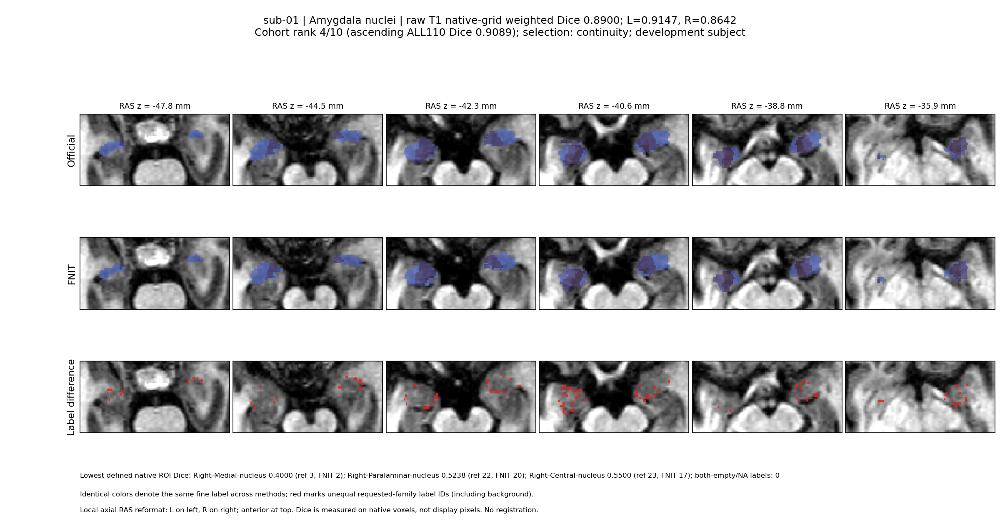
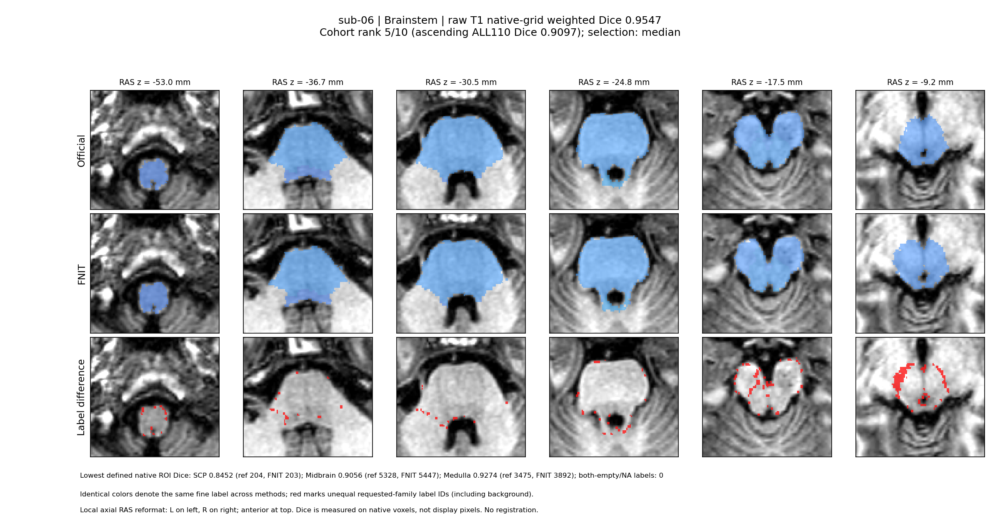
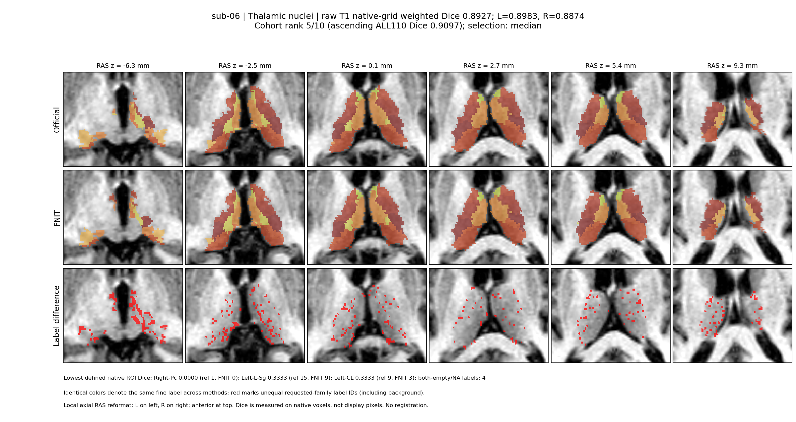
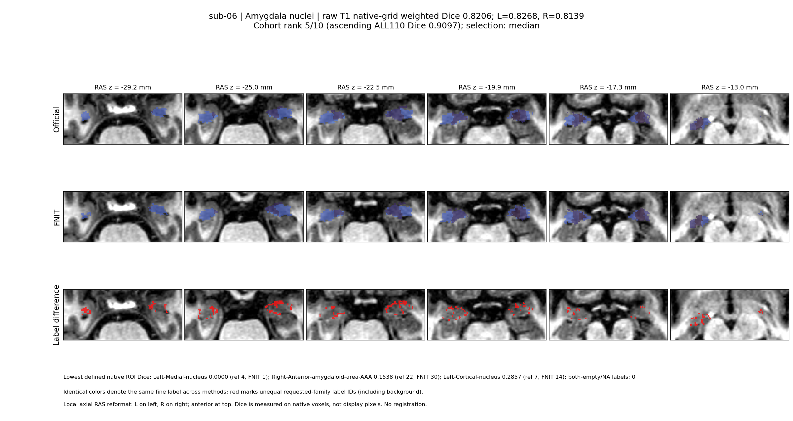
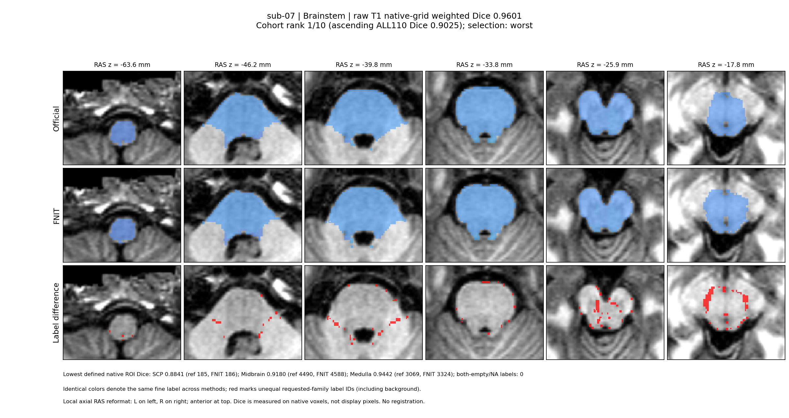
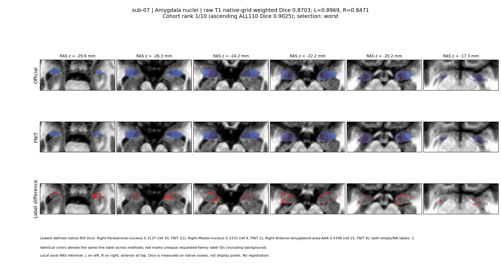

# 10 例公开 T1：精度、耗时与脑图

公开数据 [ds000114 1.0.2](https://doi.org/10.18112/openneuro.ds000114.v1.0.2) 的 `ses-test` T1：按参与者编号预先固定 sub-01–sub-10。全部 10 例与排除开发受试者 sub-01 的 9 例分别报告。公开快照已有去脸处理，本次未追加去脸。

`raw` 从本例原始公开 T1 调用 FNIT 完整四结构流程；官方从同一 T1 重新执行 `recon-all -all -openmp 4` 及脑干、丘脑、双侧海马/杏仁核分割。`stage` 从本例新官方 `norm/aseg/wmparc` 运行 FNIT，时间排除官方预处理。两者均为 `structures="all", optimization="fast", threads=4`。raw native 为原始 T1 网格，stage native 为本例官方 norm 网格；官方细标签只用于评分。

| 受试者集合 | 两模式及官方均完成 | 其余受试者 |
| --- | --- | --- |
| 全部 10 例 | 10/10 | 无 |
| 未参与开发的 9 例（排除 sub-01） | 9/9 | 无 |

## 六区域原网格精度

表格为受试者均值 ± 样本标准差（ddof=1）[最小值, 最大值]；随后为有效数/计划数和缺失数。各受试者区域 Dice 先按该区域官方细分区体素数加权，再对受试者等权平均。双方均空的细分区为 NA，单方缺失为 0；失败和缺测保留计划分母 10 或 9。标准差描述受试者间差异，范围仅取该指标有定义的受试者。

### 全部 10 例

| 区域 | raw native Dice | stage native Dice |
| --- | --- | --- |
| 脑干四分区 | 0.9612 ± 0.0050 [0.9519, 0.9664]；10/10，缺 0 | 0.9911 ± 0.0088 [0.9667, 0.9966]；10/10，缺 0 |
| 双侧丘脑细核 | 0.8881 ± 0.0189 [0.8543, 0.9135]；10/10，缺 0 | 0.9400 ± 0.0312 [0.8602, 0.9700]；10/10，缺 0 |
| 左海马亚区 | 0.8262 ± 0.0242 [0.7895, 0.8821]；10/10，缺 0 | 0.8720 ± 0.0429 [0.7903, 0.9294]；10/10，缺 0 |
| 右海马亚区 | 0.7957 ± 0.0506 [0.6799, 0.8656]；10/10，缺 0 | 0.8563 ± 0.0428 [0.7838, 0.9039]；10/10，缺 0 |
| 左杏仁核 | 0.8894 ± 0.0336 [0.8268, 0.9208]；10/10，缺 0 | 0.9272 ± 0.0266 [0.8809, 0.9631]；10/10，缺 0 |
| 右杏仁核 | 0.8679 ± 0.0303 [0.8139, 0.9280]；10/10，缺 0 | 0.9066 ± 0.0294 [0.8514, 0.9446]；10/10，缺 0 |

### 未参与开发的 9 例（排除 sub-01）

| 区域 | raw native Dice | stage native Dice |
| --- | --- | --- |
| 脑干四分区 | 0.9609 ± 0.0052 [0.9519, 0.9664]；9/9，缺 0 | 0.9911 ± 0.0094 [0.9667, 0.9966]；9/9，缺 0 |
| 双侧丘脑细核 | 0.8863 ± 0.0192 [0.8543, 0.9135]；9/9，缺 0 | 0.9366 ± 0.0312 [0.8602, 0.9637]；9/9，缺 0 |
| 左海马亚区 | 0.8271 ± 0.0255 [0.7895, 0.8821]；9/9，缺 0 | 0.8690 ± 0.0443 [0.7903, 0.9294]；9/9，缺 0 |
| 右海马亚区 | 0.8085 ± 0.0320 [0.7568, 0.8656]；9/9，缺 0 | 0.8597 ± 0.0439 [0.7838, 0.9039]；9/9，缺 0 |
| 左杏仁核 | 0.8866 ± 0.0343 [0.8268, 0.9208]；9/9，缺 0 | 0.9240 ± 0.0260 [0.8809, 0.9631]；9/9，缺 0 |
| 右杏仁核 | 0.8683 ± 0.0322 [0.8139, 0.9280]；9/9，缺 0 | 0.9029 ± 0.0286 [0.8514, 0.9446]；9/9，缺 0 |

## 完整流程及 API 计时

逐例实际软件记录：官方 build `freesurfer-linux-centos7_x86_64-8.2.0-20260314-d932c45`。 FNIT 的 PyTorch/CUDA 记录：`2.5.1/11.8`。

本轮使用共享 NVIDIA H100 PCIe；FNIT raw/stage 分别固定物理 GPU 1/0，每进程 4 线程；官方 CPU 同时运行 4 例。配置与运行共享负载见硬件、协议及分析证据。进程 wall 保留导入、CUDA 初始化、保存和观察回调；源码/输入检查、输入就绪等待和 GPU 预算等待单独记录。

单位为秒。不同项各自保留有效数；API 计算、保存和 API 总计与独立观察的进程 wall 分列。队列/输入等待不计入 FNIT 进程 wall。官方完整流程取本例实际保存的完整 wall；不使用历史时间或 recon-all 估计。

| 计时范围 | 全部 10 例 | 未参与开发的 9 例（排除 sub-01） |
| --- | --- | --- |
| FNIT raw 完整进程 wall | 293.1 ± 36.6 [260.3, 363.5]；10/10，缺 0 | 292.4 ± 38.7 [260.3, 363.5]；9/9，缺 0 |
| FNIT stage 进程 wall（排除官方预处理） | 296.5 ± 11.0 [278.2, 317.3]；10/10，缺 0 | 296.4 ± 11.7 [278.2, 317.3]；9/9，缺 0 |
| 官方原始 T1 完整流程 wall | 7527.0 ± 736.5 [6128.1, 8334.1]；10/10，缺 0 | 7607.4 ± 733.2 [6128.1, 8334.1]；9/9，缺 0 |
| 官方 recon-all 进程 wall | 5981.7 ± 664.2 [4701.9, 6904.7]；10/10，缺 0 | 6038.3 ± 678.4 [4701.9, 6904.7]；9/9，缺 0 |
| 官方脑干命令 wall | 326.4 ± 39.6 [240.6, 371.3]；10/10，缺 0 | 335.9 ± 27.1 [291.7, 371.3]；9/9，缺 0 |
| 官方丘脑命令 wall | 455.4 ± 45.3 [400.9, 543.2]；10/10，缺 0 | 461.3 ± 43.8 [400.9, 543.2]；9/9，缺 0 |
| 官方双侧海马/杏仁核命令 wall | 763.3 ± 74.8 [677.2, 898.3]；10/10，缺 0 | 771.7 ± 74.1 [677.2, 898.3]；9/9，缺 0 |
| FNIT raw API 计算 | 287.3 ± 36.5 [254.7, 357.5]；10/10，缺 0 | 286.7 ± 38.7 [254.7, 357.5]；9/9，缺 0 |
| FNIT raw 输出保存 | 0.6 ± 0.1 [0.5, 0.7]；10/10，缺 0 | 0.6 ± 0.1 [0.5, 0.7]；9/9，缺 0 |
| FNIT raw API 总计 | 288.0 ± 36.5 [255.3, 358.2]；10/10，缺 0 | 287.4 ± 38.7 [255.3, 358.2]；9/9，缺 0 |
| FNIT stage API 计算 | 289.6 ± 11.1 [272.5, 311.1]；10/10，缺 0 | 290.1 ± 11.7 [272.5, 311.1]；9/9，缺 0 |
| FNIT stage 输出保存 | 0.6 ± 0.0 [0.5, 0.7]；10/10，缺 0 | 0.6 ± 0.0 [0.5, 0.7]；9/9，缺 0 |
| FNIT stage API 总计 | 290.3 ± 11.1 [273.1, 311.9]；10/10，缺 0 | 290.7 ± 11.7 [273.1, 311.9]；9/9，缺 0 |

## 同一受试者的配对速度比值

速度倍数逐例计算后汇总：raw = 本例官方实际完整流程 wall / 本例 FNIT raw 进程 wall；stage = 本例官方三个细分割命令的实际进程 wall 之和 / 本例 FNIT stage 进程 wall。stage 分子排除 recon-all，保留双侧海马/杏仁核同一命令。仅两项都实际可用的同一受试者组成配对，缺失对仍占计划分母；倍数范围是逐例比值的最小值和最大值。共享 CPU/H100 上的实测流程比值不能推为独占硬件的算法加速。

| 受试者集合 | raw 完整流程：官方/FNIT | stage 细分割：官方/FNIT |
| --- | --- | --- |
| 全部 10 例 | 26.00 ± 3.89 [19.97, 32.02]；10/10，缺 0 | 5.21 ± 0.46 [4.48, 5.79]；10/10，缺 0 |
| 未参与开发的 9 例（排除 sub-01） | 26.36 ± 3.94 [19.97, 32.02]；9/9，缺 0 | 5.29 ± 0.40 [4.76, 5.79]；9/9，缺 0 |

逐例分子、分母、范围和缺测状态均见 [paired_runtime.tsv](paired_runtime.tsv)。

## 实际分步骤计时

单位为秒；表格继续采用均值 ± 样本标准差 [最小值, 最大值] 和有效数/计划数、缺失数。官方合成/强度列为日志显式整数计时，包含相应阶段准备。FNIT 列使用已保存的独立计时：脑干强度列为 intensity_fit；丘脑及海马强度列为多层准备与拟合。工作图准备另列，不能混为同一个计时范围。子阶段或 subset 计时已包含在其父步骤，不能与父步骤再次相加。

### 全部 10 例

| 步骤 | FNIT raw | FNIT stage |
| --- | --- | --- |
| 共享预处理 | 13.9 ± 1.0 [12.4, 15.2]；10/10，缺 0 | 1.8 ± 0.1 [1.7, 1.9]；10/10，缺 0 |

| 结构 | 官方合成准备/拟合 | 官方强度准备/拟合 | FNIT raw 合成 | raw 工作图准备 | raw 强度 | FNIT stage 合成 | stage 工作图准备 | stage 强度 |
| --- | --- | --- | --- | --- | --- | --- | --- | --- |
| 脑干 | 15.8 ± 1.9 [12.0, 18.0]；10/10，缺 0 | 264.7 ± 38.7 [188.0, 313.0]；10/10，缺 0 | 5.9 ± 0.8 [5.1, 7.9]；10/10，缺 0 | 4.1 ± 0.4 [3.4, 4.7]；10/10，缺 0 | 6.9 ± 1.8 [5.4, 9.8]；10/10，缺 0 | 12.9 ± 0.3 [12.5, 13.4]；10/10，缺 0 | 4.3 ± 0.2 [4.0, 4.7]；10/10，缺 0 | 6.1 ± 0.8 [5.3, 7.7]；10/10，缺 0 |
| 丘脑 | 79.7 ± 3.5 [75.0, 87.0]；10/10，缺 0 | 319.2 ± 37.0 [265.0, 374.0]；10/10，缺 0 | 33.5 ± 7.5 [26.7, 51.1]；10/10，缺 0 | 3.3 ± 0.1 [3.1, 3.5]；10/10，缺 0 | 44.5 ± 6.4 [36.8, 56.1]；10/10，缺 0 | 30.0 ± 1.0 [28.2, 31.3]；10/10，缺 0 | 5.5 ± 0.1 [5.4, 5.7]；10/10，缺 0 | 55.3 ± 3.6 [50.8, 63.5]；10/10，缺 0 |
| 左海马及杏仁核 | 72.4 ± 4.0 [67.0, 80.0]；10/10，缺 0 | 246.4 ± 28.6 [216.0, 309.0]；10/10，缺 0 | 30.2 ± 9.5 [16.3, 51.1]；10/10，缺 0 | 5.2 ± 0.4 [4.8, 5.8]；10/10，缺 0 | 31.5 ± 4.4 [27.8, 41.7]；10/10，缺 0 | 27.3 ± 7.0 [10.6, 35.7]；10/10，缺 0 | 7.1 ± 0.3 [6.7, 7.7]；10/10，缺 0 | 37.8 ± 2.2 [36.0, 43.1]；10/10，缺 0 |
| 右海马及杏仁核 | 73.6 ± 2.6 [70.0, 78.0]；10/10，缺 0 | 247.7 ± 24.5 [218.0, 296.0]；10/10，缺 0 | 34.0 ± 15.6 [19.6, 61.5]；10/10，缺 0 | 5.3 ± 0.3 [4.9, 5.8]；10/10，缺 0 | 31.5 ± 4.6 [25.8, 39.8]；10/10，缺 0 | 23.3 ± 7.5 [12.1, 31.3]；10/10，缺 0 | 7.3 ± 0.3 [6.8, 7.7]；10/10，缺 0 | 37.8 ± 2.4 [34.5, 41.7]；10/10，缺 0 |

| 结构 | FNIT raw recipe 总计 | FNIT stage recipe 总计 |
| --- | --- | --- |
| 脑干 | 20.4 ± 2.7 [17.3, 24.4]；10/10，缺 0 | 27.4 ± 1.1 [26.3, 30.0]；10/10，缺 0 |
| 丘脑 | 85.0 ± 11.8 [73.5, 103.4]；10/10，缺 0 | 94.7 ± 4.2 [89.2, 103.6]；10/10，缺 0 |
| 左海马及杏仁核 | 72.9 ± 13.7 [58.8, 101.1]；10/10，缺 0 | 78.2 ± 4.8 [68.7, 84.3]；10/10，缺 0 |
| 右海马及杏仁核 | 76.7 ± 18.8 [57.1, 110.5]；10/10，缺 0 | 74.2 ± 8.6 [62.1, 83.0]；10/10，缺 0 |

### 未参与开发的 9 例（排除 sub-01）

| 步骤 | FNIT raw | FNIT stage |
| --- | --- | --- |
| 共享预处理 | 13.7 ± 0.9 [12.4, 15.1]；9/9，缺 0 | 1.8 ± 0.1 [1.7, 1.9]；9/9，缺 0 |

| 结构 | 官方合成准备/拟合 | 官方强度准备/拟合 | FNIT raw 合成 | raw 工作图准备 | raw 强度 | FNIT stage 合成 | stage 工作图准备 | stage 强度 |
| --- | --- | --- | --- | --- | --- | --- | --- | --- |
| 脑干 | 16.2 ± 1.5 [14.0, 18.0]；9/9，缺 0 | 273.2 ± 29.4 [235.0, 313.0]；9/9，缺 0 | 5.7 ± 0.5 [5.1, 6.4]；9/9，缺 0 | 4.1 ± 0.3 [3.7, 4.7]；9/9，缺 0 | 7.0 ± 1.9 [5.4, 9.8]；9/9，缺 0 | 12.9 ± 0.3 [12.5, 13.4]；9/9，缺 0 | 4.3 ± 0.2 [4.1, 4.7]；9/9，缺 0 | 6.2 ± 0.7 [5.4, 7.7]；9/9，缺 0 |
| 丘脑 | 80.1 ± 3.4 [75.0, 87.0]；9/9，缺 0 | 324.2 ± 35.5 [265.0, 374.0]；9/9，缺 0 | 33.8 ± 7.9 [26.7, 51.1]；9/9，缺 0 | 3.3 ± 0.1 [3.1, 3.5]；9/9，缺 0 | 45.4 ± 6.2 [38.0, 56.1]；9/9，缺 0 | 30.2 ± 0.8 [29.2, 31.3]；9/9，缺 0 | 5.5 ± 0.1 [5.4, 5.7]；9/9，缺 0 | 55.7 ± 3.6 [50.8, 63.5]；9/9，缺 0 |
| 左海马及杏仁核 | 73.0 ± 3.7 [68.0, 80.0]；9/9，缺 0 | 249.2 ± 28.8 [216.0, 309.0]；9/9，缺 0 | 31.0 ± 9.7 [16.3, 51.1]；9/9，缺 0 | 5.2 ± 0.4 [4.8, 5.8]；9/9，缺 0 | 31.8 ± 4.6 [27.8, 41.7]；9/9，缺 0 | 26.3 ± 6.8 [10.6, 32.0]；9/9，缺 0 | 7.1 ± 0.3 [6.7, 7.7]；9/9，缺 0 | 38.0 ± 2.3 [36.0, 43.1]；9/9，缺 0 |
| 右海马及杏仁核 | 73.8 ± 2.7 [70.0, 78.0]；9/9，缺 0 | 251.0 ± 23.6 [227.0, 296.0]；9/9，缺 0 | 30.9 ± 13.0 [19.6, 60.7]；9/9，缺 0 | 5.3 ± 0.3 [5.0, 5.8]；9/9，缺 0 | 31.8 ± 4.8 [25.8, 39.8]；9/9，缺 0 | 23.4 ± 7.9 [12.1, 31.3]；9/9，缺 0 | 7.3 ± 0.2 [7.0, 7.7]；9/9，缺 0 | 38.2 ± 2.2 [34.8, 41.7]；9/9，缺 0 |

| 结构 | FNIT raw recipe 总计 | FNIT stage recipe 总计 |
| --- | --- | --- |
| 脑干 | 20.1 ± 2.7 [17.3, 24.4]；9/9，缺 0 | 27.5 ± 1.1 [26.3, 30.0]；9/9，缺 0 |
| 丘脑 | 86.3 ± 11.7 [73.5, 103.4]；9/9，缺 0 | 95.3 ± 4.0 [89.2, 103.6]；9/9，缺 0 |
| 左海马及杏仁核 | 74.1 ± 14.0 [58.8, 101.1]；9/9，缺 0 | 77.5 ± 4.6 [68.7, 82.6]；9/9，缺 0 |
| 右海马及杏仁核 | 73.9 ± 17.6 [57.1, 110.5]；9/9，缺 0 | 74.6 ± 8.9 [62.1, 83.0]；9/9，缺 0 |

完整 [步骤明细](analysis/steps/cohort_steps.tsv) 和 [步骤汇总](analysis/steps/cohort_steps_summary.tsv) 包含可用的图谱对齐、多尺度准备、solver 拟合、拟合后处理及逐层计时。没有独立计时的对齐、后处理保留 NA；未分配 recipe 开销不改名为任何未测步骤。中间阶段没有共同保存的可评分标签，阶段 Dice 未测，不由 objective 或初始化 mask Dice 代替。最终四结构/六区域精度见本页和完整 ROI 表。

## 真实 T1 脑图

展示按 raw native 全 110 分区官方体素加权 Dice 预先定义的中位例、最低例，以及开发用 sub-01。每幅分区脑图为 6 个 axial slice；官方、FNIT 和差异三行使用相同裁剪、切面和灰度范围。显示重采样只用于画图，Dice 按原始评分网格计算。

| 展示角色 | 受试者 |
| --- | --- |
| 开发用连续性例 | sub-01 |
| 中位例 | sub-06 |
| 最低例 | sub-07 |

### sub-01：脑干

### sub-01：丘脑

### sub-01：海马

### sub-01：杏仁核

### sub-06：脑干

### sub-06：丘脑

### sub-06：海马

### sub-06：杏仁核

### sub-07：脑干

### sub-07：丘脑

### sub-07：海马

### sub-07：杏仁核

## 准备阶段记录

分析另保留 1 份环境/启动准备归档：共 10 条病例记录，其中 10 条失败记录，涉及 10 名预声明受试者；失败记录中 10 条已启动子进程。这些数量从归档的 case_outcomes 逐条计算，不是最终拟合失败人数。启动错误、环境修复及重新运行过程见 [官方准备记录](official_protocol.md#启动失败及重试)。归档的 state、exit_code、failure、日志路径和 SHA 随发布证据保留。

| 准备归档（SHA 前12位） | 病例记录 | 失败记录 | 已启动的失败记录 | 依赖阻塞记录 | 失败受试者 |
| --- | --- | --- | --- | --- | --- |
| official_queue.json (ef4d609a4c32) | 10 | 10 | 10 | 0 | sub-01、sub-02、sub-03、sub-04、sub-05、sub-06、sub-07、sub-08、sub-09、sub-10 |

当前合并队列另列尝试类别：进程/输出验证失败 0 次，上游依赖阻塞 10 次，设置/预检查失败 0 次。这一组数量不含独立归档的准备阶段记录；因上游官方预处理未就绪而 blocked 的 FNIT stage 属于依赖阻塞，不另累计为 FNIT 算法失败。修复后的最终结果使用本轮固定源码和预声明输入；完成状态、精度和耗时以实际最终进程及保存结果为准。

## 完整证据与本次记录

[110 分区完整 TSV](analysis/cohort_roi.tsv)（110 × 10 × raw/stage × native/hr，共 4,400 行，保留失败）；[六区域逐例 TSV](analysis/cohort_family.tsv)、[整例 TSV](analysis/cohort_case.tsv)、[分析摘要](analysis/cohort_summary.json)、[逐例配对耗时](paired_runtime.tsv)、[分步骤 TSV](analysis/steps/cohort_steps.tsv)、[分步骤汇总](analysis/steps/cohort_steps_summary.tsv)、[recon-all 显式 FSTIME 来源](analysis/steps/cohort_reconall_fstime.tsv)、[发布证据和 SHA](benchmark_evidence.json)、[脑图清单](brain_figures/plot_manifest.json)。

冻结源码：`ac692bb4f7868a24ea4bd67180162e81726de9b4`；清单 SHA-256：`d8c8f7aecdae521751f30fdd09bea6acbffd2c0a50c9fb70e1dc97ad74717b07`。

本次发布只汇总固定十例最终结果，未按精度筛选受试者。完整分析及逐例扩展报告保留在服务器或外部文本归档，其路径、大小与 SHA 记入发布证据；仓库只保留汇总、完整 ROI TSV、实际步骤计时及衍生脑图。

数据选择与许可见 [数据记录](data_selection.md)；算法原实现、论文及使用方法见 [功能文档](../../../docs/subregions/README.md#reference)。

