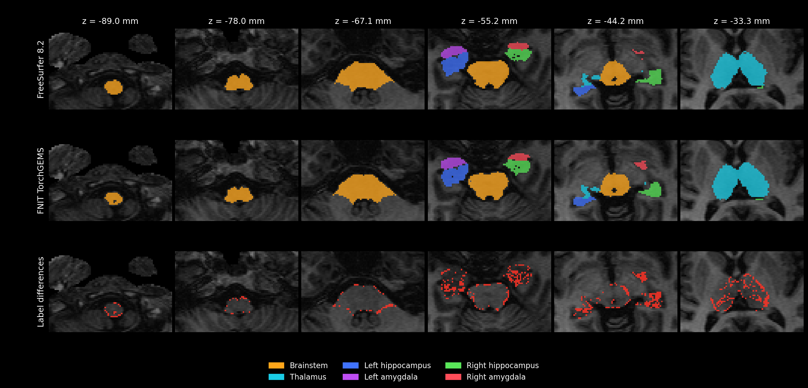
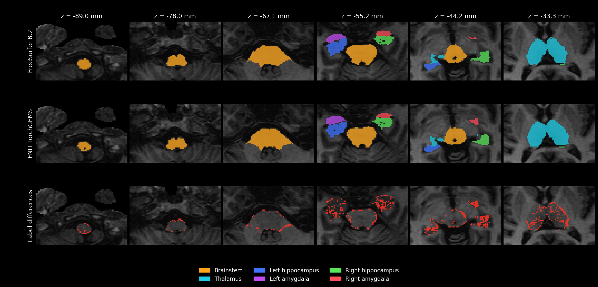
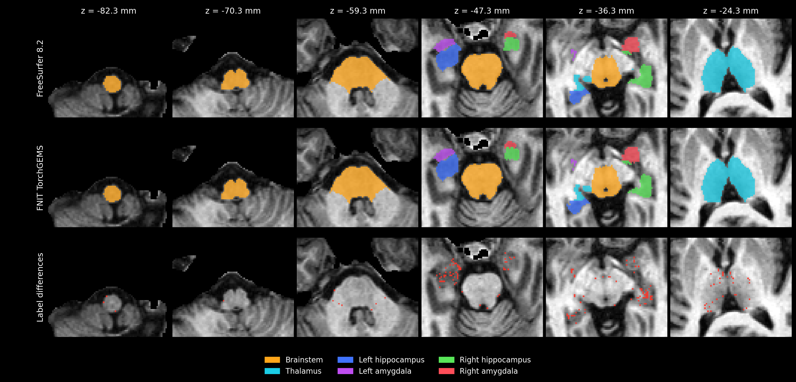

# 统一 TorchGEMS 亚区：真实 T1 验证

[功能和参数](../../docs/subregions/README.md) · [历史脑干验证](README.md) · [旧 C++/ITK 核团验证](nuclei.md)

## 输入和验收

使用 OpenNeuro ds000114 的一个完整 T1。输入为仓库已去除面部的公开衍生影像，未做 recon-all；来源、CC0 许可及处理记录见 [SOURCES.json](../../examples/data/SOURCES.json)。文件为 `sub-01_T1w.nii.gz`，形状 `256×156×256`，SHA-256 为 `f20410a4efd8e6a05cd04d55730a4a5492ecf9ad1b234fe0fd4661e448270c6a`。这一个开发病例不作为独立留出集。

两个完整运行分别报告：

1. **相同阶段输入**：FNIT 与 FreeSurfer 8.2 使用相同 `norm.mgz`、`aseg.mgz`、`wmparc.mgz`，比较亚区拟合。
2. **原始 T1 全流程**：FNIT 从上述 T1 自行生成粗分割、皮层分区和白质代理，再拟合全部结构；与同一人的官方输出比较。

每区要求 Dice ≥0.95、硬体积差 ≤5%；不要求逐体素相同。未通过的标签保留数字；参考为空而候选非空的标签记为失败，双方均为空不计入 Dice 验收。软体积单独报告后验积分差。

历史 v7 两组运行均有 7 个标签的双方硬分割为空：丘脑的双侧 Pc、Pt、VM，以及右侧杏仁核 Anterior-amygdaloid-area-AAA。这些标签的软体积非零。两份 TSV 均包含全部 110 个标签的软体积，`hard_evaluation_status=both_empty` 的 7 行将 Dice、硬体积差和验收结果留空；其余 103 行参与硬分割验收。表中的最大软体积差覆盖全部 110 个标签。各新版的空标签和受评数按实际输出另列。

运行在共享 H100 PCIe 80 GiB 上，四个 CPU 线程，FP32 张量、默认 TF32。图谱和权重已准备并核对大小、SHA-256；耗时不包含首次下载及图谱先验准备。阶段对照限制 PyTorch 分配器为显卡容量的 14%，原始 T1 全流程为 23%；历史 v7/v12 每 10 秒记录负载，当前 v15 每约 5 秒记录。优化前停止上限为 20,480 MiB；新版改为 19,073 MiB，约 20 GB。PyTorch 分配峰值与 `nvidia-smi` 进程显存分别统计。`wall_seconds` 记录读入、共享预处理、拟合和合并的计算时间；v15 同一次 API 调用自动保存，另列 API 总时间和保存耗时，对照指标计算在 API 计时之外。

## 当前 v15：统一入口与完整细网格日程

执行源码 `971a07f`，使用默认 `optimization="fast"`：保留丘脑 0.5 mm、海马/杏仁核约 0.333 mm 工作网格、全部平滑级别和外层日程，每轮网格更新上限 20 次。新版取消 v13/v14 粗强度初始化，保留 Gaussian 分组、超先验和部分容积模型。两个完整调用均生成原输入网格的统一标签、110 项硬/软体积及四份细网格标签。

| 完整流程 | 历史 v12 计算 | v15 计算 | 观测旧/新比 | v15 PyTorch 峰值 | 本进程采样峰值 | 输出保存 |
|---|---:|---:|---:|---:|---:|---:|
| 原始 T1，内部共享预处理 | 41.33 min | **21.56 min** | 1.917 | 15.47 GiB | 18,928 MiB | 0.480 s |
| 相同 `norm/aseg/wmparc` | 45.02 min | **25.02 min** | 1.799 | 6.35 GiB | 10,908 MiB | 0.520 s |

原始 T1 旧新使用物理 GPU 1；阶段输入历史 v12 使用 GPU 0，v15 完整重跑使用 GPU 1。两卡均为共享 H100，其他进程负载不同，表中的比值不作为同条件官方提速比。首次 v15 阶段运行因共享 GPU 0 的可用显存耗尽而失败，失败时间不计入此表。

| 结构 | 相同阶段输入：官方前景 Dice | 原始 T1：官方前景 Dice |
|---|---:|---:|
| 脑干 | 0.9932 | 0.9358 |
| 丘脑 | 0.9906 | 0.9111 |
| 左海马 | 0.9629 | 0.8969 |
| 左杏仁核 | 0.9739 | 0.8869 |
| 右海马 | 0.9682 | 0.8865 |
| 右杏仁核 | 0.9790 | 0.8607 |

官方逐区严格门槛仍为 Dice≥0.95 且硬体积差≤5%：阶段输入 **35/103**（v12 为 26/103），原始 T1 **0/105**（v12 为 0/104）。全部 110 项软体积独立报告。阶段输入的左海马相对 v12 硬/软体积增加 7.00%/6.76%，同时官方前景 Dice 从 0.9456 提高到 0.9629；原始 T1 的右海马体积变化已收回到 +2.27%/+2.73%，右杏仁核官方 Dice 仍比 v12 低 0.0173。不能宣称官方逐区等价。

两个完整运行各 29 项输入、源码及输出检查通过，四组最终网格 Jacobian 均为正。[v15 完整结果](speed_v15/README.md)包含六类结构的体积和世界坐标质心变化、110 项逐标签记录、轴位图、冻结源码核验、负载日志及失败记录。[v13](speed_v13/README.md)和 [v14](speed_v14/README.md)为已被修订的候选，保留实际回退结果。

最终 `9c1caa8` 仅修正保存计时和实际共享预处理来源/模型调用次数；分割计算与冻结执行源码一致，见[元数据修订审计](speed_v15/final_metadata_source_audit.json)。[相关 CPU 测试](speed_v15/tests_final_cpu.json) **222 passed**；不替代两个真实 GPU 整例。完整 PyTorch CPU 亚区耗时本轮未测。

## 共享预处理：完整真实 T1

| 设备 | SynthSeg/SynthSeg+、白质代理总时间 | PyTorch 显存峰值 |
|---|---:|---:|
| CPU，四线程 | 124.08 s | — |
| H100，默认分配器 | 8.70 s | 15.47 GiB |

[CPU 报告](unified_shared_preprocessing_cpu.json) · [GPU 报告](unified_shared_preprocessing_gpu.json) · [CPU/GPU 逐标签对照](unified_shared_preprocessing_cpu_gpu.json)

GPU 与 CPU 使用相同的完整影像和权重。原始网格粗分割相差 113 个体素、皮层分区相差 194 个体素、白质代理相差 156 个体素；三者最小逐标签 Dice 分别为 0.99875、0.99823、0.99873。六个海马白质采样标签均非空，传播结果全部限制在原有白质内。该计时只覆盖共享预处理，不能作为全部亚区分割耗时。

本次释放 U-Net 中已经使用的 skip 张量、未使用的解码器返回值和 softmax 前的末层特征，保持网络运算和权重不变。未启用 FP16 或 BF16。

## 栅格化组件检查

使用真实 BrainstemSS 图谱的 `48×48×48` 局部网格，对照更改前的 FNIT 栅格化函数。该项是数值和组件计时检查，不是完整被试 benchmark。

| 精度设置 | 最大先验绝对差 | 梯度相对 L2 差 | 四面体归属变化 | 原函数热运行 | 新函数热运行 |
|---|---:|---:|---:|---:|---:|
| 完整 FP32 | 4.77×10⁻⁷ | 1.77×10⁻⁷ | 0 | 0.430 s | 0.063 s |
| TF32 开启 | 4.77×10⁻⁷ | 2.39×10⁻⁴ | 0 | 0.496 s | 0.080 s |

[FP32 报告](unified_raster_fp32.json) · [TF32 报告](unified_raster_tf32.json)

新函数批量查找候选四面体，每个四面体只计算一次逆矩阵；候选查找不构造反向图，选中的四面体重心坐标仍由 PyTorch 自动求导。完整 FP32 对照通过 `1e-5` 先验差及 `1e-4` 梯度差检查，内部梯度还通过有限差分检查。TF32 下的梯度差单独记录。

本次局部数值检查对图谱加 `[0.137, 0.211, 0.317]` 体素的平移，避免检查点全部落在整数网格面；两份报告记录函数源码 SHA-256、PyTorch/CUDA 版本及首次和暖运行耗时。组件计时来自共享 GPU，各次负载不同，不据此计算整例提速。

早期用旧 FNIT 原生实现保存的真实丘脑工作图像和网格检查[有效块裁剪实验](unified_masked_block_experiment.json)：有效体素 725,122 个，候选块从 3,160 减为 1,842，成本相同，先验最大差为 0，梯度相对差 `3.47×10⁻⁸`。三轮暖运行的中位数由 1.224 s 降为 0.944 s，但首次组件调用为 5.543 s，另一次组件检查中暖运行也未加速。该实验当时未进入默认路径；实验脚本为 [check_masked_blocks.py](check_masked_blocks.py)。

同一丘脑图像的[合并写入实验](unified_single_write_experiment.json)将 262 次输出张量写入合并为一次。三组对照的先验、梯度和成本均相同；暖运行中位数从 1.735 s 变为 1.634 s。Profiler 中输出写入的反向节点从 262 个减为 1 个，但合并张量增加了内存，整体组件耗时改善较小。本次保留实验结果，未修改完整运行使用的生产函数。

## 2026-10-01：有效体素网格组件优化

使用旧 FNIT 原生实现保存的真实阶段：丘脑 `port_thalamus_debug`，左海马/杏仁核 `port_hippo_integrated_fullfix_left_tmp`。输入是保存的工作影像、对齐图谱影像和网格，不是独立官方阶段，也不是完整 T1 运行；输入大小、SHA-256、坐标变换和源码见[组件汇总](compact_v12/summary.json)及[源码清单](compact_v12/source_manifest.json)。冻结执行包来自 `64250aa`，实际文件哈希已核对，包括 Triton 查找 kernel；四项组件均完成。

对照 dense 栅格化加未缓存的 Ashburner 先验，与有效体素栅格化加参考几何缓存。丘脑有效体素为 717,531，左海马/杏仁核为 526,626；点批次分别由 264 减至 179、389 减至 128。空间索引缓存固定掩膜坐标，按点数和候选四面体数分组；Triton 只查真实有效点，选中的四面体合并插值，PyTorch 继续计算梯度。参考网格的逆矩阵和体积只准备一次。张量保持 FP32，未启用 FP16/BF16，也未缩减 EM 或网格拟合日程。

| 真实阶段 | 设置 | 首次调用 dense→compact（s） | 三次交替重复中位数（s） | PyTorch 分配峰值 dense→compact（GiB） | 最大梯度相对 L2 差 |
|---|---|---:|---:|---:|---:|
| [丘脑](compact_v12/compact_thalamus_fp32_v12.json) | 完整 FP32 | 13.635→2.982 | 1.512→0.147 | 1.455→0.659 | 2.39×10⁻⁸ |
| [丘脑](compact_v12/compact_thalamus_tf32_v12.json) | TF32 开启 | 14.091→2.885 | 1.524→0.144 | 1.455→0.659 | 2.35×10⁻⁸ |
| [左海马/杏仁核](compact_v12/compact_hippo-amygdala-left_fp32_v12.json) | 完整 FP32 | 21.994→2.543 | 2.236→0.111 | 2.142→0.494 | 8.83×10⁻⁹ |
| [左海马/杏仁核](compact_v12/compact_hippo-amygdala-left_tf32_v12.json) | TF32 开启 | 20.488→2.362 | 2.083→0.106 | 2.142→0.494 | 7.23×10⁻⁹ |

首次调用在共用 dense Gaussian 初始化之后，包含各路径新的点批次缓存；参考几何缓存准备时间另列。表中时间覆盖栅格化、数据成本、形变先验和一次反向传播，每段均同步 CUDA。显存峰值在清空另一条路径缓存后分别重测，按 `peak_allocated_bytes/2³⁰` 换算。四项先验最大绝对差、目标函数差和 coverage 差异均为 0；两项完整 FP32 通过先验 `<1e-5`、梯度相对 L2 `<1e-4`、目标函数相对差 `<1e-6` 的门槛。TF32 的数值差异单独观测，不作为完整 FP32 等价结论。

报告记录了实际后端调用：每项丘脑为 Triton 895 次、左海马/杏仁核为 640 次，torch 回退均为 0。每项次数覆盖首次、三次重复和独立显存重测。共享 GPU 0 的全卡显存为 65,552–69,161 MiB，利用率中位数均为 100%；本进程采样最大值分别为 2,472、2,818、3,520、3,604 MiB，顺序与表相同。四份负载日志各有 6、6、9、8 次记录，最大采样间隔均小于 10.10 s。全卡负载包含其他任务，组件观测不推算整例提速；新版完整 T1 结果见下节。

[v11 丘脑 FP32 检查](compact_v11/compact_thalamus_fp32_v11.json)曾因梯度相对差 `4.54×10⁻⁴` 超过门槛而失败，尽管目标函数相同。[逐点归属诊断](compact_v11/lookup_math/candidate_id_comparison.json)定位到共享面附近的一个点 `[36,39,79]`：关闭乘加融合时选中了相邻四面体。诊断中的开启融合及显式 FMA 变体，在全部 717,531 个点上得到 0 归属及 coverage 差异；v12 恢复 FP32 乘加融合，匹配 PyTorch CUDA 累加。上述性能数字覆盖参考缓存、点批次、查找和合并插值的整体改动。

## 2026-10-01：优化后的两个完整运行

执行包为 `64250aa`。输入与优化前 `0dfb8e7` 的 SHA-256 相同，图谱、权重、分辨率、迭代日程和验收门槛保持原配置；两组均运行全部四项结构。运行报告的 GEMS 和 SynthSeg 源码哈希与冻结包现场核对一致，源码包没有 `native_samseg` 或 `_vendor_fsl`。

| 完整运行 | 旧 API 墙钟 | 新 API 墙钟 | 观测旧/新耗时比 | PyTorch 峰值旧→新 | 新进程显存采样最大值 |
|---|---:|---:|---:|---:|---:|
| [相同阶段输入](optimized_stage_v12_summary.json) | 277.63 min | 45.02 min | 6.17 | 6.55→6.35 GiB | 10,134 MiB |
| [原始 T1 全流程](optimized_raw_t1_v12_summary.json) | 248.68 min | 41.33 min | 6.02 | 15.47→15.47 GiB | 17,762 MiB |

API 耗时包括共享预处理和全部拟合，不含保存及指标计算。阶段输入使用 GPU 0，原始 T1 使用 GPU 1；两张卡仍被其他任务占用。新版全卡利用率中位数均为 100%，采样分别为 272、248 次，最大采样间隔约 10.14、10.16 s，无超过 20 s 的间隔。本进程均未触发 19,073 MiB 停止上限。旧、新负载不同，表中比值是同一病例完整运行的观测，不能作为对官方实现的提速比。原始 T1 的总分配峰值仍由 SynthSeg 预处理占据，亚区组件省下的显存没有降低这一总峰值。

[阶段输入新旧对照](optimized_stage_v12_comparison.json) · [原始 T1 新旧对照](optimized_raw_t1_v12_comparison.json)记录全部 110 标签和四份高分辨率输出。每组 29 项输入、标签表和输出检查均通过：主输出保持原 T1 形状及 affine、`int32`，四份高分辨率输出的旧新网格也实际相同，所有非零标签均在表内。主标签分别有 2,500、597 个体素变化；逐标签旧新 Dice 中位数为 0.88822、0.97931。脑干高分辨率标签均无体素变化，主标签受统一合并影响仍有少量边界变化。组件数值门槛通过不代表整例迭代结果逐标签相同。

### 官方逐区精度

阶段输入为 **26/103** 标签同时达到 Dice≥0.95 和硬体积差≤5%，优化前为 **22/103**。其中 9 项新达标、5 项失去达标，不能用总数增加代替逐项检查；脑干仍为 **4/4**。阶段输入的 7 项双方硬标签为空，软体积全部保留。

丘脑逐标签 Dice 中位数由 0.9164 变为 0.9494；左海马由 0.8844 降至 0.7186，左杏仁核由 0.8182 降至 0.7299。左侧精度退化需要后续修正，本轮结果不表述为精度整体保持。全部 110 项自身软体积的旧新变化也保存在对照 JSON 中：阶段输入最大相对变化为 `Left-L-Sg` 的 +56.1%，原始 T1 为 `Left-fimbria` 的 +17.9%。

原始 T1 为 **0/104** 标签达标，优化前为 **0/103**。右侧 `Anterior-amygdaloid-area-AAA`（17010）由候选硬标签为空变为 20 个体素，官方仍为空，按既定规则记为失败；双方硬标签为空的项数因此由 7 变为 6。最大软体积差依然覆盖全部 110 项。

| 运行 | 结构 | 前景 Dice | 标签 Dice 中位数 | 最小 Dice | 同时达标 | 最大硬体积差 | 最大软体积差 |
|---|---|---:|---:|---:|---:|---:|---:|
| 阶段输入 | 脑干 | 0.9931 | 0.9890 | 0.9605 | 4/4 | 1.0% | 1.5% |
| 阶段输入 | 丘脑 | 0.9883 | 0.9494 | 0.6667 | 18/44 | 66.7% | 13.3% |
| 阶段输入 | 左海马 | 0.9456 | 0.7186 | 0.4526 | 0/19 | 23.2% | 16.9% |
| 阶段输入 | 右海马 | 0.9735 | 0.9113 | 0.8056 | 2/19 | 21.0% | 5.9% |
| 阶段输入 | 左杏仁核 | 0.9364 | 0.7299 | 0.1667 | 0/9 | 41.2% | 24.2% |
| 阶段输入 | 右杏仁核 | 0.9809 | 0.9095 | 0.4000 | 2/8 | 33.3% | 2.2% |
| 原始 T1 | 脑干 | 0.9359 | 0.9008 | 0.7737 | 0/4 | 9.8% | 10.8% |
| 原始 T1 | 丘脑 | 0.9100 | 0.7197 | 0.0000 | 0/44 | 100.0% | 36.2% |
| 原始 T1 | 左海马 | 0.8991 | 0.6839 | 0.4178 | 0/19 | 18.5% | 17.6% |
| 原始 T1 | 右海马 | 0.8865 | 0.6024 | 0.3956 | 0/19 | 25.9% | 21.2% |
| 原始 T1 | 左杏仁核 | 0.8805 | 0.6419 | 0.1333 | 0/9 | 200.0% | 47.7% |
| 原始 T1 | 右杏仁核 | 0.8780 | 0.3478 | 0.0000 | 0/9 | 150.0% | 58.7% |

[阶段输入逐区 TSV](optimized_stage_v12.tsv) · [阶段完整报告](optimized_stage_v12.json) · [原始 T1 逐区 TSV](optimized_raw_t1_v12.tsv) · [原始 T1 完整报告](optimized_raw_t1_v12.json)

### 时间减少在哪里

[旧日志汇总](timing_v7_baseline.json)与[新日志汇总](timing_v12.json)使用[同一解析脚本](summarize_run_timing.py)。以下只累计丘脑及双侧海马/杏仁核的强度阶段；脑干、合成标签拟合、平滑和 I/O 未包含在子计时中，整例总时间另见上表。

| 子计时 | 阶段输入旧→新 | 原始 T1 旧→新 |
|---|---:|---:|
| 网格成本与反向、L-BFGS（s） | 13,985.56→1,519.01 | 12,902.89→1,444.27 |
| EM，含各强度阶段初始化（s） | 255.86→21.98 | 201.44→15.15 |
| 网格成本评估次数 | 3,320→3,391 | 3,458→3,378 |

主要收益来自有效体素上的计算、批次合并和参考几何缓存，未缩减拟合日程。新版这些强度阶段的网格评估仍占整例约 56%/58%；脑干使用原有完整栅格化路径，合成标签拟合与其他预处理也仍需耗时。完整 PyTorch CPU 亚区流程尚未实测；此前官方四线程 CPU 三结构合计约 30.70 min，来自历史不同服务器/时段且不含 recon-all，不据此计算同条件速度比。

### 六张轴位切片

每图前两行为官方和 FNIT 的结构颜色，第三行按完整亚区 label ID 显示差异。




## 优化前的完整亚区运行结果

### 原始 T1 全流程

完整四结构已经运行结束。主输出为输入 T1 的 `256×156×256` 网格，affine 最大差为 0，磁盘数据类型为 `int32`，所有非零标签均有元数据。四项高分辨率标签全部保存：脑干和丘脑为 0.5 mm，海马/杏仁核为 0.33333 mm。报告记录了历史执行包 `0dfb8e7` 的 GEMS、SynthSeg 源码 SHA-256。

| 结构 | 前景 Dice | 逐标签 Dice 中位数 | 最小 Dice | 同时达标标签 | 最大硬体积差 | 最大软体积差 |
|---|---:|---:|---:|---:|---:|---:|
| 脑干 | 0.9359 | 0.9009 | 0.7737 | 0/4 | 9.8% | 10.8% |
| 丘脑 | 0.9100 | 0.7197 | 0.0000 | 0/44 | 100.0% | 36.3% |
| 左海马 | 0.8934 | 0.6964 | 0.4324 | 0/19 | 16.4% | 17.5% |
| 右海马 | 0.8881 | 0.5926 | 0.3563 | 0/19 | 26.0% | 23.8% |
| 左杏仁核 | 0.8882 | 0.6937 | 0.2581 | 0/9 | 100.0% | 49.5% |
| 右杏仁核 | 0.8854 | 0.4789 | 0.0000 | 0/8 | 200.0% | 61.0% |

本例观测到的 103 个非空标签均未同时达到 Dice≥0.95、硬体积差≤5%。另外 7 个双方硬分割为空的标签按既定规则不计入验收，软体积仍完整报告。完整数字见[逐标签 TSV](unified_raw_t1.tsv)、[完整报告](unified_raw_t1.json)和[网格、结构、资源摘要](unified_raw_t1_summary.json)。不能将整体前景 Dice 当作每个亚区已达标，也不能把此结果称为官方等价。

API 墙钟 **14,920.79 s（248.68 min）**；PyTorch 分配峰值 **15.47 GiB**，采样观测的本进程显存最大值为 **18,930 MiB**。GPU 1 利用率中位数为 100%，全卡使用显存为 8,774–73,308 MiB，包含其他任务。共取得 1,287 次负载记录；查询延迟造成 12 段大于 20 秒的间隔，最大间隔 661.26 秒，因此进程显存数字是采样最大值。CUDA 分配器的 23% 上限持续生效。本次完整运行没有可据以宣称官方等价提速的结果。

下图来自本例真实 T1。六种颜色表示结构，第三行按完整亚区 label ID 显示差异；每个结构内部的逐标签精度由上面的 TSV 报告。



### 相同阶段输入

完整四结构运行也已结束，参考与候选使用同一组三个 `norm/aseg/wmparc` 文件。输出为 `256×256×256` 原始网格的 `int32` NIfTI，affine 最大差为 0，所有非零标签都有元数据，四项高分辨率输出齐全；报告记录了历史执行包 `0dfb8e7` 的 GEMS/SynthSeg 源码哈希。

| 结构 | 前景 Dice | 逐标签 Dice 中位数 | 最小 Dice | 同时达标标签 | 最大硬体积差 | 最大软体积差 |
|---|---:|---:|---:|---:|---:|---:|
| 脑干 | 0.9933 | 0.9893 | 0.9605 | 4/4 | 1.0% | 1.5% |
| 丘脑 | 0.9842 | 0.9164 | 0.4000 | 12/44 | 133.3% | 27.4% |
| 左海马 | 0.9644 | 0.8844 | 0.6234 | 1/19 | 14.8% | 12.0% |
| 右海马 | 0.9725 | 0.8878 | 0.7079 | 2/19 | 19.8% | 5.3% |
| 左杏仁核 | 0.9764 | 0.8182 | 0.6667 | 2/9 | 33.3% | 6.5% |
| 右杏仁核 | 0.9782 | 0.9021 | 0.5714 | 1/8 | 33.3% | 5.9% |

脑干四区全部达标，最小 Dice 为 0.9605，最大硬体积差为 1.04%。其他 18 区达标，丘脑、海马和杏仁核仍有 81 区未达到联合验收目标。两种输入条件的全部失败标签保留在[阶段逐标签 TSV](unified_stage.tsv)、[完整报告](unified_stage.json)和[结构/资源摘要](unified_stage_summary.json)，阈值保持不变。

API 墙钟 **16,657.89 s（277.63 min）**；PyTorch 分配峰值 **6.55 GiB**，本进程采样显存最大值 **10,470 MiB**。物理 GPU 0 利用率中位数为 100%，全卡使用显存 29,804–79,543 MiB，包含其他任务。1,461 次负载记录中，11 段间隔超过 20 秒，最大间隔 661.40 秒。CUDA 分配器持续限制在显卡容量的 14%。



### 完整运行的性能结论

| 输入条件 | API 墙钟 | PyTorch 分配峰值 | 本进程采样显存最大值 |
|---|---:|---:|---:|
| 官方阶段输入 | 16,657.89 s | 6.55 GiB | 10,470 MiB |
| 原始 T1 全流程 | 14,920.79 s | 15.47 GiB | 18,930 MiB |

旧官方四线程记录为脑干 240.10 s、丘脑 596.84 s、左右海马/杏仁核合计 1,005.17 s，见[脑干历史报告](README.md)和[核团参考报告](nuclei.md)。这些是另一时段的官方命令计时。本次 GPU 全流程较慢，且共享负载与计时范围不同；没有完整官方等价的速度优势证据。共享预处理及栅格化组件的改进不能替代这两个完整运行的结果。

当前功能已经完成纯 PyTorch 迁移和统一输出；逐核团精度与完整性能尚未全部达到目标。相同阶段输入的结果确认脑干保留既有验收水平，新增丘脑/海马/杏仁核仍需改进拟合精度。原始 T1 比同阶段输入增加了粗分割、白质代理与强度预处理差异，本报告不把两组数字混为同一项精度。

前一个保留全部候选反向图的批处理版本，在限定显存的脑干拟合中发生 OOM；原始 T1 的旧 U-Net 也发生 OOM。失败日志保留在服务器的 `full_stage_v3.log`、`full_raw_v3.log`。新版已改为只对选中的四面体求梯度，并释放 U-Net 中已用完的张量；上述完整 T1 GPU 预处理已成功通过同一显存限制。失败版本的日志和取消记录不用于计算新版速度。

## 测试与计算位置

优化前 `0dfb8e7` 的 `tests/gems`、`tests/synthseg_parc`、`tests/test_setup_weights.py`：**77 passed，0 failed，0 skipped**，35.25 s。测试使用已校验的 SynthSeg/SynthSeg+ 权重；六项此前因未指定权重路径而跳过的检查，当时补齐路径后全部通过。测试中使用官方皮层标签顺序作参考，并验证其与 FNIT 内置元数据相同；默认用户运行不依赖 FreeSurfer 安装目录。

优化前测试和完整运行的环境为 Python 3.11.7、PyTorch 2.5.1/CUDA 11.8、NumPy 1.26.4、SciPy 1.11.4、Nibabel 5.4.0。冻结测试包没有 `native_samseg` 和 `_vendor_fsl`；代码版本为 `0dfb8e7`。此前共享 GPU 导致的 CUDA 初始化 OOM 单独保留为资源失败，不计为功能通过。

2026-10-01 在 H100 上对冻结 `source_v12` 执行同三组测试：**138 passed，22.14 s**，见[当前测试日志](compact_v12/tests_compact_v12.log)。源码来自 `64250aa`，冻结包现场确认没有 `native_samseg` 和 `_vendor_fsl`；环境为 Python 3.11.7、PyTorch 2.5.1/CUDA 11.8。新增组件检查与旧整例官方精度验收分别记录。

SynthSeg 网络、仿射优化、先验栅格化、Gaussian EM 和网格形变优化使用指定的 PyTorch CPU/CUDA 设备。图谱读写、裁剪、三次插值、形态学处理、白质标签传播、海马部分容积超参数准备及最终 Nibabel 重采样仍在 CPU 执行。默认统一路径不导入 `native_samseg`，不调用 FreeSurfer/FSL 程序。

## 复核命令

```bash
# 相同阶段输入：--aseg/--wmparc 与官方参考使用同一网格
python validation/subregions/run_unified.py \
  --t1 /absolute/path/subject/mri/norm.mgz \
  --aseg /absolute/path/subject/mri/aseg.mgz \
  --wmparc /absolute/path/subject/mri/wmparc.mgz \
  --atlas-root /absolute/path/subregion_atlases \
  --structures all --device cuda:0 --output-dir /absolute/path/stage_result \
  --reference-brainstem /absolute/path/official/brainstemSsLabels.FSvoxelSpace.mgz \
  --reference-thalamus /absolute/path/official/ThalamicNuclei.FSvoxelSpace.mgz \
  --reference-left /absolute/path/official/lh.hippoAmygLabels.FSvoxelSpace.mgz \
  --reference-right /absolute/path/official/rh.hippoAmygLabels.FSvoxelSpace.mgz

# 原始 T1 全流程：省略 --aseg/--wmparc，--weights 指已校验的模型缓存
python validation/subregions/run_unified.py \
  --t1 /absolute/path/sub-01_T1w.nii.gz --weights /absolute/path/weights \
  --atlas-root /absolute/path/subregion_atlases \
  --structures all --device cuda:0 --output-dir /absolute/path/raw_result
```

### Reference

原实现、各图谱和 SynthSeg 的论文列于[功能说明末尾](../../docs/subregions/README.md#官方对照与参考文献)。
