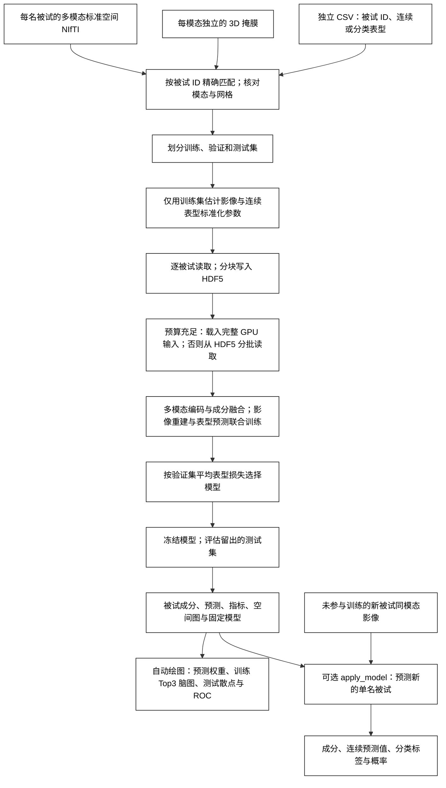

# 2026-10-05 README 历史归档

本页保留迁移前说明与历史证据，功能用法以[当前用户手册](../../docs/superbigflica/README.md)为准。迁移只整理文档，原始 benchmark、代码、影像和资源不变。

本页仅脱敏展示文本：用户目标名称统一改为 trait_01/trait_02，移除含具体目标名称的图示嵌入，科学指标与原始证据未改动。

# SuperBigFLICA：监督多模态成分与表型预测

`run_superbigflica` 在多模态标准空间影像中学习共享成分，并同时预测指定的连续或分类表型。影像输入与 [BigFLICA](../../docs/bigflica/README.md) 完全相同：每名被试一个目录，每个模态指定影像相对路径和自己的标准空间掩膜。表型保存在独立 CSV，通过被试 ID 与目录名匹配。`apply_model` 使用保存的模型和训练集标准化参数，为一名新被试输出成分、连续表型预测值，以及分类标签和各类别概率。

FNIT 依据 SuperBigFLICA 方法独立实现线性自编码器、共享成分和监督预测。每个模态经线性编码后，由按成分归一化的模态权重融合，再经过 BatchNorm；解码器与编码器共享权重。训练联合优化影像重建、空间载荷稀疏项与表型预测。连续表型使用均方误差，分类表型默认使用按训练集类别频数平衡的交叉熵。空间载荷和预测头随机初始化，随机种子由 `random_state` 固定；不使用 PCA 或 MIGP 初始化。计算使用 PyTorch；NIfTI 与分块缓存读写使用 nibabel 和 h5py，不调用原软件或工作流封装包。

## 流程



## 安装与输入

从仓库根目录创建并激活主页的 Conda 环境：

```bash
conda env create -f environment.yml
conda activate fnit
```

本功能使用环境中已有的 PyTorch、nibabel、NumPy、h5py、SciPy、scikit-learn 和 matplotlib，不需要预训练权重。CUDA 默认允许 TF32；训练、预测、影像缓存与输出使用 float32，不自动改用 float16 或 bfloat16。空间回归与 t→z 统计使用 float64：CUDA 复用 BigFLICA 的 PyTorch GPU 统计路径，CPU 使用 NumPy/SciPy。

影像目录例如：

```text
cohort_images/
  SUBJECT_A/
    VBM_2mm.nii.gz
    dti_FA_2mm_mmorf.nii.gz
    dti_MD_2mm_mmorf.nii.gz
  SUBJECT_B/
    VBM_2mm.nii.gz
    dti_FA_2mm_mmorf.nii.gz
    dti_MD_2mm_mmorf.nii.gz
phenotypes.csv
modalities.json
```

每张影像须为 3D NIfTI，并已配准到对应模态的标准空间。模态之间可有不同网格；同一模态的全部被试影像须与该模态掩膜的形状和仿射一致。函数不执行配准。

配置格式沿用 BigFLICA 的 `modalities`，另加 `targets` 明确指定每个表型类型。影像路径相对于被试目录，掩膜路径为绝对路径：

```json
{
  "modalities": {
    "vbm": {"image": "VBM_2mm.nii.gz", "mask": "/absolute/masks/vbm.nii.gz"},
    "fa": {"image": "dti_FA_2mm_mmorf.nii.gz", "mask": "/absolute/masks/fa.nii.gz"},
    "md": {"image": "dti_MD_2mm_mmorf.nii.gz", "mask": "/absolute/masks/md.nii.gz"}
  },
  "targets": {
    "trait_01": "continuous",
    "trait_02": "binary"
  }
}
```

表型 CSV 的一行对应一名被试，例如：

```csv
subject_id,trait_01,trait_02,split
SUBJECT_A,8,0,train
SUBJECT_B,6,1,validation
SUBJECT_C,,0,test
```

此片段仅说明文件格式；表型列名须换成实际 CSV 中的列名。ID 按字符串精确匹配，保留前导零，例如目录 `00123/` 对应 CSV 的 `00123`。重复 ID 会报错。分类表型可使用文字标签或离散编码。指定 `binary` 要求训练集恰好两类，`multiclass` 要求至少三类；`categorical` 按训练集类别数自动识别。类别编号以标签处理。空值、`NA`、`N/A`、`NaN` 或 `null` 按目标分别屏蔽损失，该被试仍可参与其他表型训练与影像重建。

若 CSV 包含划分列，指定 `split_column="split"`，列值使用 `train`、`validation`、`test`。模型仅由训练集拟合，验证集用于选模，测试集留到选模完成后评估。未指定划分列时，按 `random_state` 自动划分；默认训练/验证/测试比例为 60%/20%/20%，并按第一个分类目标分层。相关被试应由使用者在 CSV 中放入同一集合，避免家系或重复扫描跨集合。训练被试数须大于 `n_components + 1`，并至少有 2 名验证和 2 名测试被试；连续目标须有至少两个数值不同的训练标签及两个有效验证标签，分类目标须有至少两个训练类别、每类至少两个训练标签和至少一个有效验证标签。自动分层时，缺失分类标签也作为独立层；某层人数不足时，应提供明确划分。

## Python 示例

以下示例同时预测一个连续表型和一个疾病分类。`selected_subject_ids` 规定候选被试范围，CSV 的划分列规定其中每人的用途。被试列表应包含训练、验证和测试被试；新被试预测使用同一套模态路径。

```python
import json
from pathlib import Path

from fnit.superbigflica import apply_model, plot_superbigflica, run_superbigflica

subjects_root = Path("/absolute/path/cohort_images")  # 每名被试一个目录
phenotypes_csv = Path("/absolute/path/phenotypes.csv")  # 独立表型 CSV
configuration_file = Path("/absolute/path/modalities.json")
configuration = json.loads(configuration_file.read_text(encoding="utf-8"))
modalities = configuration["modalities"]  # 各模态影像相对路径与绝对掩膜路径
phenotype_targets = configuration["targets"]  # CSV 列名 -> continuous/binary/multiclass/categorical
selected_subject_ids = [
    subject_id.strip()
    for subject_id in Path("/absolute/path/subjects.txt").read_text().splitlines()
    if subject_id.strip()
]  # 每行一个目录名；保留字符串 ID

model_dir = run_superbigflica(
    subjects_root=subjects_root,
    modalities=modalities,
    phenotypes_csv=phenotypes_csv,
    targets=phenotype_targets,
    output_dir=Path("/absolute/path/superbigflica_output"),
    n_components=20,  # 共享成分数；应依据训练规模和验证结果选择
    id_column="subject_id",  # CSV 中用于匹配目录名的列
    split_column="split",  # 按 CSV 使用 train/validation/test；无该列时设为 None
    subjects=selected_subject_ids,
    validation_fraction=0.2,  # 仅自动划分时使用
    test_fraction=0.2,  # 仅自动划分时使用
    max_epochs=50,
    batch_size=64,
    learning_rate=0.001,
    dropout=0.2,  # 训练时影像输入 dropout 概率
    relative_weight=0.5,  # 越大越强调影像重建和空间稀疏性
    class_weight="balanced",  # 仅由训练集估计类别权重，也可设为 "none"
    random_state=0,
    device="cuda:0",
    max_gpu_gb=19.0,  # 显存预算；大掩膜或多成分仍需检查实际显存
    feature_block=2048,  # 空间回归的目标体素分块大小
    top_voxels=1000,  # 每张成分图保留绝对 z 值最高的体素数
    make_plots=True,  # 默认生成权重、训练 Top3 脑图、测试散点/ROC
)

new_subject_dir = subjects_root / "NEW_SUBJECT"  # 未参与训练、验证或测试的被试
new_subject_prediction = apply_model(
    model_dir=model_dir,
    subject_dir=new_subject_dir,
    device="cuda:0",
    output_file=Path("/absolute/path/new_subject_prediction.json"),
)
print(new_subject_prediction["subject_id"])
print(new_subject_prediction["components"])
print(new_subject_prediction["predictions"])

# 可独立重画已保存模型，也可为旧模型补图；不重新训练。
plots_dir = plot_superbigflica(
    model_dir=model_dir,
    output_dir=Path("/absolute/path/superbigflica_figures"),
    labels={
        "trait_01": "Trait 01 (user unit)",
        "trait_02": "Trait 02",
    },  # CSV 列名 -> 图中显示名，可包含表型单位
)
```

单独预测连续表型时，设 `targets={"trait_01": "continuous"}`；单独预测疾病二分类时，设 `targets={"trait_02": "binary"}`；三类及以上用 `targets={"group": "multiclass"}`，并提供实际 CSV 的对应标签列。省略 `subjects` 时从影像根目录识别候选被试。每次更换表型、被试集合、模态或掩膜，都应使用新的输出目录重新拟合。

## 命令行示例

`--config` 读取前述同时含 `modalities` 和 `targets` 的 JSON；`--subjects-file` 每行一个被试目录名。以下调用与 Python 示例使用同一组输入：

```bash
fnit-superbigflica fit \
  --subjects-root /absolute/path/cohort_images \
  --config /absolute/path/modalities.json \
  --phenotypes-csv /absolute/path/phenotypes.csv \
  --id-column subject_id --split-column split \
  --subjects-file /absolute/path/subjects.txt \
  --output-dir /absolute/path/superbigflica_output \
  --n-components 20 --max-epochs 50 --batch-size 64 \
  --learning-rate 0.001 --dropout 0.2 --relative-weight 0.5 \
  --class-weight balanced \
  --random-state 0 --device cuda:0 --max-gpu-gb 19 \
  --feature-block 2048 --top-voxels 1000

# 使用保存的模型与训练集标准化参数，输出新被试的预测 JSON。
fnit-superbigflica apply \
  --model-dir /absolute/path/superbigflica_output \
  --subject-dir /absolute/path/cohort_images/NEW_SUBJECT \
  --device cuda:0 \
  --output-file /absolute/path/new_subject_prediction.json

# 独立绘图：默认根据保存的模型、成分、预测和训练统计生成全部图。
fnit-superbigflica plot \
  --model-dir /absolute/path/superbigflica_output \
  --output-dir /absolute/path/superbigflica_figures \
  --labels /absolute/path/plot_labels.json
```

`plot_labels.json` 可使用以下列名到显示名的映射；省略 `--labels` 时显示原 CSV 列名：

```json
{
  "trait_01": "Trait 01 (user unit)",
  "trait_02": "Trait 02"
}
```

不指定 `--split-column` 时按比例自动划分，可用 `--validation-fraction 0.2 --test-fraction 0.2` 调整；不指定 `--subjects-file` 时使用目录与 CSV 的匹配交集。其余选项对应下表的同名 Python 参数。`fit` 默认自动绘图；加 `--no-plots` 可跳过，之后仍可单独执行 `plot`。完整帮助见 `fnit-superbigflica fit --help`、`apply --help` 和 `plot --help`。

## 参数

`run_superbigflica` 返回保存模型的 `Path`。

| 参数 | 默认值 | 含义 |
|---|---|---|
| `subjects_root` | 必填 | 每名被试一个目录的影像根目录。 |
| `modalities` | 必填 | 模态名到 `{"image": 相对影像路径, "mask": 绝对掩膜路径}` 的映射，与 BigFLICA 相同。 |
| `phenotypes_csv` | 必填 | 独立的表型 CSV 路径。 |
| `targets` | 必填 | CSV 表型列名到 `continuous`、`binary`、`multiclass` 或 `categorical` 的映射，可混合多个连续和分类目标。 |
| `output_dir` | 必填 | 输出与模型保存目录，须为新目录或空目录。 |
| `n_components` | 必填 | 多模态共享成分数；须不超过全部模态掩膜体素数之和。空间图输出前对训练成分逐列中心化、缩放后检查有效秩，秩不足时须减小此参数。 |
| `id_column` | `"subject_id"` | CSV 中的被试 ID 列，与影像目录名精确匹配。 |
| `split_column` | `None` | 可选 CSV 划分列；指定后使用 `train`、`validation`、`test`。 |
| `subjects` | `None` | 可选被试 ID 序列；限制候选被试范围与顺序。 |
| `validation_fraction` | `0.2` | 自动划分的验证集比例；使用 `split_column` 时不参与划分。 |
| `test_fraction` | `0.2` | 自动划分的测试集比例；训练集比例为剩余部分。 |
| `max_epochs` | `50` | 训练轮数；恰好执行此数目的轮次，再保留验证损失最低的模型。 |
| `batch_size` | `64` | 每个训练批次的目标被试数，至少为 2；CUDA 按显存预算降低实际批次，实际值写入模型。 |
| `learning_rate` | `0.001` | 模型 RMSprop 与自动损失权重 Adam 的初始学习率，后续使用余弦调度。 |
| `dropout` | `0.2` | 训练时影像输入与共享成分的 dropout 概率；评估与新被试预测时关闭。 |
| `relative_weight` | `0.5` | 影像重建与稀疏项相对权重，取值 `(0, 1)`；越大，影像项越强、监督预测项越弱。 |
| `class_weight` | `"balanced"` | 分类损失权重：按训练集有效标签的类别频数计算 `Nobs / (类别数 × 每类人数)`，训练和验证共用冻结权重；`"none"` 使用普通交叉熵，连续目标不受影响。 |
| `random_state` | `0` | 自动划分和模型随机初始化的种子。 |
| `device` | `"auto"` | `auto` 优先可用 CUDA，否则 CPU；也可指定 `cpu` 或 `cuda:0`。 |
| `max_gpu_gb` | `19.0` | CUDA 显存预算，单位 GiB；计入输入缓存、模型/优化器、训练批次与空间统计，扣除调用方已分配显存。预算充足时自动缓存完整输入，否则从 HDF5 读取；实际批次和体素块按剩余预算调整。 |
| `feature_block` | `2048` | 空间回归的目标体素分块大小；CUDA 按显存预算降低实际块大小，记录在模型元数据中。 |
| `top_voxels` | `1000` | 各成分阈值图保留的最大体素数，按绝对 z 值选择。 |
| `make_plots` | `True` | 拟合完成后自动生成权重、训练 Top3 成分脑图与测试散点/ROC；`False` 只保存模型和数值输出。 |

`apply_model` 的参数为：

| 参数 | 默认值 | 含义 |
|---|---|---|
| `model_dir` | 必填 | `run_superbigflica` 返回的模型目录。 |
| `subject_dir` | 必填 | 一名新被试的影像目录，须具有训练时约定的模态和网格。 |
| `device` | `"auto"` | 新被试推理设备。 |
| `output_file` | `None` | 可选 JSON 输出路径；省略时只返回 Python 字典。 |

返回字典的 `subject_id` 为目录名，`components` 为按成分顺序排列的值，`predictions` 按 CSV 表型列名组织。连续目标含 `value`，已经还原到原表型单位；分类目标含 `label` 和 `probabilities`，后者为类别标签到概率的映射。

`plot_superbigflica(model_dir, output_dir=None, *, labels=None)` 返回图像保存目录的 `Path`。`model_dir` 为拟合后的固定模型目录；`output_dir` 为可选图像目录，省略时使用 `model_dir/plots/`。`labels` 为可选的“CSV 表型列名 → 显示名”映射，可在名称中写明单位；省略时使用原列名。绘图读取已保存的成分、预测、训练均值与空间图，不重新拟合模型。

## 训练与输出

影像逐体素均值和标准差、连续表型均值和标准差，仅由训练集估计并保存。验证集、测试集和新被试共用这些参数。分类标签表由训练集建立，验证或测试集中出现训练未见类别时会报错。表型缺失不作标签填补。连续损失按有效标签数平均；分类损失只对有效标签按冻结的训练类别权重加权平均。各类别人数、权重、请求类型与实际二类/多类模式写入 `model.json`。

标准化影像先写入按被试切分的 HDF5 缓存。CUDA 预算足以容纳完整 float32 输入、模型/优化器状态和批次时，自动把输入载入 GPU，训练、验证和预测直接索引缓存；无需新增参数。预算扣除调用方已有显存分配，并结合当前可用显存判断。调用方的分配上限等因素导致缓存分配失败时，回退到 HDF5；CPU 和预算不足的 CUDA 路径逐被试读取所选行，再组成当前批次。缓存方式、占用量和前载耗时 `input_cache_s` 写入模型元数据。

公开训练与 `apply_model` 显式使用 float32 模型和张量，保存的参数与输出精度不随全局 `torch.set_default_dtype` 改变。CUDA 默认 TF32；空间统计使用 float64，初始化仍为随机方式。

四项损失的相对权重按原实现设为 `(r, r, 1-r, 1-r)` 并按总和归一化，其中 `r=relative_weight`；前两项对应影像重建与空间稀疏项，后两项对应预测项与预测权重约束。这组比例固定，可学习的是各项中的五组损失尺度。模型使用 RMSprop，损失尺度使用 Adam，学习率分别作余弦调度；损失尺度前 10 轮冻结，从第 11 轮更新。最佳模型按验证集各目标的平均监督损失选择：连续目标使用标准化后的均方误差，分类目标使用与训练相同权重的交叉熵。测试集不用于选择训练轮数。

保存文件包括：

```text
model_dir/
  model.json                         # 参数、划分、表型类型/类别权重、缓存方式与阶段时间
  model.pt                           # 验证集选出的 PyTorch 模型参数
  vbm_mask.nii.gz, fa_mask.nii.gz, ... # 固定的模态掩膜
  vbm_mean.npy, vbm_std.npy, ...      # 每模态训练集的逐体素均值/标准差
  match_report.json                 # 匹配数量、缺失表型/影像与忽略的 ID
  input_store/
    vbm.h5, fa.h5, ...               # 分块影像缓存：[被试, 掩膜体素]
  subj_course.npy                    # [被试, 成分]
  subj_course.tsv                    # subject_id、split、component_001 等列
  predictions.csv                    # 被试 ID、划分、真实表型及模型预测
  metrics.json                       # 各划分、各表型的样本数与预测指标
  history.csv                        # 每轮训练/验证损失与选模记录
  modality_weights.npy               # [成分, 模态]
  prediction_weights.npy             # [成分, 连续输出数+分类类别数]
  vbm_zstat.npy, fa_zstat.npy, ...    # [掩膜体素, 成分]
  plots/                             # 默认自动绘图；也可用 plot 指定独立目录
    summary.json                     # 训练成分排名、系数与聚合指标，无被试 ID
    latent_weights.png/.svg/.pdf      # 全部目标的成分预测权重柱图
    target-001_top-components.*       # 第一个表型的训练 Top3 脑图
    target-002_top-components.*       # 第二个表型的训练 Top3 脑图
    target-001_test-scatter.*         # 连续目标测试散点，三种格式
    target-002_test-roc.*             # 分类目标测试 ROC，三种格式
  maps/
    vbm/
      component-001_zstat.nii.gz       # 模态原网格上的成分 z 图
      component-001_top-1000.nii.gz    # 绝对 z 值最高的体素
      component-001_top-1000.png       # 阈值脑图
    fa/, md/, ...
```

`predictions.csv` 含 `subject_id`、`split`，每个目标的 `目标名__observed`、`目标名__prediction`；分类目标另有 `目标名__prob_000` 等列，类别顺序见模型元数据。`metrics.json` 按训练、验证和测试分别给出有效标签数；连续目标报告原单位 MAE、RMSE、R² 和 Pearson r，分类目标报告 accuracy、balanced accuracy、macro F1，二分类在两类标签均存在时报告 ROC AUC。

空间图由训练被试的成分分别回归到各模态影像，再把 t 统计量转换为 z。用于这一步的训练成分在 float64 中逐列中心化和缩放，避免成分单位影响数值秩；有效秩阈值按来源 float32 的机器精度计算。保存的成分及预测权重沿用模型原始单位。CPU/CUDA 的 Student-t 双侧概率采用相同的 float64 下限。

GPU 输入缓存可用时，空间回归先切体素块，再提取该块的训练行，直接交给成熟的 float64 统计实现。图像保留模态掩膜网格，掩膜外为零。`modality_weights.npy` 表示各模态对成分的贡献，`prediction_weights.npy` 表示成分对各预测输出的权重；分类权重须结合 `model.json` 的类别顺序解释。

## 图像与成分排序

默认生成成分预测权重、每个表型的训练 Top3 脑图，以及独立测试集的连续预测散点或分类 ROC。PNG 为 300 dpi；SVG 和 PDF 保留可编辑的文字与线条；散点与脑影像层以 raster 保存，脑影像保持原始体素分辨率。白色背景、黑色文字、清晰坐标和单位、无背景网格及色盲友好颜色遵循 [Nature 官方研究图规范](https://research-figure-guide.nature.com/figures/preparing-figures-our-specifications/)。

| 图 | 数值与解释 |
|---|---|
| 成分预测权重柱图 | 连续目标展示标准化表型的预测系数；二分类展示 `classes[1]` 相对 `classes[0]` 的 logit 系数差；多分类展示各类系数减去该成分各类均值后的权重。 |
| 每表型 Top3 成分脑图 | 只在训练集有效标签中排名，最多取三个成分；各模态以自己的训练均值为背景，叠加该成分保留 `top_voxels` 的有符号 z 图，在峰值位置显示三个切面；按 canonical affine 的体素毫米尺寸保持切面比例。 |
| 连续测试散点 | 测试集真实值与预测值，使用原表型单位；显示 `y=x` 参考线、有效人数、Pearson r、RMSE 和 MAE。 |
| 分类测试 ROC | 二分类使用 `model.json` 中 `classes[1]` 为正类；例如标签 0/1 时正类为 1。多分类显示可计算的每类 one-vs-rest 曲线；全类别均可计算时给出 macro AUC，micro ROC 单独按有效测试标签计算。 |

Top3 排名按连续目标的 `|Pearson r|`、二分类的 `max(AUC, 1-AUC)`、多分类的 η² 计算，均只使用训练成分与训练标签。η² 为类间平方和占总平方和的比例，衡量各类成分均值的分离程度。模型固定后绘制测试散点和 ROC；测试指标不参与成分排名。排名分数描述训练成分与表型的关联强度；脑图保持原成分方向，z 表示影像与该成分的空间回归统计量。`top_voxels` 是显示体素数量。图名的 `target-001`、`target-002` 按 `model.json` 的表型顺序编号；每个目标写 Top3 脑图，连续目标另写 `test-scatter`，分类目标另写 `test-roc`，同一图保存 PNG、SVG 和 PDF。某测试类别缺少正例或负例时，其 ROC 与全类别 macro AUC 未定义，并在摘要中记为 `null`；有有效测试标签时仍单独计算 micro ROC。

分类目标的绘图摘要位于 `targets[目标名].test.roc_auc`：`class_auc` 保存类别名到 AUC 的映射，`macro_auc`、`micro_auc` 为独立汇总字段。类别即使叫 `macro_auc` 或 `micro_auc`，其结果也保存在 `class_auc` 内；未定义的指标记为 `null`。

## 与原实现的对应

[SuperBigFLICA 原仓库](https://github.com/weikanggong/SuperBigFLICA) 提供 `SupervisedFLICA` 训练和 `get_model_param` 投影接口，没有独立命令行程序。其输入是已经准备好的“被试 × 特征”模态矩阵列表和连续表型矩阵；原版调用形式如下，需在原作者代码的独立目录中运行：

```python
from SupBigFLICA_cpu import SupervisedFLICA, get_model_param

# 每个列表元素为一个模态的 [被试, 特征] 矩阵；数组须事先准备。
training_imaging_matrices = imaging_train
validation_imaging_matrices = imaging_validation
training_phenotype_matrix = phenotypes_train
validation_phenotype_matrix = phenotypes_validation
relative_weight = 0.5

validation_prediction, best_model, loss_history, best_score, final_model = SupervisedFLICA(
    x_train=training_imaging_matrices,
    y_train=training_phenotype_matrix,
    x_test=validation_imaging_matrices,  # 原函数名为 x_test，选模时实际传验证集
    y_test=validation_phenotype_matrix,
    dropout=0.2,
    device="cpu",
    auto_weight=[1, 1, 1, 1],
    lambdas=[relative_weight, relative_weight, 1-relative_weight, 1-relative_weight],
    nlat=20,
    lr=0.001,
    random_seed=0,
    maxiter=50,
    batch_size=64,
    init_method="random",
)
original_model_outputs = get_model_param(
    x_train=training_imaging_matrices,
    x_test=imaging_test,  # 留出测试集
    y_train=training_phenotype_matrix,
    best_model=best_model,
)
```

源码核对固定到 [`6695b638802aab50f43f889e97af223f8191018e`](https://github.com/weikanggong/SuperBigFLICA/tree/6695b638802aab50f43f889e97af223f8191018e)。该版本未提供明确再分发许可，FNIT 不包含其源码。FNIT 增加了影像目录与 CSV 的 ID 匹配、连续/分类混合多目标、固定的数据划分、缺失标签处理及新被试推理。缺失标签只屏蔽相应目标的损失，分类损失使用冻结的训练类别权重，混合目标按平均验证监督损失选模；原版连续目标按 Pearson 相关选模。FNIT 的 `max_epochs` 表示恰好执行的轮数，原版 `maxiter` 执行 `maxiter + 1` 轮。原版空间载荷提取循环重复回归第一模态，且把 t 统计量命名为 z；FNIT 对各模态独立回归并完成 t→z 转换。

## 真实数据验证

使用 **5,000 名真实 UKB 被试、VBM/FA/MD 完整掩膜、20 个共享成分**。训练/验证/测试为 3,000/1,000/1,000 人，随机初始化，类别平衡，批次 64，完整执行 50 个 epoch；按验证损失选出的模型来自第 5 轮。连续目标为 `trait_01`（[匹配连续目标，毫秒](https://www.ukbiobank.ac.uk/)），二分类目标为 `trait_02`。示例中的 `trait_01` 仅说明 CSV 格式，不是本次核验的表型。

| 测试项目 | 本次真实实测 |
|---|---|
| 连续目标预测（1,000 人测试集） | MAE 73.50 ms，RMSE 102.06 ms，Pearson r 0.1731，R² 0.0254 |
| 分类目标二分类（1,000 人测试集） | ROC AUC 0.7226，balanced accuracy 0.6716，accuracy 0.6610，macro F1 0.6082 |
| 公开 API 全流程，含影像读写、缓存前载与自动绘图 | 660.04 s（11.00 min）；共享 H100 PCIe、8 个 CPU 线程、单次观测 |
| 峰值资源 | PyTorch GPU allocation 12.25 GiB；进程 RSS 1.39 GiB |
| GPU 输入缓存 | 11.22 GiB；前载 38.86 s，计入全流程时间 |
| 输出检查 | 5,000×20 成分；训练成分秩 20，含截距设计矩阵秩 21；120 张 float32 NIfTI 均有限、掩膜外为零 |

启动时共享 GPU 利用率为 100%；上述时间记录本次完整运行。固定模型 CPU/CUDA 单被试推理相对批次评估的成分最大差为 1.92e-05，连续目标差不超过 0.00457 ms，分类概率差不超过 2.32e-05。

同一训练集的 8 人完整模态输入另与原版连续模型比较，均为 20 成分、固定相同参数、关闭 dropout：共享成分、连续预测和四项损失一致，重建最大绝对差 1.19e-07，全部检查的梯度最大差 1.49e-08。原版对照覆盖连续模型的前向/损失/梯度；分类头及混合目标选模为 FNIT 扩展。真实队列覆盖连续和二分类；多分类、缺失标签及测试集隔离由定向 CPU/CUDA 功能测试覆盖。

完整指标、阶段时间、输入/模型/源码 SHA-256 和冻结推理核对见 [真实验证报告](README.md)；[效率与一致性对照](efficiency_real5000.json)记录 60 项定向回归测试，[192 人输入诊断](input_profile_real192.json)记录缓存路径的输入、预测、损失和梯度零差。

### 同队列前后对照

| 项目 | 修复前：HDF5 分批 | 当前：GPU 输入缓存 |
|---|---:|---:|
| 公开 API 全流程 | 1517.16 s（25.29 min） | 660.04 s（11.00 min） |
| 缓存前载 | — | 38.86 s |
| 训练、选模与预测 | 760.19 s | 101.37 s |
| 空间统计与脑图 | 188.20 s | 18.30 s |
| PyTorch 峰值 GPU allocation | 1.03 GiB | 12.25 GiB |

当前完整输入缓存为 11.22 GiB；新增前载换取后续 GPU 直接索引，峰值显存分配增加至 12.25 GiB。两次时间来自同一共享 H100 的独立观测，均包含自动绘图。

两次运行使用相同的 5,000 人影像、掩膜、CSV、划分、种子和 50 轮设置。保存的模型与损失参数、50 轮六项损失、全部成分、表型预测、类别概率和分类标签均逐值一致；模型 SHA-256 相同。空间图只有 9 个 float32 z 值出现末位差异，最大 4.77e-07，阈值图的非零支持集一致。完整阶段时间、两次源码与输入散列见 [前后对照报告](efficiency_real5000.json)。

### 本次真实输出图

所有 Top3 均由训练集排名，散点和 ROC 使用独立测试集。三种格式来自同一固定模型；原绘图摘要（含用户目标名，未新增复制）保存排序分数、成分编号和图中系数。

#### 成分预测权重

连续目标展示标准化预测系数，二分类展示类别 1 相对类别 0 的 logit 系数差；粗边框标出训练集选出的 Top3。

原图未在本归档中重新嵌入：其展示文本需独立隐私审核。
原矢量图链接未复制；原产物保持不变。

#### 连续目标：训练 Top3 成分脑图

按训练集 |Pearson r| 选出的成分为 4、9、17；各列使用 VBM、FA、MD 自身的训练均值背景。

原图未在本归档中重新嵌入：其展示文本需独立隐私审核。
原矢量图链接未复制；原产物保持不变。

#### 分类目标：训练 Top3 成分脑图

按训练集双向 AUC 选出的成分为 1、4、7；地图保留成分的原始方向。

原图未在本归档中重新嵌入：其展示文本需独立隐私审核。
原矢量图链接未复制；原产物保持不变。

#### 连续目标：独立测试散点

1,000 名测试被试，真实值与预测值均为毫秒；虚线为 y=x。预测值主要集中在均值附近，测试相关为 0.1731。

原图未在本归档中重新嵌入：其展示文本需独立隐私审核。
原矢量图链接未复制；原产物保持不变。

#### 分类目标：独立测试 ROC

1,000 名测试被试，以类别 1 为正类；曲线来自固定模型输出的概率。

原图未在本归档中重新嵌入：其展示文本需独立隐私审核。
原矢量图链接未复制；原产物保持不变。

## 参考文献与原实现

1. Gong W, Bai S, Zheng Y-Q, Smith SM, Beckmann CF. Supervised phenotype discovery from multimodal brain imaging. *IEEE Transactions on Medical Imaging*. 2023;42(3):834–849. [DOI: 10.1109/TMI.2022.3218720](https://doi.org/10.1109/TMI.2022.3218720).
2. [SuperBigFLICA 原实现](https://github.com/weikanggong/SuperBigFLICA)，[固定版本源文件](https://github.com/weikanggong/SuperBigFLICA/blob/6695b638802aab50f43f889e97af223f8191018e/SupBigFLICA_cpu.py)。
